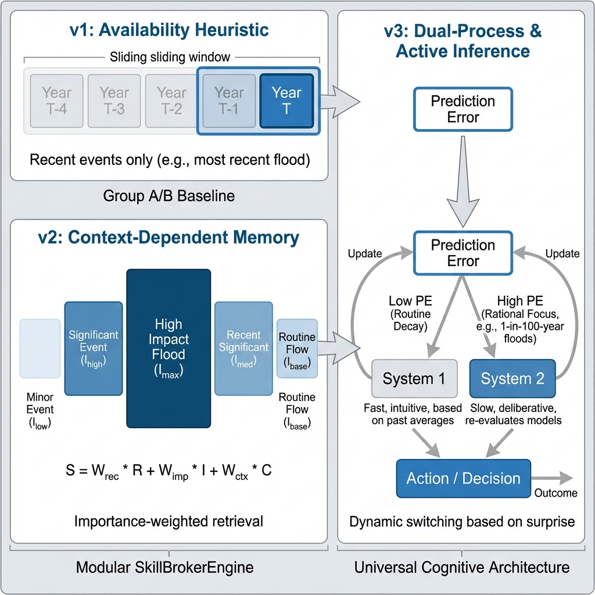

# Governed Broker Framework

<div align="center">

**A Governance Middleware for LLM-Driven Hydro-Social Agent-Based Models**

[](https://www.python.org/downloads/)
[](LICENSE)
[](https://ollama.com/)

[**English**](README.md) | [**中文**](README_zh.md)

</div>

## Mission Statement

> _"Turning LLM Storytellers into Rational Actors for Hydro-Social Agent-Based Models."_

The **Governed Broker Framework** addresses the fundamental **Logic-Action Gap** in Large Language Model (LLM) agents: while LLMs produce fluent natural-language reasoning, they exhibit stochastic instability, hallucinations, and memory erosion across long-horizon simulations — problems that undermine the scientific validity of LLM-driven agent-based models (ABMs).

This framework provides an architectural **Governance Layer** that validates agent reasoning against physical constraints and behavioral theories (e.g., Protection Motivation Theory, PMT) in real time. It is designed for **flood risk adaptation research** and other hydro-social modeling contexts where reproducibility, auditability, and long-horizon consistency are essential.

**Target domains**: nonstationary flood risk adaptation, irrigation water management, household adaptation behavior, community resilience, water resource policy evaluation.

**Validated case studies**:

- **Flood Household Adaptation (SA)**: 100 agents using PMT (Protection Motivation Theory), 10-year simulation with Gemma 3 (4B/12B/27B)
- **Flood Multi-Agent (MA)**: 400 agents (balanced 4-cell design: MG/NMG × Owner/Renter) with institutional agents (Government, Insurance), 13-year PRB simulation
- **Irrigation Water Management**: 78 CRSS agents from the Upper Colorado River Basin

---

## Quick Start

### 1. Install

```bash
pip install -r requirements.txt
```

### 2. Run a Governed Flood Simulation

Launch a 10-agent flood adaptation demo with governance and human-centric memory (requires [Ollama](https://ollama.com/)):

```bash
python examples/governed_flood/run_experiment.py --model gemma3:4b --years 3 --agents 10
```

### 3. Run the Full Benchmark (WRR Paper)

Replicate the three-group ablation study (100 agents, 10 years):

```bash
python examples/single_agent/run_flood.py --model gemma3:4b --years 10 --agents 100 \
    --memory-engine humancentric --governance-mode strict
```

### 4. Explore More

| Example            | Complexity   | Description                                           | Link                           |
| :----------------- | :----------- | :---------------------------------------------------- | :----------------------------- |
| **Governed Flood** | Beginner     | Standalone Group C demo with full governance          | [Go](examples/governed_flood/) |
| **Single Agent**   | Intermediate | JOH Benchmark: Groups A/B/C ablation study            | [Go](examples/single_agent/)   |
| **Irrigation ABM** | Intermediate | Colorado River Basin water demand (Hung & Yang, 2021) | [Go](examples/irrigation_abm/) |
| **Multi-Agent**    | Advanced     | Social dynamics, insurance market, government policy  | [Go](examples/multi_agent/)    |
| **Finance**        | Extension    | Cross-domain demonstration (portfolio decisions)      | [Go](examples/finance/)        |

---

## Module Directory (Documentation Hub)

The framework is organized into five conceptual chapters, each with bilingual documentation:

- **Chapter 0 — Theoretical Basis**: [Overview](docs/modules/00_theoretical_basis_overview.md) | [中文](docs/modules/00_theoretical_basis_overview_zh.md)
- **Chapter 1 — Memory & Reflection**: [Memory & Surprise Engine](docs/modules/memory_components.md) | [Reflection Engine](docs/modules/reflection_engine.md)
- **Chapter 2 — Governance Core**: [Governance Logic & Validators](docs/modules/governance_core.md)
- **Chapter 3 — Context & Perception**: [Context Builder](docs/modules/context_system.md) | [Simulation Engine](docs/modules/simulation_engine.md)
- **Chapter 4 — Skill Registry**: [Action Ontology](docs/modules/skill_registry.md)
- **Experiments**: [Benchmarks & Examples](examples/README.md)

---

## Documentation & Guides

### Integration Guides (`docs/guides/`)

- **[Experiment Design Guide](docs/guides/experiment_design_guide.md)**: Recipe for building new experiments.
- **[Agent Assembly Guide](docs/guides/agent_assembly.md)**: How to stack "Cognitive Blocks" (Level 1-3).
- **[Customization Guide](docs/guides/customization_guide.md)**: Adding new skills, validators, and audit fields.

### Architecture Specs (`docs/architecture/`)

- **[High-Level Architecture](docs/architecture/architecture.md)**: System diagrams and data flow.
- **[Skill Architecture](docs/architecture/skill_architecture.md)**: Deep dive into the Action/Skill ontology.
- **[MAS Five-Layer Mapping](docs/architecture/mas-five-layers.md)**: Multi-agent system architecture (AgentTorch alignment).

### Multi-Agent Ecosystem (`docs/multi_agent_specs/`)

- **[Government Agents](docs/multi_agent_specs/government_agent_spec.md)**: Subsidies, buyouts & policy logic.
- **[Insurance Market](docs/multi_agent_specs/insurance_agent_spec.md)**: Premium calculation & risk models.
- **[Institutional Behavior](docs/multi_agent_specs/institutional_agent_behavior_spec.md)**: Interaction protocols.

---

## Core Problem Statement


LLM-driven ABMs face five recurring problems that this framework solves:

| Challenge            | Problem Description                                  | Framework Solution                                                         | Component           |
| :------------------- | :--------------------------------------------------- | :------------------------------------------------------------------------- | :------------------ |
| **Hallucination**    | LLM generates invalid actions (e.g., "build a wall") | **Strict Registry**: Only registered `skill_id`s are accepted              | `SkillRegistry`     |
| **Context Limit**    | Cannot dump entire history into prompt               | **Salience Memory**: Retrieves only top-k relevant past events             | `MemoryEngine`      |
| **Inconsistency**    | Decisions contradict reasoning (Logical Drift)       | **Thinking Validators**: Checks logical coherence between TP/CP and Choice | `SkillBrokerEngine` |
| **Opaque Decisions** | "Why did agent X do Y?" is lost                      | **Structured Trace**: Logs Input, Reasoning, Validation, and Outcome       | `AuditWriter`       |
| **Unsafe Mutation**  | LLM output breaks simulation state                   | **Sandboxed Execution**: Validated skills are executed by engine, not LLM  | `SimulationEngine`  |

---

## Unified Architecture (v3.5)

The framework utilizes a layered middleware approach that unifies single-agent isolated reasoning with multi-agent social simulations. As of v3.5, all broker-level modules are **fully domain-agnostic** — construct names, action vocabularies, LLM timeouts, and validation keywords are loaded from YAML configuration rather than hardcoded.


### Combinatorial Intelligence ("Stacking Blocks")

The framework implements a **Stacking Blocks** architecture. You can build agents of varying cognitive complexity by stacking different modules onto the base Execution Engine:

| Stack Level   | Cognitive Block      | Function          | Effect                                                                                                                                    |
| :------------ | :------------------- | :---------------- | :---------------------------------------------------------------------------------------------------------------------------------------- |
| **Base**      | **Execution Engine** | _The Body_        | Can execute actions but has no memory or rationality.                                                                                     |
| **+ Level 1** | **Context Lens**     | _The Eyes_        | Adds bounded perception (Window Memory). Prevents context overflow.                                                                       |
| **+ Level 2** | **Memory Engine**    | _The Hippocampus_ | Adds **HumanCentric Memory Engine**. Emotional salience encoding (importance = emotion × source) with stochastic consolidation and decay. |
| **+ Level 3** | **Skill Broker**     | _The Superego_    | Adds **Governance**. Enforces "Thinking Rules" to ensure decisions match beliefs (Rationality).                                           |

> **Why this matters for research**: This design enables controlled ablation studies. Run a Level 1 Agent (Group A — baseline) vs. Level 3 Agent (Group C — full cognitive) to isolate exactly _which_ cognitive component resolves a specific behavioral bias.

**[Learn how to assemble custom agents](docs/guides/agent_assembly.md)**

### Framework Evolution



The memory and governance architecture has evolved through three phases:

- **v1 (Legacy)**: [Availability Heuristic] — Monolithic scripts with basic Window Memory. (Group A/B Baseline).
- **v2 (Weighted)**: [Context-Dependent Memory] — Modular `SkillBrokerEngine` with **Weighted Retrieval** ($S = W_{rec}R + W_{imp}I + W_{ctx}C$).
- **v3 (Current)**: [Emotion-Weighted Memory Architecture] — Introduces multiple memory engines. Production experiments use **HumanCentricMemoryEngine** in basic ranking mode.
  - **Importance = Emotion × Source**: Keyword-classified emotional weight (critical/major/positive/shift/routine) multiplied by source proximity (personal > neighbor > community > abstract).
  - **Stochastic Consolidation**: High-importance memories have probabilistic transfer to long-term storage ($P = 0.7$ when importance $> 0.6$).
  - **Exponential Decay**: $I(t) = I_0 \cdot e^{-\lambda t}$ applied to long-term memories.
  - **Retrieval (basic ranking mode)**: Recent `window_size` working memories + top-K significant long-term memories ranked by `decayed_importance`. No weighted scoring ($W_{rec}, W_{imp}, W_{ctx}$).
  - _Note_: A weighted retrieval mode ($S = W_{rec} R + W_{imp} I + W_{ctx} C$) and a more advanced `UnifiedCognitiveEngine` with EMA-based surprise detection and System 1/2 switching exist but are **not used** in the WRR experiments.

**[Deep Dive: Memory Priority & Retrieval Math](docs/modules/memory_components.md)**

### Provider Layer & Adapter

| Component                      | File                    | Description                                                                                                       |
| :----------------------------- | :---------------------- | :---------------------------------------------------------------------------------------------------------------- |
| **UnifiedAdapter**             | `model_adapter.py`      | Smart parsing: handles model-specific quirks (e.g., DeepSeek `<think>` tags, Llama JSON formatting)               |
| **LLM Utils**                  | `llm_utils.py`          | Config-driven LLM calls: timeout, model quirks, and mock responses loaded from YAML (v3.5)                        |
| **OllamaProvider**             | `ollama.py`             | Default local inference provider                                                                                  |
| **FinancialCostProvider**      | `context_providers.py`  | Pre-decision financial cost disclosure (elevation, buyout, insurance costs) injected into agent context            |
| **PerceptionAwareProvider**    | `context_providers.py`  | Agent-type-aware perception filter (households see qualitative; institutions see quantitative). Must be last in chain |

### Validator Layer (Governance Rule Engine)

> **Architecture Overview**
>
> The validator layer is the core governance mechanism of the framework. Every skill proposal
> passes through a pipeline of five category validators before execution. Each validator
> produces `ValidationResult` objects with two severity levels: **ERROR** (blocks the action
> and triggers a retry loop, max 3 attempts) or **WARNING** (logs the observation but
> preserves agent autonomy).

```
broker/validators/governance/
│
├── base_validator.py            # Abstract base: YAML rules + BuiltinCheck injection
│
├── physical_validator.py        # Category: "physical"
│   ├── flood_already_elevated       BuiltinCheck   ERROR
│   ├── flood_already_relocated      BuiltinCheck   ERROR
│   └── flood_renter_restriction     BuiltinCheck   ERROR
│
├── thinking_validator.py        # Category: "thinking"
│   ├── _builtin_pmt_check           BuiltinCheck   ERROR  (PMT: TP/CP)
│   ├── _builtin_utility_check       BuiltinCheck   ERROR  (Utility: Budget/Equity)
│   ├── _builtin_financial_check     BuiltinCheck   ERROR  (Financial: Risk/Solvency)
│   └── _validate_yaml_rules()       Multi-condition YAML engine (domain-agnostic)
│
├── personal_validator.py        # Category: "personal"
│   └── flood_elevation_affordability BuiltinCheck  ERROR
│
├── social_validator.py          # Category: "social"  [WARNING ONLY]
│   └── flood_majority_deviation      BuiltinCheck  WARNING
│
└── semantic_validator.py        # Category: "semantic"
    ├── flood_social_proof_hallucination  BuiltinCheck  ERROR
    ├── flood_temporal_grounding          BuiltinCheck  WARNING
    └── flood_state_consistency           BuiltinCheck  WARNING
```

#### Class Hierarchy (類繼承結構)

```
BaseValidator (ABC)                    # broker/validators/governance/base_validator.py
│   validate(skill_name, rules, ctx)   → List[ValidationResult]
│   _default_builtin_checks()          → List[BuiltinCheck]        # Override per domain
│
├── PhysicalValidator                  # State preconditions + irreversible action guards
│                                        物理驗證器：狀態前置條件 + 不可逆操作守衛
├── ThinkingValidator                  # Construct-action consistency (PMT / Utility / Financial)
│                                        思維驗證器：構念-行為一致性
├── PersonalValidator                  # Financial + cognitive constraints
│                                        個人驗證器：財務與認知約束
├── SocialValidator                    # Neighbor influence observation (WARNING only)
│                                        社會驗證器：鄰居影響觀測（僅警告）
└── SemanticGroundingValidator         # Free-text reasoning vs simulation ground truth
                                         語義接地驗證器：推理文本 vs 模擬事實
```

```

#### Design Philosophy

| Principle                       | Description                                                                                                                                | Rationale                                                                                                                                                                                          |
| :------------------------------ | :----------------------------------------------------------------------------------------------------------------------------------------- | :------------------------------------------------------------------------------------------------------------------------------------------------------------------------------------------------- |
| **ERROR vs WARNING**            | ERROR (`valid=False`) triggers retry loop (max 3). WARNING (`valid=True`) logs but does not block.                                         | Prevents "Governance Dead Zone" — preserves agent autonomy while maintaining observability. |
| **Insurance Renewal Exclusion** | `buy_insurance` when already insured is NOT flagged as hallucination.                                                                      | Insurance expires annually (`has_insurance` reset each year). Unlike elevation/relocation (irreversible), renewal is rational behavior. |
| **Domain-Agnostic Core**        | `BaseValidator` + `BuiltinCheck` pattern. Domain checks are pluggable functions: `(skill_name, rules, context) -> List[ValidationResult]`. | YAML-driven condition engine is fully generic. Domain-specific logic is injected, not hardcoded. |
| **Dual Evaluation Path**        | 1) YAML-driven rules filtered by `self.category`; 2) Injected `_builtin_checks` (hardcoded domain logic).                                  | YAML rules support rapid prototyping; built-in checks provide compile-time safety for critical invariants.                                                                                         |
| **Template Interpolation**      | Rule messages support `{context.TP_LABEL}`, `{rule.id}` via `RetryMessageFormatter`.                                                       | Retry prompts contain the exact violation reason, enabling the LLM to self-correct.                                                                                                                |

#### Validator Category Details

**1. PhysicalValidator** — State Preconditions

Guards against actions that contradict irreversible simulation state. These represent the most unambiguous hallucination type: the agent proposes an action that is physically impossible given the current world state.

| Check                | Trigger                                                  | Level | Hallucination Type |
| :------------------- | :------------------------------------------------------- | :---- | :----------------- |
| `already_elevated`   | `elevate_house` when `state.elevated=True`               | ERROR | Physical           |
| `already_relocated`  | Any property action when `state.relocated=True`          | ERROR | Physical           |
| `renter_restriction` | `elevate_house` or `buyout` when `state.tenure="renter"` | ERROR | Physical           |

**2. ThinkingValidator** — Construct-Action Consistency

Enforces coherence between the agent's self-reported psychological appraisals and the action it proposes. Supports three psychological frameworks (PMT, Utility, Financial) via the `framework` constructor parameter. The multi-condition YAML engine (`_validate_yaml_rules`) uses AND-logic across conditions and is fully domain-agnostic.

| Rule (PMT)       | Condition                       | Blocked Skill               | Level |
| :--------------- | :------------------------------ | :-------------------------- | :---- |
| `high_tp_cp`     | TP in {H, VH} AND CP in {H, VH} | `do_nothing`                | ERROR |
| `extreme_threat` | TP = VH                         | `do_nothing`                | ERROR |
| `low_tp_extreme` | TP in {VL, L}                   | `relocate`, `elevate_house` | ERROR |

**3. PersonalValidator** — Financial & Cognitive Constraints

Validates that the agent has the economic capacity to execute a proposed action. Prevents the LLM from ignoring budget constraints entirely.

| Check                     | Trigger                                                              | Level |
| :------------------------ | :------------------------------------------------------------------- | :---- |
| `elevation_affordability` | `elevate_house` when `savings < elevation_cost * (1 - subsidy_rate)` | ERROR |

**4. SocialValidator** — Neighbor Influence Observation

Social rules are **WARNING only** by design. They log social pressure signals for the audit trail but never block decisions. This reflects the theoretical position that social influence is an input to decision-making, not a constraint on it.

| Check                | Trigger                                        | Level   |
| :------------------- | :--------------------------------------------- | :------ |
| `majority_deviation` | `do_nothing` when >50% neighbors have elevated | WARNING |

**5. SemanticGroundingValidator** — Reasoning vs Ground Truth

Detects hallucinations where the agent's free-text reasoning contradicts observable simulation state. This is the most nuanced validator category, as it performs NLP-level pattern matching against structured ground truth.

| Check                | What It Detects                                                                 | Level   |
| :------------------- | :------------------------------------------------------------------------------ | :------ |
| `social_proof`       | Agent cites "neighbors" when context shows 0 neighbors (hallucinated consensus) | ERROR   |
| `temporal_grounding` | Agent references "last year's flood" when no flood occurred                     | WARNING |
| `state_consistency`  | Agent claims "I'm insured" when `has_insurance=False`                           | WARNING |

---

## Advanced Memory & Skill Retrieval (v3.2)

For long-horizon simulations (10+ years), v3.2 introduced a **Tiered Memory System** and **Dynamic Skill Retrieval (RAG)** to maintain decision consistency without exceeding LLM context limits.

### Tiered Memory

Memory is organized into three functional tiers rather than a simple sliding window:

- **CORE (Semantic)**: Fixed agent attributes (income, personality traits, governance profile).
- **HISTORIC (Episodic Summary)**: Long-term compressed history of significant events (e.g., specific flood impacts).
- **RECENT (Episodic)**: High-resolution records from the most recent years.

### Context-Aware Skill Retrieval (RAG)

For simulations with many possible actions, the framework uses a **SkillRetriever** to inject only the most relevant actions into the prompt:

- **Adaptive Precision**: Filters irrelevant skills based on current context (e.g., when threat is high, prioritize relocation-related skills), reducing the LLM's cognitive load.
- **Benchmark Compatibility**: When using `WindowMemoryEngine`, RAG is automatically disabled for fair comparison with legacy baselines (v1.0/v3.1).

---

## Cognitive Architecture & Design Philosophy

The **Context Builder** is not just a data pipe; it is a designed **Cognitive Lens** that structures reality to mitigate LLM hallucinations and cognitive biases.

### 1. Structural Bias Mitigation

We explicitly engineer the prompt context to counteract known LLM limitations:

- **Scale Anchoring (The "Floating M" Problem)**: Small models (3B-4B) lose track of symbol definitions in long contexts.
  - **Design**: We use **Inline Semantic Anchoring** (e.g., `TP=M(Medium)` instead of just `TP=M`) to enforce immediate understanding.
- **Option Primacy Bias**: LLMs statistically prefer the first option in a list.
  - **Design**: The `ContextBuilder` implements **Dynamic Option Shuffling**, ensuring that "Do Nothing" or "Buy Insurance" do not benefit from positional advantage.
- **The "Goldfish Effect" (Recency Bias)**: Models forget early instructions when overloaded with recent events.
  - **Design**: We use a **Tiered Context Hierarchy** (`Personal State -> Local Observation -> Global Memory`). This places survival-critical data (State) closest to the decision block, while compressing distant memories.

### 2. The Logic-Action Validator & Explainable Feedback Loop

- **Challenge**: The "Logic-Action Gap." Small LLMs often output a reasoning string that classifies a threat as "Very High" (VH) but then select "Do Nothing" due to syntax confusion or reward bias.
- **Solution**: The **SkillBrokerEngine** implements a **Recursive Feedback Loop** (see [Skill System Pipeline](#pipeline-flow) for the full 6-stage implementation):
  1. **Detection**: Validators scan the parsed response. If `TP=VH` but `Action=Do Nothing`, an `InterventionReport` is generated.
  2. **Injection**: The framework extracts the specific violation and injects it into a **Retry Prompt**.
  3. **Instruction**: The LLM is told: _"Your previous response was rejected due to logical inconsistency. Here is why: [Violation]. Please reconsider."_
  4. **Trace**: This entire exchange between the Broker and the LLM is captured in the `AuditWriter` for full transparency.

---

## Memory Architecture


### Available Memory Engines

The framework provides four memory engines of increasing cognitive complexity. Each experiment chooses ONE engine via the `--memory-engine` CLI flag:

- Use **WindowMemoryEngine** for baseline comparisons (no importance weighting — fair comparison with traditional ABMs)
- Use **HumanCentricMemoryEngine** for experiments requiring emotional salience and trauma modeling (validated in WRR benchmark)
- **ImportanceMemoryEngine** is a lightweight alternative that adds importance scoring without consolidation
- **UnifiedCognitiveEngine** is available for advanced research (surprise detection, System 1/2 switching) but not validated in WRR

| Engine                       | CLI Flag                       | Complexity | Used In                        | Description                                                                                              |
| :--------------------------- | :----------------------------- | :--------- | :----------------------------- | :------------------------------------------------------------------------------------------------------- |
| **WindowMemoryEngine**       | `--memory-engine window`       | Minimal    | Flood Group B                  | FIFO sliding window. Keeps last N memories, no importance scoring.                                       |
| **ImportanceMemoryEngine**   | `--memory-engine importance`   | Low        | —                              | Adds keyword-based importance scoring to window retrieval.                                               |
| **HumanCentricMemoryEngine** | `--memory-engine humancentric` | Medium     | **Flood Group C, Irrigation**  | Emotion × source importance, stochastic consolidation, exponential decay. Two ranking modes (see below). |
| **UnifiedCognitiveEngine**   | `--memory-engine universal`    | High       | — (available, not used in WRR) | Adds EMA-based surprise detection and System 1/2 switching on top of HumanCentric features.              |

### HumanCentricMemoryEngine — Detail (used in all WRR experiments)

This is the production memory engine for all governed experiments (flood Group C + irrigation). It supports two ranking modes:

- **Basic ranking mode** (`--memory-ranking-mode legacy`, the default): Validated in all WRR experiments. Uses simple recency + decayed importance for retrieval without contextual adjustments. Recommended for reproducibility and baseline comparisons.
- **Weighted mode** (`--memory-ranking-mode weighted`): Experimental. Adds contextual boosters (e.g., flood events increase relevance of flood-related memories). Not used in WRR experiments.

**Encoding** (`add_memory`):

1. Classify emotion type by keyword matching → `emotion_weight` (critical=1.0, major=0.9, positive=0.8, shift=0.7, observation=0.4, routine=0.1)
2. Classify source proximity by keyword matching → `source_weight` (personal=1.0, neighbor=0.7, community=0.5, abstract=0.3)
3. Compute `importance = emotion_weight × source_weight`
4. If importance > `consolidation_threshold` (0.6), probabilistically transfer to long-term memory (P=0.7)

**Retrieval** (basic ranking mode — used in WRR experiments):

1. Return the most recent `window_size` (5) working memories
2. Apply exponential decay to long-term memories: $I(t) = I_0 \cdot e^{-\lambda t}$
3. Select top-K (2) long-term memories by `decayed_importance`
4. Return: `[top-K significant] + [recent N]`
5. No weighted scoring ($W_{rec}, W_{imp}, W_{ctx}$). Contextual boosters are **ignored** in basic ranking mode.

**Retrieval** (weighted mode — available but NOT used in WRR):

- Computes $S = W_{rec} \cdot R + W_{imp} \cdot I + W_{ctx} \cdot C$ (recency 0.3, importance 0.5, context 0.2)
- Contextual boosters actively adjust relevance scores
- Activated via `--memory-ranking-mode weighted`

### Reflection Engine

The `ReflectionEngine` (`broker/components/reflection_engine.py`) runs at configurable intervals (default: every year) to consolidate episodic memories into generalized insights. It is automatically invoked by the experiment runner at year-end when using `HumanCentricMemoryEngine` or `UnifiedCognitiveEngine`. Each reflection adds one LLM call per agent per interval.

1. **Batch Consolidation**: Collects recent memories and prompts the LLM to synthesize lessons learned.
2. **Domain-Specific Guidance**: Reflection questions are loaded from `agent_types.yaml` (`global_config.reflection.questions`), enabling domain-tailored consolidation (e.g., flood trauma vs irrigation strategy).
3. **Action-Outcome Feedback**: Agents receive combined action + outcome memories (e.g., "Year 3: You chose to increase demand (by 15%). You requested 120,000 AF and received 95,000 AF."), enabling causal learning.
4. **Insight Storage**: Generated insights are stored with elevated importance scores ($I = 0.9$) to resist decay.

### Memory Tier Structure

| Tier  | Component               | Function                                                                                          |
| :---- | :---------------------- | :------------------------------------------------------------------------------------------------ |
| **1** | **Working Memory**      | Immediate context (last `window_size` years). Always included in retrieval.                       |
| **2** | **Long-Term Memory**    | Consolidated significant events. Subject to exponential decay.                                    |
| **3** | **Reflection Insights** | Abstracted lessons from reflection (e.g., "Insurance is vital"). High importance to resist decay. |

**[Read the full Memory & Reflection Specification](docs/modules/memory_components.md)**

---

## State Management

### State Ownership (Multi-Agent)

| State Type        | Examples                              | Scope                | Read      | Write           |
| :---------------- | :------------------------------------ | :------------------- | :-------- | :-------------- |
| **Individual**    | `memory`, `elevated`, `has_insurance` | Agent-private        | Self only | Self only       |
| **Social**        | `neighbor_actions`, `last_decisions`  | Observable neighbors | Neighbors | System          |
| **Shared**        | `flood_occurred`, `year`              | All agents           | All       | System          |
| **Institutional** | `subsidy_rate`, `policy_mode`         | All agents           | All       | Government only |

> **Key point**: `memory` is **Individual** — each agent has its own memory, never shared.

---

## Validation Pipeline & Domain Configurations

### Runtime Validation Sequence

When the `SkillBrokerEngine` receives a parsed `SkillProposal`, it executes the following ordered pipeline. The function `validate_all(skill_name, rules, context, domain=...)` orchestrates all five category validators.

```

SkillProposal ─────────────────────────────────────────────────────────────► Execute
│ ▲
│ ┌─────────────┐ ┌─────────────┐ ┌─────────────┐ │
├──►│ Physical │──►│ Thinking │──►│ Personal │─┐ │
│ │ (state pre- │ │ (construct- │ │ (financial │ │ │
│ │ conditions) │ │ action │ │ capacity) │ │ │
│ └─────────────┘ │ coherence) │ └─────────────┘ │ │
│ └─────────────┘ │ │
│ ┌─────────────┐ ┌─────────────────┐ │ │
└──►│ Social │──►│ Semantic │───────────────┘ │
│ (neighbor │ │ Grounding │ │
│ influence) │ │ (text vs truth) │ │
└─────────────┘ └─────────────────┘ │
│ │
▼ │
Any ERROR? ──YES──► RetryLoop (max 3) ──► Re-parse ─┘
│
NO
│
▼
Pass (execute skill)

````

### Hallucination Taxonomy

The framework defines four hallucination types, each detected by a different validator category. This taxonomy is used both at runtime (governance) and in post-hoc analysis (paper metrics).

| Type         | Definition                              | Validator                        | Example                                          |
| :----------- | :-------------------------------------- | :------------------------------- | :----------------------------------------------- |
| **Physical** | Action contradicts irreversible state   | `PhysicalValidator`              | Elevate an already-elevated house                |
| **Thinking** | Construct-action inconsistency          | `ThinkingValidator`              | TP=VH threat appraisal, yet selects `do_nothing` |
| **Economic** | Operationally absurd resource decision  | `PhysicalValidator` (irrigation) | Reduce demand below 10% utilisation floor        |
| **Semantic** | Reasoning text contradicts ground truth | `SemanticGroundingValidator`     | Cites "neighbors" when agent has 0 neighbors     |

### Domain Validator Configurations

The `validate_all()` function accepts a `domain` parameter that controls which `BuiltinCheck` functions are injected into each validator. The YAML-driven condition engine always runs regardless of domain.

```python
# Flood domain (default)
validate_all(skill_name, rules, context, domain="flood")

# Irrigation domain
validate_all(skill_name, rules, context, domain="irrigation")

# YAML rules only (no hardcoded built-in checks)
validate_all(skill_name, rules, context, domain=None)
````

#### Flood Domain Validators (洪水領域驗證器)

| Category | Check ID                  | Trigger                                           | Level   |
| :------- | :------------------------ | :------------------------------------------------ | :------ |
| Physical | `already_elevated`        | `elevate_house` when `elevated=True`              | ERROR   |
| Physical | `already_relocated`       | Property action when `relocated=True`             | ERROR   |
| Physical | `renter_restriction`      | `elevate_house`/`buyout` when `tenure=renter`     | ERROR   |
| Thinking | `high_tp_cp`              | TP in {H,VH} + CP in {H,VH} + `do_nothing`        | ERROR   |
| Thinking | `extreme_threat`          | TP=VH + `do_nothing`                              | ERROR   |
| Thinking | `low_tp_extreme`          | TP in {VL,L} + `relocate`/`elevate_house`         | ERROR   |
| Personal | `elevation_affordability` | `elevate_house` when `savings < cost`             | ERROR   |
| Social   | `majority_deviation`      | `do_nothing` when >50% neighbors elevated         | WARNING |
| Semantic | `social_proof`            | Reasoning cites neighbors; context shows 0        | ERROR   |
| Semantic | `temporal_grounding`      | Reasoning cites flood; no flood occurred          | WARNING |
| Semantic | `state_consistency`       | Reasoning claims insurance; `has_insurance=False` | WARNING |

#### Irrigation Domain Validators (灌溉領域驗證器)

Source: `examples/irrigation_abm/validators/irrigation_validators.py`

**Physical Checks (6 rules):**

| Check ID                     | Trigger                                                  | Level | Notes                                  |
| :--------------------------- | :------------------------------------------------------- | :---- | :------------------------------------- |
| `water_right_cap`            | `increase_demand` when `at_allocation_cap=True`          | ERROR | Enforces senior water right limit      |
| `non_negative_diversion`     | `decrease_demand` when `current_diversion=0`             | ERROR | Floor constraint                       |
| `efficiency_already_adopted` | `adopt_efficiency` when `has_efficient_system=True`      | ERROR | Irreversible (like elevation in flood) |
| `minimum_utilisation`        | `decrease_demand`/`reduce_acreage` when utilisation <10% | ERROR | Economic hallucination type            |
| `drought_severity`           | `increase_demand` when `drought_index >= 0.8`            | ERROR | Conservation mandate                   |
| `magnitude_cap`              | `increase_demand` when proposed magnitude > cluster cap  | ERROR | Cluster-specific bounds                |

**Institutional Checks (2 rules):**

| Check ID                | Trigger                                            | Level   | Notes                  |
| :---------------------- | :------------------------------------------------- | :------ | :--------------------- |
| `curtailment_awareness` | `increase_demand` during active curtailment        | WARNING | Informational only     |
| `compact_allocation`    | `increase_demand` when basin exceeds Compact share | WARNING | Colorado River Compact |

**Irrigation Thinking Rules (YAML-driven):**

| Rule                                | Condition            | Blocked Skill      |
| :---------------------------------- | :------------------- | :----------------- |
| `high_threat_no_maintain`           | WSA = VH threat      | `maintain_demand`  |
| `high_threat_high_cope_no_increase` | WSA = VH + ACA = H   | `increase_demand`  |
| `water_right_cap`                   | At allocation cap    | `increase_demand`  |
| `already_efficient`                 | Has efficient system | `adopt_efficiency` |

#### Domain Comparison Summary (領域對比)

| Dimension                | Flood                                | Irrigation                                                                      |
| :----------------------- | :----------------------------------- | :------------------------------------------------------------------------------ |
| **Behavioral Theory**    | PMT (Protection Motivation Theory)   | Dual Appraisal (WSA/ACA)                                                        |
| **Constructs**           | TP (Threat), CP (Coping), SP, SC, PA | WSA (Water Stress), ACA (Adaptive Capacity)                                     |
| **Irreversible Actions** | Elevation, Relocation                | Efficiency Adoption                                                             |
| **Renewable Actions**    | Insurance (annual expiry)            | Demand adjustment (annual)                                                      |
| **Physical Checks**      | 3 built-in checks                    | 6 built-in checks                                                               |
| **Social Checks**        | 1 WARNING (majority deviation)       | 2 WARNINGs (curtailment, compact)                                               |
| **Semantic Checks**      | 3 (social proof, temporal, state)    | None active (agents operate independently; no social network to ground against) |
| **Hallucination Types**  | Physical, Thinking, Semantic         | Physical, Thinking, Economic                                                    |

### Extending to a New Domain (擴展至新領域)

The validator architecture is designed for domain extensibility. To add validators for a new domain (e.g., groundwater management, drought response), follow this pattern:

**Step 1**: Define `BuiltinCheck` functions in a domain-specific file.

```python
# examples/groundwater_abm/validators/groundwater_validators.py
from broker.validators.governance.base_validator import BuiltinCheck

def well_depth_limit_check(skill_name, rules, context):
    """Block pumping increase if well exceeds depth limit."""
    if skill_name != "increase_pumping":
        return []
    if context.get("well_depth", 0) >= context.get("max_depth", 500):
        return [ValidationResult(
            valid=False,
            validator_name="GroundwaterPhysicalValidator",
            errors=["Well depth limit exceeded"],
            metadata={"rule_id": "well_depth_limit", "category": "physical"}
        )]
    return []

GROUNDWATER_PHYSICAL_CHECKS = [well_depth_limit_check]
```

**Step 2**: Inject checks when constructing validators.

```python
from broker.validators.governance import PhysicalValidator, ThinkingValidator

validators = [
    PhysicalValidator(builtin_checks=GROUNDWATER_PHYSICAL_CHECKS),
    ThinkingValidator(builtin_checks=[]),   # YAML rules only
]
```

**Step 3**: Or register the domain in `validate_all()` for framework-level support.

```python
# In broker/validators/governance/__init__.py
elif domain == "groundwater":
    validators = [
        PhysicalValidator(builtin_checks=GROUNDWATER_PHYSICAL_CHECKS),
        ThinkingValidator(builtin_checks=[]),
        # ...
    ]
```

> **Key pattern / 關鍵模式**: `builtin_checks=None` uses flood defaults (backward compatibility);
> `builtin_checks=[]` disables all built-in checks (YAML-only mode);
> `builtin_checks=[your_fn]` injects domain-specific logic.
>
> `builtin_checks=None` 使用洪水預設值（向後相容）；`builtin_checks=[]` 禁用所有內建檢查
> （純 YAML 模式）；`builtin_checks=[your_fn]` 注入領域特定邏輯。

---

## Configuration-Driven Extension (v3.5)

All domain-specific logic is centralized in YAML configuration files. New water sub-domains (e.g., groundwater management, drought response) can be added by defining skill registries, validators, and agent configurations — without modifying the core broker.

### Domain-Agnostic Refactoring (v3.5)

As of v3.5, the `broker/` layer contains **zero hardcoded domain-specific values**. The following modules were refactored to read all configuration from YAML:

| Module | Before (v3.4) | After (v3.5) | Config Source |
| :--- | :--- | :--- | :--- |
| **LLM Utils** | Hardcoded timeout (120s/600s) by model name pattern; hardcoded DeepSeek/Qwen3 quirks; hardcoded PMT mock response | `LLMConfig` reads `global_config.llm.timeout`, `model_quirks`, `large_model_patterns` from YAML | `agent_types.yaml` |
| **Validators** | Hardcoded `TP_LABEL`/`CP_LABEL` fallbacks; hardcoded flood/irrigation keyword lists | Template context built dynamically from `reasoning` dict keys; keywords injected via constructor | `agent_types.yaml` |
| **Audit Writer** | 9 named construct columns (`TP_LABEL`, `CP_LABEL`, etc.) | Dynamic extraction of all `_LABEL`/`_UTIL`/`_GAP`/`_IMPACT` keys from reasoning | Agent output |
| **Post-hoc R_H** | Hardcoded `elevated`/`relocated` column names | Parameterized `irreversible_states` dict passed by caller | Caller config |
| **Psychometric** | Hardcoded action names (`elevate_house`, `relocate`) | `expected_behavior_map` and `extreme_actions` passed via constructor | Caller config |

**Backward compatibility**: All modules retain sensible defaults. Existing experiments (flood, irrigation) work without any config changes — the defaults match the previous hardcoded values.

### YAML Configuration Examples

```yaml
# agent_types.yaml - Parsing & Memory Configuration
parsing:
  decision_keywords: ["decision", "choice", "action"]
  synonyms:
    tp: ["severity", "vulnerability", "threat", "risk"]
    cp: ["efficacy", "self_efficacy", "coping", "ability"]

# LLM configuration (v3.5 — previously hardcoded)
global_config:
  llm:
    timeout: 120
    timeout_large_model: 600
    large_model_patterns: ["27b", "30b", "32b", "70b"]
    model_quirks:
      deepseek:
        min_retries: 5
      qwen3:
        append_suffix: "/no_think"
        strip_think_tags: true

memory_config:
  emotional_weights:
    critical: 1.0 # Flood damage, trauma
    major: 0.9    # Important life decisions
    positive: 0.8 # Successful adaptation
    routine: 0.1  # Daily noise

  source_weights:
    personal: 1.0 # Direct experience "I saw..."
    neighbor: 0.7 # "My neighbor did..."
    community: 0.5 # "The news said..."
```

---

## Skill System

The Skill System is the framework's **action ontology** — it defines what agents can do, how they propose actions, and how proposals are validated before execution. Every agent decision flows through a 6-stage pipeline managed by the `SkillBrokerEngine`.

### Core Concepts

| Concept               | Component                             | Description                                                                                                                                     |
| :-------------------- | :------------------------------------ | :---------------------------------------------------------------------------------------------------------------------------------------------- |
| **SkillDefinition**   | `skill_registry.yaml`                 | YAML entry defining a skill: `skill_id`, `description`, `preconditions`, `institutional_constraints`, `implementation_mapping`, `output_schema` |
| **SkillRegistry**     | `broker/components/skill_registry.py` | Central registry loaded from YAML. Provides eligibility checks, precondition enforcement, output schema validation, and magnitude bounds.       |
| **SkillProposal**     | `broker/interfaces/skill_types.py`    | Parsed LLM output before validation. Contains: `skill_name`, `reasoning` (construct labels), `magnitude_pct`, `parse_layer`, `confidence`.      |
| **ApprovedSkill**     | `broker/interfaces/skill_types.py`    | Post-validation result. Contains: `skill_name`, `approval_status` (APPROVED/REJECTED/REJECTED_FALLBACK), `execution_mapping`, `parameters`.     |
| **SkillBrokerEngine** | `broker/core/skill_broker_engine.py`  | Main orchestrator. Implements the 6-stage pipeline: context → LLM → parse → validate → approve → execute.                                       |

### Pipeline Flow

```
┌──────────────┐     ┌──────────────┐     ┌──────────────┐     ┌──────────────┐     ┌──────────────┐     ┌──────────────┐
│ ① Context    │────►│ ② LLM Call   │────►│ ③ Parse      │────►│ ④ Validate   │────►│ ⑤ Approve    │────►│ ⑥ Execute    │
│   Builder    │     │   + Prompt   │     │   Output     │     │   Pipeline   │     │   / Reject   │     │   + Audit    │
└──────────────┘     └──────────────┘     └──────────────┘     └──────┬───────┘     └──────────────┘     └──────────────┘
                                                                      │ ERROR?
                                                                      ▼
                                                               Retry Loop (max 3)
                                                               with feedback prompt
```

| Stage          | Component                 | What Happens                                                                                                                                                                                                                                                                                                                                    |
| :------------- | :------------------------ | :---------------------------------------------------------------------------------------------------------------------------------------------------------------------------------------------------------------------------------------------------------------------------------------------------------------------------------------------- |
| **① Context**  | `ContextBuilder`          | Build bounded perception: agent state, memory retrieval, filtered skill list, environmental signals                                                                                                                                                                                                                                             |
| **② LLM**      | `llm_invoke()`            | Call language model with structured prompt (persona + context + response format)                                                                                                                                                                                                                                                                |
| **③ Parse**    | `ModelAdapter`            | Multi-layer defensive parsing: enclosure → JSON repair → keyword regex → digit extraction → fallback. Extracts `SkillProposal` with construct labels and optional `magnitude_pct`. Up to 2 **format retries** (separate from governance retries — for structural parse failures only).                                                          |
| **④ Validate** | `_run_validators()`       | Run 5-category governance validators (Physical → Thinking → Personal → Social → Semantic; see [Validator Layer](#validator-layer-governance-rule-engine) for details) + registry checks (eligibility, preconditions, output schema). ERROR triggers up to 3 **governance retries** with human-readable feedback injected into the retry prompt. |
| **⑤ Approve**  | `_build_approved_skill()` | Create `ApprovedSkill` with status, execution mapping, and parameters. On rejection after max retries: fallback to `default_skill`.                                                                                                                                                                                                             |
| **⑥ Execute**  | `SimulationEngine`        | Execute approved skill in sandboxed simulation. Write full audit trace (prompt, output, validation history, outcome).                                                                                                                                                                                                                           |

### Response Format & Prompt Engineering

The **ResponseFormatBuilder** (`broker/components/response_format.py`) converts YAML `response_format.fields` into structured prompt instructions. The field ordering in YAML directly controls the order of fields in the LLM prompt.

**YAML Configuration** (from `agent_types.yaml`):

```yaml
shared:
  response_format:
    delimiter_start: "<<<DECISION_START>>>"
    delimiter_end: "<<<DECISION_END>>>"
    fields:
      - { key: "reasoning", type: "text", required: false }
      - {
          key: "threat_appraisal",
          type: "appraisal",
          required: true,
          construct: "TP_LABEL",
        }
      - {
          key: "coping_appraisal",
          type: "appraisal",
          required: true,
          construct: "CP_LABEL",
        }
      - { key: "decision", type: "choice", required: true }
      - {
          key: "magnitude_pct",
          type: "numeric",
          min: 1,
          max: 30,
          required: false,
        }
```

**Field Types**:

| Type        | YAML Example                                                                     | Generated Prompt Output                                         |
| :---------- | :------------------------------------------------------------------------------- | :-------------------------------------------------------------- |
| `text`      | `{ key: "reasoning", type: "text" }`                                             | `"reasoning": "..."`                                            |
| `appraisal` | `{ key: "threat_appraisal", type: "appraisal", construct: "TP_LABEL" }`          | `"threat_appraisal": {"label": "VL/L/M/H/VH", "reason": "..."}` |
| `choice`    | `{ key: "decision", type: "choice" }`                                            | `"decision": "<Numeric ID, choose ONE from: 1, 2, or 3>"`       |
| `choice`    | `{ key: "decision", type: "choice" }`                                            | `"decision": "<Numeric ID, choose ONE from: 1, 2, or 3>"`       |
| `numeric`   | `{ key: "elevation", type: "numeric", min: 0, max: 5, unit: "m", sign: "both" }` | `"elevation": "Enter a number: +/- 0-5 m"`                      |

**Flexible Numeric Fields (v3.4)**:
The `numeric` type now supports detailed calibration:

- `unit`: Appends unit to placeholder (e.g., "%", "meters", "USD").
- `sign`: Controls allowed values (`positive_only` [default], `negative_only`, `both`).
- `min`/`max`: Generates range guidance and enables automatic clamping (e.g., result > max is clamped to max).

**Example LLM Response** (what the model actually outputs):

```json
<<<DECISION_START>>>
{
  "reasoning": "Flood depth reached 4 feet last year. My savings are limited.",
  "threat_appraisal": {"label": "H", "reason": "Severe flood risk based on recent damage"},
  "coping_appraisal": {"label": "L", "reason": "Cannot afford elevation costs"},
  "decision": 2
}
<<<DECISION_END>>>
```

**Reasoning Before Rating**: All WRR experiment configs place the `reasoning` field **first** in the field list. Because LLMs generate tokens autoregressively (left to right), this forces the model to articulate its reasoning before committing to appraisal labels and action choices — improving generation quality. This is a config-level feature, not a module-level change; any experiment can reorder fields in YAML.

**`required: true` vs `required: false`**: Required fields trigger parse errors and format retries if missing. Optional fields (e.g., `magnitude_pct`, `reasoning`) are silently skipped — the system uses persona defaults or empty values as fallback.

### Skill Registry Configuration

Skills are defined in domain-specific `skill_registry.yaml` files:

```yaml
skills:
  - skill_id: elevate_house
    description: "Elevate your house (High upfront cost, permanent protection...)"
    eligible_agent_types: ["*"]
    preconditions: ["not elevated"]
    institutional_constraints:
      once_only: true
      cost_type: "one_time"
    allowed_state_changes: [elevated]
    implementation_mapping: "sim.elevate"
    output_schema:
      type: object
      properties:
        decision: { type: integer }
    conflicts_with: [relocate]

default_skill: do_nothing
```

| Field                       | Purpose                                                                    |
| :-------------------------- | :------------------------------------------------------------------------- |
| `skill_id`                  | Unique identifier used in governance rules and parsing                     |
| `eligible_agent_types`      | Which agent types can use this skill (`"*"` = all)                         |
| `preconditions`             | State conditions that must be met (checked by `check_preconditions()`)     |
| `institutional_constraints` | Domain rules: `once_only`, `annual`, `magnitude_type`, `max_magnitude_pct` |
| `output_schema`             | JSON Schema for post-parse validation via `validate_output_schema()`       |
| `conflicts_with`            | Mutually exclusive skills (for future composite execution)                 |
| `implementation_mapping`    | Simulation command to execute (e.g., `"sim.elevate"`)                      |

### Enhancements (v3.4/v3.5)

#### JSON Schema Output Validation

Skills can now define a `output_schema` in their YAML registry using JSON Schema standard syntax. The `SkillRegistry.validate_output_schema()` method supports type checking (`number`, `string`, `integer`), range validation (`minimum`/`maximum`), and `enum` constraints.

```yaml
# Example: irrigation skill with magnitude constraint
- skill_id: increase_demand
  output_schema:
    type: object
    required: [decision]
    properties:
      decision: { type: integer, enum: [1, 2, 3, 4, 5] }
      magnitude_pct: { type: number, minimum: 1, maximum: 30 }
  conflicts_with: [decrease_demand]
```

#### Composite Skill Declarations

Skills declare mutual exclusivity (`conflicts_with`) and dependency ordering (`depends_on`) for future composite skill execution (C4). The registry provides `check_composite_conflicts()` to validate skill combinations before execution.

| Declaration      | Purpose                   | Example                                     |
| :--------------- | :------------------------ | :------------------------------------------ |
| `conflicts_with` | Mutually exclusive skills | `increase_demand` ↔ `decrease_demand`       |
| `depends_on`     | Prerequisite ordering     | `adopt_efficiency` → then `decrease_demand` |

#### Flexible Numeric Parsing (Schema-Driven)

The framework now supports dynamic parsing of any numeric field defined in `response_format.fields`. While `magnitude_pct` is the common use case, agents can now output budget allocations, physical dimensions, or signed values.

| Component      | Behavior                                                                                                                                    |
| :------------- | :------------------------------------------------------------------------------------------------------------------------------------------ | --- |
| **Schema**     | Define any field with `type: "numeric"` in `agent_types.yaml`.                                                                              |
| **Config**     | Support `unit` ("%", "m"), `sign` ("both"), `min`, `max`.                                                                                   |
| **Parsing**    | `ModelAdapter` dynamically extracts values based on field keys. Supports robust regex extraction for outputs like `"15%"` or `"Enter: 20"`. |
| **Validation** | Automatic clamping to [min, max] range. Sign enforcement (e.g., rejecting negative values if `positive_only`).                              |
| **Legacy**     | Fully backward compatible with experiments that use `magnitude_pct` or no numeric fields at all.                                            |     |

#### Per-Agent 2018 Baseline (Irrigation)

Irrigation agents now initialize from **actual 2018 historical diversions** (aligning with Hung & Yang, 2021) rather than a uniform `water_right × 0.8`:

| Basin                       | Source                               | Unit              | Method                                                 |
| :-------------------------- | :----------------------------------- | :---------------- | :----------------------------------------------------- |
| **Lower Basin** (22 agents) | `LB_historical_annual_diversion.csv` | acre-ft           | Direct match by agent name                             |
| **Upper Basin** (56 agents) | `UB_historical_annual_depletion.csv` | thousands AF → AF | Proportional split by `water_right` within state group |

Synthetic profiles (no CRSS data) fall back to `water_right × 0.8`.

#### Skill System Architecture Status

> **Skill System Validation Pipeline Status:**
>
> | Method                        | Purpose                                     | Status                                               |
> | :---------------------------- | :------------------------------------------ | :--------------------------------------------------- |
> | `validate_output_schema()`    | JSON Schema validation for LLM output       | ✅ Wired into `_run_validators()` (commit `f384814`) |
> | `check_preconditions()`       | YAML precondition enforcement               | ✅ Wired into `_run_validators()` (commit `08cdb3a`) |
> | `get_magnitude_bounds()`      | Extract magnitude constraints from registry | ✅ Used by schema-driven magnitude pipeline          |
> | `check_composite_conflicts()` | Mutual exclusivity checking                 | Awaiting C4 composite skill execution                |

---

## Experimental Validation & Benchmarks

The framework has been validated through the **WRR Benchmark** (_Water Resources Research_), a three-group ablation study that isolates the contribution of each cognitive component:

| Group                  | Memory Engine | Governance | Purpose                                                   |
| :--------------------- | :------------ | :--------- | :-------------------------------------------------------- |
| **A (Baseline)**       | None          | Disabled   | Raw LLM output — no memory, no validation                 |
| **B (Governed)**       | Window        | Strict     | Governance effect isolation — memory-less but rational    |
| **C (Full Cognitive)** | HumanCentric  | Strict     | Complete system with emotional salience and trauma recall |

### Single-Agent vs. Multi-Agent Comparison

| Dimension     | Single-Agent    | Multi-Agent                                  |
| :------------ | :-------------- | :------------------------------------------- |
| State         | Individual only | Individual + Social + Shared + Institutional |
| Agent types   | 1 (household)   | N (household, government, insurance)         |
| Observability | Self only       | Self + neighbors + community statistics      |
| Context       | Direct          | Context Builder + Social Module              |
| Use case      | Baseline ABM    | Policy simulation with social dynamics       |

### Validated Models (v3.4)

| Model Family     | Variants            | Use Case                             |
| :--------------- | :------------------ | :----------------------------------- |
| **Google Gemma** | 3-4B, 3-12B, 3-27B  | Primary benchmark models (JOH Paper) |
| **Mistral**      | Ministral 3B/8B/14B | Cross-family generalization study    |
| **Meta Llama**   | 3.2-3B-Instruct     | Lightweight edge agents              |
| **DeepSeek**     | R1-Distill-Llama-8B | High-Reasoning (CoT) tasks           |

### Flood Experiment Status (WRR Benchmark)

All B/C groups re-running with v7 code (action-outcome feedback, configurable reflection, reasoning-first ordering).

| Model         | Group A (Ungoverned) | Group B (Governed+Window) | Group C (Governed+HumanCentric) |
| :------------ | :------------------: | :-----------------------: | :-----------------------------: |
| Gemma 3-4B    |          ✓           |      Re-running (v7)      |         Re-running (v7)         |
| Gemma 3-12B   |          ✓           |      Re-running (v7)      |         Re-running (v7)         |
| Gemma 3-27B   |          ✓           |      Re-running (v7)      |         Re-running (v7)         |
| Ministral 3B  |          ✓           |      Re-running (v7)      |         Re-running (v7)         |
| Ministral 8B  |          ✓           |      Re-running (v7)      |         Re-running (v7)         |
| Ministral 14B |          ✓           |      Re-running (v7)      |         Re-running (v7)         |

**[Full experimental details](examples/single_agent/)**

---

## Practical Challenges & Lessons Learned

### 1. The Parsing Breakdown (Syntax vs. Semantics)

**Challenge**: Small language models (3B-4B parameters) frequently suffer from "Syntax Collapse" when prompts become dense. They may output invalid JSON, nested objects instead of flat keys, or unquoted strings.

**Insight**: We moved from strict JSON parsing to a **Multi-Layer Defensive Parsing** strategy: Enclosure Extraction -> JSON Repair (missing quotes/commas) -> Keyword Regex -> Last-Resort Digit Extraction.

### 2. The Governance Dead Zone

**Challenge**: When governance rules create a narrow "action funnel" (e.g., TP=H blocks "Do Nothing", CP=L blocks "Elevate" and "Relocate"), agents may have only one valid action remaining, removing meaningful choice.

**Insight**: We distinguish between **ERROR** rules (block the action and trigger retry) and **WARNING** rules (allow the action but record the observation in the audit trail). This preserves agent autonomy while maintaining scientific observability.

---

## Single-Agent vs Multi-Agent Compatibility (SA/MA 適配性)

The `SkillBrokerEngine` is used by **both** SA and MA experiments. MA support works via lifecycle hooks and domain-agnostic context injection:

| Capability               |        SA         |        MA         | Notes                                     |
| :----------------------- | :---------------: | :---------------: | :---------------------------------------- |
| Basic skill execution    |         ✓         |         ✓         | Same broker pipeline                      |
| Single-agent validation  |         ✓         |         ✓         | 5-category validator pipeline             |
| Cross-agent constraints  |        N/A        |         ⚠         | Implemented via hooks, not broker audit   |
| Lifecycle hooks          |         ✓         |         ✓         | `pre_year`, `post_step`, `post_year`      |
| Memory + Reflection      |         ✓         |         ✓         | Per-agent memory, batch reflection        |
| Output Schema validation |         ✓         |         ✓         | JSON Schema defined per skill             |
| Communication protocol   |        N/A        |      Partial      | Broadcast via `env` state; no negotiation |
| Domain adapters          | Flood, Irrigation | Flood, Irrigation | Extensible via `DomainReflectionAdapter`  |

### MA Execution Model

The framework supports **phased execution** via `ExperimentBuilder.with_phase_order()` (v3.5). Agent type groups execute sequentially so that institutional decisions are visible to household agents within the same year.

```
Phase 1: Government agents → execute first
    ├─ Update env["subsidy_rate"], subsidy decisions
    └─ Broadcast via post_step hooks
                    ↓
Phase 2: Insurance agents → execute second
    ├─ Update env["premium_rate"], CRS discount
    └─ Broadcast via post_step hooks
                    ↓
Phase 3: Household agents (N sequential) → see institutional decisions in context
    ├─ SkillBrokerEngine validates per-agent
    ├─ PerceptionAwareProvider filters context by agent type
    └─ State changes applied individually
                    ↓
Post-year aggregation → damage calculation, reflection batch
```

```python
# Phase order configuration (SAGA 3-tier)
builder.with_phase_order([
    ["government"],                           # Phase 1
    ["insurance"],                            # Phase 2
    ["household_owner", "household_renter"],  # Phase 3
])
```

### Known Limitations for MA

1. **No cross-agent validation** in broker — inter-agent constraints enforced via hooks (not auditable as governance)
2. **Non-PMT reasoning** (Government/Finance agents) requires domain-specific validator configs
3. **No negotiation protocol** — only broadcast communication via environment state

---

## References (APA)

The architecture is grounded in and contributes to the following literature:

### Behavioral Theory

1. **Rogers, R. W.** (1983). Cognitive and physiological processes in fear appeals and attitude change: A revised theory of protection motivation. _Social Psychophysiology_.
2. **Trope, Y., & Liberman, N.** (2010). Construal-level theory of psychological distance. _Psychological Review_, 117(2), 440.
3. **Tversky, A., & Kahneman, D.** (1973). Availability: A heuristic for judging frequency and probability. _Cognitive Psychology_, 5(2), 207-232.
4. **Ebbinghaus, H.** (1885). _Memory: A Contribution to Experimental Psychology_. (The Forgetting Curve basis).

### Flood Risk & Adaptation

5. **Siegrist, M., & Gutscher, H.** (2008). Natural hazards and motivation for self-protection: Memory matters. _Risk Analysis_, 28(3), 771-778.
6. **Bubeck, P., Botzen, W. J. W., & Aerts, J. C. J. H.** (2012). A review of risk perceptions and other factors that influence flood mitigation behavior. _Risk Analysis_, 32(9), 1481-1495.
7. **Hung, C.-L. J., & Yang, Y. C. E.** (2021). Assessing adaptive irrigation impacts on water scarcity in nonstationary environments. _Water Resources Research_, 57(7), e2020WR028946.

### LLM Agents & Architecture

8. **Park, J. S., ... & Bernstein, M. S.** (2023). Generative Agents: Interactive Simulacra of Human Behavior. _ACM CHI_.

---

## License

MIT
