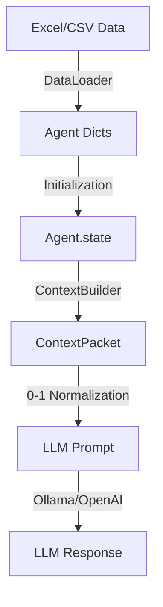

# Governed Broker Framework

**🌐 Language / 語言: [English](README.md) | [中文](README_zh.md)**

<div align="center">

**A governance middleware for LLM-driven Agent-Based Models**

[](https://www.python.org/downloads/)
[](LICENSE)

</div>

---

## Overview

The Governed Broker Framework provides a **skill-governed architecture** for building reliable LLM-based Agent-Based Models (ABMs). It ensures that LLM decisions are validated through a multi-stage pipeline before affecting simulation state.

### Key Features

- **Multi-Stage Validation**: Configurable validators ensure admissibility, feasibility, constraints, safety, and consistency
- **Multi-Agent Support**: Supports heterogeneous agent types with different skills and eligibility rules
- **Multi-Level State**: Individual, Social, Shared, and Institutional state layers with access control
- **Extensible LLM Providers**: Default Ollama, extensible to OpenAI, Anthropic, etc.
- **Full Traceability**: Complete audit trail for reproducibility

---

## Challenges & Solutions


| Challenge | Problem | Solution | Component |
|-----------|---------|----------|-----------|
| **Hallucination** | LLM generates invalid actions | Skill Registry restricts to registered skills | `SkillRegistry` |
| **Inconsistent Decisions** | Illogical or contradictory choices | Multi-stage validators check config-driven rules | `Validators` |
| **Domain Leakage** | Hardcoded logic in core layers | Config-driven orchestration & generic base classes | `Core Engine` |
| **No Traceability** | Cannot reproduce decisions | Complete audit trail with timestamps | `AuditWriter` |
| **Uncontrolled State** | Direct state mutation | State Manager controls all updates | `StateManager` |

---

## Framework vs. User Extension

To maintain a clean separation of concerns, the project is divided into **Framework Core** (generic logic) and **User Extension** (domain-specific logic).

### 🛠️ Framework Core (Do Not Modify)
These modules provide the generic orchestration and should remain domain-agnostic:
- **`broker/`**: Core registration, parsing, context building, and audit logic.
- **`simulation/`**: Generic multi-level state management and simulation loops.
- **`providers/`**: LLM connectivity (Ollama, OpenAI, etc.).
- **`validators/`**: The base `AgentValidator` engine.

### 🎨 User Extension (Customizable)
These areas are where users implement their specific simulation domain:
- **`broker/agent_types.yaml`**: Define your agent profiles, skills, and behavior parameters.
- **`validators/coherence_rules.yaml`**: Define domain-specific consistency and safety rules.
- **`examples/`**: Your experiment-specific agent implementations, environment models, and data.
- **`data/*.csv`**: Your agent population data and demographics.

---

## Skill Proposal Format

The framework requires LLM to output decisions in a **structured Skill Proposal format**:

```json
{
  "skill": "buy_insurance",
  "parameters": {"duration": 1},
  "reasoning": "High flood risk this year..."
}
```

### Why Skill Proposal?

| Aspect | Free-form LLM Output | Skill Proposal |
|--------|---------------------|----------------|
| **Parse-ability** | Requires complex NLP | Structured JSON, easy to parse |
| **Validation** | Cannot validate | Skill Registry checks eligibility |
| **Traceability** | Hard to log | Complete audit trail |
| **State Safety** | Direct mutation | Validated before execution |
| **Reproducibility** | Non-deterministic | Deterministic skill execution |

### How does LLM know available skills?

The **Context Builder** injects available skills into the prompt:

```
You are an agent. Available skills:
- buy_insurance: Purchase flood insurance (duration: int)
- elevate_house: Elevate your house (once only)
- relocate: Move to a safer area (permanent)
- do_nothing: Take no action this year

Respond with JSON: {"skill": "...", "parameters": {...}, "reasoning": "..."}
```

This ensures LLM only proposes registered skills, which are then validated by the Skill Broker.

### Core Execution Flow

```
┌─────────────────────────────────────────────────────────────────────┐
│  1. CONTEXT BUILDING                                                │
│     StateManager → ContextBuilder                                   │
│     • Read agent's individual state (memory, has_insurance, etc.)   │
│     • Read shared state (flood_occurred, year)                      │
│     • Inject available skills into prompt                           │
└───────────────────────────┬─────────────────────────────────────────┘
                            ▼
┌─────────────────────────────────────────────────────────────────────┐
│  2. LLM DECISION                                                    │
│     ContextBuilder → LLM                                            │
│     • LLM receives bounded context + skill list                     │
│     • LLM outputs SkillProposal JSON                                │
│     • {"skill": "buy_insurance", "parameters": {...}, ...}          │
└───────────────────────────┬─────────────────────────────────────────┘
                            ▼
┌─────────────────────────────────────────────────────────────────────┐
│  3. VALIDATION                                                      │
│     ModelAdapter → SkillBrokerEngine → Validators                   │
│     • Parse LLM output into structured SkillProposal                │
│     • Admissibility: Is skill registered? Agent eligible?           │
│     • Feasibility: Preconditions met? (not already elevated)        │
│     • Constraints: Annual limits? Once-only rules?                  │
│     • If INVALID → Fallback to "do_nothing"                         │
└───────────────────────────┬─────────────────────────────────────────┘
                            ▼
┌─────────────────────────────────────────────────────────────────────┐
│  4. EXECUTION & STATE UPDATE                                        │
│     SkillBrokerEngine → Executor → StateManager                     │
│     • Execute validated skill effects                               │
│     • Update agent's individual state                               │
│     • Log to AuditWriter for traceability                           │
└─────────────────────────────────────────────────────────────────────┘
```

---

## Architecture

### Single-Agent Mode


**Flow**: Environment → Context Builder → LLM → Model Adapter → Skill Broker Engine → Validators → Executor → State

#### V3 with Memory Layer


**Added**: Memory Layer with `retrieve()` (active) and `add_memory()` (passive) operations.

### Multi-Agent Mode


**Flow**: Agents → LLM (Skill Proposal) → Governed Broker Layer (Context Builder + Validators) → State Manager with four layers: Individual (memory), Social (neighbor observation), Shared (environment), and Institutional (policy rules).

#### V3 with Memory & Environment Layers


**Added**:
- **Memory Layer**: Working (neighbor, policy) + Episodic (flood, claim, decision)
- **Environment Layer**: Pure functions `process(flood|damage|claim|subsidy)`

---

## Quick Start

```bash
# Install dependencies
pip install -r requirements.txt

# Run example experiment
cd examples/skill_governed_flood
python run_experiment.py --model llama3.2:3b --num-agents 100 --num-years 10
```

---

## Framework Evolution


**No MCP → MCP v1 → Skill-Governed (v2)**: Progressive governance layers added for reliable LLM-ABM integration.

### ⚠️ Framework Versions

| Directory | Version | Experiment | Status |
|-----------|---------|------------|--------|
| `examples/v2_skill_governed/` | **Skill-Governed (v2)** | Exp 10 | ✅ Recommended |
| `examples/v1_mcp_flood/` | MCP (v1) | Exp 9 | ⚠️ DEPRECATED |
| `broker/legacy/` | Legacy broker components | - | ⚠️ DEPRECATED |

> **Note**: Use `v2_skill_governed/` for all new experiments. Legacy code is in `broker/legacy/`.

See [examples/README.md](examples/README.md) for detailed version comparison.

---

## Core Components (V2 Skill-Governed Architecture) ✅

> **Note**: The following components are for the **latest v2 Skill-Governed framework**. 
> For legacy v1 MCP components, see `broker/legacy/`.

### Broker Layer (`broker/`)

| Component | File | Purpose |
|-----------|------|---------|
| **SkillBrokerEngine** | `skill_broker_engine.py` | 🎯 Main orchestrator: validates skills → executes via simulation |
| **SkillRegistry** | `skill_registry.py` | 📋 Skill definitions with eligibility rules & parameters |
| **SkillProposal** | `skill_types.py` | 📦 Structured LLM output format (JSON) |
| **ModelAdapter** | `model_adapter.py` | 🔄 Parses raw LLM text → SkillProposal |
| **ContextBuilder** | `context_builder.py` | 👁️ Builds bounded context for agents |
| **Memory** | `memory.py` | 🧠 Working + Episodic memory with consolidation |
| **AuditWriter** | `audit_writer.py` | 📊 Complete audit trail for reproducibility |
| **GenericAuditWriter** | `generic_audit_writer.py` | 📊 Agent-agnostic audit logging (Dict-based) |
#### Agent Type Configuration (`broker/agent_types.yaml`)

All agent settings are externalized to a **unified YAML configuration**. This allows changing agent behavior without modifying Python code.

```yaml
household:
  # Valid skills for this agent type
  actions: 
    - id: buy_insurance
      aliases: ["Purchase Insurance"]
    - id: do_nothing
  
  # Domain-specific parameters accessed via get_parameters()
  parameters:
    income_threshold: 40000
    damage_threshold: 0.1
    
  # PMT Theory constructs for validation
  constructs: [TP, CP, SP, SC, PA]
```

#### Generic AgentValidator (`validators/agent_validator.py`)

The framework uses a **metadata-driven** validation system. Rules are configured in `agent_types.yaml` and `coherence_rules.yaml`.

| Category | Fields |
|----------|--------|
| **Core** | `agent_id`, `mg`, `tenure`, `income` |
| **Trust** | `trust_gov`, `trust_ins`, `trust_neighbors` |
| **Demographics** | `household_size`, `generations`, `has_vehicle`, `age_of_head`, ... |

> Any additional CSV columns are automatically loaded. See `get_schema_info("household")` for full schema.

#### Context Engineering Flow

The framework follows a structured pipeline to ensure high-fidelity context for LLMs:



1.  **DataLoader**: Reads extensible demographics (e.g., `household_size`, `generations`) from CSV.
2.  **State Mapping**: `HouseholdAgent` maps these to normalized fields (e.g., `income` → `income_norm`).
3.  **ContextBuilder**: Dynamically populates YAML prompt templates using the agent's state.
4.  **Prompt Format**: Variables like `{household_size}` are automatically injected from the agent's state.

#### Parameter Normalization Guide

Most trust and state parameters should be normalized to **0.0-1.0** range:

| Parameter | Min | Max | MG Typical | NMG Typical |
|-----------|-----|-----|------------|-------------|
| `income` | $20,000 | $150,000 | $35,000 | $75,000 |
| `property_value` | $0 | $500,000 | $220,000 | $350,000 |
| `trust_*` | 0.0 | 1.0 | LOW=0.3, MED=0.5, HIGH=0.7 |
| `generations` | 1 | 5 | Owner: 2, Renter: 1 |
| `household_size` | 1 | 10 | 3 |

```python
from broker.data_loader import get_normalization_guide
print(get_normalization_guide())
```


### State Layer (`simulation/`)

| Component | File | Description |
|-----------|------|-------------|
| `StateManager` | `state_manager.py` | Multi-level state: Individual / Social / Shared / Institutional |
| `SimulationEngine` | `engine.py` | ABM simulation loop with skill execution |

### Provider Layer (`providers/`)

| Component | File | Description |
|-----------|------|-------------|
| `OllamaProvider` | `ollama.py` | Default LLM provider (local Ollama) |
| `OpenAIProvider` | `openai_provider.py` | OpenAI API provider |
| `ProviderFactory` | `factory.py` | Dynamic provider instantiation |
| `RateLimiter` | `rate_limiter.py` | Rate limiting for API calls |

### Validator Layer (`validators/`)

| Component | File | Description |
|-----------|------|-------------|
| **AgentValidator** | `agent_validator.py` | 🎯 Generic validator for all agent types |
| `BaseValidator` | `base.py` | Abstract validator interface |
| `coherence_rules.yaml` | Config | Configurable PMT coherence rules |

#### Generic AgentValidator

The framework uses a **label-based** validation system. Rules are configured per `agent_type`:

```python
from validators.agent_validator import AgentValidator

validator = AgentValidator()

# Validate any agent type
results = validator.validate(
    agent_type="insurance",
    agent_id="InsuranceCo",
    decision=proposal,
    state=current_state
)
```

#### Validation Rules (per Agent Type)

```python
# Configured in validators/agent_validator.py
VALIDATION_RULES = {
    "insurance": {
        "rate_bounds": {"param": "premium_rate", "min": 0.02, "max": 0.15},
        "solvency_floor": {"param": "solvency", "min": 0.0}
    },
    "government": {
        "subsidy_bounds": {"param": "subsidy_rate", "min": 0.20, "max": 0.95},
        "budget_reserve": {"param": "budget_used", "max": 0.90}
    },
    "household": {
        "valid_decisions": {"values": ["FI", "HE", "BP", "RL", "DN", ...]}
    }
}
```

#### PMT Coherence Validation (Household)

The validator enforces **Psychological Coherence** by checking if the LLM's **Rating** is consistent with the agent's **Actual State**.

**Output Format**: `EVAL_[Construct]:[Rating] [Explanation]`
*   Example: `EVAL_TP:[HIGH] Recent local flood damaged my property significantly.`

**Coherence Rules** (Configured in `coherence_rules.yaml`):

| Construct | Reference Field | Condition | Invalid Rating |
|-----------|-----------------|-----------|----------------|
| **TP** (Threat) | `cumulative_damage` | High (>0.5) | LOW (L) |
| **CP** (Coping) | `income` | High (>0.8) | LOW (L) |
| **SP** (Stakeholder) | `trust_gov` + `trust_ins` | High (>0.7) | LOW (L) |
| **SC** (Social) | `trust_neighbors` | High (>0.7) | LOW (L) |
| **PA** (Attachment)| `elevated` OR `insured` | True | NONE |

Validations are logged as `WARNING` or `ERROR` in the audit trail.

---

## State Management

### State Ownership (Multi-Agent)

```
┌─────────────────────────────────────────────────────────────┐
│  Agent 1          Agent 2          Agent 3                  │
│  ┌──────────┐     ┌──────────┐     ┌──────────┐            │
│  │ INDIVIDUAL│     │ INDIVIDUAL│     │ INDIVIDUAL│           │
│  │ • memory  │     │ • memory  │     │ • memory  │           │
│  │ • elevated│     │ • elevated│     │ • elevated│           │
│  │ • insured │     │ • insured │     │ • insured │           │
│  └─────┬────┘     └─────┬────┘     └─────┬────┘            │
│        │                │                │                  │
│        └────────────────┼────────────────┘                  │
│                         ▼                                   │
│  ┌─────────────────────────────────────────────────────┐   │
│  │               SHARED STATE                           │   │
│  │  • flood_occurred  • year  • community_stats         │   │
│  └─────────────────────────────────────────────────────┘   │
└─────────────────────────────────────────────────────────────┘
```

| State Type | Examples | Scope | Read | Write |
|------------|----------|-------|------|-------|
| **Individual** | `memory`, `elevated`, `has_insurance` | Per-agent private | Self only | Self only |
| **Social** | `neighbor_actions`, `last_decisions` | Observable neighbors | Neighbors | System |
| **Shared** | `flood_occurred`, `year` | All agents | All | System |
| **Institutional** | `subsidy_rate`, `policy_mode` | All agents | All | Gov only |

> **Key Point**: `memory` is **Individual** - each agent has their own memory, not shared.

```python
from simulation import StateManager

state = StateManager()
state.register_agent("agent_1", agent_type="homeowner")

# Individual: agent's private state (including memory)
state.update_individual("agent_1", {
    "memory": ["flood in year 2", "bought insurance in year 3"],
    "elevated": True
})

# Shared: environment visible to all
state.update_shared({"flood_occurred": True, "year": 5})
```

---

## Validation Pipeline

| Stage | Validator | Check |
|-------|-----------|-------|
| 1 | Admissibility | Skill exists? Agent eligible for this skill? |
| 2 | Feasibility | Preconditions met? (e.g., not already elevated) |
| 3 | Constraints | Once-only? Annual limit? |
| 4 | Effect Safety | State changes valid? |
| 5 | PMT Consistency | Reasoning matches decision? |
| 6 | Uncertainty | Response confident? |

---

## Multi-Agent Configuration

```yaml
# config/agent_types.yaml
agent_types:
  homeowner:
    skills: [buy_insurance, elevate_house, relocate, do_nothing]
    observable: [neighbors, community]
  
  government:
    skills: [set_subsidy, change_policy]
    can_modify: [institutional]
```

---

## Framework Comparison

| Dimension | Single-Agent | Multi-Agent |
|-----------|--------------|-------------|
| State | Individual only | Individual + Social + Shared + Institutional |
| Agent Types | 1 type | N types (Resident, Gov, Insurance) |
| Observable | Self only | Self + Neighbors + Community Stats |
| Context | Direct | Via Context Builder + Social Module |
| Use Case | Basic ABM | Policy simulation with social dynamics |

---

## Extensibility

The framework is designed for extensibility to support:

### 1. Disaster Models Integration

Extend `SharedState` to include disaster model outputs:

```python
@dataclass
class DisasterSharedState(SharedState):
    # From disaster model
    flood_probability: float = 0.0
    flood_severity: float = 0.0
    sea_level_rise: float = 0.0
    
    # From climate model
    precipitation_forecast: float = 0.0
    storm_surge_risk: float = 0.0
```

### 2. Survey Data for Agent Demographics

Load real-world survey data as agent attributes:

```python
@dataclass
class SurveyFloodAgent(IndividualState):
    # Standard attributes
    elevated: bool = False
    has_insurance: bool = False
    
    # PMT attributes (from survey)
    trust_in_insurance: float = 0.3
    trust_in_neighbors: float = 0.4
    
    # Demographic attributes (from survey)
    age: int = 40
    income: str = "middle"           # low/middle/high
    education: str = "bachelor"
    household_size: int = 3
    homeownership: str = "owner"     # owner/renter
    years_in_community: int = 10
```

### 3. CSV Auto-Loading

Place `agent_initial_profiles.csv` in framework root:

```csv
id,elevated,has_insurance,trust_in_insurance,age,income,education
Agent_1,False,False,0.35,45,high,master
Agent_2,False,True,0.52,32,middle,bachelor
```

The framework automatically loads survey data if CSV exists.

### 4. Custom Context with Demographics

```python
class SurveyContextBuilder(ContextBuilder):
    def build(self, agent_id: str) -> Dict:
        return {
            # Standard context...
            "age": agent.age,
            "income": agent.income,
            "education": agent.education,
            # Include in LLM prompt for personalized decisions
        }
```

---

## Documentation

- [Architecture Details](docs/skill_architecture.md)
- [Customization Guide](docs/customization_guide.md)
- [Experiment Design](docs/experiment_design_guide.md)

---

## License

MIT
