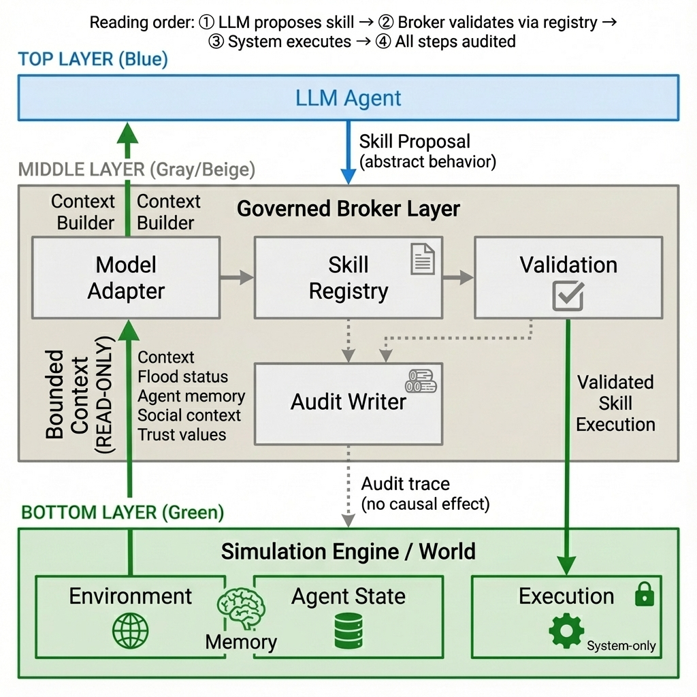

# Governed Broker Framework

<div align="center">

**A governance middleware for LLM-driven Agent-Based Models**

[](README.md#english) [](README.md#中文)

</div>

---

## English

### ✨ v0.2 Skill-Governed Architecture

| v0.1 Action-Based | v0.2 Skill-Governed |
|-------------------|---------------------|
| `action_code: "1"` | `skill_name: "buy_insurance"` |
| Format + PMT validation | 6-stage validation pipeline |
| Single LLM parser | Multi-LLM adapters |

👉 See [`docs/skill_architecture.md`](docs/skill_architecture.md) for details.

### Quick Start

```bash
pip install -r requirements.txt
cd examples/flood_adaptation
python run_skill_governed.py --model llama3.2:3b --num-agents 100 --num-years 10
```

### Architecture



### Key Components

| Component | Purpose |
|-----------|---------|
| `SkillBrokerEngine` | Main orchestrator |
| `SkillRegistry` | Institutional rules |
| `ModelAdapter` | Multi-LLM support |
| `SkillValidators` | 6-stage validation |

### Validation Pipeline

1. **Admissibility** - Skill exists? Agent eligible?
2. **Feasibility** - Preconditions met?
3. **Constraints** - Once-only? Annual limit?
4. **Effect Safety** - Safe state changes?
5. **PMT Consistency** - Reasoning consistent?
6. **Uncertainty** - Response confident?

### License

MIT

---

## 中文

### ✨ v0.2 技能治理架構

| v0.1 動作導向 | v0.2 技能治理 |
|---------------|---------------|
| `action_code: "1"` | `skill_name: "buy_insurance"` |
| 格式 + PMT 驗證 | 6 階段驗證管線 |
| 單一 LLM 解析器 | 多 LLM 適配器 |

👉 詳見 [`docs/skill_architecture.md`](docs/skill_architecture.md)

### 快速開始

```bash
pip install -r requirements.txt
cd examples/flood_adaptation
python run_skill_governed.py --model llama3.2:3b --num-agents 100 --num-years 10
```

### 架構


### 核心元件

| 元件 | 用途 |
|------|------|
| `SkillBrokerEngine` | 主協調器 |
| `SkillRegistry` | 制度規則 |
| `ModelAdapter` | 多 LLM 支援 |
| `SkillValidators` | 6 階段驗證 |

### 驗證管線

1. **Admissibility** - 技能存在？代理有權限？
2. **Feasibility** - 前置條件滿足？
3. **Constraints** - 單次限制？年度限制？
4. **Effect Safety** - 狀態變更安全？
5. **PMT Consistency** - 推理一致？
6. **Uncertainty** - 回應確定？

### 授權

MIT
