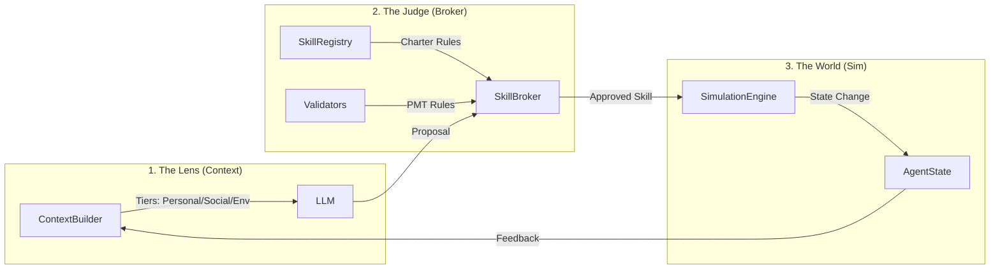

# Governed Broker Framework

**🌐 Language / 語言: [English](README.md) | [中文](README_zh.md)**

<div align="center">

**A governance middleware for LLM-driven Agent-Based Models**

[](https://www.python.org/downloads/)
[](LICENSE)

</div>

## Lego-Style Modular Architecture 🧱

The framework is built like a set of **Lego blocks**. Each component is independent and can be "plugged in" or swapped to build entirely different research experiments without changing the core engine.

### The 4 Core Building Blocks

| Block | Role | Analogy | Description |
| :--- | :--- | :--- | :--- |
| **Skill Registry** | The Charter | *The Law* | Defines *what* an agent can do and the physical constraints of those actions. |
| **Skill Broker** | The Judge | *The Court* | Enforces institutional and psychological rules (e.g., PMT coherence) on LLM proposals. |
| **Sim Engine** | The World | *The Physics* | Executes the results of approved actions and updates the environment (e.g., flood damage). |
| **Context Builder** | The Lens | *The Senses* | Filters what an agent "sees" (Personal, Social, and Global tiers) to create the LLM prompt. |

---

## 🛡️ Challenges & Solutions


| Challenge | Problem | Solution | Component |
| :--- | :--- | :--- | :--- |
| **Hallucination** | LLM generates invalid/non-existent actions | Skill Registry restricts to registered skills only | `SkillRegistry` |
| **Asymmetric Information** | LLM lacks state awareness, makes infeasible decisions | Context Builder provides bounded observable state | `ContextBuilder` |
| **Inconsistent Decisions** | Contradictory or illogical choices | Multi-stage validators check PMT consistency | `Validators` |
| **No Traceability** | Cannot reproduce or audit decisions | Complete audit trail with timestamps | `AuditWriter` |
| **Uncontrolled State Mutation** | Direct, unvalidated state changes | State Manager controls all state updates | `StateManager` |

---

---

## Multi-Agent Social Constructs (The "5 Pillars")

To support complex social simulations, we define 5 core psychological constructs that drive agent decision-making. These are implemented as modular "Governance Detectors":

1.  **Threat Perception (TP)**: Composed of preparedness, worry, and awareness.
2.  **Coping Perception (CP)**: Composed of self-efficiency, mitigation-cost, and mitigation-efficiency.
3.  **Stakeholder Perception (SP)**: Views on trustworthiness, expertise, and influence of governments, insurance, etc.
4.  **Social Capital (SC)**: Capital embedded in social networks, trust, and norms.
5.  **Place Attachment (PA)**: Emotional and physical bond to current location.

---

## How it Plugs Together (Lego Flow)



---

## Skill Proposal Format

The framework requires LLM to output decisions in a **structured Skill Proposal format**:

```json
{
  "skill": "approve_transaction",
  "parameters": {"amount": 5000},
  "reasoning": "Transaction is within authorized limit and risk score is low."
}
```

### Why Skill Proposal?

| Aspect | Free-form LLM Output | Skill Proposal |
|--------|---------------------|----------------|
| **Parse-ability** | Requires complex NLP | Structured JSON, easy to parse |
| **Validation** | Cannot validate | Skill Registry checks eligibility |
| **Traceability** | Hard to log | Complete audit trail |
| **State Safety** | Direct mutation | Validated before execution |
| **Reproducibility** | Non-deterministic | Deterministic skill execution |

### How does LLM know available skills?

The **Context Builder** injects available skills into the prompt (defined in `agent_types.yaml`):

```
You are a Supervisor Agent. Available skills:
- approve_transaction: Approve a pending request (parameters: id)
- reject_transaction: Reject with reason
- escalate_review: Send to human review
- do_nothing: Wait for more info

Respond with JSON: {"skill": "...", "parameters": {...}, "reasoning": "..."}
```

This ensures LLM only proposes registered skills, which are then validated by the Skill Broker.

### 🔄 Universal Modular Information Flow

The framework orchestrates a strict, data-driven loop to ensure LLM decisions are contextually grounded and physically consistent:

1.  **Context Building (The Intake)**: 
    -   `StateManager` aggregates real-time data from the three decoupled layers: **Individual** (private state/memory), **Social** (neighbor observation), and **Shared/Institutional** (environment/policy).
    -   `ContextBuilder` synthesizes this data into a structured, bounded prompt, injecting the available action set defined in the `SkillRegistry`.
2.  **LLM Decision (The Suggestion)**: 
    -   The LLM generates a **SkillProposal**—a structured JSON suggestion containing the chosen action, parameters, and psychological reasoning (Threat/Coping Appraisal).
3.  **Two-Tier Governance (The Filter)**:
    -   **Tier 1: Identity & Admissibility**: Checks if the agent's current state permits the action (e.g., a relocated agent cannot buy flood insurance).
    -   **Tier 2: Metadata & PMT Coherence**: Validates if the internal reasoning strings (e.g., `TP_REASON`) logically support the final decision based on protection motivation theory.
4.  **Execution & Audit (The Impact)**:
    -   Validated skills are committed by the `SimulationEngine`, which updates the physical environment (e.g., deducting funds, applying flood damage).
    -   The `AuditWriter` captures the entire pipeline (Input → LLM reasoning → Validation Result → Final Outcome) into **CSV traces** for high-resolution analysis.

---

## 🏗️ Core Architecture Components (Universal Modules)

### 1. Multi-Tier State Management
To accurately model social-ecological systems, we partition state into three distinct security and visibility horizons:

| Tier | Type | Visibility | Examples |
| :--- | :--- | :--- | :--- |
| **Individual** | Private | Self-Only | Income, Education, **Memory (Episodic History)**, Adaptation Status. |
| **Social** | Observable | Neighbors | Social capital, Neighbor's recent decisions (e.g., 50% of neighbors elevated). |
| **Shared / Inst.** | Global | All Agents | Flood severity, Year, Subsidy levels, Institutional trust scores. |

### 2. The Biologically-Inspired Memory Engine
Our `MemoryEngine` manages the agent's subjective perception of time:
-   **Passive Recording**: Every event (flood, payout, neighborhood change) is timestamped and stored.
-   **Active Salience Retrieval**: During `context_building`, the engine retrieves memories based on a **sliding window** or **salience threshold**, ensuring agents react to past trauma without suffering from "infinite context" errors.

### 3. Dual-Validator System
The `SkillBroker` categorized institutional and psychological rules into two critical tiers:
-   **Strict Validators (Error)**: Guard against non-physical or illegal actions (e.g., double elevation). Violations trigger a **mandatory retry** with localized feedback.
-   **Heuristic Validators (Warning)**: Flag "irrational" but physically possible behaviors (e.g., high threat but zero action). These allow for human-like diversity while ensuring researchers can flag anomalies in the audit trace.
    
    ---
    
    ## Architecture
    
    ### Single-Agent Mode
    
    
    
    **Flow**: Environment → Context Builder → LLM → Model Adapter → Skill Broker Engine → Validators → Executor → State
    
    #### V3 with Memory Layer
    
    
    
    **Added**: Memory Layer with `retrieve()` (active) and `add_memory()` (passive) operations.
    
    ### Multi-Agent Mode
    
    
    
    **Flow**: Agents → LLM (Skill Proposal) → Governed Broker Layer (Context Builder + Validators) → State Manager with four layers: Individual (memory), Social (neighbor observation), Shared (environment), and Institutional (policy rules).
    
    #### V3 with Memory & Environment Layers
    
    
    
    **Added**:
    - **Memory Layer**: Working (short-term) + Episodic (long-term)
    - **Environment Layer**: Pure functions `process(event_A, event_B)`

---

## Quick Start

```bash
# Install dependencies
pip install -r requirements.txt

# Run example experiment
cd examples/skill_governed_flood
python run_experiment.py --model llama3.2:3b --num-agents 100 --num-years 10
```

---

## Framework Evolution


**No MCP → MCP v1 → Skill-Governed (v2)**: Progressive governance layers added for reliable LLM-ABM integration.

### ⚠️ Framework Versions

| Directory | Version | Experiment | Status |
|-----------|---------|------------|--------|
| `examples/v2_skill_governed/` | **Skill-Governed (v2)** | Exp 10 | ✅ Recommended |
| `examples/v1_mcp_flood/` | MCP (v1) | Exp 9 | ⚠️ DEPRECATED |
| `broker/legacy/` | Legacy broker components | - | ⚠️ DEPRECATED |

> **Note**: Use `v2_skill_governed/` for all new experiments. Legacy code is in `broker/legacy/`.

See [examples/README.md](examples/README.md) for detailed version comparison.

---

## Core Components (V2 Skill-Governed Architecture) ✅

> **Note**: The following components are for the **latest v2 Skill-Governed framework**. 
> For legacy v1 MCP components, see `broker/legacy/`.

### Broker Layer (`broker/`)

| Component | File | Purpose |
|-----------|------|---------|
| **SkillBrokerEngine** | `skill_broker_engine.py` | 🎯 Main orchestrator: validates skills → executes via simulation |
| **SkillRegistry** | `skill_registry.py` | 📋 Skill definitions with eligibility rules & parameters |
| **SkillProposal** | `skill_types.py` | 📦 Structured LLM output format (JSON) |
| **ModelAdapter** | `model_adapter.py` | 🔄 Parses raw LLM text → SkillProposal |
| **ContextBuilder** | `context_builder.py` | 👁️ Builds bounded context for agents |
| **Memory** | `memory.py` | 🧠 Working + Episodic memory with consolidation |
| **AuditWriter** | `audit_writer.py` | 📊 Complete audit trail for reproducibility |

### State Layer (`simulation/`)

| Component | File | Description |
|-----------|------|-------------|
| `StateManager` | `state_manager.py` | Multi-level state: Individual / Social / Shared / Institutional |
| `SimulationEngine` | `engine.py` | ABM simulation loop with skill execution |

### Provider Layer (`providers/`)

| Component | File | Description |
|-----------|------|-------------|
| `OllamaProvider` | `ollama.py` | Default LLM provider (local Ollama) |
| `OpenAIProvider` | `openai_provider.py` | OpenAI API provider |
| `ProviderFactory` | `factory.py` | Dynamic provider instantiation |
| `RateLimiter` | `rate_limiter.py` | Rate limiting for API calls |

### Validator Layer (`validators/`)

| Component | File | Description |
|-----------|------|-------------|
| `BaseValidator` | `base.py` | Abstract validator interface |
| `SkillValidators` | `skill_validators.py` | Configurable validators (see below) |
| `ValidatorFactory` | `factory.py` | Dynamic validator loading from YAML |

#### Validation Pipeline Details

Each SkillProposal passes through a **configurable validation pipeline**:

```
SkillProposal → [Validator 1] → [Validator 2] → ... → [Validator N] → Execution
                    ↓               ↓                    ↓
               If FAIL → Reject with reason, fallback to default skill
```

#### Built-in Validator Types

| Validator Type | Purpose | When to Use |
|----------------|---------|-------------|
| **Admissibility** | Skill registered? Agent eligible? | Always (core) |
| **Feasibility** | Preconditions met? | When skills have prerequisites |
| **Constraints** | Institutional rules (once-only, limits) | When enforcing regulations |
| **Effect Safety** | State changes valid? | When protecting state integrity |
| **Domain-Specific** | Custom business logic | Define per use case |

> **Key Point**: Validators are **modular and configurable**. Add/remove validators based on your domain requirements.

```yaml
# config/validators.yaml - Example Configuration
validators:
  - name: admissibility
    enabled: true       # Core validator, always recommended
  - name: feasibility
    enabled: true       # Enable if skills have preconditions
  - name: constraints
    enabled: true       # Enable for institutional rules
  - name: custom_rule   # Your domain-specific validator
    enabled: true
    config:
      threshold: 0.5
```

---

## State Management

### State Ownership (Multi-Agent)

```
┌─────────────────────────────────────────────────────────────┐
│  Agent 1          Agent 2          Agent 3                  │
│  ┌──────────┐     ┌──────────┐     ┌──────────┐            │
│  │ INDIVIDUAL│     │ INDIVIDUAL│     │ INDIVIDUAL│           │
│  │ • memory  │     │ • memory  │     │ • memory  │           │
│  │ • elevated│     │ • elevated│     │ • elevated│           │
│  │ • insured │     │ • insured │     │ • insured │           │
│  └─────┬────┘     └─────┬────┘     └─────┬────┘            │
│        │                │                │                  │
│        └────────────────┼────────────────┘                  │
│                         ▼                                   │
│  ┌─────────────────────────────────────────────────────┐   │
│  │               SHARED STATE                           │   │
│  │  • flood_occurred  • year  • community_stats         │   │
│  └─────────────────────────────────────────────────────┘   │
└─────────────────────────────────────────────────────────────┘
```

| State Type | Examples | Scope | Read | Write |
|------------|----------|-------|------|-------|
| **Individual** | `memory`, `elevated`, `has_insurance` | Per-agent private | Self only | Self only |
| **Social** | `neighbor_actions`, `last_decisions` | Observable neighbors | Neighbors | System |
| **Shared** | `flood_occurred`, `year` | All agents | All | System |
| **Institutional** | `subsidy_rate`, `policy_mode` | All agents | All | Gov only |

> **Key Point**: `memory` is **Individual** - each agent has their own memory, not shared.

```python
from simulation import StateManager

state = StateManager()
state.register_agent("agent_1", agent_type="homeowner")

# Individual: agent's private state (including memory)
state.update_individual("agent_1", {
    "memory": ["flood in year 2", "bought insurance in year 3"],
    "elevated": True
})

# Shared: environment visible to all
state.update_shared({"flood_occurred": True, "year": 5})
```

---

## Validation Pipeline

| Stage | Validator | Check |
|-------|-----------|-------|
| 1 | Admissibility | Skill exists? Agent eligible for this skill? |
| 2 | Feasibility | Preconditions met? (e.g., not already elevated) |
| 3 | Constraints | Once-only? Annual limit? |
| 4 | Effect Safety | State changes valid? |
| 5 | PMT Consistency | Reasoning matches decision? (Warning or Error) |
| 6 | Uncertainty | Response confident? |

### Governance Taxonomy: Major Pillars vs. Minor Nuances

To maintain a balance between logical consistency and agent autonomy, we categorize governance rules into two tiers:

| Category | Mapping | Logic | Example |
| :--- | :--- | :--- | :--- |
| **Major Pillars** | **ERROR** | **Foundational PMT principles.** Violation creates systematic bias or non-physical behavior. | High Threat + Inaction; Low Threat + Drastic Adaptation (Relocation/HE). |
| **Minor Nuances** | **WARNING** | **Behavioral diversity.** Suspicious or sub-optimal choices that are still within the realm of "human" variance. | Medium Threat + Inaction; High Coping + Delayed response. |

Currently, all core PMT gates (Threat & Coping alignment) are set to **ERROR** to establish a baseline of "Rational Adaptation."

---

## Multi-Agent Configuration

```yaml
# config/agent_types.yaml
agent_types:
  homeowner:
    skills: [buy_insurance, elevate_house, relocate, do_nothing]
    observable: [neighbors, community]
  
  government:
    skills: [set_subsidy, change_policy]
    can_modify: [institutional]
```

---

## Framework Comparison

| Dimension | Single-Agent | Multi-Agent |
|-----------|--------------|-------------|
| State | Individual only | Individual + Social + Shared + Institutional |
| Agent Types | 1 type | N types (Resident, Gov, Insurance) |
| Observable | Self only | Self + Neighbors + Community Stats |
| Context | Direct | Via Context Builder + Social Module |
| Use Case | Basic ABM | Policy simulation with social dynamics |

---

## Extensibility

The framework is designed for extensibility to support:

### 1. Disaster Models Integration

Extend `SharedState` to include disaster model outputs:

```python
@dataclass
class DisasterSharedState(SharedState):
    # From disaster model
    flood_probability: float = 0.0
    flood_severity: float = 0.0
    sea_level_rise: float = 0.0
    
    # From climate model
    precipitation_forecast: float = 0.0
    storm_surge_risk: float = 0.0
```

### 2. Survey Data for Agent Demographics

Load real-world survey data as agent attributes:

```python
@dataclass
class SurveyFloodAgent(IndividualState):
    # Standard attributes
    elevated: bool = False
    has_insurance: bool = False
    
    # PMT attributes (from survey)
    trust_in_insurance: float = 0.3
    trust_in_neighbors: float = 0.4
    
    # Demographic attributes (from survey)
    age: int = 40
    income: str = "middle"           # low/middle/high
    education: str = "bachelor"
    household_size: int = 3
    homeownership: str = "owner"     # owner/renter
    years_in_community: int = 10
```

### 3. CSV Auto-Loading

Place `agent_initial_profiles.csv` in framework root:

```csv
id,elevated,has_insurance,trust_in_insurance,age,income,education
Agent_1,False,False,0.35,45,high,master
Agent_2,False,True,0.52,32,middle,bachelor
```

The framework automatically loads survey data if CSV exists.

### 4. Custom Context with Demographics

```python
class SurveyContextBuilder(ContextBuilder):
    def build(self, agent_id: str) -> Dict:
        return {
            # Standard context...
            "age": agent.age,
            "income": agent.income,
            "education": agent.education,
            # Include in LLM prompt for personalized decisions
        }
```

---

## Documentation

- [Architecture Details](docs/skill_architecture.md)
- [Customization Guide](docs/customization_guide.md)
- [Experiment Design](docs/experiment_design_guide.md)

---

## License

MIT
