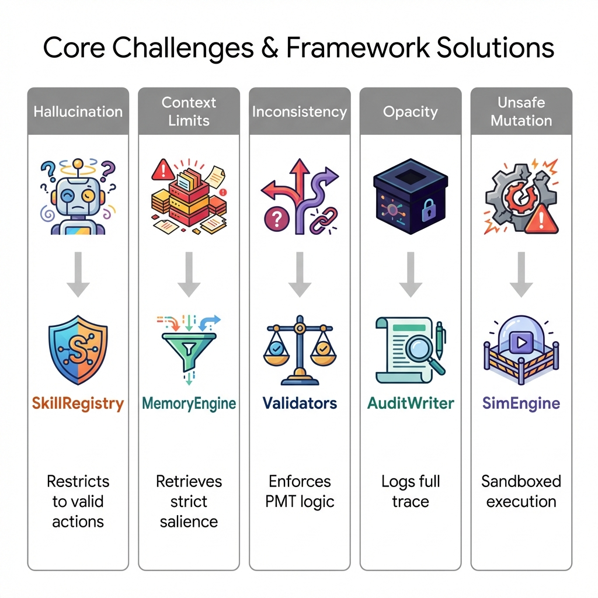
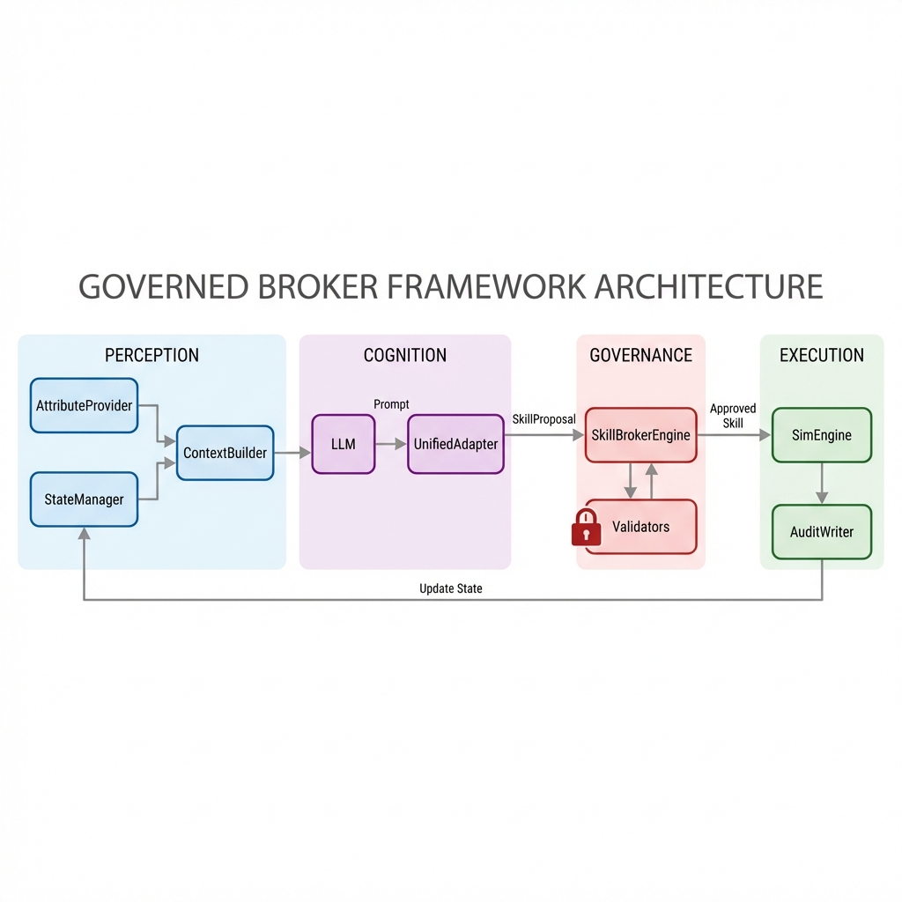
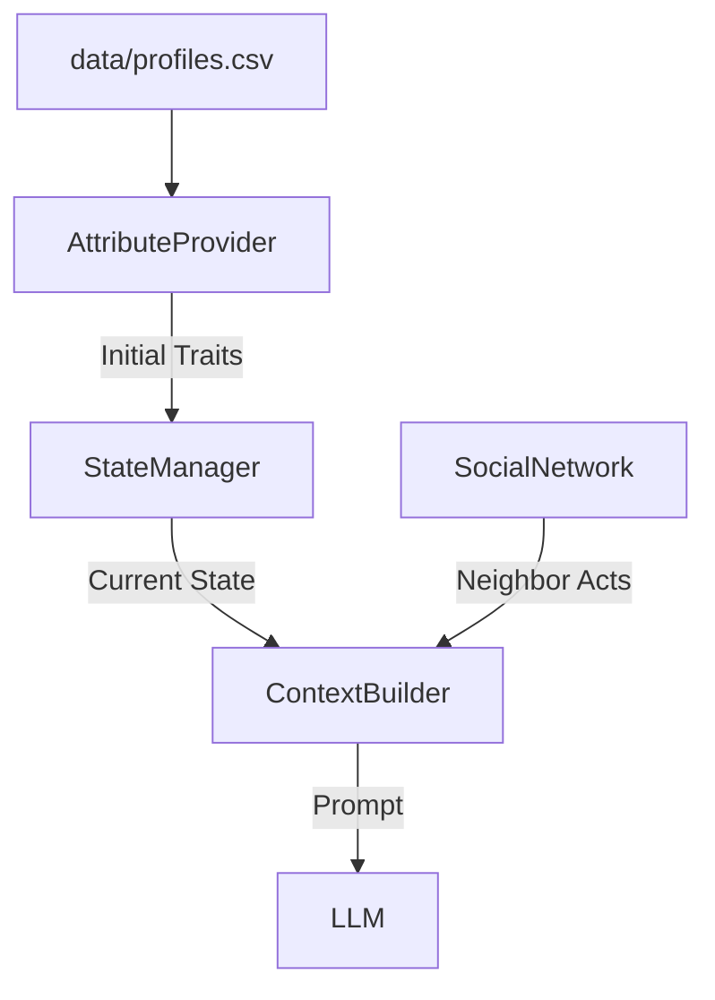

# Governed Broker Framework

**🌐 Language / 語言: [English](README.md) | [中文](README_zh.md)**

<div align="center">

**A governance middleware for LLM-driven Agent-Based Models**

[](https://www.python.org/downloads/)
[](LICENSE)

</div>

## Modular Middleware Architecture

The framework is designed as a **governance middleware** that sits between the Agent's decision-making model (LLM) and the simulation environment (ABM). Each component is decoupled, allowing for flexible experimentation with different models, validation rules, and environmental dynamics.

### The 4 Core Modules

| Module | Role | Description |
| :--- | :--- | :--- |
| **Skill Registry** | *The Charter* | Defines *what* an agent can do (actions), including costs, constraints, and physical consequences. |
| **Skill Broker** | *The Judge* | The central governance engine. Enforces institutional and psychological coherence on LLM proposals. |
| **Sim Engine** | *The World* | Executes validated actions and manages the physical state evolution (e.g., flood damage). |
| **Context Builder** | *The Lens* | Synthesizes a bounded view of reality (Personal Memory, Social Signals, Global State) for the agent. |

---

---

## 🛡️ Core Problems Statement



| Challenge | Problem Description | Framework Solution | Component |
| :--- | :--- | :--- | :--- |
| **Hallucination** | LLM generates invalid actions (e.g., "build wall") | **Strict Registry**: Only registered `skill_id`s are accepted. | `SkillRegistry` |
| **Context Limit** | Cannot dump entire history into prompt. | **Salience Memory**: Retrieves only top-k relevant past events. | `MemoryEngine` |
| **Inconsistency** | Decisions contradict reasoning (Logical Drift). | **Thinking Validators**: Checks logical coherence between `TP`/`CP` and `Choice`. | `SkillBrokerEngine` |
| **Opaque Decisions** | "Why did agent X do Y?" is lost. | **Structured Trace**: Logs Input, Reasoning, Validation, and Outcome. | `AuditWriter` |
| **Unsafe Mutation** | LLM output breaks simulation state. | **Sandboxed Execution**: Validated skills are executed by engine, not LLM. | `SimulationEngine` |

---

## Architecture

### 1. Single-Agent Loop (Detailed)

This diagram illustrates the flow for a single agent step, highlighting the transformation from Raw Data to Validated Action.



### 2. Multi-Agent Interaction

In multi-agent mode, social signals become a critical input.


### Framework Evolution


**Migration Note**: 
- **v1 (Legacy)**: Monolithic scripts.
- **v2 (Current)**: Modular `SkillBrokerEngine` + `providers`. Use `examples/single_agent/run_modular_experiment.py`.

---

## Core Components (V2 Skill-Governed Architecture) ✅

> **Note**: The following components are for the **latest v2 Skill-Governed framework**. 
> For legacy v1 MCP components, see `broker/legacy/`.

### Broker Layer (`broker/`)

| Component | File | Purpose |
|-----------|------|---------|
| **SkillBrokerEngine** | `skill_broker_engine.py` | 🎯 Main orchestrator: validates skills → executes via simulation |
| **SkillRegistry** | `skill_registry.py` | 📋 Skill definitions with eligibility rules & parameters |
| **SkillProposal** | `skill_types.py` | 📦 Structured LLM output format (JSON) |
| **ModelAdapter** | `model_adapter.py` | 🔄 Parses raw LLM text → SkillProposal |
| **ContextBuilder** | `context_builder.py` | 👁️ Builds bounded context for agents |
| **Memory** | `memory.py` | 🧠 Working + Episodic memory with consolidation |
| **AuditWriter** | `audit_writer.py` | 📊 Complete audit trail for reproducibility |

### State Layer (`simulation/`)

| Component | File | Description |
|-----------|------|-------------|
| `StateManager` | `state_manager.py` | Multi-level state: Individual / Social / Shared / Institutional |
| `SimulationEngine` | `engine.py` | ABM simulation loop with skill execution |

### Provider Layer & Adapters (`providers/` & `broker/utils/`)

| Component | File | Description |
|-----------|------|-------------|
| **UnifiedAdapter** | `model_adapter.py` | 🧠 **Smart Parsing**: Handles model-specific quirks (e.g., DeepSeek `<think>` tags, Llama JSON). |
| **LLM Utils** | `llm_utils.py` | ⚡ Centralized invocation with robust error handling and verbosity control. |
| **OllamaProvider** | `ollama.py` | Default local provider. |

### Validator Layer (`validators/`)

We categorize governance rules into a 2x2 matrix:

| Axis | **Strict (Block & Retry)** | **Heuristic (Warn & Log)** |
| :--- | :--- | :--- |
| **Physical / Identity** | *Impossible Actions* <br> (e.g., "Already elevated", "Insuring while relocated") | *Suspicious States* <br> (e.g., "Wealthy agent doing nothing") |
| **Psychological / Thinking** | *Logical Fallacies* <br> (e.g., "High Threat + Low Cost $\rightarrow$ Do Nothing") | *Behavioral Anomalies* <br> (e.g., "High Anxiety but delaying action") |

**Implementation:**
- **Identity Rules**: Checks against current state (from `StateManager`).
- **Thinking Rules**: Checks internal consistency of the LLM's reasoning (from `SkillProposal`).

### Initial Data & Context Linking

| Component | Role | Description |
|-----------|------|-------------|
| **AttributeProvider** | *The Seed* | Loads potential agent profiles from CSV (`agent_initial_profiles.csv`) or generates them stochastically. |
| **ContextBuilder** | *The Link* | dynamically pulls: <br> 1. **Static Traits** (from AttributeProvider) <br> 2. **Dynamic State** (from StateManager) <br> 3. **Social Signals** (from SocialNetwork) |



#### Validation Pipeline Details

Each SkillProposal passes through a **configurable validation pipeline**:

```
SkillProposal → [Validator 1] → [Validator 2] → ... → [Validator N] → Execution
                    ↓               ↓                    ↓
               If FAIL → Reject with reason, fallback to default skill
```

#### Built-in Validator Types

| Validator Type | Purpose | When to Use |
|----------------|---------|-------------|
| **Admissibility** | Skill registered? Agent eligible? | Always (core) |
| **Feasibility** | Preconditions met? | When skills have prerequisites |
| **Constraints** | Institutional rules (once-only, limits) | When enforcing regulations |
| **Effect Safety** | State changes valid? | When protecting state integrity |
| **Domain-Specific** | Custom business logic | Define per use case |

> **Key Point**: Validators are **modular and configurable**. Add/remove validators based on your domain requirements.

```yaml
# config/validators.yaml - Example Configuration
validators:
  - name: admissibility
    enabled: true       # Core validator, always recommended
  - name: feasibility
    enabled: true       # Enable if skills have preconditions
  - name: constraints
    enabled: true       # Enable for institutional rules
  - name: custom_rule   # Your domain-specific validator
    enabled: true
    config:
      threshold: 0.5
```

---

## State Management

### State Ownership (Multi-Agent)

```
┌─────────────────────────────────────────────────────────────┐
│  Agent 1          Agent 2          Agent 3                  │
│  ┌──────────┐     ┌──────────┐     ┌──────────┐            │
│  │ INDIVIDUAL│     │ INDIVIDUAL│     │ INDIVIDUAL│           │
│  │ • memory  │     │ • memory  │     │ • memory  │           │
│  │ • elevated│     │ • elevated│     │ • elevated│           │
│  │ • insured │     │ • insured │     │ • insured │           │
│  └─────┬────┘     └─────┬────┘     └─────┬────┘            │
│        │                │                │                  │
│        └────────────────┼────────────────┘                  │
│                         ▼                                   │
│  ┌─────────────────────────────────────────────────────┐   │
│  │               SHARED STATE                           │   │
│  │  • flood_occurred  • year  • community_stats         │   │
│  └─────────────────────────────────────────────────────┘   │
└─────────────────────────────────────────────────────────────┘
```

| State Type | Examples | Scope | Read | Write |
|------------|----------|-------|------|-------|
| **Individual** | `memory`, `elevated`, `has_insurance` | Per-agent private | Self only | Self only |
| **Social** | `neighbor_actions`, `last_decisions` | Observable neighbors | Neighbors | System |
| **Shared** | `flood_occurred`, `year` | All agents | All | System |
| **Institutional** | `subsidy_rate`, `policy_mode` | All agents | All | Gov only |

> **Key Point**: `memory` is **Individual** - each agent has their own memory, not shared.

```python
from simulation import StateManager

state = StateManager()
state.register_agent("agent_1", agent_type="homeowner")

# Individual: agent's private state (including memory)
state.update_individual("agent_1", {
    "memory": ["flood in year 2", "bought insurance in year 3"],
    "elevated": True
})

# Shared: environment visible to all
state.update_shared({"flood_occurred": True, "year": 5})
```

---

## Validation Pipeline

| Stage | Validator | Check |
|-------|-----------|-------|
| 1 | Admissibility | Skill exists? Agent eligible for this skill? |
| 2 | Feasibility | Preconditions met? (e.g., not already elevated) |
| 3 | Constraints | Once-only? Annual limit? |
| 4 | Effect Safety | State changes valid? |
| 5 | PMT Consistency | Reasoning matches decision? (Warning or Error) |
| 6 | Uncertainty | Response confident? |

### Governance Taxonomy: Major Pillars vs. Minor Nuances

To maintain a balance between logical consistency and agent autonomy, we categorize governance rules into two tiers:

| Category | Mapping | Logic | Example |
| :--- | :--- | :--- | :--- |
| **Major Pillars** | **ERROR** | **Foundational PMT principles.** Violation creates systematic bias or non-physical behavior. | High Threat + Inaction; Low Threat + Drastic Adaptation (Relocation/HE). |
| **Minor Nuances** | **WARNING** | **Behavioral diversity.** Suspicious or sub-optimal choices that are still within the realm of "human" variance. | Medium Threat + Inaction; High Coping + Delayed response. |

Currently, all core PMT gates (Threat & Coping alignment) are set to **ERROR** to establish a baseline of "Rational Adaptation."

---

## Multi-Agent Configuration

```yaml
# config/agent_types.yaml
agent_types:
  homeowner:
    skills: [buy_insurance, elevate_house, relocate, do_nothing]
    observable: [neighbors, community]
  
  government:
    skills: [set_subsidy, change_policy]
    can_modify: [institutional]
```

---

## Framework Comparison

| Dimension | Single-Agent | Multi-Agent |
|-----------|--------------|-------------|
| State | Individual only | Individual + Social + Shared + Institutional |
| Agent Types | 1 type | N types (Resident, Gov, Insurance) |
| Observable | Self only | Self + Neighbors + Community Stats |
| Context | Direct | Via Context Builder + Social Module |
| Use Case | Basic ABM | Policy simulation with social dynamics |

---

## Extensibility

The framework is designed for extensibility to support:

### 1. Disaster Models Integration

Extend `SharedState` to include disaster model outputs:

```python
@dataclass
class DisasterSharedState(SharedState):
    # From disaster model
    flood_probability: float = 0.0
    flood_severity: float = 0.0
    sea_level_rise: float = 0.0
    
    # From climate model
    precipitation_forecast: float = 0.0
    storm_surge_risk: float = 0.0
```

### 2. Survey Data for Agent Demographics

Load real-world survey data as agent attributes:

```python
@dataclass
class SurveyFloodAgent(IndividualState):
    # Standard attributes
    elevated: bool = False
    has_insurance: bool = False
    
    # PMT attributes (from survey)
    trust_in_insurance: float = 0.3
    trust_in_neighbors: float = 0.4
    
    # Demographic attributes (from survey)
    age: int = 40
    income: str = "middle"           # low/middle/high
    education: str = "bachelor"
    household_size: int = 3
    homeownership: str = "owner"     # owner/renter
    years_in_community: int = 10
```

### 3. CSV Auto-Loading

Place `agent_initial_profiles.csv` in framework root:

```csv
id,elevated,has_insurance,trust_in_insurance,age,income,education
Agent_1,False,False,0.35,45,high,master
Agent_2,False,True,0.52,32,middle,bachelor
```

The framework automatically loads survey data if CSV exists.

### 4. Custom Context with Demographics

```python
class SurveyContextBuilder(ContextBuilder):
    def build(self, agent_id: str) -> Dict:
        return {
            # Standard context...
            "age": agent.age,
            "income": agent.income,
            "education": agent.education,
            # Include in LLM prompt for personalized decisions
        }
```

---

## Documentation

- [Architecture Details](docs/skill_architecture.md)
- [Customization Guide](docs/customization_guide.md)
- [Experiment Design](docs/experiment_design_guide.md)

---

## License

MIT
