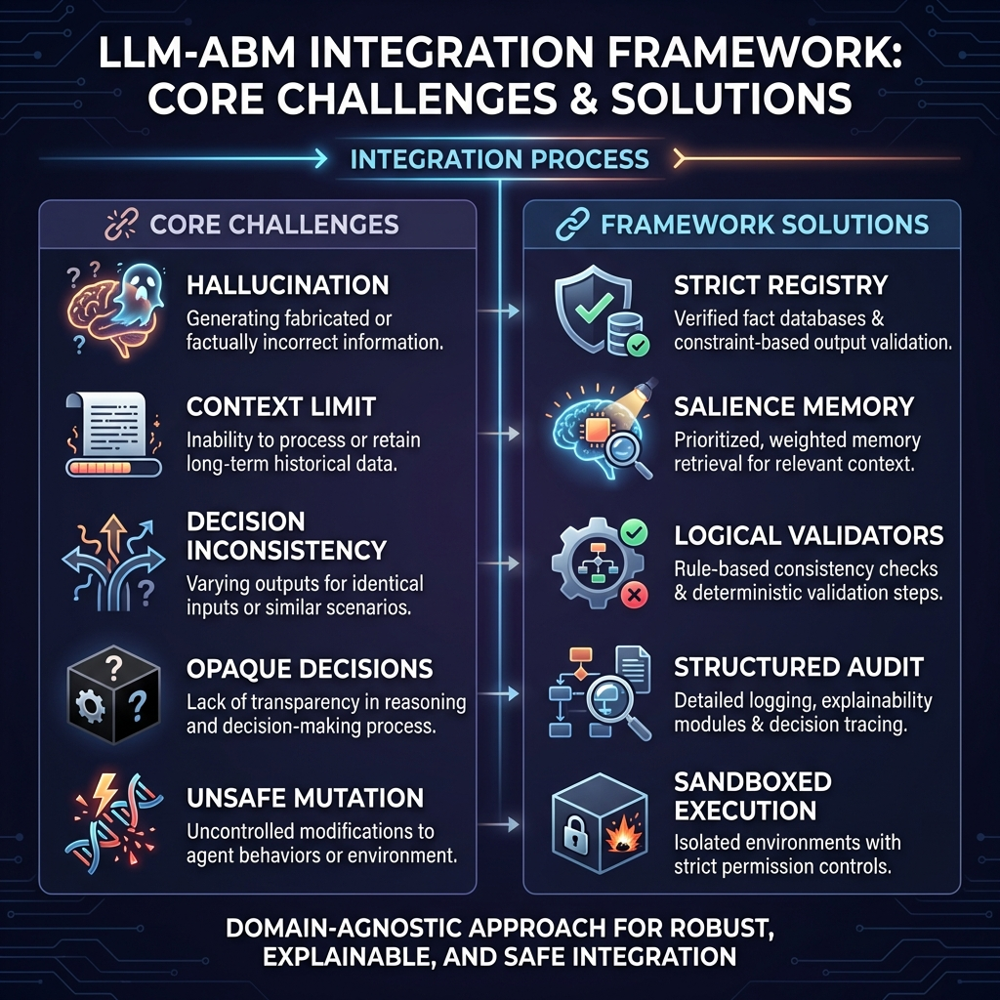
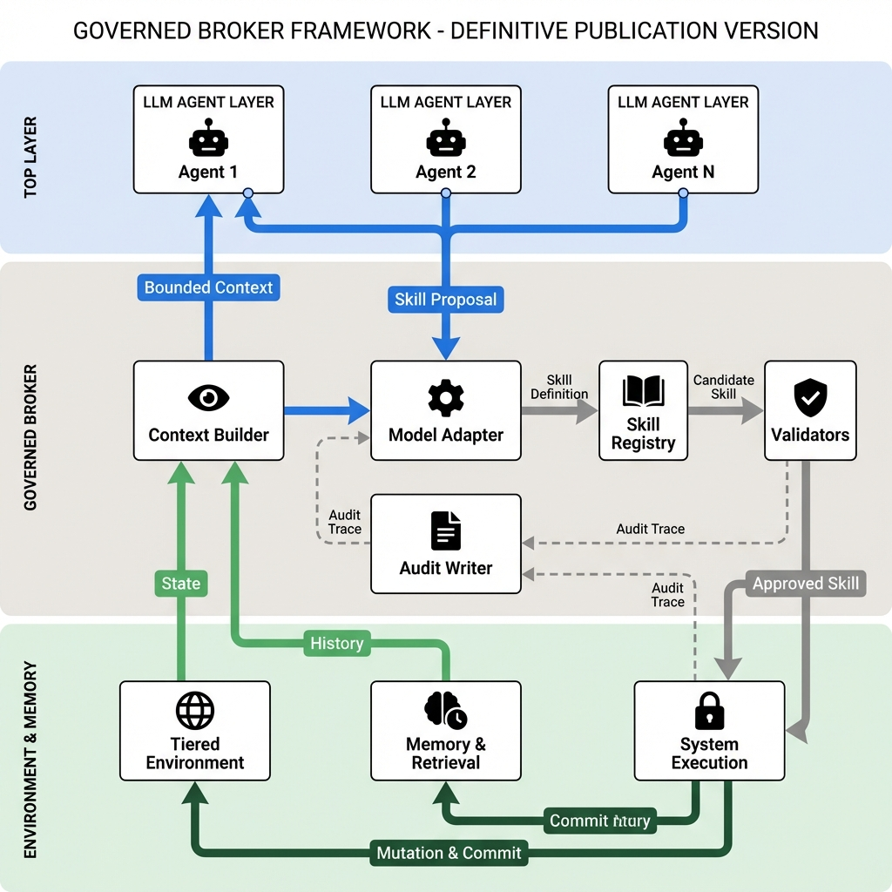
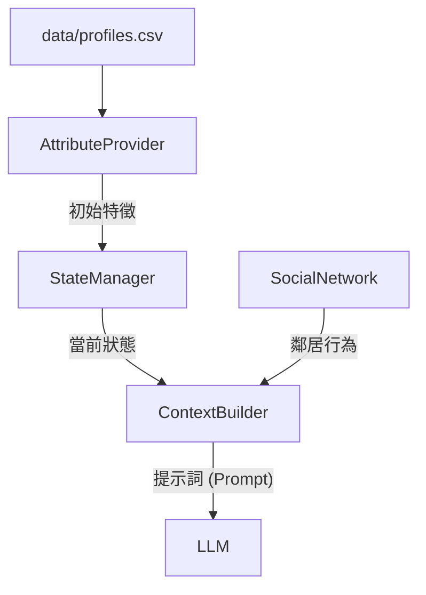

# Governed Broker Framework

**🌐 Language / 語言: [English](README.md) | [中文](README_zh.md)**

<div align="center">

**LLM 驅動的 Agent-Based Model 治理中間件**

[](https://www.python.org/downloads/)
[](LICENSE)

</div>

## 模組化中間件架構 (Modular Middleware Architecture)

本框架設計為位於代理人決策模型 (LLM) 與模擬環境 (ABM) 之間的 **治理中間件 (Governance Middleware)**。每個組件都是解耦的，允許靈活地實驗不同的模型、驗證規則與環境動態。

### 4 大核心模組

| 模組                | 角色   | 說明                                                                          |
| :------------------ | :----- | :---------------------------------------------------------------------------- |
| **Skill Registry**  | _憲法_ | 定義代理人 _能做什麼_ (技能)，包含成本、限制與物理後果。                      |
| **Skill Broker**    | _法官_ | 核心治理引擎。強制執行制度與心理一致性規則 ( PMT Coherence) 於 LLM 提案之上。 |
| **Sim Engine**      | _世界_ | 執行獲准的動作並管理物理狀態的演變 (例如：洪水損害)。                         |
| **Context Builder** | _感官_ | 為代理人合成一個有界的現實視圖 (個人記憶、社交信號、全局狀態)。               |

---

---

## 🛡️ 核心問題陳述



| 挑戰                     | 問題描述                            | 框架解決方案                                                  | 組件                |
| :----------------------- | :---------------------------------- | :------------------------------------------------------------ | :------------------ |
| **幻覺 (Hallucination)** | LLM 產生無效動作 (例如 "造牆")      | **嚴格註冊表**: 僅接受已註冊的 `skill_id`。                   | `SkillRegistry`     |
| **上下文限制**           | 無法將完整歷史塞入提示詞。          | **顯著性記憶**: 僅檢索 Top-k 相關的過去事件。                 | `MemoryEngine`      |
| **不一致性**             | 決策與推理矛盾 (邏輯漂移)。         | **思考驗證器**: 檢查 `TP`/`CP` 與 `Choice` 之間的邏輯連貫性。 | `SkillBrokerEngine` |
| **不透明決策**           | "為什麼代理人 X 做了 Y?" 行為佚失。 | **結構化軌跡**: 完整記錄 輸入、推理、驗證 與 結果。           | `AuditWriter`       |
| **不安全變更**           | LLM 輸出破壞模擬狀態。              | **沙盒執行**: 獲准技能由引擎執行，而非 LLM 直接修改。         | `SimulationEngine`  |

---

## 統一架構 (Unified Architecture v3.0)

本框架採用分層中間件方法，將單代理人的孤立推理與複雜的多代理人模擬進行了統一。



### 核心架構支柱：

1. **上下文感知感知 (Context-Aware Perception)**：明確區分環境 **狀態 (State)** 與歷史 **記憶 (Memories)**。
2. **單向治理 (One-Way Governance)**：LLM 提案單向流入驗證管線，隨後由系統執行。
3. **閉環反饋 (Closed Feedback Loop)**：模擬結果同時提交至記憶與環境狀態。
4. **全生命週期審計 (Lifecycle Auditing)**：`AuditWriter` 捕捉從提案到執行的完整軌跡，確保可重現性。

**遷移說明**:

- **v1 (舊版)**：單體腳本。
- **v2 (穩定)**：模組化 `SkillBrokerEngine` + `providers`。
- **v3 (最新)**：統一單/多代理人架構 + 專業審計軌跡。請使用 `run_unified_experiment.py`。
- **v3.1**：**人口統計錨定與統計驗證**。代理人決策與真實世界調研數據掛鉤。
- **v3.2 (正式版)**：**進階記憶與技能檢索**。實作 MemGPT 風格的分層記憶（核心/情節/語義）以及基於 RAG 的動態技能檢索。

---

## 🧠 進階記憶與技能檢索 (v3.2) ✅

為了處理長期模擬（10 年以上），v3.2 引入了 **分層記憶系統 (Tiered Memory System)** 與 **動態技能檢索 (RAG)**，確保代理人在不超過 LLM 上下文限制的情況下保持決策的一致性。

### 1. 分層（階層式）記憶

記憶不再是簡單的滑動窗口，而是分為三個功能層級：

- **CORE (核心)**：固定的代理人屬性（收入、人格特質、治理配置文件）。
- **HISTORIC (語義記憶)**：長期壓縮的重大事件歷史（例如：過去洪水的具體影響）。
- **RECENT (情節記憶)**：高解析度的最近幾年行為與社交記錄。

### 2. 上下文感知技能檢索 (RAG)

對於擁有多種備選動作的複雜模擬，框架使用 **SkillRetriever** 僅將最相關的動作注入 Prompt。

- **自適應精度**：根據當前情境（例如：當威脅程度高時，優先檢索搬遷相關技能）過濾無關技能，降低 LLM 的認知負荷。
- **基準測試相容**：當使用 `WindowMemoryEngine` 時，系統會自動禁用 RAG，以便與舊版基準（v1.0/v3.1）進行公平的科學對比。
  本框架現在包含一個明確的 **Memory Layer (記憶層)**，位於 Governed Broker 和 Simulation State 之間，增強了代理人的一致性與學習能力。

### 記憶元件

- **Working Memory (工作記憶)**: 短期儲存當下上下文 (例如：最近鄰居的動作、今年的政策)。
- **Episodic Memory (情節記憶)**: 長期儲存重要事件的歷史 (例如：過去的洪水災害、理賠紀錄、過去的決策)。

### 資訊流

1.  **主動檢索 (`retrieve()`)**:

    - 在做出決策之前，**Context Builder** 呼叫 `retrieve()` 獲取相關記憶。
    - _範例_: "檢索過去 3 年的洪水災害和理賠成功率。"
    - 這些數據會被注入到發送給 LLM 的 **Bounded Context (有界上下文)** 中。

2.  **被動儲存 (`add_memory()`)**:
    - 當 **Executor** 執行已驗證的技能後，觸發 `add_memory()`。
    - 決策、結果以及任何驗證註記都會被儲存為新的記憶軌跡。
    - _範例_: "決策：加高房屋 (第 5 年)。結果：成功。"

### 增強型審計 (Audit)

**Audit Writer** 捕捉認知過程的完整軌跡：

- **Input**: 提供了什麼上下文/記憶？
- **Reasoning**: LLM 的內部推理是什麼？
- **Validation**: 提案為何被接受或拒絕？
- **Execution**: 實際發生了什麼狀態變更？

---

# 🏗️ 通用性與標準化指南 (v3.0)

為了確保框架保持 domain-agnostic (領域無關) 並在不同模擬之間維持高度可比性，我們遵循嚴格的 **0-1 參數標準化規範**。

### 1. 0-1 參數規範

所有核心模組中的心理、制度與物理狀態參數，應盡可能標準化至 `[0.0, 1.0]` 範圍。

| 類別     | 建議參數名稱          | 預設 / 範圍    | 描述                             |
| :------- | :-------------------- | :------------- | :------------------------------- |
| **認知** | `semantic_thresholds` | `(0.3, 0.7)`   | Prompt 中 L/M/H 標籤的上下界。   |
| **記憶** | `importance_weights`  | `0.1` to `1.0` | 不同記憶類別的顯著性評分權重。   |
| **驗證** | `risk_tolerance`      | `0.5`          | 心理連貫性檢查的基準值。         |
| **環境** | `hazard_intensity`    | `0.0` to `1.0` | 外部衝擊（如災害）的強度或機率。 |

### 2. 通用性檢查清單 (Universality Checklist)

當將框架擴展到新領域（如：金融、醫療）時，請確保：

- [ ] **解耦提示詞 (Decoupled Prompting)**: 使用 `agent_types.yaml` 中的 `prompt_template`，而非硬編碼文字。
- [ ] **泛用技能 (Generic Skills)**: 在 `skill_registry.yaml` 中註冊領域動作，並賦予唯一的 `skill_id`。
- [ ] **反射式發現 (Reflective Discovery)**: 確保 Prompt 中使用的代理人屬性是可公開訪問的 (publicly accessible)。
- [ ] **審計相容性 (Audit Compatibility)**: 目錄與模型名稱使用 `snake_case`，以確保日誌一致性。

### 3. 預設配置建議

- **Window Memory**: `window_size=3` (在上下文長度與簡潔度之間取得平衡)。
- **治理配置文件**: `strict` 用於科學研究，`permissive` 用於創意探索。
- **重試邏輯**: `max_retries=2` (共 3 次嘗試) 是在不增加過多成本下的最佳復原策略。

---

```bash
# 安裝依賴
pip install -r requirements.txt

# 執行範例實驗
cd examples/skill_governed_flood
python run_experiment.py --model llama3.2:3b --num-agents 100 --num-years 10
```

---

## 🔄 框架演進


## 🔮 未來展望 (v3.3+)

建基於 v3.2 的穩健架構，我們未來的優化方向包括：

- **並行執行模式**: 實作 `MultiprocessingBroker` 以提升大規模模擬的執行效率。
- **多模態環境感知**: 支援基於視覺（Vision）的環境感知（例如：讓代理人「看到」洪水地圖）。
- **進階代理人委員會**: 擴展治理機制，建立隨機的代理人委員會進行決策同行評審（Peer Review）。
- **動態語義嵌入**: 採用向量資料庫（如 ChromaDB）提升技能檢索的精確度。

### 審計與透明度 (`broker/components/audit_writer.py`)

`AuditWriter` 提供了一個「玻璃盒」視角，為每個決策導出高解析度的 CSV 紀錄。

| 欄位名稱           | 說明                                                      |
| :----------------- | :-------------------------------------------------------- |
| **step_id**        | 模擬步驟/年份的唯一標識符。                               |
| **agent_id**       | 特定代理人的標識符 (例如 `Agent_1`)。                     |
| **proposed_skill** | LLM 在驗證前最初提案的動作名稱。                          |
| **final_skill**    | 最終執行的動作 (如果提案被拒絕，則可能不同)。             |
| **status**         | 動作結果 (SUCCESS, FAILED, 或 BLOCKED)。                  |
| **validated**      | 布林值，指示決策是否通過所有治理檢查。                    |
| **failed_rules**   | 被違反的規則 ID (例如 `TP_COHERENCE`)，以管線符號分隔。   |
| **reason_tp / cp** | 提取出的心理評估 (威脅/應對感知)。                        |
| **demo_score**     | 人口統計錨定分數 (0.0 到 1.0)，衡量對調研數據的使用程度。 |
| **llm_retries**    | 由於解析錯誤或空輸出導致的 LLM 層級重試次數。             |

---

## 🏗️ 技術架構細節

### 1. 狀態層 (State Layer): 多級所有權

由 `simulation/state_manager.py` 管理，狀態被劃分以確保嚴格的權限控制：

- **Individual (個人)**: 代理人獨有的私有變數 (例如 `elevated=True`, `has_insurance=False`)。
- **Social (社交)**: 來自鄰居的可觀察行為信號 (例如 `neighbor_decisions`)。
- **Shared (共享)**: 所有代理人可見的全局環境變數 (例如 `flood_occurrence`)。
- **Institutional (制度)**: 由特定實體控制的政策級變數 (例如 `tax_rate`, `subsidy`)。

### 2. 上下文構建器 (Context Builder): 有界感知

由 `broker/components/context_builder.py` 管理，此模組為代理人生成「世界觀」：

- **顯著性過濾 (Salience Filtering)**: 不使用完整歷史，而是使用加權重要性來檢索相關記憶。
- **人口統計錨定 (Demographic Anchoring)**: 自動將固定的調研特徵 (收入、世代) 注入角色設定中。
- **自適應精度 (Adaptive Precision)**: 將原始狀態數值 (如 `0.85 wealth`) 轉換為語義標籤 (如 `High Wealth`)，提升 LLM 推理效果。

### 3. 模擬引擎 (Simulation Engine): 順序世界演變

由 `simulation/engine.py` 管理，負責協調時間循環：

- **步驟流程**: 年末狀態更新 → 環境衝擊過渡 → 代理人決策循環 → 技能執行。
- **沙盒執行 (Sandboxed Execution)**: 代理人從不直接修改狀態。他們提案 `skill_id`，由引擎應用物理後果。

**No MCP → MCP v1 → Skill-Governed (v2) → Unified Simulation (v3)**：漸進式增加治理層級，實現可靠且可擴展的 LLM-ABM 整合。

---

## 核心元件

#### 代理人類型配置 (`broker/agent_types.yaml`)

所有代理人設置都已外部化到 **統一的 YAML 配置** 中。這允許在不修改 Python 代碼的情況下更改代理人行為。

```yaml
household:
  # 此代理人類型的有效技能
  actions:
    - id: buy_insurance
      aliases: ["Purchase Insurance"]
    - id: do_nothing

  # 透過 get_parameters() 訪問的領域專屬參數
  parameters:
    income_threshold: 40000
    damage_threshold: 0.1

  # 用於驗證的 PMT 理論構念
  constructs: [TP, CP, SP, SC, PA]
```

### 提供者層與適配器 (`providers/` & `broker/utils/`)

| 組件               | 檔案               | 說明                                                                                         |
| ------------------ | ------------------ | -------------------------------------------------------------------------------------------- |
| **UnifiedAdapter** | `model_adapter.py` | 🧠 **智能解析**：處理特定模型的怪癖（例如 DeepSeek 的 `<think>` 標籤、Llama 的 JSON 格式）。 |
| **LLM Utils**      | `llm_utils.py`     | ⚡ **集中調用**：具備穩健錯誤處理與詳細程度控制 (Verbosity control)。                        |
| **OllamaProvider** | `ollama.py`        | 預設的本地提供者。                                                                           |

### 驗證器層 (`validators/`)

我們將治理規則分類為一個 2x2 的矩陣：

| 維度                | **嚴格 (阻止並重試)**                                                    | **啟發式 (警告並記錄)**                              |
| :------------------ | :----------------------------------------------------------------------- | :--------------------------------------------------- |
| **物理 / 身份規則** | _不可能的動作_ <br> (例：「已加高房屋卻再次加高」、「已搬遷卻還買保險」) | _可疑狀態_ <br> (例：「富裕代理人卻選擇什麼都不做」) |
| **心理 / 思考規則** | _邏輯謬誤_ <br> (例：「高威脅 + 低成本 $\rightarrow$ 選擇什麼都不做」)   | _行為異常_ <br> (例：「極度焦慮卻延遲行動」)         |

**實作方式：**

- **身份規則 (Identity Rules)**：根據當前狀態（來自 `StateManager`）進行檢查。
- **思考規則 (Thinking Rules)**：檢查 LLM 推理內容的內部一致性（來自 `SkillProposal`）。

### 初始數據與上下文連結

| 組件                  | 角色     | 說明                                                                                                                                              |
| --------------------- | -------- | ------------------------------------------------------------------------------------------------------------------------------------------------- |
| **AttributeProvider** | _種子_   | 從 CSV (`agent_initial_profiles.csv`) 載入潛在代理人屬性或隨機生成。                                                                              |
| **ContextBuilder**    | _連結者_ | 動態提取並整合： <br> 1. **靜態特徵** (來自 AttributeProvider) <br> 2. **動態狀態** (來自 StateManager) <br> 3. **社交信號** (來自 SocialNetwork) |



## 狀態管理

### 狀態所有權 (多代理人)

| 狀態類型          | 範例                                  | 範圍       | 讀取   | 寫入   |
| ----------------- | ------------------------------------- | ---------- | ------ | ------ |
| **Individual**    | `memory`, `elevated`, `has_insurance` | 代理人私有 | 僅自己 | 僅自己 |
| **Social**        | `neighbor_actions`, `last_decisions`  | 可觀察鄰居 | 鄰居   | 系統   |
| **Shared**        | `flood_occurred`, `year`              | 所有代理人 | 全部   | 系統   |
| **Institutional** | `subsidy_rate`, `policy_mode`         | 所有代理人 | 全部   | 僅政府 |

> **重點**: `memory` 是 **Individual** - 每個代理人有自己的記憶，不共享。

---

## 驗證管線

| 階段 | 驗證器          | 檢查                               |
| ---- | --------------- | ---------------------------------- |
| 1    | Admissibility   | 技能存在？代理人有資格使用此技能？ |
| 2    | Feasibility     | 前置條件滿足？(例如，尚未加高)     |
| 3    | Constraints     | 一次性？年度限制？                 |
| 4    | Effect Safety   | 狀態變更有效？                     |
| 5    | PMT Consistency | 推理與決策一致？                   |
| 6    | Uncertainty     | 回應有信心？                       |

---

## 框架比較

| 維度       | 單代理人      | 多代理人                                     |
| ---------- | ------------- | -------------------------------------------- |
| 狀態       | 僅 Individual | Individual + Social + Shared + Institutional |
| 代理人類型 | 1 種          | N 種 (居民、政府、保險公司)                  |
| 可觀察     | 僅自己        | 自己 + 鄰居 + 社區統計                       |
| 上下文     | 直接          | 透過 Context Builder + Social Module         |
| 使用案例   | 基礎 ABM      | 具社會動態的政策模擬                         |

---

## 文件

- [實驗設計](docs/experiment_design_guide.md)

---

## 授權

MIT

---

## Single-Agent Flood Experiment (SA)

### �N�z�H��l��
- `examples/single_agent/run_flood.py` �|�q CSV ���J�N�z�H�]�w�C
- ���n���G`id`, `elevated`, `has_insurance`, `relocated`, `trust_in_insurance`, `trust_in_neighbors`, `flood_threshold`, `memory`�C
- `agent_type` �� `household`�A�ޯ�ӷ��� registry�C

### �a�`�ҫ�
- �x���Ҧ��G
  - `fixed`: �� `flood_years.csv` ���w�~��
  - `prob`: �� `FLOOD_PROBABILITY` ����~�׾��v
- �C�~�H���Ggrant �i�ΡB�F�~�[��B�H���^�СC
- �l�`�ҫ��G��� $10,000�F�Y�w�ﰪ�A�l�`���� 10%�C
- �ﰪ��|���C `flood_threshold`�A��֫���Q�T���v�C

### ��X�P����
- `simulation_log.csv` �t `yearly_decision` �P `cumulative_state`�C
- Audit traces �C������|�۰ʲM�šA�קK�V�J���P `run_id`�C

## �q�ΩʻP�i���@��

- SA �޿趰���b `examples/single_agent/`�A�֤� broker �O�� domain-agnostic�C
- �a�`�ѼƦb `run_flood.py`�Aprompt/skills �b `agent_types.yaml`�C
- �T�w��X���c�H�Q���{�]`config_snapshot.yaml`�Baudit CSV�Btraces�^�C
