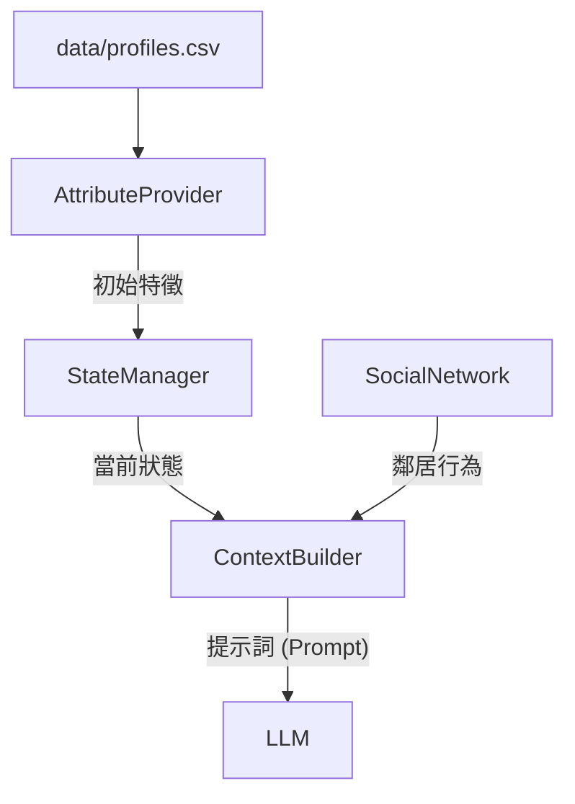

# Governed Broker Framework

**🌐 Language / 語言: [English](README.md) | [中文](README_zh.md)**

<div align="center">

**LLM 驅動的 Agent-Based Model 治理中間件**

[](https://www.python.org/downloads/)
[](LICENSE)

</div>

## 模組化中間件架構 (Modular Middleware Architecture)

本框架設計為位於代理人決策模型 (LLM) 與模擬環境 (ABM) 之間的 **治理中間件 (Governance Middleware)**。每個組件都是解耦的，允許靈活地實驗不同的模型、驗證規則與環境動態。

### 🧩 系統組件 (通用模組與連接器)

本框架由 **通用模組 (Common Modules)** 與 **整合連接器 (Integration Connectors)** 組成，確保能適應不同的模型與領域。

#### 1. 通用邏輯模組 (`simulation/`)

這些是驅動代理人認知的領域無關引擎，在所有模擬類型（單/多代理人）中共享。

| 模組           | Python 組件       | 職責                                                                                          |
| :------------- | :---------------- | :-------------------------------------------------------------------------------------------- |
| **認知記憶**   | `MemoryEngine`    | **分層儲存**。管理短期（視窗）與長期（隨機）記憶的保留。實作基於顯著性的 "System-Push" 檢索。 |
| **感知透鏡**   | `ContextBuilder`  | **提示合成**。透過情節緩衝區 (Episodic Buffer) 將龐大的歷史過濾為有限的提示詞上下文。         |
| **治理核心**   | `SkillBroker`     | **理性執行**。針對 "Thinking Rules"（如：威脅評估與行動的一致性）驗證 LLM 輸出，防止幻覺。    |
| **一致性檢查** | `FinalParityHook` | **狀態同步**。確保代理人的內部 Python 物件狀態與 LLM 的信念狀態完全吻合。                     |

#### 2. 整合連接器 (`providers/` & `InteractionHub`)

這些適配器允許框架掛載不同的「大腦」(LLMs) 與「世界」(Simulators)。

| 連接器         | 組件              | 職責                                                                                                                                             |
| :------------- | :---------------- | :----------------------------------------------------------------------------------------------------------------------------------------------- |
| **模型連接器** | `ProviderFactory` | **模型無關性**。統一的工廠介面，連接 **Ollama** (Local Llama/Gemma/DeepSeek) 或 **OpenAI/Anthropic** (API)。自動處理重試邏輯與解析差異。         |
| **世界連接器** | `InteractionHub`  | **模擬橋接**。將代理人與物理模擬器解耦。它將標準信號（如 `flood_depth: 1.5m`）轉譯為代理人感知，並將代理人動作（如 `elevate`）轉譯為模擬器指令。 |

---

---

## 🛡️ 核心問題陳述


| 挑戰                     | 問題描述                            | 框架解決方案                                                  | 組件                |
| :----------------------- | :---------------------------------- | :------------------------------------------------------------ | :------------------ |
| **幻覺 (Hallucination)** | LLM 產生無效動作 (例如 "造牆")      | **嚴格註冊表**: 僅接受已註冊的 `skill_id`。                   | `SkillRegistry`     |
| **上下文限制**           | 無法將完整歷史塞入提示詞。          | **顯著性記憶**: 僅檢索 Top-k 相關的過去事件。                 | `MemoryEngine`      |
| **不一致性**             | 決策與推理矛盾 (邏輯漂移)。         | **思考驗證器**: 檢查 `TP`/`CP` 與 `Choice` 之間的邏輯連貫性。 | `SkillBrokerEngine` |
| **不透明決策**           | "為什麼代理人 X 做了 Y?" 行為佚失。 | **結構化軌跡**: 完整記錄 輸入、推理、驗證 與 結果。           | `AuditWriter`       |
| **不安全變更**           | LLM 輸出破壞模擬狀態。              | **沙盒執行**: 獲准技能由引擎執行，而非 LLM 直接修改。         | `SimulationEngine`  |

---

## 統一架構 (Unified Architecture v3.0)

本框架採用分層中間件方法，將單代理人的孤立推理與複雜的多代理人模擬進行了統一。


### 核心架構支柱：

1. **上下文感知感知 (Context-Aware Perception)**：明確區分環境 **狀態 (State)** 與歷史 **記憶 (Memories)**。
2. **單向治理 (One-Way Governance)**：LLM 提案單向流入驗證管線，隨後由系統執行。
3. **閉環反饋 (Closed Feedback Loop)**：模擬結果同時提交至記憶與環境狀態。
4. **全生命週期審計 (Lifecycle Auditing)**：`AuditWriter` 捕捉從提案到執行的完整軌跡，確保可重現性。

**遷移說明**:

- **v1 (舊版)**：單體腳本。
- **v2 (穩定)**：模組化 `SkillBrokerEngine` + `providers`。
- **v3 (最新)**：統一單/多代理人架構 + 專業審計軌跡。請使用 `run_unified_experiment.py`。
- **v3.3 (JOH Edition)**：**認知中介層實作 (Cognitive Middleware Implementation)**。
  - **耦合介面 (Coupling Interface)**：輸入 (JSON 信號) 與 輸出 (Action JSON) 完全解耦，支援與 HEC-RAS/SWMM 等物理模型整合。
  - **以人為本的記憶 (Human-Centric Memory)**：引入情感編碼與隨機固化機制。
  - **可解釋的治理 (Explainable Governance)**：新增自我修正軌跡 (Self-Correction Trace)，實現透明的理性決策。
- **v3.1**：**人口統計錨定與統計驗證**。代理人決策與真實世界調研數據掛鉤。
- **v3.2 (正式版)**：**進階記憶與技能檢索**。實作 MemGPT 風格的分層記憶（核心/情節/語義）。

---

## 🧠 進階記憶與技能檢索 (v3.2) ✅

為了處理長期模擬（10 年以上），v3.2 引入了 **分層記憶系統 (Tiered Memory System)** 與 **動態技能檢索 (RAG)**，確保代理人在不超過 LLM 上下文限制的情況下保持決策的一致性。

### 1. 分層（階層式）記憶

記憶不再是簡單的滑動窗口，而是分為三個功能層級：

- **CORE (核心)**：固定的代理人屬性（收入、人格特質、治理配置文件）。
- **HISTORIC (語義記憶)**：長期壓縮的重大事件歷史（例如：過去洪水的具體影響）。
- **RECENT (情節記憶)**：高解析度的最近幾年行為與社交記錄。

### 2. 上下文感知技能檢索 (RAG)

對於擁有多種備選動作的複雜模擬，框架使用 **SkillRetriever** 僅將最相關的動作注入 Prompt。

- **自適應精度**：根據當前情境（例如：當威脅程度高時，優先檢索搬遷相關技能）過濾無關技能，降低 LLM 的認知負荷。
- **基準測試相容**：當使用 `WindowMemoryEngine` 時，系統會自動禁用 RAG，以便與舊版基準（v1.0/v3.1）進行公平的科學對比。
  本框架現在包含一個明確的 **Memory Layer (記憶層)**，位於 Governed Broker 和 Simulation State 之間，增強了代理人的一致性與學習能力。

### 記憶元件

- **Working Memory (工作記憶)**: 短期儲存當下上下文 (例如：最近鄰居的動作、今年的政策)。
- **Episodic Memory (情節記憶)**: 長期儲存重要事件的歷史 (例如：過去的洪水災害、理賠紀錄、過去的決策)。

### 資訊流

1.  **主動檢索 (`retrieve()`)**:
    - 在做出決策之前，**Context Builder** 呼叫 `retrieve()` 獲取相關記憶。
    - _範例_: "檢索過去 3 年的洪水災害和理賠成功率。"
    - 這些數據會被注入到發送給 LLM 的 **Bounded Context (有界上下文)** 中。

2.  **被動儲存 (`add_memory()`)**:
    - 當 **Executor** 執行已驗證的技能後，觸發 `add_memory()`。
    - 決策、結果以及任何驗證註記都會被儲存為新的記憶軌跡。
    - _範例_: "決策：加高房屋 (第 5 年)。結果：成功。"

### 增強型審計 (Audit)

**Audit Writer** 捕捉認知過程的完整軌跡：

- **Input**: 提供了什麼上下文/記憶？
- **Reasoning**: LLM 的內部推理是什麼？
- **Validation**: 提案為何被接受或拒絕？
- **Execution**: 實際發生了什麼狀態變更？

---

# 🏗️ 通用性與標準化指南 (v3.0)

為了確保框架保持 domain-agnostic (領域無關) 並在不同模擬之間維持高度可比性，我們遵循嚴格的 **0-1 參數標準化規範**。

### 1. 0-1 參數規範

所有核心模組中的心理、制度與物理狀態參數，應盡可能標準化至 `[0.0, 1.0]` 範圍。

| 類別     | 建議參數名稱          | 預設 / 範圍    | 描述                             |
| :------- | :-------------------- | :------------- | :------------------------------- |
| **認知** | `semantic_thresholds` | `(0.3, 0.7)`   | Prompt 中 L/M/H 標籤的上下界。   |
| **記憶** | `importance_weights`  | `0.1` to `1.0` | 不同記憶類別的顯著性評分權重。   |
| **驗證** | `risk_tolerance`      | `0.5`          | 心理連貫性檢查的基準值。         |
| **環境** | `hazard_intensity`    | `0.0` to `1.0` | 外部衝擊（如災害）的強度或機率。 |

### 2. 通用性檢查清單 (Universality Checklist)

當將框架擴展到新領域（如：金融、醫療）時，請確保：

- [ ] **解耦提示詞 (Decoupled Prompting)**: 使用 `agent_types.yaml` 中的 `prompt_template`，而非硬編碼文字。
- [ ] **泛用技能 (Generic Skills)**: 在 `skill_registry.yaml` 中註冊領域動作，並賦予唯一的 `skill_id`。
- [ ] **反射式發現 (Reflective Discovery)**: 確保 Prompt 中使用的代理人屬性是可公開訪問的 (publicly accessible)。
- [ ] **審計相容性 (Audit Compatibility)**: 目錄與模型名稱使用 `snake_case`，以確保日誌一致性。

### 3. 預設配置建議

- **Window Memory**: `window_size=3` (在上下文長度與簡潔度之間取得平衡)。
- **治理配置文件**: `strict` 用於科學研究，`permissive` 用於創意探索。
- **重試邏輯**: `max_retries=2` (共 3 次嘗試) 是在不增加過多成本下的最佳復原策略。

---

```bash
# 安裝依賴
pip install -r requirements.txt

# 執行範例實驗
cd examples/skill_governed_flood
python run_experiment.py --model llama3.2:3b --num-agents 100 --num-years 10
```

---

## 🔄 框架演進


## 🧠 認知架構與設計哲學 (Cognitive Architecture & Design Philosophy)

我們的 **Context Builder** 不僅是一個資料管道；它是一個經過精心設計的**「認知透鏡 (Cognitive Lens)」**，用於建構現實以減輕 LLM 的幻覺與認知偏誤。

### 1. 結構性偏誤緩解 (Structural Bias Mitigation)

我們明確地透過 Prompt 工程來對抗已知的 LLM 限制：

- **Scale Anchoring (The "Floating M" Problem)**: 3B 模型在長文本中容易失去符號與定義的連結。
  - **設計**: 我們使用 **行內語意錨定 (Inline Semantic Anchoring)** (例如 `TP=M(Medium)` 而非僅 `TP=M`) 來強制模型即時理解。
- **Option Primacy Bias**: LLM 在統計上傾向選擇列表中的第一個選項。
  - **設計**: `Context Builder` 實作了 **動態選項洗牌 (Dynamic Option Shuffling)**，確保 "Do Nothing" 或 "Buy Insurance" 不會因為總是排在第一位而獲得不公平的優勢。
- **The "Goldfish Effect" (Recency Bias)**: 當資訊過載時，模型會忘記早期的指令。
  - **設計**: 我們使用 **分層上下文階層 (Tiered Context Hierarchy)** (`Personal State -> Local Observation -> Global Memory`)。這將生存關鍵數據 (State) 放在最接近決策區塊的位置，同時壓縮遠期記憶。

### 2. 邏輯-行動驗證器與可解釋反饋循環 (Explainable Feedback Loop)

- **挑戰**:「邏輯-行動差距 (Logic-Action Gap)」。小型 LLM 經常輸出「威脅非常高 (VH)」的推理，但卻因為語法困惑或獎勵偏誤而選擇「不採取行動 (Do Nothing)」。
- **解決方案**: **SkillBrokerEngine** 實作了 **遞歸反饋循環 (Recursive Feedback Loop)**。
  1. **偵測 (Detection)**: 驗證器掃描解析後的結果。若 `TP=VH` 但代理人忽略了加高或保險而選擇「不採取行動」，則產生 `InterventionReport`。
  2. **注入 (Injection)**: 框架提取具體的違規原因（例如：_"不匹配：高威脅感知但選擇被動動作"_），並將其注入 **重試提示詞 (Retry Prompt)**。
  3. **指令 (Instruction)**: 告知 LLM：_"您之前的回應因邏輯不一致被拒絕。原因如下：[違規描述]。請根據您的威脅評估重新考慮動作。"_
  4. **軌跡 (Trace)**: 治理引擎與 LLM 之間的這場「辯論」會完整記錄在 `AuditWriter` 中。

---

## 🧠 記憶演進：從窗口到分層 (v4 路線圖)

框架正從簡單的滑動窗口記憶轉向 **分層認知架構 (Tiered Cognitive Architecture)**，在保持歷史感知的同時解決上下文過載問題。

### 第一層：工作記憶 (Working Memory - 滑動窗口)

- **範圍**: 最近 5 年的詳細事件。
- **功能**: 為當前決策步驟提供即時上下文。
- **清理**: 定期清除低重要性事件以維持 Token 效率。

### 第二層：情節摘要 (Episodic Summary - 以人為本檢索)

- **範圍**: 歷史性的重大創傷事件（如：第 2 年的特大洪水）。
- **功能**: 使用 **隨機檢索機制**。記憶透過 `重要性 = (情緒 x 來源) x 衰減` 評分。高情緒記憶會繞過窗口限制，即使在 10 年後也會被「推回」提示詞中。

### 第三層：語法洞察 (Semantic Insights - 反思引擎) - [最新 v3.3]

- **範圍**: 固化的生活教訓。
- **功能**: 年末觸發「系統二」思考過程。反思引擎要求 LLM 將當年的經歷總結為一條 **洞察 (Insight)**（例：_"保險是我應對財務崩潰的唯一緩衝"_）。這些洞察作為高優先級語義記憶儲存，確保代理人的「人格」隨經驗演化。

---

## 🧪 實驗配置說明 (Baseline vs. Full)

在框架的驗證流程（如 JOH 論文）中，我們定義了兩種核心配置來測試通用模組的效能：

1. **Baseline (基準組)**：
   - **記憶**: 使用 `WindowMemoryEngine` (簡單滑動窗口)。
   - **治理**: 僅開啟基礎語法驗證。
   - **目的**: 建立一個控制組，用來衡量「認知中介層」在缺乏長效記憶時的行為表現。

2. **Full (完整組)**：
   - **記憶**: 開啟 **Human-Centric Memory** (含反思引擎)。
   - **治理**: 開啟 **Logic-Action Validator** (遞歸重試機制)。
   - **感知**: 開啟 **Pillar 3 (Priority Schema)** 權重感知。
   - **目的**: 完整展現三支柱架構在解決 LLM 幻覺與偏誤上的能力。

---

---

## 核心元件

#### 代理人類型配置 (`broker/agent_types.yaml`)

所有代理人設置都已外部化到 **統一的 YAML 配置** 中。這允許在不修改 Python 代碼的情況下更改代理人行為。

```yaml
household:
  # 此代理人類型的有效技能
  actions:
    - id: buy_insurance
      aliases: ["Purchase Insurance"]
    - id: do_nothing

  # 透過 get_parameters() 訪問的領域專屬參數
  parameters:
    income_threshold: 40000
    damage_threshold: 0.1

  # 用於驗證的 PMT 理論構念
  constructs: [TP, CP, SP, SC, PA]
```

### 提供者層與適配器 (`providers/` & `broker/utils/`)

| 組件               | 檔案               | 說明                                                                                         |
| ------------------ | ------------------ | -------------------------------------------------------------------------------------------- |
| **UnifiedAdapter** | `model_adapter.py` | 🧠 **智能解析**：處理特定模型的怪癖（例如 DeepSeek 的 `<think>` 標籤、Llama 的 JSON 格式）。 |
| **LLM Utils**      | `llm_utils.py`     | ⚡ **集中調用**：具備穩健錯誤處理與詳細程度控制 (Verbosity control)。                        |
| **OllamaProvider** | `ollama.py`        | 預設的本地提供者。                                                                           |

### 驗證器層 (`validators/`)

我們將治理規則分類為一個 2x2 的矩陣：

| 維度                | **嚴格 (阻止並重試)**                                                    | **啟發式 (警告並記錄)**                              |
| :------------------ | :----------------------------------------------------------------------- | :--------------------------------------------------- |
| **物理 / 身份規則** | _不可能的動作_ <br> (例：「已加高房屋卻再次加高」、「已搬遷卻還買保險」) | _可疑狀態_ <br> (例：「富裕代理人卻選擇什麼都不做」) |
| **心理 / 思考規則** | _邏輯謬誤_ <br> (例：「高威脅 + 低成本 $\rightarrow$ 選擇什麼都不做」)   | _行為異常_ <br> (例：「極度焦慮卻延遲行動」)         |

**實作方式：**

- **身份規則 (Identity Rules)**：根據當前狀態（來自 `StateManager`）進行檢查。
- **思考規則 (Thinking Rules)**：檢查 LLM 推理內容的內部一致性（來自 `SkillProposal`）。

### 初始數據與上下文連結

| 組件                  | 角色     | 說明                                                                                                                                              |
| --------------------- | -------- | ------------------------------------------------------------------------------------------------------------------------------------------------- |
| **AttributeProvider** | _種子_   | 從 CSV (`agent_initial_profiles.csv`) 載入潛在代理人屬性或隨機生成。                                                                              |
| **ContextBuilder**    | _連結者_ | 動態提取並整合： <br> 1. **靜態特徵** (來自 AttributeProvider) <br> 2. **動態狀態** (來自 StateManager) <br> 3. **社交信號** (來自 SocialNetwork) |



## 狀態管理

### 狀態所有權 (多代理人)

| 狀態類型          | 範例                                  | 範圍       | 讀取   | 寫入   |
| ----------------- | ------------------------------------- | ---------- | ------ | ------ |
| **Individual**    | `memory`, `elevated`, `has_insurance` | 代理人私有 | 僅自己 | 僅自己 |
| **Social**        | `neighbor_actions`, `last_decisions`  | 可觀察鄰居 | 鄰居   | 系統   |
| **Shared**        | `flood_occurred`, `year`              | 所有代理人 | 全部   | 系統   |
| **Institutional** | `subsidy_rate`, `policy_mode`         | 所有代理人 | 全部   | 僅政府 |

> **重點**: `memory` 是 **Individual** - 每個代理人有自己的記憶，不共享。

---

## 驗證管線

| 階段 | 驗證器          | 檢查                               |
| ---- | --------------- | ---------------------------------- |
| 1    | Admissibility   | 技能存在？代理人有資格使用此技能？ |
| 2    | Feasibility     | 前置條件滿足？(例如，尚未加高)     |
| 3    | Constraints     | 一次性？年度限制？                 |
| 4    | Effect Safety   | 狀態變更有效？                     |
| 5    | PMT Consistency | 推理與決策一致？                   |
| 6    | Uncertainty     | 回應有信心？                       |

---

## 框架比較

| 維度       | 單代理人      | 多代理人                                     |
| ---------- | ------------- | -------------------------------------------- |
| 狀態       | 僅 Individual | Individual + Social + Shared + Institutional |
| 代理人類型 | 1 種          | N 種 (居民、政府、保險公司)                  |
| 可觀察     | 僅自己        | 自己 + 鄰居 + 社區統計                       |
| 上下文     | 直接          | 透過 Context Builder + Social Module         |
| 使用案例   | 基礎 ABM      | 具社會動態的政策模擬                         |

---

## 文件

- [實驗設計](docs/experiment_design_guide.md)

---

## 授權

MIT
