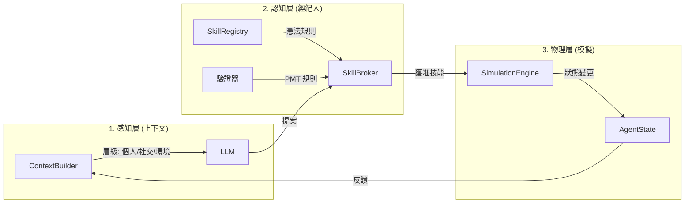

# Governed Broker Framework

**🌐 Language / 語言: [English](README.md) | [中文](README_zh.md)**

<div align="center">

**LLM 驅動的 Agent-Based Model 治理中間件**

[](https://www.python.org/downloads/)
[](LICENSE)

</div>

---

| **感知層 (Perception)** | `ContextBuilder` | *感官* | 動態整合代理人的個人、社交與全局狀態，生成受限的 LLM 提示詞。 |
| **認知層 (Cognition)** | `SkillBroker` | *法官* | 「治理者」角色，負責驗證 LLM 的提案是否符合心理規則與物理限制。 |
| **行動層 (Action)** | `SkillRegistry` | *憲法* | 定義代理人所有可能的動作、及其所需的成本、前提條件與執行效果。 |
| **物理層 (Physics)** | `SimEngine` | *世界* | 執行獲准的動作，並更新模擬環境（例如：洪水淹沒與損害計算）。 |

---

## 🛡️ 挑戰與解決方案 (Challenges & Solutions)


| 挑戰 | 問題 | 解決方案 | 核心組件 |
| :--- | :--- | :--- | :--- |
| **幻覺 (Hallucination)** | LLM 產生無效或不存在的動作 | Skill Registry 限制只能使用已註冊技能 | `SkillRegistry` |
| **資訊不對稱** | LLM 缺乏狀態感知，做出不可行的決策 | Context Builder 提供有界的的可觀察狀態 | `ContextBuilder` |
| **決策不一致** | 矛盾或不合邏輯的選擇 | 多階段驗證器檢查 PMT 心理一致性 | `Validators` |
| **無法追蹤** | 無法重現或審計決策過程 | 完整的時間戳記審計軌跡 | `AuditWriter` |
| **不受控狀態變更** | 直接且未經驗證的狀態修改 | State Manager 控制所有狀態更新與權限 | `StateManager` |

---

---

## 👥 多代理人社交構念（「五大支柱」）

為了支援複雜的社交模擬，我們定義了 5 個驅動代理人決策的核心心理構念。這些是以模組化的「治理探測器」實現的：

1.  **威脅感知 (Threat Perception, TP)**：包含防範意識、憂慮程度與風險警覺。
2.  **應對感知 (Coping Perception, CP)**：包含自我效能、調適成本與調適效率。
3.  **利益相關者感知 (Stakeholder Perception, SP)**：對政府、保險公司等機構的信任度、專業度與影響力的看法。
4.  **社交資本 (Social Capital, SC)**：嵌入社交網絡中的信任、規範與鄰里觀察。
5.  **地方依附 (Place Attachment, PA)**：對當前居住地點的情感與物理連結。

---

## 🧩 模組如何串聯 (樂高流程)



---

## 挑戰與解決方案


| 挑戰 | 問題 | 解決方案 | 元件 |
|------|------|----------|------|
| **幻覺 (Hallucination)** | LLM 產生無效決策 | Skill Registry 限制只能使用已註冊技能 | `SkillRegistry` |
| **決策不一致** | 矛盾或不合邏輯的選擇 | 多階段驗證器檢查可配置規則 | `Validators` |
| **領域耦合** | 核心層包含硬編碼邏輯 | 配置驅動的編排與通用基類 | `Core Engine` |
| **無可追溯性** | 無法重現或稽核決策 | 完整的時間戳記審計軌跡 | `AuditWriter` |
| **非控制狀態變更** | 直接、未驗證的狀態更改 | State Manager 控制所有狀態更新 | `StateManager` |

---

## 框架 vs. 使用者擴充 (Framework vs. User Extension)

為了保持關注點分離（Separation of Concerns），專案分為 **框架核心 (Framework Core)** 和 **使用者擴充 (User Extension)**。

### 🛠️ 框架核心 (核心程式碼，建議不要修改)
這些模組提供通用的編排邏輯，應保持與具體領域無關：
- **`broker/`**: 核心註冊、解析、內容建構和審計邏輯。
- **`simulation/`**: 通用的多層狀態管理和模擬循環。
- **`providers/`**: LLM 連接器 (Ollama, OpenAI 等)。
- **`validators/`**: 基礎 `AgentValidator` 引擎。

### 🎨 使用者擴充 (可根據需求自訂)
使用者在此處實現特定的模擬領域邏輯：
- **`broker/agent_types.yaml`**: 定義代理人設定檔、技能和行為參數。
- **`validators/coherence_rules.yaml`**: 定義領域專屬的一致性與安全規則。
- **`examples/`**: 實驗專屬的代理人實現、環境模型和數據。
- **`data/*.csv`**: 代理人族群數據與人口統計資料。

---

## Skill Proposal 格式

框架要求 LLM 以**結構化的 Skill Proposal 格式**輸出決策：

```json
{
  "skill": "buy_insurance",
  "parameters": {"duration": 1},
  "reasoning": "今年洪水風險高..."
}
```

### 為何使用 Skill Proposal？

| 面向 | 自由格式 LLM 輸出 | Skill Proposal |
|------|-------------------|----------------|
| **可解析性** | 需要複雜的 NLP | 結構化 JSON，易於解析 |
| **可驗證性** | 無法驗證 | Skill Registry 檢查資格 |
| **可追溯性** | 難以記錄 | 完整審計軌跡 |
| **狀態安全** | 直接變更 | 執行前已驗證 |
| **可重現性** | 非確定性 | 確定性技能執行 |

### LLM 如何知道可用技能？

**Context Builder** 將可用技能注入提示詞中：

```
你是一個代理人。可用技能：
- buy_insurance: 購買洪水保險 (duration: int)
- elevate_house: 加高房屋 (僅能使用一次)
- relocate: 遷移到更安全的區域 (永久)
- do_nothing: 今年不採取任何行動

請以 JSON 格式回覆: {"skill": "...", "parameters": {...}, "reasoning": "..."}
```

這確保 LLM 只會提出已註冊的技能，由 Skill Broker 進行驗證。

### 🔄 通用模組化資訊流 (Universal Modular Information Flow)

本框架透過嚴格的數據驅動循環，確保 LLM 的決策既具備上下文感應能力，又符合物理與邏輯的一致性：

1.  **上下文建構 (Context Building - 輸入)**：
    -   `StateManager` 從三個解耦層提取即時數據：**個人層**（私有狀態/記憶）、**社交層**（鄰居觀察）以及**共享/制度層**（環境、政策）。
    -   `ContextBuilder` 將這些數據合成結構化、有界的提示詞（Prompt），並從 `SkillRegistry` 注入可用的動作集。
2.  **LLM 決策 (LLM Decision - 提議)**：
    -   LLM 生成 **SkillProposal**——一個結構化的 JSON 提案，包含所選動作、參數以及心理推理（威脅/應對評估）。
3.  **兩階段治理 (Two-Tier Governance - 過濾)**：
    -   **第一階段：身份與准入**：檢查代理人的當前狀態是否允許該動作（例如：已搬遷的代理人不能購買保險）。
    -   **第二階段：元數據與 PMT 一致性**：驗證推理內容（如 `TP_REASON`）在邏輯上是否支持最終決策。
4.  **執行與審計 (Execution & Audit - 影響)**：
    -   獲准的技能由 `SimulationEngine` 執行，並更新物理環境（如扣除資金、套用損害）。
    -   `AuditWriter` 將整個管線（輸入 → 推理 → 驗證結果 → 最終產出）記錄到 **CSV 審計軌跡**中，供高解析度分析使用。

---

## 🏗️ 核心架構組件 (通用模組)

### 1. 多層級狀態管理
為了精確模擬社會-生態系統，我們將狀態劃分為三個不同的可見性維度：

| 層次 | 類型 | 可見性 | 說明 |
| :--- | :--- | :--- | :--- |
| **個人層 (Individual)** | 私有 | 僅限自己 | 收入、教育程度、**情節記憶 (Memory)**、調適狀態。 |
| **社交層 (Social)** | 可觀察 | 鄰居 | 社交資本、鄰居的近期決策（如：50% 的鄰居已加高房屋）。 |
| **共享/制度層 (Shared)** | 全域 | 所有代理人 | 淹水嚴重程度、年份、補助金水位、制度信任分數。 |

### 2. 生物啟發式記憶引擎
我們的 `MemoryEngine` 管理代理人對時間的主觀感知：
-   **被動記錄**：每個事件（淹水、理賠、鄰里變化）都會被標記時間戳並儲存。
-   **主動顯著性檢索**：在 `context_building` 期間，引擎根據 **滑動窗口** 或 **顯著性門檻** 檢索相關記憶，確保代理人能對過去的創傷做出反應，同時避免「無限上下文」導致的錯誤。

### 3. 雙驗證器系統 (Dual-Validator System)
`SkillBroker` 將制度與心理規則劃分為兩個關鍵層級：
-   **嚴格驗證器 (Error)**：攔截非物理或非法的動作（例如：重複加高房屋）。違規會觸發**強制性的邏輯重試**並提供具體反饋。
-   **啟發式驗證器 (Warning)**：標記「不理性」但物理上可能的行為（例如：高威脅感知卻零行動）。這在允許類人多樣性的同時，確保研究人員能在審計軌跡中追蹤異常。

---

## 架構

### 單代理人模式


**流程**: 環境 → Context Builder → LLM → Model Adapter → Skill Broker Engine → Validators → Executor → State

### 多代理人模式


**流程**: Agents → LLM (Skill Proposal) → Governed Broker Layer (Context Builder + Validators) → State Manager，包含四層：Individual (memory)、Social (鄰居觀察)、Shared (環境)、Institutional (政策規則)。

---

## 記憶與認知架構 (V3 特性)

本框架現在包含一個明確的 **Memory Layer (記憶層)**，位於 Governed Broker 和 Simulation State 之間，增強了代理人的一致性與學習能力。

### 記憶元件
*   **Working Memory (工作記憶)**: 短期儲存當下上下文 (例如：最近鄰居的動作、今年的政策)。
*   **Episodic Memory (情節記憶)**: 長期儲存重要事件的歷史 (例如：過去的洪水災害、理賠紀錄、過去的決策)。

### 資訊流
1.  **主動檢索 (`retrieve()`)**: 
    - 在做出決策之前，**Context Builder** 呼叫 `retrieve()` 獲取相關記憶。
    - *範例*: "檢索過去 3 年的洪水災害和理賠成功率。"
    - 這些數據會被注入到發送給 LLM 的 **Bounded Context (有界上下文)** 中。

2.  **被動儲存 (`add_memory()`)**:
    - 當 **Executor** 執行已驗證的技能後，觸發 `add_memory()`。
    - 決策、結果以及任何驗證註記都會被儲存為新的記憶軌跡。
    - *範例*: "決策：加高房屋 (第 5 年)。結果：成功。"

### 增強型審計 (Audit)
**Audit Writer** 捕捉認知過程的完整軌跡：
*   **Input**: 提供了什麼上下文/記憶？
*   **Reasoning**: LLM 的內部推理是什麼？
*   **Validation**: 提案為何被接受或拒絕？
*   **Execution**: 實際發生了什麼狀態變更？

---

## 快速開始

```bash
# 安裝依賴
pip install -r requirements.txt

# 執行範例實驗
cd examples/skill_governed_flood
python run_experiment.py --model llama3.2:3b --num-agents 100 --num-years 10
```

---

## 🔄 框架演進


**No MCP → MCP v1 → Skill-Governed (v2)**：漸進式增加治理層級，實現可靠的 LLM-ABM 整合。

---

## 核心元件

#### 代理人類型配置 (`broker/agent_types.yaml`)

所有代理人設置都已外部化到 **統一的 YAML 配置** 中。這允許在不修改 Python 代碼的情況下更改代理人行為。

```yaml
household:
  # 此代理人類型的有效技能
  actions: 
    - id: buy_insurance
      aliases: ["Purchase Insurance"]
    - id: do_nothing
  
  # 透過 get_parameters() 訪問的領域專屬參數
  parameters:
    income_threshold: 40000
    damage_threshold: 0.1
    
  # 用於驗證的 PMT 理論構念
  constructs: [TP, CP, SP, SC, PA]
```

#### 通用 AgentValidator (`validators/agent_validator.py`)

框架使用 **元數據驅動** 的驗證系統。規則在 `agent_types.yaml` 和 `coherence_rules.yaml` 中配置。

---

## 狀態管理

### 狀態所有權 (多代理人)

| 狀態類型 | 範例 | 範圍 | 讀取 | 寫入 |
|----------|------|------|------|------|
| **Individual** | `memory`, `elevated`, `has_insurance` | 代理人私有 | 僅自己 | 僅自己 |
| **Social** | `neighbor_actions`, `last_decisions` | 可觀察鄰居 | 鄰居 | 系統 |
| **Shared** | `flood_occurred`, `year` | 所有代理人 | 全部 | 系統 |
| **Institutional** | `subsidy_rate`, `policy_mode` | 所有代理人 | 全部 | 僅政府 |

> **重點**: `memory` 是 **Individual** - 每個代理人有自己的記憶，不共享。

---

## 驗證管線

| 階段 | 驗證器 | 檢查 |
|------|--------|------|
| 1 | Admissibility | 技能存在？代理人有資格使用此技能？ |
| 2 | Feasibility | 前置條件滿足？(例如，尚未加高) |
| 3 | Constraints | 一次性？年度限制？ |
| 4 | Effect Safety | 狀態變更有效？ |
| 5 | PMT Consistency | 推理與決策一致？ |
| 6 | Uncertainty | 回應有信心？ |

---

## 框架比較

| 維度 | 單代理人 | 多代理人 |
|------|----------|----------|
| 狀態 | 僅 Individual | Individual + Social + Shared + Institutional |
| 代理人類型 | 1 種 | N 種 (居民、政府、保險公司) |
| 可觀察 | 僅自己 | 自己 + 鄰居 + 社區統計 |
| 上下文 | 直接 | 透過 Context Builder + Social Module |
| 使用案例 | 基礎 ABM | 具社會動態的政策模擬 |

---

## 文件

- [架構詳情](docs/skill_architecture.md)
- [自訂指南](docs/customization_guide.md)
- [實驗設計](docs/experiment_design_guide.md)

---

## 授權

MIT
