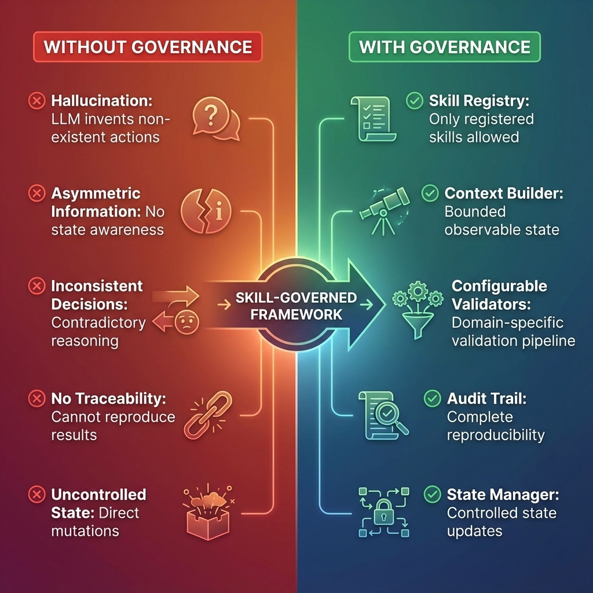
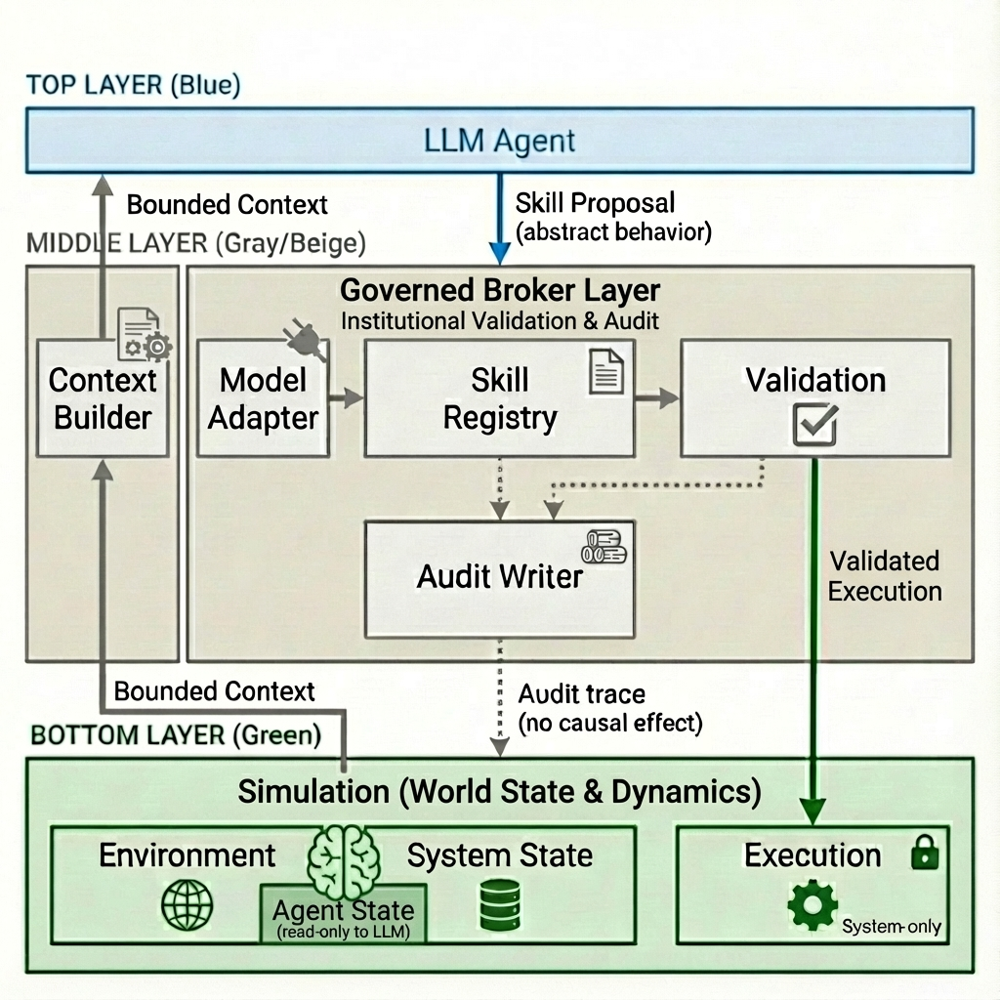
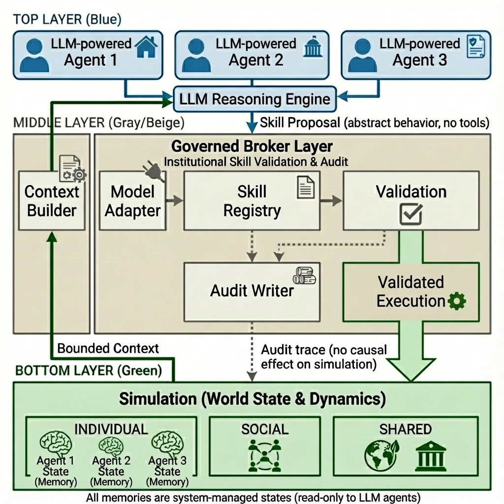
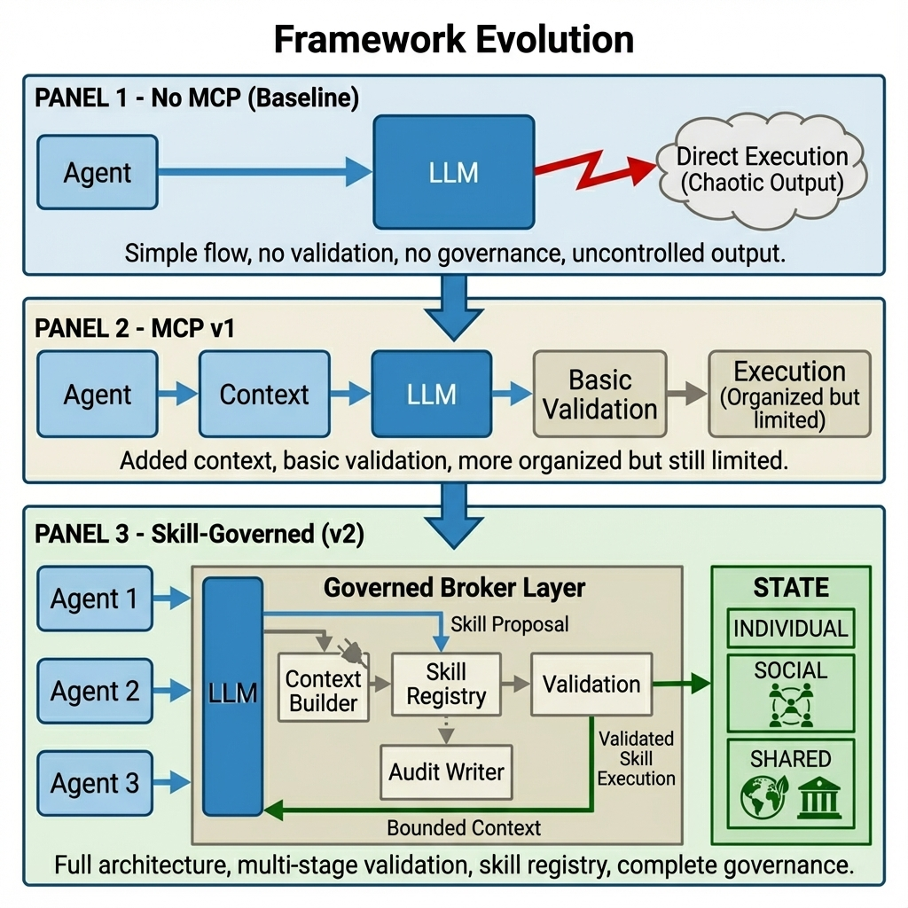

# Governed Broker Framework

**🌐 Language / 語言: [English](README.md) | [中文](README_zh.md)**

<div align="center">

**LLM 驅動的 Agent-Based Model 治理中間件**

[](https://www.python.org/downloads/)
[](LICENSE)

</div>

---

## 概述

Governed Broker Framework 為建構可靠的 LLM 基礎 Agent-Based Models (ABMs) 提供**技能治理架構**。它確保 LLM 的決策在影響模擬狀態之前，經過多階段管線的驗證。

### 核心特色

- **多階段驗證**: 可配置的驗證器確保可接受性、可行性、約束、安全性和一致性
- **多代理人支援**: 支援具有不同技能和資格規則的異質代理人類型
- **多層狀態**: Individual、Social、Shared 和 Institutional 狀態層，具有存取控制
- **可擴展 LLM 提供者**: 預設 Ollama，可擴展至 OpenAI、Anthropic 等
- **完整可追溯性**: 完整的審計軌跡以確保可重現性

---

## 挑戰與解決方案



| 挑戰 | 問題 | 解決方案 | 元件 |
|------|------|----------|------|
| **幻覺 (Hallucination)** | LLM 產生無效/不存在的動作 | Skill Registry 限制只能使用已註冊技能 | `SkillRegistry` |
| **資訊不對稱** | LLM 缺乏狀態感知，做出不可行的決策 | Context Builder 提供有界可觀察狀態 | `ContextBuilder` |
| **決策不一致** | 矛盾或不合邏輯的選擇 | 多階段驗證器檢查 PMT 一致性 | `Validators` |
| **無可追溯性** | 無法重現或稽核決策 | 完整的時間戳記審計軌跡 | `AuditWriter` |
| **非控制狀態變更** | 直接、未驗證的狀態更改 | State Manager 控制所有狀態更新 | `StateManager` |

---

## Skill Proposal 格式

框架要求 LLM 以**結構化的 Skill Proposal 格式**輸出決策：

```json
{
  "skill": "buy_insurance",
  "parameters": {"duration": 1},
  "reasoning": "今年洪水風險高..."
}
```

### 為何使用 Skill Proposal？

| 面向 | 自由格式 LLM 輸出 | Skill Proposal |
|------|-------------------|----------------|
| **可解析性** | 需要複雜的 NLP | 結構化 JSON，易於解析 |
| **可驗證性** | 無法驗證 | Skill Registry 檢查資格 |
| **可追溯性** | 難以記錄 | 完整審計軌跡 |
| **狀態安全** | 直接變更 | 執行前已驗證 |
| **可重現性** | 非確定性 | 確定性技能執行 |

### LLM 如何知道可用技能？

**Context Builder** 將可用技能注入提示詞中：

```
你是一個代理人。可用技能：
- buy_insurance: 購買洪水保險 (duration: int)
- elevate_house: 加高房屋 (僅能使用一次)
- relocate: 遷移到更安全的區域 (永久)
- do_nothing: 今年不採取任何行動

請以 JSON 格式回覆: {"skill": "...", "parameters": {...}, "reasoning": "..."}
```

這確保 LLM 只會提出已註冊的技能，由 Skill Broker 進行驗證。

### 核心執行流程

```
┌─────────────────────────────────────────────────────────────────────┐
│  1. 上下文建構                                                       │
│     StateManager → ContextBuilder                                   │
│     • 讀取代理人個人狀態 (memory, has_insurance 等)                  │
│     • 讀取共享狀態 (flood_occurred, year)                           │
│     • 將可用技能注入提示詞                                          │
└───────────────────────────┬─────────────────────────────────────────┘
                            ▼
┌─────────────────────────────────────────────────────────────────────┐
│  2. LLM 決策                                                        │
│     ContextBuilder → LLM                                            │
│     • LLM 接收有界上下文 + 技能列表                                  │
│     • LLM 輸出 SkillProposal JSON                                   │
│     • {"skill": "buy_insurance", "parameters": {...}, ...}          │
└───────────────────────────┬─────────────────────────────────────────┘
                            ▼
┌─────────────────────────────────────────────────────────────────────┐
│  3. 驗證                                                            │
│     ModelAdapter → SkillBrokerEngine → Validators                   │
│     • 將 LLM 輸出解析為結構化 SkillProposal                          │
│     • Admissibility: 技能是否已註冊？代理人是否有資格？              │
│     • Feasibility: 前置條件是否滿足？(尚未加高)                      │
│     • Constraints: 年度限制？一次性規則？                           │
│     • 若無效 → 退回到 "do_nothing"                                  │
└───────────────────────────┬─────────────────────────────────────────┘
                            ▼
┌─────────────────────────────────────────────────────────────────────┐
│  4. 執行與狀態更新                                                   │
│     SkillBrokerEngine → Executor → StateManager                     │
│     • 執行已驗證的技能效果                                          │
│     • 更新代理人個人狀態                                            │
│     • 記錄到 AuditWriter 以確保可追溯性                             │
└─────────────────────────────────────────────────────────────────────┘
```

---

## 架構

### 單代理人模式



**流程**: 環境 → Context Builder → LLM → Model Adapter → Skill Broker Engine → Validators → Executor → State

### 多代理人模式



**流程**: Agents → LLM (Skill Proposal) → Governed Broker Layer (Context Builder + Validators) → State Manager，包含四層：Individual (memory)、Social (鄰居觀察)、Shared (環境)、Institutional (政策規則)。

---

## 快速開始

```bash
# 安裝依賴
pip install -r requirements.txt

# 執行範例實驗
cd examples/skill_governed_flood
python run_experiment.py --model llama3.2:3b --num-agents 100 --num-years 10
```

---

## 框架演進



**No MCP → MCP v1 → Skill-Governed (v2)**: 漸進式增加治理層以實現可靠的 LLM-ABM 整合。

---

## 核心元件

### Broker 層 (`broker/`)

| 元件 | 檔案 | 說明 |
|------|------|------|
| `SkillBrokerEngine` | `skill_broker_engine.py` | 主要協調器：驗證技能、管理執行管線 |
| `SkillRegistry` | `skill_registry.py` | 技能定義及代理人類型資格和參數結構 |
| `ContextBuilder` | `context_builder.py` | 從狀態建構有界上下文，包含鄰居觀察 |
| `ModelAdapter` | `model_adapter.py` | 將 LLM 輸出解析為結構化 SkillProposal |
| `AuditWriter` | `audit_writer.py` | 完整審計軌跡以確保可重現性 |

### State 層 (`simulation/`)

| 元件 | 檔案 | 說明 |
|------|------|------|
| `StateManager` | `state_manager.py` | 多層狀態: Individual / Social / Shared / Institutional |
| `SimulationEngine` | `engine.py` | ABM 模擬迴圈及技能執行 |

### Provider 層 (`providers/`)

| 元件 | 檔案 | 說明 |
|------|------|------|
| `OllamaProvider` | `ollama.py` | 預設 LLM 提供者 (本地 Ollama) |
| `OpenAIProvider` | `openai_provider.py` | OpenAI API 提供者 |
| `ProviderFactory` | `factory.py` | 動態提供者實例化 |
| `RateLimiter` | `rate_limiter.py` | API 呼叫速率限制 |

### Validator 層 (`validators/`)

| 元件 | 檔案 | 說明 |
|------|------|------|
| `BaseValidator` | `base.py` | 抽象驗證器介面 |
| `SkillValidators` | `skill_validators.py` | 6 個驗證器: Admissibility, Feasibility, Constraints, Safety, PMT, Uncertainty |
| `ValidatorFactory` | `factory.py` | 從 YAML 動態載入驗證器 |

---

## 狀態管理

### 狀態所有權 (多代理人)

| 狀態類型 | 範例 | 範圍 | 讀取 | 寫入 |
|----------|------|------|------|------|
| **Individual** | `memory`, `elevated`, `has_insurance` | 代理人私有 | 僅自己 | 僅自己 |
| **Social** | `neighbor_actions`, `last_decisions` | 可觀察鄰居 | 鄰居 | 系統 |
| **Shared** | `flood_occurred`, `year` | 所有代理人 | 全部 | 系統 |
| **Institutional** | `subsidy_rate`, `policy_mode` | 所有代理人 | 全部 | 僅政府 |

> **重點**: `memory` 是 **Individual** - 每個代理人有自己的記憶，不共享。

---

## 驗證管線

| 階段 | 驗證器 | 檢查 |
|------|--------|------|
| 1 | Admissibility | 技能存在？代理人有資格使用此技能？ |
| 2 | Feasibility | 前置條件滿足？(例如，尚未加高) |
| 3 | Constraints | 一次性？年度限制？ |
| 4 | Effect Safety | 狀態變更有效？ |
| 5 | PMT Consistency | 推理與決策一致？ |
| 6 | Uncertainty | 回應有信心？ |

---

## 框架比較

| 維度 | 單代理人 | 多代理人 |
|------|----------|----------|
| 狀態 | 僅 Individual | Individual + Social + Shared + Institutional |
| 代理人類型 | 1 種 | N 種 (居民、政府、保險公司) |
| 可觀察 | 僅自己 | 自己 + 鄰居 + 社區統計 |
| 上下文 | 直接 | 透過 Context Builder + Social Module |
| 使用案例 | 基礎 ABM | 具社會動態的政策模擬 |

---

## 文件

- [架構詳情](docs/skill_architecture.md)
- [自訂指南](docs/customization_guide.md)
- [實驗設計](docs/experiment_design_guide.md)

---

## 授權

MIT
