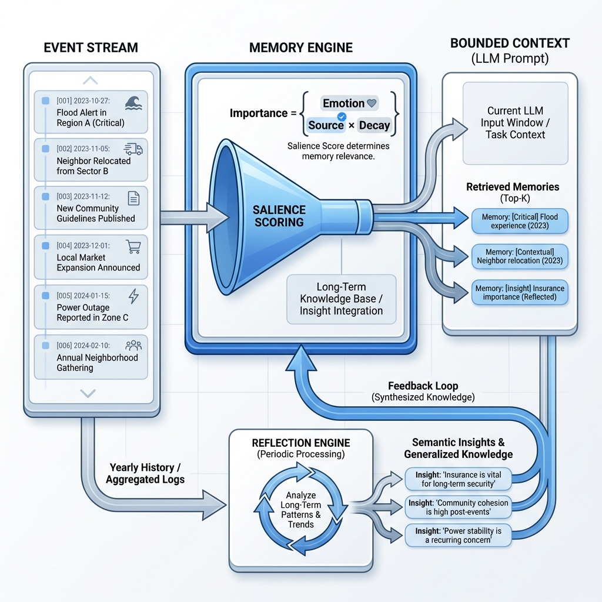

# Water Agent Governance Framework

<div align="center">

**LLM 驅動水社會代理人模型的治理中間件**

[](https://www.python.org/downloads/)
[](LICENSE)
[](https://ollama.com/)

[**English**](README.md) | [**中文**](README_zh.md)

</div>

## 核心使命

> _「將 LLM 從故事講述者轉變為水社會代理人模型中的理性行動者。」_

**Water Agent Governance Framework** 旨在解決大型語言模型 (LLM) 代理人的根本性 **邏輯-行動差距 (Logic-Action Gap)**：LLM 雖然能生成流暢的自然語言推理，但在長跨度模擬中會出現隨機不穩定、幻覺與記憶沖蝕等問題——這些問題嚴重損害了 LLM 驅動之代理人模型 (ABMs) 的科學有效性。

本框架提供了一個架構級的 **治理層 (Governance Layer)**，負責實時驗證代理人的推理過程是否符合物理約束與行為理論（例如保護動機理論, PMT）。它專為**洪水風險適應研究**及其他水社會建模情境而設計，強調可重現性、可審計性及長跨度一致性。

**目標領域**：非穩態洪水風險、灌溉水管理、家戶適應行為、社區韌性、水資源政策評估。

**已驗證案例研究**：

- **洪水家戶適應 (SA)**：100 個代理人使用 PMT，Gemma 3 (4B/12B/27B) 驅動之 10 年模擬。
- **洪水多代理人 (MA)**：400 個代理人（均衡四格設計：已繪製/未繪製洪水地圖區 × 屋主/租客），含機構代理人（政府、保險），波多馬克河流域 (PRB) 13 年模擬。
- **灌溉水管理**：科羅拉多河模擬系統 (CRSS) 上游盆地的 78 個代理人。

---

## 快速上手

### 1. 安裝

```bash
pip install -r requirements.txt
```

### 2. 執行治理洪水模擬

啟動一個 10 人的洪水適應示範，含治理與以人為本的記憶系統（需要 [Ollama](https://ollama.com/)）：

```bash
python examples/governed_flood/run_experiment.py --model gemma3:4b --years 3 --agents 10
```

### 3. 執行完整基準測試（WRR — _Water Resources Research_ 論文）

複製三組消融研究（100 代理人，10 年）：

```bash
python examples/single_agent/run_flood.py --model gemma3:4b --years 10 --agents 100 \
    --memory-engine humancentric --governance-mode strict
```

### 4. 探索更多

| 範例 | 複雜度 | 說明 | 連結 |
| :--- | :--- | :--- | :--- |
| **Governed Flood** | 入門 | 獨立的 Group C 示範，含完整治理 | [前往](examples/governed_flood/) |
| **Single Agent** | 中階 | JOH 基準測試：Groups A/B/C 消融研究 | [前往](examples/single_agent/) |
| **Irrigation ABM** | 中階 | 科羅拉多河流域水需求模擬 (Hung & Yang, 2021) | [前往](examples/irrigation_abm/) |
| **Multi-Agent** | 進階 | 社會動態、保險市場、政府政策 | [前往](examples/multi_agent/flood/) |

### 5. 提供者支援 (Provider Support)

框架支援多種 LLM 提供者，通過 `--model` 旗標選擇：

```bash
python run_experiment.py --model gemma3:4b                         # Ollama（預設，本地推理）
python run_experiment.py --model anthropic:claude-sonnet-4-5-20250929  # Anthropic Claude
python run_experiment.py --model gemini:gemini-1.5-flash-latest    # Google Gemini
python run_experiment.py --model openai:gpt-4-turbo                # OpenAI
```

| 提供者 | 前綴 | 需要 |
| :--- | :--- | :--- |
| **Ollama** | _(無)_ | 本地安裝 Ollama |
| **Anthropic** | `anthropic:` 或 `claude:` | `ANTHROPIC_API_KEY` |
| **Gemini** | `gemini:` | `GEMINI_API_KEY` |
| **OpenAI / Azure** | `openai:` 或 `azure:` | `OPENAI_API_KEY` |

### 6. ExperimentBuilder API

```python
from broker.core.experiment import ExperimentBuilder
from broker.components.memory.engines.humancentric import HumanCentricMemoryEngine

experiment = (
    ExperimentBuilder("examples/single_agent/config/agent_types.yaml")
    .with_model("gemma3:4b")
    .with_memory_engine(HumanCentricMemoryEngine)
    .with_governance("strict")
    .with_years(10)
    .with_agents(100)
    .build()
)
experiment.run()
```

---

## 導覽

| 讀者類型 | 建議路徑 |
| :--- | :--- |
| **研究者**（重現實驗結果） | [理論基礎](docs/modules/00_theoretical_basis_overview.md) → [實驗設計](docs/guides/experiment_design_guide.md) → [範例](examples/README.md) → [C&V 框架](broker/validators/calibration/README.md) |
| **開發者**（擴展框架） | [架構](docs/architecture/architecture.md) → [ExperimentBuilder API](#6-experimentbuilder-api) → [自定義指南](docs/guides/customization_guide.md) → [代理人類型規格](docs/guides/agent_type_specification_guide.md) |
| **論文貢獻者** | [論文貢獻者指南](#論文貢獻者) |

---

## 模組導覽大廳（文件中心）

本框架分為五個概念章節，每章皆有雙語文件：

- **第 0 章 — 理論基礎**: [總覽](docs/modules/00_theoretical_basis_overview.md) | [English](docs/modules/00_theoretical_basis_overview.md)
- **第 1 章 — 記憶與反思**: [記憶模組](docs/modules/memory_components.md) | [反思引擎](docs/modules/reflection_engine.md)
- **第 2 章 — 核心治理**: [治理邏輯與驗證器](docs/modules/governance_core.md)
- **第 3 章 — 感知與上下文**: [上下文系統](docs/modules/context_system.md) | [模擬引擎](docs/modules/simulation_engine.md)
- **第 4 章 — 技能註冊表**: [動作本體論](docs/modules/skill_registry.md)
- **實驗**: [範例與基準](examples/README.md)

---

## 文檔與指南

### 整合指南 (`docs/guides/`)

- **[實驗設計指南](docs/guides/experiment_design_guide.md)**：建構新實驗的食譜。
- **[代理人組裝指南](docs/guides/agent_assembly_zh.md)**：如何堆疊「認知積木」（Level 1-3）。
- **[自定義指南](docs/guides/customization_guide.md)**：新增技能、驗證器與審計欄位。

### 架構規格 (`docs/architecture/`)

- **[高階架構圖](docs/architecture/architecture.md)**：系統圖表與資料流。
- **[技能架構詳解](docs/architecture/skill_architecture.md)**：動作/技能本體論的深度解析。
- **[MAS 五層映射](docs/architecture/mas-five-layers.md)**：多代理人系統架構（AgentTorch 對齊）。

### 多代理人生態系統 (`docs/multi_agent_specs/`)

- **[政府代理人](docs/multi_agent_specs/government_agent_spec.md)**：補貼、收購與政策邏輯。
- **[保險市場](docs/multi_agent_specs/insurance_agent_spec.md)**：保費計算與風險模型。
- **[機構行為](docs/multi_agent_specs/institutional_agent_behavior_spec.md)**：互動協議規範。

---

## 核心問題陳述


LLM 驅動的 ABM 面臨五個反覆出現的問題，本框架逐一解決：

| 挑戰           | 問題描述                            | 框架解決方案                                          | 組件                |
| :------------- | :---------------------------------- | :---------------------------------------------------- | :------------------ |
| **幻覺**       | LLM 產生無效動作（例如「造牆」）    | **嚴格註冊表**：僅接受已註冊的 `skill_id`             | `SkillRegistry`     |
| **上下文限制** | 無法將完整歷史塞入提示詞            | **顯著性記憶**：僅檢索 Top-k 相關的過去事件           | `MemoryEngine`      |
| **不一致性**   | 決策與推理矛盾（邏輯漂移）          | **思考驗證器**：檢查 TP/CP 與 Choice 之間的邏輯連貫性 | `SkillBrokerEngine` |
| **不透明決策** | 「為什麼代理人 X 做了 Y？」行為佚失 | **結構化軌跡**：完整記錄輸入、推理、驗證與結果        | `AuditWriter`       |
| **不安全變更** | LLM 輸出破壞模擬狀態                | **沙盒執行**：獲准技能由引擎執行，而非 LLM 直接修改   | `SimulationEngine`  |

---

## 統一架構 (v3.5)

本框架採用分層中間件方法，將單代理人的孤立推理與多代理人社會模擬進行了統一。自 v3.5 起，所有 `broker/` 層模組均為**完全領域無關** — 構念名稱、行動詞彙、LLM 逾時設定及驗證關鍵字均從 YAML 配置載入，而非硬編碼。


### 組合式智能（「蓋積木」架構）

本框架採用 **堆疊積木 (Stacking Blocks)** 設計。您可以像玩樂高一樣，將不同的認知模組疊加在基礎執行引擎上，打造出不同複雜度的代理人：

| 堆疊層級      | 認知積木     | 功能     | 效果                                                                        |
| :------------ | :----------- | :------- | :-------------------------------------------------------------------------- |
| **底座**      | **執行引擎** | _身體_   | 能夠執行物理動作，但沒有記憶或理性。                                        |
| **+ Level 1** | **感知透鏡** | _眼睛_   | 加入有界感知（視窗記憶）。防止 LLM 因歷史過長而當機。                       |
| **+ Level 2** | **記憶引擎** | _海馬迴_ | 加入 **HumanCentric 記憶引擎**。情感顯著性編碼（重要性 = 情緒 × 來源），含隨機整合與指數衰減。 |
| **+ Level 3** | **技能仲裁** | _超我_   | 加入**治理機制**。強制執行 "Thinking Rules"，確保行為符合信念（理性驗證）。 |

> **為什麼這對研究很重要**：此設計支持受控消融研究。運行 Level 1 Agent（Group A — 基準組）對比 Level 3 Agent（Group C — 完整組），精確區分出*哪一個*認知組件解決了特定的行為偏差。

**[學習如何組裝自定義代理人](docs/guides/agent_assembly_zh.md)**

### 框架演進


記憶與治理架構經歷了三個演進階段：

- **v1 (舊版)**：[可得性捷思] — 單一視窗記憶模式（Group A/B 基準）。
- **v2 (加權)**：[情境依賴記憶] — 模組化 `SkillBrokerEngine` 與**加權優先級檢索** ($S = W_{rec}R + W_{imp}I + W_{ctx}C$)。
- **v3 (最新)**：[情緒加權記憶架構] — 引入多種記憶引擎。生產實驗使用 **HumanCentricMemoryEngine**（基本排序模式）。
  - **重要性 = 情緒 × 來源**：關鍵字分類的情緒權重（critical/major/positive/shift/routine）乘以來源接近度（personal > neighbor > community > abstract）。
  - **隨機整合**：高重要性記憶以概率方式轉入長期儲存（$P = 0.7$，重要性 $> 0.6$ 時）。工作記憶上限 20 條，長期記憶上限 100 條。
  - **指數衰減**：$I(t) = I_0 \cdot e^{-\lambda t}$，應用於長期記憶。
  - _注_：更進階的 `UnifiedCognitiveEngine`（含 EMA 驚喜偵測與系統 1/2 切換）已實作但**未用於** WRR 單代理人實驗。多代理人洪水實驗（Paper 3）使用此引擎。

**[深度解析：記憶優先級與檢索數學](docs/modules/memory_components_zh.md)**

### 提供者層 (Provider Layer)

| 組件 | 檔案 | 說明 |
| :--- | :--- | :--- |
| **LLMProvider** (ABC) | `providers/llm_provider.py` | 統一介面：`invoke()` / `ainvoke()` / `validate_connection()` |
| **OllamaProvider** | `providers/ollama.py` | 本地推理（預設） |
| **AnthropicProvider** | `providers/anthropic.py` | Claude API (claude-sonnet/opus/haiku) |
| **OpenAIProvider** | `providers/openai_provider.py` | GPT-4 / Azure OpenAI |
| **GeminiProvider** | `providers/gemini.py` | Google Gemini API |
| **RateLimitedProvider** | `providers/llm_provider.py` | 速率限制包裝器，含指數退避重試 |
| **UnifiedAdapter** | `broker/core/model_adapter.py` | 智能解析：處理模型特殊處理（DeepSeek `<think>`、Llama JSON） |
| **LLM Utils** | `broker/utils/llm_utils.py` | 集中式 LLM 調用，穩健錯誤處理與詳細程度控制 |

## 驗證器層（治理規則引擎）

驗證層是框架的核心治理機制。每個技能提案在執行前都會通過五類驗證器組成的流水線。每個驗證器產生 `ValidationResult` 物件，包含兩個嚴重級別：**ERROR**（阻止操作並觸發重試循環，最多 3 次）或 **WARNING**（僅記錄觀測但保留代理人自主性）。

```
broker/validators/governance/
├── physical_validator.py        # 類別："physical" (物理約束)
├── thinking_validator.py        # 類別："thinking" (思維連貫性)
├── personal_validator.py        # 類別："personal" (個人財務/能力)
├── social_validator.py          # 類別："social"   (社會影響，僅限 WARNING)
└── semantic_validator.py        # 類別："semantic" (語義落地/事實檢查)
```

### 設計哲學

| 原則                 | 說明                                                                                                               |
| :------------------- | :----------------------------------------------------------------------------------------------------------------- |
| **ERROR vs WARNING** | ERROR 會觸發重試循環。WARNING 僅記錄日誌，不阻止決策。這能防止「治理死區」，在維持可觀測性的同時保留代理人自主性。 |
| **領域中立核心**     | 採用 `BaseValidator` + `BuiltinCheck` 模式。YAML 驅動的條件引擎是通用的，各領域邏輯透過注入而非硬編碼實現。        |
| **範本插值**         | 重試訊息支援 `{context.TP_LABEL}` 等標籤，讓 LLM 能根據具體的違規原因進行自我修正。                                |

---

## 技能系統 (Skill System)

技能系統是框架的**動作本體論 (Action Ontology)**。每個代理人決策都流經由 `SkillBrokerEngine` 管理的 6 階段管線。

### 核心概念

| 概念                | 組件                  | 說明                                                          |
| :------------------ | :-------------------- | :------------------------------------------------------------ |
| **SkillDefinition** | `skill_registry.yaml` | YAML 定義：ID、描述、前置條件、制度約束、JSON Schema。        |
| **SkillProposal**   | `skill_types.py`      | 解析後的 LLM 原始輸出，包含推理標籤與選定的 `magnitude_pct`。 |
| **ApprovedSkill**   | `skill_types.py`      | 通過驗證後的結果，包含執行映射與最終參數。                    |

### 彈性數值解析 (v3.4/v3.5)

框架現在支援動態解析 `response_format.fields` 中定義的任何數值欄位。雖然 `magnitude_pct` 是最常見的案例，但代理人現在可以輸出預算分配、物理尺寸或帶正負號的數值。

| 組件       | 行為                                                                                                    |
| :--------- | :------------------------------------------------------------------------------------------------------ |
| **配置**   | 在 `agent_types.yaml` 中定義 `type: "numeric"`，支援 `unit` ("%", "m")、`sign` ("both")、`min`、`max`。 |
| **解析**   | `ModelAdapter` 動態提取數值。支援強大的正則提取，例如 `"15%"` 或 `"Enter: 20"` 均能正確辨識標點與文字。 |
| **驗證**   | 自動進行 [min, max] 範圍修飾 (Clamping)。強制執行正負號規則。                                           |
| **相容性** | 完全向下相容於使用 `magnitude_pct` 或不使用數值欄位的舊實驗。                                           |

### 回應格式與提示工程

**ResponseFormatBuilder** 將 YAML 配置轉換為結構化的提示指令。欄位順序直接控制 LLM 提示詞中的出現順序。

**YAML 配置範例**:

```yaml
fields:
  - { key: "reasoning", type: "text", required: true }
  - { key: "decision", type: "choice", required: true }
  - { key: "magnitude_pct", type: "numeric", min: 1, max: 30, unit: "%" }
```

**生成的提示詞輸出**:

- `choice`: `"decision": "<數字 ID，從 1, 2, 或 3 中擇一>"`
- `numeric`: `"magnitude_pct": "請輸入數字：1-30%"`

**推理先行 (Reasoning Before Rating)**：所有 WRR 實驗配置都將 `reasoning` 欄位放在首位。這強制模型在提交標籤與決策前先闡明其推理過程，有效提升生成品質。

---

## 認知架構與設計哲學

**Context Builder** 是一個精心設計的**「認知透鏡」**，用於緩解 LLM 的幻覺與認知偏誤：

1. **結構性偏誤緩解**：透過**行內語意錨定** (例如 `TP=M(Medium)`) 與**動態選項洗牌**來對抗 LLM 的位置偏誤與量級錨定問題。
2. **邏輯-行動驗證器**：實作遞歸反饋循環，當思維推理與最終行動不一致時，將具體原因反饋給 LLM 要求其自我修正。

---

## 記憶架構



**Human-Centric Memory Engine** (v3.3) 解決了「金魚腦效應」，根據**情感顯著性**而非僅時間新近度來優先處理記憶。它包含一個**反思引擎**，能將年度經歷整合為長期洞察。

### 核心功能

1. **優先級驅動檢索**：Context Builder 根據檢索分數 $S = (W_{rec} \cdot S_{rec}) + (W_{imp} \cdot S_{imp}) + (W_{ctx} \cdot S_{ctx})$ 動態注入記憶。確保即便時間久遠的創傷或與現狀匹配的事實能被 LLM 看見。
2. **反思迴圈**：年度事件整合為通用「洞察」（初始權重 $I=10.0$ 以抵抗衰減）。
3. **有界上下文**：將數千條日誌精煉為節省 Token 的提示詞，優先保障準確性。

### 分層記憶路線圖（v4 目標）

| 層級  | 組件         | 功能（理論）                                                   |
| :---- | :----------- | :------------------------------------------------------------- |
| **1** | **工作記憶** | **感覺緩衝器**。即時上下文（最近 5 年）。                      |
| **2** | **情節摘要** | **海馬迴**。長期儲存「重大」事件（Phase 1/2 邏輯）。           |
| **3** | **語義洞察** | **新皮質**。從反思中萃取的抽象「規則」（例如「保險很重要」）。 |

**[閱讀完整的記憶與反思規格說明](docs/modules/memory_components_zh.md)**

---

## 狀態管理

### 狀態所有權（多代理人）

| 狀態類型          | 範例                                  | 範圍       | 讀取   | 寫入   |
| :---------------- | :------------------------------------ | :--------- | :----- | :----- |
| **Individual**    | `memory`, `elevated`, `has_insurance` | 代理人私有 | 僅自己 | 僅自己 |
| **Social**        | `neighbor_actions`, `last_decisions`  | 可觀察鄰居 | 鄰居   | 系統   |
| **Shared**        | `flood_occurred`, `year`              | 所有代理人 | 全部   | 系統   |
| **Institutional** | `subsidy_rate`, `policy_mode`         | 所有代理人 | 全部   | 僅政府 |

> **重點**：`memory` 是 **Individual** — 每個代理人有自己的記憶，不共享。

---

## 驗證管線

`SkillBrokerEngine` 對每個 `SkillProposal` 執行 5 類有序驗證管線（Physical → Thinking → Personal → Social → Semantic）。ERROR 結果觸發重試循環（最多 3 次），附帶人類可讀回饋；WARNING 結果僅記錄，不阻止執行。

| 類別 | 驗證器 | 檢查 |
| :--- | :----- | :--- |
| **Physical** | `PhysicalValidator` | 不可逆狀態守衛（已加高？已搬遷？） |
| **Thinking** | `ThinkingValidator` | 構念-行動一致性（PMT / Utility / Financial） |
| **Personal** | `PersonalValidator` | 財務能力約束（收入、補貼門檻） |
| **Social** | `SocialValidator` | 鄰居影響觀測（僅 WARNING，不阻止） |
| **Semantic** | `SemanticGroundingValidator` | 推理文本 vs 模擬事實（幻覺偵測） |

---

## 領域中立配置 (v3.5)

自 v3.5 起，`broker/` 層**零硬編碼領域值** — 所有逾時、模型特殊處理、構念標籤及關鍵字均從 YAML 載入。現有實驗無需更改配置（預設值與先前硬編碼值一致）。

參見 [YAML 配置參考](docs/references/yaml_configuration_reference.md) 了解完整參數規格（記憶引擎、加權評分、反思、LLM、治理、StateParam 正規化）。

### YAML vs. Python 擴展邊界

| 您想要變更的內容 | 僅 YAML | 需要 Python | 配置檔 |
| :--- | :---: | :---: | :--- |
| 新增/移除技能（動作） | Yes | — | `skill_registry.yaml` |
| 定義代理人類型與人設 | Yes | — | `agent_types.yaml` |
| 新增/修改治理規則 | Yes | — | `agent_types.yaml` → `governance.rules` |
| 調整記憶參數（視窗、衰減、權重） | Yes | — | `agent_types.yaml` → `global_config.memory` |
| 變更 LLM 模型或逾時 | Yes | — | `agent_types.yaml` → `global_config.llm` |
| 變更回應格式欄位 | Yes | — | `agent_types.yaml` → `response_format.fields` |
| 新增 BuiltinCheck（領域驗證器） | — | Yes | 實作於 `broker/validators/governance/` |
| 新增記憶引擎 | — | Yes | 繼承 `MemoryEngine` ABC |
| 新增 LLM 提供者 | — | Yes | 繼承 `LLMProvider` ABC（`providers/`） |
| 新增領域（洪水/灌溉以外） | — | Yes | 新建 `lifecycle_hooks.py` + `skill_registry.yaml` + `agent_types.yaml` |
| 自定義校準指標 (C&V) | — | Yes | 提供 `compute_metrics_fn` 給 `CalibrationProtocol` |

### 如何擴展（介面契約）

新增**記憶引擎** — 繼承 `broker/components/memory/engine.py` 中的 ABC：

```python
class MemoryEngine(ABC):
    @abstractmethod
    def add_memory(self, agent_id: str, content: str,
                   metadata: Optional[Dict[str, Any]] = None) -> None: ...
    @abstractmethod
    def retrieve(self, agent: BaseAgent, query: Optional[str] = None,
                 top_k: int = 3, **kwargs) -> List[dict]: ...
    @abstractmethod
    def clear(self, agent_id: str) -> None: ...
```

新增 **LLM 提供者** — 繼承 `providers/llm_provider.py` 中的 ABC：

```python
class LLMProvider(ABC):
    @property
    @abstractmethod
    def provider_name(self) -> str: ...
    @abstractmethod
    def invoke(self, prompt: str, **kwargs) -> LLMResponse: ...
    @abstractmethod
    async def ainvoke(self, prompt: str, **kwargs) -> LLMResponse: ...
    def validate_connection(self) -> bool: ...  # 提供預設實作
```

新增**驗證器** — 繼承 `broker/validators/governance/base_validator.py`：

```python
class BaseValidator(ABC):
    category: str                          # 例如 "physical", "thinking"
    @abstractmethod
    def _default_builtin_checks(self) -> List[BuiltinCheck]: ...
    # validate() 由基類提供 — 僅需覆寫 _default_builtin_checks
```

新增**領域**（例如野火、乾旱），需提供：

1. `skill_registry.yaml` — 該領域的動作本體論
2. `agent_types.yaml` — 人設定義、構念、治理規則
3. `lifecycle_hooks.py` — 繼承 `BaseLifecycleHooks`，處理環境設定與狀態轉換
4. （可選）領域特定的 `BuiltinCheck` 函式

---

## 事後校準與驗證 (C&V)

[驗證器層](#驗證器層治理規則引擎)在**執行期**攔截幻覺，而 C&V 框架在模擬結束**後**評估輸出：_「受治理的代理人是否產生了科學上合理的行為？」_

驗證遵循 Grimm et al. (2005) 模式導向建模的三層層級：

| 層級 | 範圍 | 核心指標 | 測試目標 |
| :--- | :--- | :------- | :------- |
| **L1 — 微觀** | 個體代理人 | **CACR**（構念-行動一致率）、**R_H**（幻覺率 + EBE） | 個體決策是否與其報告的心理構念內部一致？ |
| **L2 — 宏觀** | 總體人口 | **GCR**（治理一致率）、**EPI**（經驗合理性指數） | 總體採用率是否符合經驗基準（NFIP、調查數據）？ |
| **L3 — 認知** | 心理計量 | **ICC(2,1)** + **eta-squared**（效果量） | LLM 是否在重複測試中產生可靠、可區分的構念評分？ |

設計特點：L1/L2 **零 LLM 調用**（純審計 CSV 分析）；配置驅動路由（`ValidationRouter` 從 `agent_types.yaml` 自動偵測適用指標）；領域無關（構念名稱、行動詞彙由調用者提供）。

三階段校準協議：**Pilot**（25 代理人 × 3 年）→ **Sensitivity**（LLM 探針測試）→ **Full**（400 代理人 × 13 年 × 10 seeds）。

**[完整 C&V 文件、API 範例與指標閾值](broker/validators/calibration/README.md)**

---

## 實驗驗證與基準測試

本框架透過 **JOH 基準測試**（Journal of Hydrology）進行驗證，為三組消融研究，用以隔離每個認知組件的貢獻：

| 組別              | 記憶引擎                | 治理 | 目的                             |
| :---------------- | :---------------------- | :--- | :------------------------------- |
| **A（基準）**     | 無                      | 停用 | 原始 LLM 輸出 — 無記憶、無驗證   |
| **B（治理）**     | Window                  | 嚴格 | 治理效果隔離 — 無記憶但理性      |
| **C（完整認知）** | HumanCentric + Priority | 嚴格 | 完整系統，含情感顯著性與創傷回憶 |

### 單代理人 vs. 多代理人比較

| 維度       | 單代理人      | 多代理人                                     |
| :--------- | :------------ | :------------------------------------------- |
| 狀態       | 僅 Individual | Individual + Social + Shared + Institutional |
| 代理人類型 | 1（家戶）     | N（家戶、政府、保險公司）                    |
| 可觀察     | 僅自己        | 自己 + 鄰居 + 社區統計                       |
| 上下文     | 直接          | Context Builder + Social Module              |
| 使用案例   | 基礎 ABM      | 具社會動態的政策模擬                         |

### 已驗證模型 (v3.4)

| 模型族           | 變體                | 使用案例                     |
| :--------------- | :------------------ | :--------------------------- |
| **Google Gemma** | 3-4B, 3-12B, 3-27B  | 主要基準測試模型（JOH 論文） |
| **Meta Llama**   | 3.2-3B-Instruct     | 輕量邊緣代理人               |
| **DeepSeek**     | R1-Distill-Llama-8B | 高推理（思維鏈）任務         |

**[完整實驗細節](examples/single_agent/)**

---

## 實務挑戰與經驗教訓

### 1. 解析崩潰（語法 vs. 語意）

**挑戰**：小型語言模型（3B-4B 參數）在 Prompt 密集時頻繁出現「語法崩潰」。可能輸出無效 JSON、巢狀物件而非扁平鍵值、或未加引號的字串。

**洞察**：我們從嚴格 JSON 解析轉向**多層防禦式解析**策略：封閉標記提取 -> JSON 修復（補齊引號/逗號）-> 關鍵字正規表達式 -> 最後手段數字提取。

### 2. 治理死區

**挑戰**：當治理規則形成狹窄的「行動漏斗」（例如：TP=H 阻止「什麼都不做」，CP=L 阻止「加高」和「搬遷」），代理人可能只剩一個有效動作，失去有意義的選擇。

**洞察**：我們區分 **ERROR** 規則（阻止動作並觸發重試）與 **WARNING** 規則（允許動作通過但在審計軌跡中記錄觀察）。這在保持科學可觀測性的同時維護了代理人自主性。

---

## 論文貢獻者

### WRR 論文工作區

| 論文 | 目錄 | 配置檔 |
| :--- | :--- | :----- |
| Paper 2（灌溉） | `examples/irrigation_abm/` | `config/agent_types.yaml` |
| Paper 3（洪水 MA） | `examples/multi_agent/flood/` | `config/ma_agent_types.yaml` |

### Zotero 整合

專案使用共享 Zotero 文獻庫管理參考文獻。請聯繫 PI 取得群組存取憑證。引用鍵格式為 `AuthorYear`（例如 `Rogers1983`、`Bubeck2012`）。

設定說明請參見 `docs/guides/zotero_guide.md`。

---

## 參考文獻 (APA)

本架構植基於並貢獻於以下文獻：

### 核心理論

1. **Rogers, R. W.** (1983). 保護動機理論 (PMT) 的修訂。
2. **Hung, C.-L. J., & Yang, Y. C. E.** (2021). 評估非穩態環境中適應性灌溉對水資源短缺的影響 (WRR)。
3. **Park, J. S., et al.** (2023). Generative Agents: Interactive Simulacra of Human Behavior。

---

## 授權

MIT
