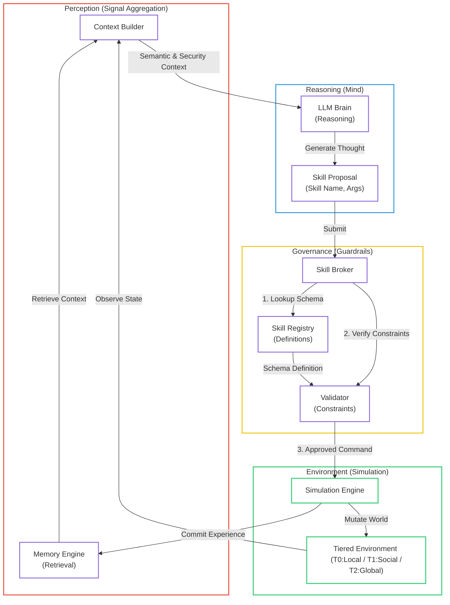

# Governed Broker Framework - Architecture

## Overview

A governance middleware for LLM-driven Agent-Based Models (ABMs).
The framework separates concerns into three distinct layers with strict data flow control.

---

## Three-Layer Architecture

```
╔═══════════════════════════════════════════════════════════════════════════════╗
║                              LLM AGENT LAYER                                  ║
║  ┌─────────────────────────────────────────────────────────────────────────┐  ║
║  │                           LLM Agent                                     │  ║
║  │   • Receives bounded context (READ-ONLY)                                │  ║
║  │   • Produces structured JSON output                                     │  ║
║  │   • Contains reasoning (threat/coping appraisal)                        │  ║
║  │   • CANNOT access hidden state                                          │  ║
║  │   • CANNOT execute actions directly                                     │  ║
║  └─────────────────────────────────────────────────────────────────────────┘  ║
╚═══════════════════════════════════════════════════════════════════════════════╝
                    │                              ▲
                    │ ② Structured Output          │ ① Bounded Context
                    │    (JSON: decision +         │    (Observable signals,
                    │     reasoning)               │     memory, options)
                    ▼                              │
╔═══════════════════════════════════════════════════════════════════════════════╗
║                          GOVERNED BROKER LAYER                                ║
║  ┌──────────────┐    ┌──────────────┐    ┌──────────────┐    ┌────────────┐  ║
║  │   Context    │───▶│  Validation  │───▶│    Retry     │───▶│   Audit    │  ║
║  │   Builder    │    │   Engine     │    │   Manager    │    │   Writer   │  ║
║  └──────────────┘    └──────────────┘    └──────────────┘    └────────────┘  ║
║         │                   │                                       │        ║
║         │            ┌──────┴──────┐                                │        ║
║         │            │ Validators: │                                │        ║
║         │            │ • Schema    │                                │        ║
║         │            │ • Policy    │                                │        ║
║         │            │ • Feasibility                                │        ║
║         │            │ • Domain-specific                            │        ║
║         │            └─────────────┘                                │        ║
║         │                                                           │        ║
║  ───────┴───────────────────────────────────────────────────────────┴─────── ║
║                    ⚠️  NO STATE MUTATION IN THIS LAYER                       ║
╚═══════════════════════════════════════════════════════════════════════════════╝
                    │                              │
                    │ ④ Action Request            │ Audit Trace
                    │    (Intent only)            │ (JSONL)
                    ▼                              ▼
╔═══════════════════════════════════════════════════════════════════════════════╗
║                         SIMULATION ENGINE LAYER                               ║
║  ┌──────────────┐    ┌──────────────┐    ┌──────────────┐    ┌────────────┐  ║
║  │ Tiered Env   │    │   System     │    │   Action     │    │  Memory    │  ║
║  │ (Institutional/Social)│  State      │◀───│  Execution   │───▶│  Update    │  ║
║  └──────────────┘    └──────────────┘    └──────────────┘    └────────────┘  ║
║                             │                    ▲                            ║
║                             │ ⑤ Admissibility    │ ⑥ Execute                  ║
║                             │    Check           │    (STATE CHANGES HERE)    ║
║                             └────────────────────┘                            ║
║  ────────────────────────────────────────────────────────────────────────── - ║
║                    ✅ ALL STATE MUTATIONS HAPPEN HERE                         ║
╚═══════════════════════════════════════════════════════════════════════════════╝
```

---

## Information Flow (6 Steps)

```
┌─────────┬─────────────┼──────────────────────────┼─────────────────────────┐
│  STEP   │  LAYER      │  ACTION                  │  REPO COMPONENT         │
├─────────┼─────────────┼──────────────────────────┼─────────────────────────┤
│   ①    │  Broker     │  Build bounded context   │  broker/context_builder │
│         │             │  (READ-ONLY tiered signals)│  broker/interaction_hub │
├─────────┼─────────────┼──────────────────────────┼─────────────────────────┤
│   ②    │  LLM        │  Generate reasoning      │  examples/.../prompts.py│
│         │             │  and Proposed Skill      │  broker/utils/model_adapter.py│
├─────────┼─────────────┼──────────────────────────┼─────────────────────────┤
│   ③    │  Broker     │  Validate output         │  broker/core/validator.py│
│         │             │  (schema, policy, theory)│  examples/.../rules.yaml│
├─────────┼─────────────┼──────────────────────────┼─────────────────────────┤
│   ④    │  Broker     │  Create action request   │  broker/types.py        │
│         │             │  (Intent ONLY)          │                          │
├─────────┼─────────────┼──────────────────────────┼─────────────────────────┤
│   ⑤    │  Engine     │  Check admissibility     │  simulation/engine.py   │
├─────────┼─────────────┼──────────────────────────┼─────────────────────────┤
│   ⑥    │  Engine     │  Execute & update state  │  simulation/engine.py   │
│         │             │  ⬅️ ONLY MUTATION POINT │                          │
└─────────┴─────────────┴──────────────────────────┴─────────────────────────┘
```

---

## Key Components

### Broker Layer (`broker/`)

| File                 | Purpose                                    |
| -------------------- | ------------------------------------------ |
| `engine.py`          | Main orchestrator, coordinates 6-step flow |
| `context_builder.py` | Builds bounded context for LLM             |
| `audit_writer.py`    | Writes JSONL audit traces                  |
| `replay.py`          | Deterministic replay from traces           |
| `types.py`           | Core data types (DecisionRequest, etc.)    |

### Interfaces (`interfaces/`)

| File                          | Purpose                           |
| ----------------------------- | --------------------------------- |
| `read_interface.py`           | Read-only state access (Step ①)   |
| `action_request_interface.py` | Action intent submission (Step ④) |
| `execution_interface.py`      | System-only execution (Step ⑥)    |

### Tiered Interaction Layer (`broker/components/`)

| File                 | Purpose                                               |
| -------------------- | ----------------------------------------------------- |
| `interaction_hub.py` | Tiered data aggregation (Institutional/Social/Global) |
| `context_builder.py` | Pipeline of providers for prompt construction         |
| `memory_engine.py`   | RAG-based context retrieval                           |

### Validators (`broker/core/validator.py`)

| Validator           | Purpose                                   |
| ------------------- | ----------------------------------------- |
| `SkillValidator`    | Structural and semantic skill checks      |
| `ContextValidator`  | Ensures no hidden state leak to LLM       |
| `ThinkingValidator` | Analyzes TP/CP consistency (PMT specific) |

---

## Key Invariants

1. **LLM is READ-ONLY**: Cannot access hidden state or modify anything
2. **Broker validates, never mutates**: Governance layer only
3. **Engine owns causality**: All state transitions happen here only
4. **Deterministic replay**: Same seed + same trace = same result
5. **Complete audit**: Every decision step produces structured trace

---

## Audit Trace Schema (JSONL)

```json
{
  "run_id": "flood_20241230_120000",
  "step_id": 1,
  "timestamp": "2024-12-30T12:00:01",
  "seed": 42,
  "agent_id": "Agent_1",
  "memory_pre": ["Year 1: No flood occurred"],
  "llm_output": {
    "action_code": "1",
    "reasoning": { "threat": "...", "coping": "..." }
  },
  "validator_results": [{ "valid": true, "errors": [] }],
  "action_request": "buy_flood_insurance",
  "admissible_command": { "status": "PASSED" },
  "execution_result": {
    "success": true,
    "state_changes": { "has_insurance": true }
  },
  "memory_post": [
    "Year 1: No flood occurred",
    "Year 1: You purchased insurance"
  ],
  "outcome": "EXECUTED",
  "retry_count": 0
}
```

---

## v3.0 Visualization


Our architecture is designed for transparency and governance. Below is the **Governed Loop** diagram, which can be imported directly into tools like **Draw.io** (via `Arrange > Insert > Advanced > Mermaid`).



---

---

## v3.0 Generalization

The Phase 9 refactoring introduced a strictly decoupled information flow:

1. **Environment Abstraction**: `SkillBrokerEngine` now accepts a generic `env_context: Dict`, removing hardcoded dependencies on specific simulation states (e.g., flood status).
2. **Generic Iteration**: `ExperimentRunner` supports `Steps` as a first-class citizen alongside `Years`, with dual hooks triggered for both paradigms.
3. **Configurable Prompting**: `ContextBuilder` externalizes semantic thresholds (Low/Medium/High) to `ExperimentConfig`, allowing domain-specific heuristics.
4. **Tiered Worldview**: `InteractionHub` enables agents to perceive T1 (Spatial/Social), T2 (Global), and T3 (Institutional) layers independently.
