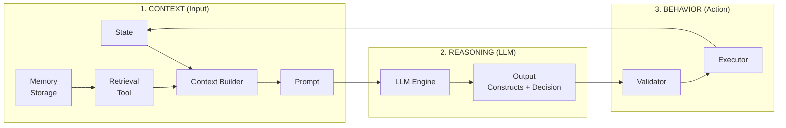

# Agent Decision Pipeline Architecture

## Overview: Three-Stage Separation



---

## 1. CONTEXT (輸入層)

Context = **State** + **Memory** → **Prompt**

### 1.1 State (靜態/當期狀態)

| Source | Description | Example |
|--------|-------------|---------|
| Agent State | Agent 的固定屬性 | `mg`, `tenure`, `region_id` |
| Current State | 當期可變狀態 | `elevated`, `has_insurance`, `cumulative_damage` |
| Environmental | 外部環境 | `subsidy_rate`, `premium_rate`, `flood_occurred` |

```python
# agent_state (直接讀取)
state = {
    "mg": agent.state.mg,              # 由 survey data 初始化
    "tenure": agent.state.tenure,      # Owner / Renter
    "elevated": agent.state.elevated,  # 累積狀態
    "has_insurance": agent.state.has_insurance,  # 年度狀態
    "cumulative_damage": agent.state.cumulative_damage
}
```

### 1.2 Memory (記憶層) - **STATE**

Memory 是 **State**，持久儲存在 Agent 內：

```python
# Memory 是 agent 的一部分
class HouseholdAgent:
    state: HouseholdAgentState
    memory: CognitiveMemory  # 記憶是狀態的一部分
```

**Memory 類型：**

| Type | Description | Capacity |
|------|-------------|----------|
| Working Memory | 短期，近期事件 | 5 items |
| Episodic Memory | 長期，重要經歷 | Unlimited (decay) |

### 1.3 Retrieval (檢索層) - **TOOL**

Retrieval 是 **Tool**，是一個動作，需要被調用：

```yaml
# skill_registry.yaml
memory_tools:
  - skill_id: retrieve_memory
    description: "Retrieve relevant past experiences"
    eligible_agent_types: ["*"]
    implementation_mapping: "memory.retrieve"
```

**重要區分：**

| Concept | Type | 說明 |
|---------|------|------|
| `memory.add()` | State Update | 寫入記憶 (被動) |
| `memory.retrieve()` | Tool Call | 主動檢索 (需調用) |

### 1.4 Context Builder (組裝層)

```python
def build_context(agent, environment):
    """組裝完整 context"""
    
    # 1. STATIC STATE
    state = get_agent_state(agent)
    
    # 2. TOOL: Retrieve Memory
    memories = agent.memory.retrieve(top_k=5, current_year=year)
    
    # 3. BUILD PROMPT
    prompt = build_household_prompt(state, environment, memories)
    
    return prompt
```

---

## 2. REASONING (推理層)

LLM 負責：
- 評估 5 個 PMT Constructs
- 產生決策
- 提供 Justification

### 2.1 Input → LLM

```
Prompt = Context (State + Retrieved Memories)
```

### 2.2 LLM → Output

```
TP Assessment: [LEVEL] - [explanation]
CP Assessment: [LEVEL] - [explanation]
SP Assessment: [LEVEL] - [explanation]
SC Assessment: [LEVEL] - [explanation]
PA Assessment: [LEVEL] - [explanation]
Final Decision: [number]
Justification: [reasoning]
```

### 2.3 Parser

將 LLM 文字輸出轉換為結構化 `HouseholdOutput`：

```python
output = parse_household_response(
    response,       # LLM 原始回應
    agent_id, mg, tenure, year, elevated
)
# -> HouseholdOutput dataclass
```

---

## 3. BEHAVIOR (行為層)

### 3.1 Validator (驗證)

確保決策符合規則：

| Rule | Type | 說明 |
|------|------|------|
| R4 | Error | Renter 不能 elevate |
| R9 | Error | Renter 只能 insurance/relocate/nothing |
| R6 | Error | 已 relocated 不能行動 |
| R7 | Warning | FULL PA 不需 relocate |
| R8 | Warning | PA 與實際狀態不符 |

### 3.2 Executor (執行)

套用決策到 Agent State：

```python
def apply_decision(agent, output):
    skill = output.decision_skill
    
    if skill == "buy_insurance":
        agent.state.has_insurance = True
    elif skill == "elevate_house":
        agent.state.elevated = True
    elif skill == "relocate":
        agent.state.relocated = True
    # do_nothing: no state change
```

### 3.3 Memory Update (自動)

執行後自動更新記憶 (被動，不是 tool)：

```python
# After decision
agent.memory.update_after_decision(output.decision_skill, year)

# After flood
agent.memory.update_after_flood(damage, year)
```

---

## Data Flow Diagram

```
┌─────────────────────────────────────────────────────────────────┐
│                          YEAR LOOP                              │
├─────────────────────────────────────────────────────────────────┤
│                                                                 │
│  ┌──────────────── CONTEXT ────────────────┐                    │
│  │                                         │                    │
│  │  State (Read)                           │                    │
│  │    ├── mg, tenure (from survey)         │                    │
│  │    ├── elevated, has_insurance          │                    │
│  │    └── cumulative_damage                │                    │
│  │                                         │                    │
│  │  Memory.Retrieve (Tool Call)            │                    │
│  │    └── Top 5 relevant memories          │                    │
│  │                                         │                    │
│  │  Environment (Read)                     │                    │
│  │    ├── subsidy_rate                     │                    │
│  │    ├── premium_rate                     │                    │
│  │    └── flood_occurred                   │                    │
│  │                                         │                    │
│  └──────────────────┬──────────────────────┘                    │
│                     │                                           │
│                     ▼                                           │
│  ┌──────────────── PROMPT ─────────────────┐                    │
│  │  Built from Context                     │                    │
│  └──────────────────┬──────────────────────┘                    │
│                     │                                           │
│                     ▼                                           │
│  ┌──────────────── REASONING ──────────────┐                    │
│  │                                         │                    │
│  │  LLM (Ollama llama3.2:3b)               │                    │
│  │    ├── Evaluate: TP, CP, SP, SC, PA     │                    │
│  │    ├── Choose: Decision                 │                    │
│  │    └── Explain: Justification           │                    │
│  │                                         │                    │
│  └──────────────────┬──────────────────────┘                    │
│                     │                                           │
│                     ▼                                           │
│  ┌──────────────── BEHAVIOR ───────────────┐                    │
│  │                                         │                    │
│  │  1. Parse Response → HouseholdOutput    │                    │
│  │  2. Validate (R1-R9)                    │                    │
│  │  3. Execute → Update State              │                    │
│  │  4. Update Memory (auto)                │                    │
│  │  5. Log to Audit                        │                    │
│  │                                         │                    │
│  └─────────────────────────────────────────┘                    │
│                                                                 │
└─────────────────────────────────────────────────────────────────┘
```

---

## Key Distinction: Memory vs Retrieval

```
╔═══════════════════════════════════════════════════════════════╗
║  MEMORY (State)          │  RETRIEVAL (Tool)                  ║
╠═══════════════════════════════════════════════════════════════╣
║  - Stored in Agent       │  - Called as Tool                  ║
║  - Persistent            │  - On-demand                       ║
║  - Auto-updated          │  - Must be invoked                 ║
║  - agent.memory.add()    │  - agent.memory.retrieve()         ║
╠═══════════════════════════════════════════════════════════════╣
║  Example:                │  Example:                          ║
║  memory.update_after_    │  memories = memory.retrieve(       ║
║    decision("elevate")   │      top_k=5, current_year=3)      ║
╚═══════════════════════════════════════════════════════════════╝
```

---

## File Mapping

| Stage | Files |
|-------|-------|
| Context | `data_loader.py`, `broker/memory.py` |
| Prompt | `prompts.py` |
| Reasoning | `run_experiment.py` (call_llm) |
| Parser | `parsers.py` |
| Validator | `validators.py` |
| Executor | `agents/household.py` |
| Audit | `audit_writer.py` |
