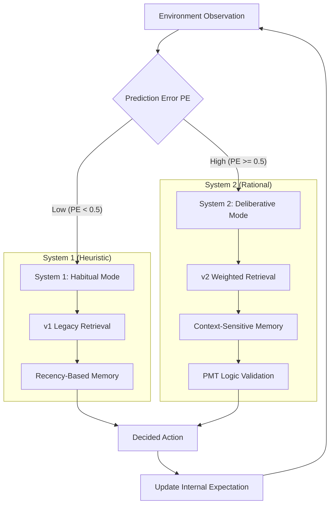

# Theoretical Basis & Architecture Master Map

This document bridges the gap between **Behavioral Theory** and **Software Engineering**. It details the academic foundations of the framework and maps them to specific code modules.

**Recommended for**: Researchers writing the "Methodology" section of their paper.

---

## 1. Dictionary of Concepts

### 1.1 Availability Heuristic & The Forgetting Curve

- **Theory**: Humans judge the probability of an event by how easily they can recall it (**Tversky & Kahneman, 1973**). Memories follow an exponential decay over time (**Ebbinghaus, 1885**).
- **Implementation**: `HumanCentricMemoryEngine` (v1 mode).
- **Mechanism**:
  - **Importance Score ($I$)**: Normalized [0, 1] based on emotional weight and source credibility.
  - **Decay Function**: $S = I \times e^{-\lambda t}$. Traumatic events remain "available" in memory longer than routine data.

### 1.2 Context-Dependent Memory

- **Theory**: Memory retrieval is significantly more effective when the context at the time of retrieval matches the context at the time of encoding (**Godden & Baddeley, 1975**).
- **Implementation**: `HumanCentricMemoryEngine` (v2 mode).
- **Mechanism**:
  - **Context Score ($C$)**: A binary match {0, 1} between current situation tags and stored memory tags.
  - **Weighted Retrieval**: $S = W_{rec}R + W_{imp}I + W_{ctx}C$. This allows even distant memories to be "reawakened" if the environment matches.

### 1.3 Dual-Process Theory & Active Inference

- **Theory**: Human cognition balances between fast, intuitive "System 1" and slow, analytical "System 2" (**Kahneman, 2011**). This switching is driven by **Surprise** or **Prediction Error ($PE$)**, where the brain allocates more resources only when expectations are violated (**Friston, 2010**).
- **Implementation**: `UniversalCognitiveEngine` (v3 "The Surprise Engine").
- **Mechanism**:
  - **Routine ($PE < \theta$)**: Uses v1 (System 1/Habit). Saves energy/compute.
  - **Surprise ($PE \ge \theta$)**: Uses v2 (System 2/Deliberate). Forces context-aware retrieval.

### 1.4 Configurable Reasoning (e.g., PMT)

- **Theory Context**: Our default simulation uses **Protection Motivation Theory (PMT)** (**Rogers, 1975**).
- **Generalizability**: The module is a **"Theory Slot"**. It is not hardcoded to PMT.
- **Implementation**: `AgentValidator` (Dual-Tier Validation).

### 1.5 Bounded Rationality

- **Theory**: Agents are rational only within limits of information and cognition (**Simon, 1957**).
- **Implementation**: **Governance Layer**.

### 1.6 Reflexion (Meta-Cognition)

- **Theory**: Learning occurs not just through doing, but through reflecting on past actions (**Shinn et al., 2023**).
- **Implementation**: `ReflectionEngine`.

---

## 2. Integrated Cognitive Flow (Dual-Process Architecture)

The framework coordinates these theories into a single "State-to-Mind" loop. Below is the cognitive switching logic driven by the **Surprise Engine**:

## 3. Theory-to-Code Mapping

| Theory                        | Module                   | File                   | Function                                   |
| :---------------------------- | :----------------------- | :--------------------- | :----------------------------------------- |
| **Availability Heuristic**    | **Memory Engine (v1)**   | `memory_engine.py`     | `HumanCentricMemoryEngine` (Legacy mode)   |
| **Context-Dependent Memory**  | **Memory Engine (v2)**   | `memory_engine.py`     | `HumanCentricMemoryEngine` (Weighted mode) |
| **Dual-Process / Active Inf** | **Surprise Engine (v3)** | `universal_memory.py`  | `UniversalCognitiveEngine.retrieve`        |
| **PMT / Reasoning**           | **Thinking Validator**   | `agent_validator.py`   | `AgentValidator.validate`                  |
| **Bounded Rationality**       | **Governance Layer**     | `governance.py`        | `GovernanceLayer.process`                  |
| **Cognitive Constraints**     | **Memory Capacity**      | `cognitive_constraints.py` | `CognitiveConstraints.get_memory_count` (Miller 1956 / Cowan 2001) |
| **Reflexion**                 | **Reflection Engine**    | `reflection_engine.py` | `ReflectionEngine.reflect`                 |
| **Prompt Synthesis**          | **Context Builder**      | `context_builder.py`   | `ContextBuilder.build_prompt`              |

---

## 3. System Workflow (The Cognitive Cycle)

The following lifecycle demonstrates how these theories interact in a single simulation step:

### Step 1: Perception & Arousal (Dual-Process)

- **State**: Year 5, Raining.
- **Predictor**: Expectation = Sunny (Avg). Reality = Extreme Rain.
- **Surprise ($PE$)**: $PE = |1.0 - 0.1| = 0.9$.
- **Trigger**: $0.9 > \theta$ (0.5). Switch to **System 2** (v2 Retrieval).
- **Retrieval**: 3-year-old "Flood Trauma" is reawakened because $C=1.0$ (matching the Rain/Flood context).
- **Effect**: The agent "wakes up" and remembers the pain clearly, bypassing normalcy bias.

### Step 2: Reasoning (PMT & Bounded Rationality)

- **Prompt**: "You are Agent 001. It is raining. You recall the Year 2 disaster."
- **Cycle**:
  1.  **Draft 1**: "I ignore it." -> **BLOCKED** by Validator (Violates PMT: Ignored Threat).
  2.  **Retry**: "Because of the Year 2 disaster (Threat), I must act. I have savings (Coping)." -> **APPROVED**.

### Step 3: Action & Encoding (Episodic)

- **Action**: `buy_insurance`.
- **Encoding (Path A)**: "Year 5: Bought insurance." -> Saved to Raw Log.

### Step 4: Reflection (Reflexion / Semantic)

- **End of Year**: The agent reviews its logs.
- **Synthesis (Path B)**: "I learned that proactive spending prevents bankruptcy."
- **Result**: This **Insight** is stored as high-priority Semantic Memory for the future.

---

## 4. Universality & Domain Adaptation

The framework is a **Cognitive Middleware**, adaptable to any domain by changing the configuration (`agent_types.yaml`), not the code.

| Layer              | Socio-Hydrology (Current)  | Consumer Behavior           | Behavioral Finance                  |
| :----------------- | :------------------------- | :-------------------------- | :---------------------------------- |
| **Theory**         | **PMT** (Threat vs Coping) | **TPB** (Attitude vs Norms) | **Prospect Theory** (Loss Aversion) |
| **Trauma/Trigger** | `["flood", "damage"]`      | `["scam", "waste"]`         | `["market crash", "loss"]`          |
| **Logic Rule**     | "Evaluate Threat Level"    | "Evaluate Social Norms"     | "Compare to Reference Point"        |
| **Social Signal**  | Neighbor Elevation Rate    | Viral Product Review        | Market Sentiment / FOMO             |

This demonstrates the framework's capacity to model **any boundedly rational human behavior**, from buying insurance to stock trading.
