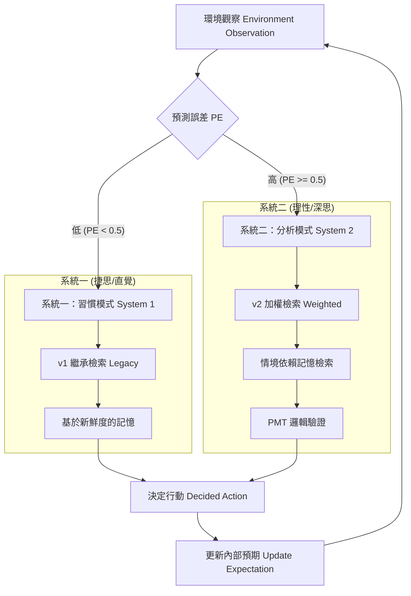

# 系統理論與架構詳解 (System Theory & Architecture Master Map)

這份文檔詳細解釋了框架中使用的每一個**專有名詞 (Term)**、其背後的**學術理論 (Theory)**、對應的**程式模組 (Module)**，以及整個系統是如何串聯運作的。

---

## 1. 名詞與理論詳解 (Detailed Dictionary)

### 1.1 可得性捷思與遺忘曲線 (Availability Heuristic & The Forgetting Curve)

- **理論**：心理學概念 (**Tversky & Kahneman, 1973**)。人類判斷事件機率是看想起它的難易度，而非統計數據。記憶隨時間呈指數級衰減 (**Ebbinghaus, 1885**)。
- **對應模組**：`HumanCentricMemoryEngine` (v1 模式)
- **實作方式**：
  - **重要性評分 ($I$)**：基於情緒與來源可靠度的 [0, 1] 標準化評分。
  - **衰減函數**：$S = I \times e^{-\lambda t}$。創傷性事件因 $I$ 高，在腦中保持「可得性」的時間遠長於日常瑣事。

### 1.2 情境依賴記憶 (Context-Dependent Memory)

- **理論**：當檢索時的情境（Context）與編碼時的情境吻合時，記憶檢索效率會顯著大幅提升 (**Godden & Baddeley, 1975**)。
- **對應模組**：`HumanCentricMemoryEngine` (v2 模式)
- **實作方式**：
  - **情境分數 ($C$)**：當前環境標籤與記憶標籤的二元匹配 {0, 1}。
  - **加權檢索**：$S = W_{rec}R + W_{imp}I + W_{ctx}C$。即使是十年前的老記憶，只要環境匹配，就會被重新喚醒。

### 1.3 雙系統理論與主動推理 (Dual-Process Theory & Active Inference)

- **理論**：人類認知在快速直覺的「系統一」與慢速分析的「系統二」之間平衡 (**Kahneman, 2011**)。這種切換由「驚奇感」或「預測誤差 ($PE$)」驅動，當預期被違背時，大腦才會分配更多認知資源 (**Friston, 2010**)。
- **對應模組**：`UniversalCognitiveEngine` (v3 「驚奇引擎」)
- **實作方式**：
  - **日常模式 ($PE < \theta$)**：執行 v1 (系統一/習慣)。節省算力。
  - **驚奇模式 ($PE \ge \theta$)**：執行 v2 (系統二/深思)。強制啟動情境感知檢索。

### 1.4 可配置的推論邏輯 (Configurable Reasoning - e.g., PMT)

- **核心概念**：這是一個**可抽換的理論插槽 (Theory Slot)**。
  - **行為財務學**：可換成 **展望理論 (Prospect Theory)**，要求代理人展現「損失規避」。
- **對應模組**：`AgentValidator` (雙層驗證機制)。

### 1.5 有限理性 (Bounded Rationality)

- **理論**：代理人的理性受限於資訊、時間和認知能力 (**Simon, 1957**)。
- **對應模組**：**治理層 (Governance Layer)**。

### 1.6 元認知與反思 (Metacognition & Reflexion)

- **理論**：學習不僅發生在行動中，更發生在對行動的反思中 (**Shinn et al., 2023**)。
- **對應模組**：`ReflectionEngine`。

---

## 2. 整合認知流 (雙系統架構圖)

本框架將上述理論整合進一個「狀態到心智 (State-to-Mind)」的循環中。以下是由 **驚奇引擎 (Surprise Engine)** 驅動的切換邏輯：

## 3. 模組對照表 (Mapping Table)

| 理論 (Theory)                 | 程式模組 (Code)    | 檔案位置 (File)        | 作用 (Function)                       |
| :---------------------------- | :----------------- | :--------------------- | :------------------------------------ |
| **Availability Heuristic**    | **記憶引擎 (v1)**  | `memory_engine.py`     | `HumanCentricMemoryEngine` (Legacy)   |
| **Context-Dependent Memory**  | **記憶引擎 (v2)**  | `memory_engine.py`     | `HumanCentricMemoryEngine` (Weighted) |
| **Dual-Process / Active Inf** | **驚奇引擎 (v3)**  | `universal_memory.py`  | `UniversalCognitiveEngine.retrieve`   |
| **PMT / 理性推論**            | **思考驗證器**     | `agent_validator.py`   | `AgentValidator.validate`             |
| **Bounded Rationality**       | **治理層**         | `governance.py`        | `GovernanceLayer.process`             |
| **認知限制 (Cognitive Constraints)** | **記憶容量**  | `cognitive_constraints.py` | `CognitiveConstraints.get_memory_count` (Miller 1956 / Cowan 2001) |
| **Reflexion**                 | **反思引擎**       | `reflection_engine.py` | `ReflectionEngine.reflect`            |
| **Prompt 組合**               | **ContextBuilder** | `context_builder.py`   | `ContextBuilder.build_prompt`         |

---

## 3. 系統運作流程 (How it Works Together)

這是一個代理人 (Agent) 在模擬環境中做出決策的**完整生命週期**，展示了所有模組如何協作：

### 步驟 1：感知與喚起 (Dual-Process & Arousal)

- **情況**：第 5 年，外面下大雨，水位 1.0ft (Reality)。
- **Predictor**：預期水位 0.1ft (Expectation)。
- **驚奇度 (PE)**：$PE = |1.0 - 0.1| = 0.9$。
- **切換**：$0.9 > \theta$，啟動 **系統二的 v2 檢索**。
- **Memory Engine**：
  - 系統掃描發現一條 3 年前的記憶：「第 2 年大水致屋毀 (Imp=1.0)」。
  - 因為當前關鍵字匹配，「情境分數 $C$」爆發，該記憶得分躍居第一。
  - **決定**：將這條「創傷記憶」強制注入 Prompt，衝破「九年安逸」產生的偏見。

### 步驟 2：思考 (Reasoning with PMT)

- **Context Builder**：組合 Prompt：「你是 Agent 001，外面下雨，你記得以前淹過水。請決定行動。」
- **LLM (Gemma)**：開始思考。
  - _Draft 1_: "我覺得沒差，睡覺。" -> **Validator 攔截** (沒有評估威脅)。
  - _Retry_: "根據 PMT，外面下雨 + 我有創傷記憶 = **高威脅**。但我存款夠 = **高應對能力**。" -> **Validator 通過**。

### 步驟 3：行動 (Action)

- **LLM**：決定輸出 Action: `buy_insurance`。
- **Simulator**：執行扣款，更新狀態。

### 步驟 4：反思與語意記憶 (Reflection / Semantic)

- **Path A**："Year 5: Bought Insurance due to fear." -> 存入 Raw Log。
- **一年結束**：Reflection Engine 讀取日誌，LLM 總結：「我發現保險能讓我安心，即使要花錢。」
- **Path B**：這條「心得」被存入長期記憶，作為明年的決策依據。

---

## 4. 通用性與領域適配 (Universality & Domain Adaptation)

本框架是**可移植的中介軟體**，只要修改 YAML 設定檔即可適配不同領域。

**跨領域對照表**

| 認知層 (Layer)      | 水文學 (Current)      | 消費者行為 (Retail) | 行為財務學 (Finance)           |
| :------------------ | :-------------------- | :------------------ | :----------------------------- |
| **理論模型**        | **PMT** (保護動機)    | **TPB** (計畫行為)  | **Prospect Theory** (展望理論) |
| **關鍵字 (Memory)** | `["flood", "trauma"]` | `["scam", "waste"]` | `["crash", "loss"]`            |
| **思考規則**        | "評估威脅與應對"      | "評估CP值與口碑"    | "與參考點比較損益"             |
| **社會訊號**        | 鄰居是否墊高          | 網紅是否推薦        | 市場恐慌指數 (FOMO)            |

**如何操作？**

您只需要修改 `agent_types.yaml` 的 `emotion_keywords` 和 `thinking_rules` 即可。系統核心代碼 (**System Execution Layer**) 完全不需要更動。這一點證明了本研究貢獻在於「架構」而非單一案例。
