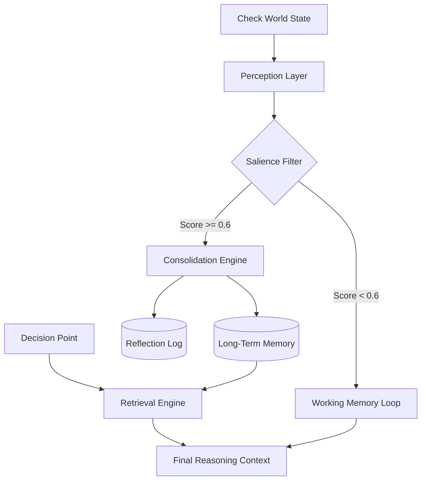

# Components: Memory, Context & Reflection

**🌐 Language: [English](memory_components.md) | [中文](memory_components_zh.md)**

This document details the cognitive architecture of the agent, designed to solve the "Goldfish Effect" in LLMs using psychological principles.

---

### 3. Deep Dive: How It Actually Works (The Math)

To understand how the agent "remembers," let's walk through a concrete calculation trace from the JOH Simulation.

#### 3.1 The Scenario

- **Configuration**: `decay_rate (λ) = 0.1`, `importance_threshold = 0.6`.
- **Event**: In **Year 2**, the agent's house floods (Depth: 2.0ft).
- **Source**: Personal Experience (Weight: 1.0).
- **Emotion**: `trauma` (Weight: 1.5).

#### 3.2 Step 1: Valuation (Encoding)

The memory engine first calculates the **Unified Importance Score ($I$)**:
$$I = W_{source} \times W_{emotion}$$
$$I = 1.0 \times 1.5 = \textbf{1.5}$$

Since $1.5 \ge 0.6$, this event is **Consolidated** into Long-Term Memory (saved to JSON). It is now a "Durable Belief."

#### 3.3 Step 2: Retrieval in the Future

It is now **Year 5** (3 years later). The agent is deciding whether to buy insurance. The system queries memory.

- **Time Delta ($t$)**: 3 years.
- **Decay Function**: The engine calculates the current retrieval strength ($S$):
  $$S = I \times e^{-\lambda t}$$
  $$S = 1.5 \times e^{-0.1 \times 3} = 1.5 \times 0.74 = \textbf{1.11}$$

- **Comparison**: A routine event from Year 4 (e.g., "Sunny day", $I=0.2$) has decayed to $0.2 \times e^{-0.1 \times 1} = 0.18$.
- **Result**: The Flood Memory (1.11) is **6x stronger** than the recent weather (0.18). The agent "remembers" the flood vividly and ignores the sun.

### 4. Information Flow Diagram

The following diagram illustrates how raw signals are transformed into permanent convictions.



### 6. Further Reading

For a deep dive into the academic theories (PMT, Availability Heuristic) and their code implementation, please see:
[Theoretical Basis & Architecture Master Map](theoretical_basis.md)

This architecture ensures that **High-Impact Events** (Red Path) bypass the standard forgetting mechanism of the LLM context window.

---

## 1. Core Concepts & Definitions

Before understanding the code, it is essential to define the cognitive terms and their academic basis.

- **Human-Centric Memory**: A retrieval mechanism that prioritizes "Emotional Salience" (Trauma/Major Events) over simple recency. It mimics human availability heuristics.
  - _Reference_: **Park, J. S., et al.** (2023). Generative Agents: Interactive Simulacra of Human Behavior.
- **Bounded Context**: The limit of the LLM's attention. We cannot feed 10 years of logs; we must construct a "Frame of Reality" that fits within the token window.
- **Reflection**: A meta-cognitive process where the agent looks back at its history to form high-level "Insights" (e.g., "I live in a flood zone").
  - _Reference_: **Shinn, N., et al.** (2023). Reflexion: Language Agents with Verbal Reinforcement Learning.
- **Protection Motivation (PMT)**: The psychological theory driving the agent's decision-making, balancing Threat Perception vs. Coping Appraisal.
  - _Reference_: **Rogers, R. W.** (1975). A Protection Motivation Theory.

---

## 2. System Design & Architecture

### 🧠 Memory Engine: The Science of Recall

The `MemoryEngine` is a **Reconstructive Process**. It acts as a filter _before_ the prompt is meaningful.

**Mathematical Formulation**
The retrieval score $S$ for a memory $m$ at time $t$ uses a **Decay-Weighted Product** model:

$$ S(m, t) = Imp(m) \cdot e^{-\lambda' \cdot \Delta t} $$

Where:

- $Imp(m) = W_{emotion} \times W_{source}$
- $\lambda'$ is the emotion-adjusted decay rate:
  $$ \lambda' = \lambda*{base} \cdot (1 - 0.5 \cdot W*{emotion}) $$
  _(Impact: Higher emotion memories decay significantly slower)_

_Note: The system does not use linear $\alpha, \beta, \gamma$ weights._

### 👁️ Context Builder: The Cognitive Lens

The `ContextBuilder` frames reality to prevent **Hallucination**. It constructs a strict schema for every prompt:

1.  **Global Truth**: "You are a homeowner." (Identity)
2.  **Retrieved Memory**: "You recall the flood of Year 2." (From Memory Engine)
3.  **Immediate State**: "Current water level: 1.5m." (Sensors)
4.  **Social Signals**: "Neighbor bought insurance." (Influence)

### 🪞 Reflection Engine: Long-Term Caching

Executed at the end of every simulation year (The "Sleep" phase).

1.  **Aggregate**: Reads all daily logs.
2.  **Synthesize**: LLM generates 3 high-level bullet points (Insights).
3.  **Consolidate**: Insights are saved to memory with `Importance=10`.

---

## 3. ⚙️ Configuration & Parameters

Recommended settings for Llama 3 / Gemma sized models.

### Keywords & Weights Configuration

Users can customize priorities via `agent_types.yaml`. These directly affect $Imp(m)$.

| Category            | Keyword Examples            | Weight               |
| :------------------ | :-------------------------- | :------------------- |
| **Direct Impact**   | `flood`, `damage`, `trauma` | **1.0** (Max)        |
| **Personal Source** | `i`, `my`, `me`             | **1.0** (Direct Exp) |
| **Strategic**       | `decision`, `relocate`      | **0.8**              |
| **Neighbor**        | `neighbor`, `others`        | **0.8**              |
| **Routine**         | (default behavior)          | **0.1**              |

### General Parameters

| Parameter                       | Type    | Default | Description                            |
| :------------------------------ | :------ | :------ | :------------------------------------- |
| `window_size`                   | `int`   | `5`     | Items in "Working Memory".             |
| `decay_rate` ($\lambda_{base}$) | `float` | `0.1`   | Base forgetting rate.                  |
| `importance_boost`              | `float` | `0.9`   | Multiplier for **Reflected Insights**. |

---

## 4. 🔌 Usage & Connector Guide

How to instantiate and connect the components in your experiment script (`run.py`).

```python
# 1. Initialize the Engine
memory_engine = HumanCentricMemoryEngine(
    window_size=5,
    top_k_significant=2,
    consolidation_prob=0.7
)

# 2. Link to Context Builder
# The ContextBuilder automatically triggers retrieval during the 'build()' step
ctx_builder = FinalContextBuilder(
    memory_engine=memory_engine,
    agent_id=agent.id
)

# 3. Main Loop Integration
observation = ctx_builder.build(
    agent=agent,
    world_state=flood_depth
)
# 'observation' now contains the injected memories + current state
```

---

## 5. 📝 Input / Output Examples

What actually happens inside the prompt?

**Input: Raw Memory Store**

```json
[
  {
    "year": 2,
    "text": "House destroyed by flood. Trauma High.",
    "importance": 1.0
  },
  { "year": 8, "text": "Sunny day.", "importance": 0.1 }
]
```

**Process: Year 10 Retrieval**

- Year 8 is forgotten (Decay).
- Year 2 is **Retrieved** (High Importance outweighs Decay).

**Output: Injected Context**

```text
[Your History]
- Recurring Memory: "House destroyed by flood..." (Year 2)
[Current Situation]
- "It is raining heavily."
```
