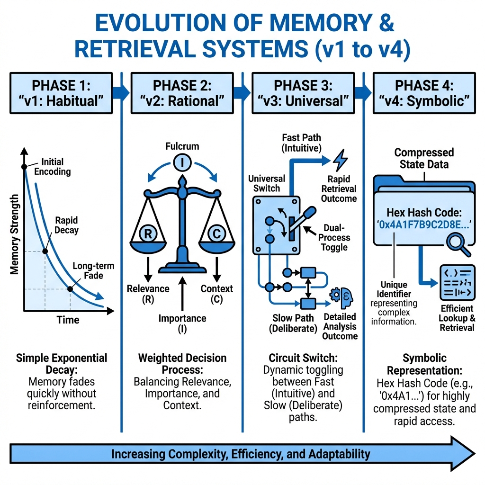

# 元件：記憶與檢索系統

**語言： [English](memory_components.md) | [中文](memory_components_zh.md)**

**記憶與檢索系統** 是代理人過去經驗與當前決策之間的認知橋樑。在本框架中，我們明確地將 **Memory（儲存）** 與 **Retrieval（存取控制）** 解耦，以確保在高資訊密度下仍能維持理性決策。

---

## 記憶演化與路線圖

本系統是建立在認知科學基礎上的 **通用認知架構**，以三個階段逐步深化檢索能力。



---

## 1. 記憶生命週期：從感知到提示詞

以下以單一事件為例，說明記憶如何被儲存與檢索：

### Step 1: 記憶系統、評估與符號字典

#### **A. 記憶系統的策略比較**

| 特徵 | v1：舊式（習慣） | v2：加權（理性） | v3：通用（切換） | v4：符號（完形） |
| :--- | :--- | :--- | :--- | :--- |
| **檢索邏輯** | **顯著性導向** | **統一評分** | **驚奇驅動閘門** | **簽章導向** |
| **核心公式** | $S(t)=I\cdot e^{-\lambda t}$ | $S=W_{rec}R+W_{imp}I+W_{ctx}C$ | $PE=\|Reality-Expectation\|$ | $S=1-P(Signature)$ |
| **設計哲學** | **可得性捷思** | **情境相關性** | **主動推理** | **有限理性** |
| **目標** | 記住「近期衝擊」 | 記住「相關歷史」 | **習慣**直到**驚奇** | **情境**而不犧牲效能 |

#### **B. 參數與符號字典（0.0至1.0）**

| 符號 | 元件/參數 | 預設 | 定義 |
| :--- | :--- | :--- | :--- |
| **$R$** | **新鮮度分數** | (計算) | $1-(\text{age}/\text{max\_age})$，越新越高 |
| **$I$** | **重要性分數** | (計算) | $I_{initial}\cdot e^{-\lambda t}$，衰減強度 |
| **$C$** | **情境分數** | (計算) | 記憶標籤與當前提示詞的二元匹配 |
| **$PE$** | **預測誤差** | (計算) | 驚奇度（現實 vs. 預期） |
| **$\lambda$** | **衰減率** | 0.1 | 遺忘速度 |
| $W_{rec}$ | **新鮮權重** | 0.3 | 提示詞中新鮮度的權重 |
| $W_{imp}$ | **重要權重** | 0.5 | 歷史重要性的權重 |
| $W_{ctx}$ | **情境權重** | 0.2 | 情境相關性的權重 |
| $I_{gate}$ | **固化閾值** | 0.6 | 進入長期記憶的最小強度 |
| $P_{burn}$ | **固化機率** | 0.8 | 通過閾值後的固化機率 |

#### **C. 重要性計算邏輯（$I$ 的推導）**

重要性不是隨機的，而是**情緒權重**與**來源可信度**的乘積：

$$I_{initial}=W_{emotion}\times W_{source}$$

---

## 2. 實際案例：家戶代理人記憶檢索追蹤

**當前情境（第 11 年）**：氣象局已發布**紅色警報**，預報極端降雨與河川洪水風險。

> **當前標籤**：`[Flood, Danger, Rain]`

代理人在長期記憶中保留兩筆事件：

- **記憶 A（災難）**：「第 1 年：洪水潰堤，地下室淹了 2 呎，家具全毀，非常可怕。」
  - **參數**：$I_{initial}=1.0$、Age=10、Tags=`[Flood]`
- **記憶 B（日常）**：「第 10 年：氣象晴朗，下午在後院園藝，是平靜的一天。」
  - **參數**：$I_{initial}=0.1$、Age=1、Tags=`[Routine]`

---

#### **Model v1：習慣型代理人（Habit）**

v1 只關注顯著性：$I\cdot e^{-\lambda t}$。

1. **記憶 A 分數**：$1.0\cdot e^{-(0.1\times10)}=0.36$
2. **記憶 B 分數**：$0.1\cdot e^{-(0.1\times1)}\approx0.09$
3. **結果**：災難記憶逐漸衰減，前景被大量日常記憶佔據
4. **行動**：代理人忽略警報，「常態偏誤」主導

---

#### **Model v2：理性型代理人（Deliberate）**

v2 使用 $S=(R\times0.3)+(I\times0.5)+(C\times0.2)$。

1. **記憶 A（災難）**
   - **計算**：$(R=0.0\times0.3)+(I=0.36\times0.5)+(C=1.0\times0.2)=0.38$
   - **原因**：與「Flood」情境匹配，$C=1.0$
2. **記憶 B（日常）**
   - **計算**：$(R=0.9\times0.3)+(I=0.09\times0.5)+(C=0.0\times0.2)=0.315$
   - **原因**：新鮮度高但無情境匹配
3. **結果**：$0.38>0.315$，災難記憶勝出
4. **行動**：立即購買洪水保險！

---

## 3. v3：通用記憶（驚奇引擎）

v3 是認知架構的「控制器」，負責模型**喚醒迴路**，決定何時採用習慣（v1）或理性（v2）。

### 3.1 喚醒迴路機制

1. **感官輸入（Reality）**：`flood_depth=2.0m`
2. **內部預期（Expectation）**：`flood_depth=0.1m`（EMA）
3. **驚奇（PE）**：$|2.0-0.1|=1.9$
4. **切換**：若 $PE\ge0.5$，進入 **System 2**

---

## 4. v4：符號架構（Symbolic Context）

### 4.1 為何需要符號？

- **v3 的問題**：單一閾值過於脆弱
- **向量嵌入的問題**：計算成本過高
- **v4 解法**：以**符號簽章**兼顧情境靈活性與 $O(1)$ 速度

### 4.2 機制

1. **感測器**：偵測 `FLOOD:HIGH`、`PANIC:LOW`
2. **簽章**：`Hash("FLOOD:HIGH|PANIC:LOW")`
3. **驚奇**：$S=1-P(\text{Signature})$

### 4.3 案例：溫水煮蛙追蹤

| 年份 | 事件 | 簽章 | 機率 $P$ | 驚奇 $S$ | 系統 | 行動 |
| :--- | :--- | :--- | :--- | :--- | :--- | :--- |
| **Y1** | **首次洪水** | `FLOOD:HIGH` | 0.0 | **1.0** | **System 2** | **購買保險** |
| **Y2** | 再次洪水 | `FLOOD:HIGH` | 0.5 | 0.5 | System 1 | 習慣續保 |
| **Y3** | 再次洪水 | `FLOOD:HIGH` | 0.66 | 0.33 | System 1 | 麻木 |
| **Y4** | 再次洪水 | `FLOOD:HIGH` | 0.75 | 0.25 | **System 1** | **不作為** |
| **Y10** | **新情境** | `FLOOD:HIGH`+`NEIGHBOR:ELEVATING` | 0.0 | **1.0** | **System 2** | **墊高** |

> **要點**：Y4 雖然風險高，驚奇卻很低，代理人會「習慣化」。新情境才會喚醒。

---

## 5. 相關元件

- **[Reflection Engine（反思引擎）](reflection_engine.md)**
- **[Simulation Engine（模擬引擎）](../modules/simulation_engine.md)**

### 5.1 認知限制（記憶容量）

控制工作記憶容量，避免過多事件湧入提示詞。

`CognitiveConstraints`（`cognitive_governance/memory/config/cognitive_constraints.py`）根據喚醒程度決定可檢索的記憶數量：

- **System 1（低喚醒）**：5 筆近期記憶（Cowan 2001：4 +/- 1）
- **System 2（高喚醒）**：7 筆近期記憶（Miller 1956：7 +/- 2）
- **補充**：+2 筆高重要性長期記憶（不受喚醒限制）

| 設定檔 | System 1 | System 2 | 工作容量 | 適用場景 |
| :--- | :--- | :--- | :--- | :--- |
| `MILLER_STANDARD` | 5 | 7 | 10 | 建議預設 |
| `COWAN_CONSERVATIVE` | 3 | 5 | 7 | 資源受限 |
| `EXTENDED_CONTEXT` | 7 | 9 | 15 | 複雜推理 |
| `MINIMAL` | 3 | 4 | 5 | 小型模型 |

`get_memory_count(arousal)` 在兩系統間做平滑插值，而非硬切換。

### 5.2 SDK 擴充（cognitive_governance/）

以下擴充 API 與核心引擎分開：

- **嵌入式檢索**（`embeddings.py`）：向量相似度搜尋
- **多維度驚奇**（`multidimensional.py`）：多維 PE 向量
- **記憶圖譜**（`memory/`）：雙向關聯檢索

---

## 6. 設定與參考文獻

```yaml
memory_config:
  type: "universal" # v3/v4
  params:
    arousal_threshold: 0.5
    W_recency: 0.3
    W_importance: 0.5
    W_context: 0.2
```

### 參考文獻

[1] Tversky & Kahneman (1973). _Availability Heuristic_
[2] Friston (2010). _The free-energy principle_
[3] Kahneman (2011). _Thinking, Fast and Slow_
