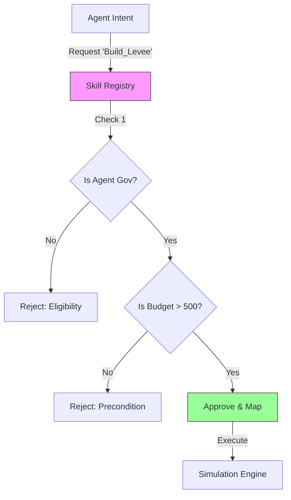

# Skill Registry (Action Governance)

The **Skill Registry** serves as the **"Institutional Charter"** of the system. Unlike a simple function mapper, it acts as a **Governance Layer** that defines:

1.  **Existence**: What actions are physically possible in the environment.
2.  **Eligibility**: Who is allowed to perform each action.
3.  **Preconditions**: What state must be true before execution.
4.  **Constraints**: Institutional rules (e.g., costs, limits) tied to the action.

---

## 1. Core Concepts

### 1.1 Separation of Intent vs. Execution

In this framework, an agent's "output" is just an **Intent** (a string like `relocate`). The Skill Registry validates this intent against the "Laws of Physics" and "Laws of Society" before it becomes an **Action**.

### 1.2 The Skill Definition

Every skill is a structured object, not just a function pointer.

```python
@dataclass
class SkillDefinition:
    skill_id: str
    description: str
    eligible_agent_types: List[str]  # e.g., ["resident", "government"] or ["*"]
    preconditions: List[str]         # e.g., ["has_budget", "not is_flooded"]
    institutional_constraints: Dict  # e.g., {"cost": 500, "cooldown": 1}
    allowed_state_changes: List[str] # Whitelist of side effects
    implementation_mapping: str      # Function name in simulation engine
```

---

## 2. Usage Workflow



---

## 3. Configuration (YAML)

Skills are typically loaded from a human-readable `skill_registry.yaml` file, making the rules of the simulation transparent and easy to edit without touching code.

**Example `skill_registry.yaml`:**

```yaml
skills:
  - skill_id: "do_nothing"
    description: "Take no action this turn."
    eligible_agent_types: ["*"]
    implementation_mapping: "pass_turn"

  - skill_id: "relocate"
    description: "Permanently move to a safer region."
    eligible_agent_types: ["resident"]
    preconditions: ["is_active"]
    institutional_constraints:
      cost: 50
    allowed_state_changes: ["location", "budget"]
    implementation_mapping: "execute_relocation"

  - skill_id: "build_levee"
    description: "Construct flood defense infrastructure."
    eligible_agent_types: ["government"]
    preconditions: ["has_budget"]
    implementation_mapping: "construct_infrastructure"
```

---

## 4. API Reference

### `register(skill: SkillDefinition)`

Adds a new skill to the registry programmatically.

### `check_eligibility(skill_id, agent_type)`

- **Returns**: `ValidationResult` (Boolean + Error Message).
- **Logic**: Checks if `agent_type` is in `eligible_agent_types` (or if list contains `*`).

### `check_preconditions(skill_id, agent_state)`

- **Returns**: `ValidationResult`.
- **Logic**: Iterates through `preconditions` list.
  - `"field"` requires `agent_state["field"]` to be Truthy.
  - `"not field"` requires `agent_state["field"]` to be Falsy.

---

## 5. Role-Based Permissions (Multi-Agent)

The `RoleEnforcer` (`broker/components/role_permissions.py`) adds a separate permission layer that validates skill and state access per agent type:

- **Skill Permissions**: Which skills each agent type can propose (e.g., only `government` can `set_subsidy_rate`)
- **State Read/Write Access**: Which state keys each agent type can read or modify (e.g., `insurance` agents can write `premium_rate` but not `subsidy_rate`)

This supplements the existing Skill Registry's eligibility checks. While the Registry validates "can this agent _ever_ use this skill?", the RoleEnforcer validates "does this agent type have _permission_ in this simulation context?"

Roles are injected by domain modules (e.g., flood simulation defines household/government/insurance roles), not hardcoded in the framework.

---

## 6. Integration Example

In the **Broker**, the flow looks like this:

```python
# 1. LLM proposes an action
intent = "relocate"

# 2. Broker consults Registry
if not registry.check_eligibility(intent, agent.type).valid:
    raise ActionError("You are not allowed to do that.")

if not registry.check_preconditions(intent, agent.state).valid:
    raise ActionError("You cannot do that right now (e.g., broke/dead).")

# 3. If valid, execute mapped function
func_name = registry.get_execution_mapping(intent)
simulation_engine.call(func_name, agent)
```
