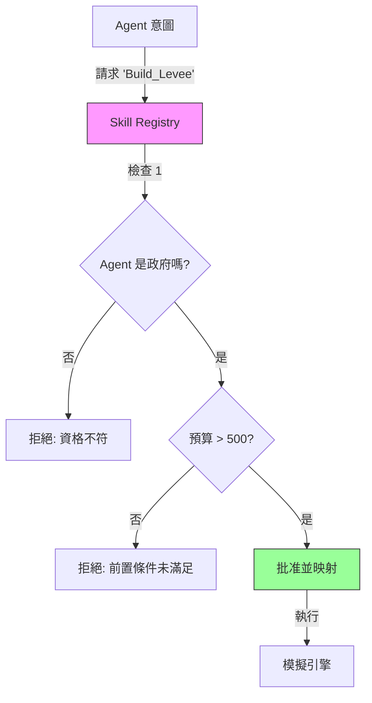

# Skill Registry (技能註冊表 / 行動治理)

**Skill Registry (技能註冊表)** 扮演著系統的 **「制度章程 (Institutional Charter)」**。與簡單的函數映射表不同，它作為一個 **治理層 (Governance Layer)**，負責定義：

1.  **存在性 (Existence)**：環境中物理上可能發生的行動。
2.  **資格 (Eligibility)**：誰被允許執行每個行動 (權限控制)。
3.  **前置條件 (Preconditions)**：執行前必須滿足的狀態 (物理/社會限制)。
4.  **約束 (Constraints)**：與行動綁定的制度規則 (如成本、冷卻時間)。

---

## 1. 核心概念 (Core Concepts)

### 1.1 意圖與執行的分離 (Separation of Intent vs. Execution)

在此框架中，Agent 的「輸出」僅僅是一個 **意圖 (Intent)** (例如字串 `relocate`)。Skill Registry 會在該意圖轉化為實際 **行動 (Action)** 之前，先根據「物理定律」和「社會法律」對其進行驗證。

### 1.2 技能定義 (Skill Definition)

每個技能都是一個結構化的物件，而不僅僅是一個函數指針。

```python
@dataclass
class SkillDefinition:
    skill_id: str
    description: str
    eligible_agent_types: List[str]  # 例如 ["resident", "government"] 或 ["*"]
    preconditions: List[str]         # 例如 ["has_budget", "not is_flooded"]
    institutional_constraints: Dict  # 例如 {"cost": 500, "cooldown": 1}
    allowed_state_changes: List[str] # 允許的副作用白名單
    implementation_mapping: str      # 模擬引擎中的函數名稱
```

---

## 2. 使用流程 (Workflow)



---

## 3. 配置 (YAML)

技能通常從易於閱讀的 `skill_registry.yaml` 文件中加載，這使得模擬的規則透明化，且易於在不修改程式碼的情況下進行編輯。

**`skill_registry.yaml` 範例:**

```yaml
skills:
  - skill_id: "do_nothing"
    description: "本回合不採取任何行動。"
    eligible_agent_types: ["*"]
    implementation_mapping: "pass_turn"

  - skill_id: "relocate"
    description: "永久搬遷到更安全的區域。"
    eligible_agent_types: ["resident"]
    preconditions: ["is_active"]
    institutional_constraints:
      cost: 50
    allowed_state_changes: ["location", "budget"]
    implementation_mapping: "execute_relocation"

  - skill_id: "build_levee"
    description: "建造防洪基礎設施。"
    eligible_agent_types: ["government"]
    preconditions: ["has_budget"]
    implementation_mapping: "construct_infrastructure"
```

---

## 4. API 參考

### `register(skill: SkillDefinition)`

以編程方式向註冊表添加新技能。

### `check_eligibility(skill_id, agent_type)`

- **返回**: `ValidationResult` (布林值 + 錯誤訊息)。
- **邏輯**: 檢查 `agent_type` 是否在 `eligible_agent_types` 列表中 (或者列表包含 `*`)。

### `check_preconditions(skill_id, agent_state)`

- **返回**: `ValidationResult`。
- **邏輯**: 迭代檢查 `preconditions` 列表。
  - `"field"` 要求 `agent_state["field"]` 為真 (Truthy)。
  - `"not field"` 要求 `agent_state["field"]` 為假 (Falsy)。

---

## 5. 角色權限 (Role-Based Permissions)

`RoleEnforcer` (`broker/components/role_permissions.py`) 新增獨立的權限層，驗證每種 Agent 類型的技能與狀態存取：

- **技能權限**：每種 Agent 類型可提出哪些技能（例如僅 `government` 可 `set_subsidy_rate`）
- **狀態讀寫權限**：每種 Agent 類型可讀寫哪些狀態鍵（例如 `insurance` Agent 可寫入 `premium_rate` 但不可寫入 `subsidy_rate`）

此功能補充 Skill Registry 的資格檢查。Registry 驗證「此 Agent 是否_曾_可使用此技能」，RoleEnforcer 驗證「此 Agent 類型在此模擬中是否有_權限_」。

角色由領域模組注入（例如洪水模擬定義 household/government/insurance 角色），非框架硬編碼。

---

## 6. 整合範例

在 **Broker** 中，流程如下所示：

```python
# 1. LLM 提出一個行動
intent = "relocate"

# 2. Broker 諮詢 Registry
if not registry.check_eligibility(intent, agent.type).valid:
    raise ActionError("你不被允許執行此操作。")

if not registry.check_preconditions(intent, agent.state).valid:
    raise ActionError("你現在無法執行此操作 (例如：預算不足/已死亡)。")

# 3. 如果有效，執行映射的函數
func_name = registry.get_execution_mapping(intent)
simulation_engine.call(func_name, agent)
```
