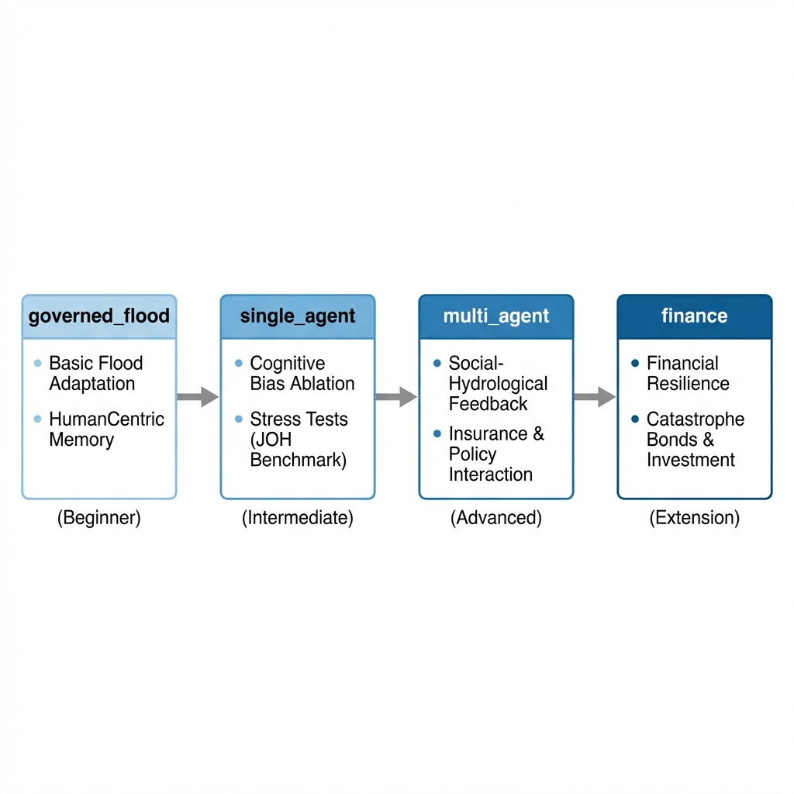

# Examples & Benchmarks

**Language: [English](README.md) | [中文](README_zh.md)**

This directory contains reproduction scripts, experimental configurations, and benchmark results for the Governed Broker Framework.

---

## Learning Path (Recommended Order)

10:
11: 
12:

| #   | Example                                | Complexity   | What You Learn                                                              |
| :-- | :------------------------------------- | :----------- | :-------------------------------------------------------------------------- |
| 1   | **[governed_flood/](governed_flood/)** | Beginner     | Standalone Group C demo — governance + human-centric memory in action       |
| 2   | **[single_agent/](single_agent/)**     | Intermediate | Full JOH Benchmark — Groups A/B/C ablation study, stress tests, survey mode |
| 3   | **[multi_agent/](multi_agent/)**       | Advanced     | Social dynamics — insurance market, government subsidies, peer effects      |
| 4   | **[finance/](finance/)**               | Extension    | Cross-domain demonstration — portfolio decisions under governance           |

---

## Directory Overview

| Directory                              | Agents | Social   | Governance                           | Memory       | Status   |
| :------------------------------------- | :----- | :------- | :----------------------------------- | :----------- | :------- |
| **[governed_flood/](governed_flood/)** | 100    | No       | Strict only                          | HumanCentric | Active   |
| **[single_agent/](single_agent/)**     | 100    | Optional | 3 profiles (strict/relaxed/disabled) | Configurable | Active   |
| **[multi_agent/](multi_agent/)**       | 50+    | Yes      | Advanced                             | Configurable | Active   |
| **[finance/](finance/)**               | 10     | Yes      | Basic                                | Importance   | Demo     |
| **[archive/](archive/)**               | --     | --       | --                                   | --           | Archived |

---

## Quick Start

### 1. Simplest: Governed Flood Demo

The governed_flood example is a self-contained Group C experiment with full governance and human-centric memory. No configuration required.

```bash
python examples/governed_flood/run_experiment.py --model gemma3:4b --years 3 --agents 10
```

### 2. Full Benchmark: Single Agent (JOH Paper)

Replicate the three-group ablation study with 100 agents over 10 years:

```bash
# Group A: Baseline (no governance, no memory)
python examples/single_agent/run_flood.py --model gemma3:4b --years 10 --agents 100 \
    --governance-mode disabled

# Group B: Governance + Window Memory
python examples/single_agent/run_flood.py --model gemma3:4b --years 10 --agents 100 \
    --memory-engine window --governance-mode strict

# Group C: Full Cognitive (HumanCentric + Priority Schema)
python examples/single_agent/run_flood.py --model gemma3:4b --years 10 --agents 100 \
    --memory-engine humancentric --governance-mode strict --use-priority-schema
```

### 3. Multi-Agent: Social Dynamics

Run a multi-agent experiment with household, government, and insurance agents:

```bash
python examples/multi_agent/run_unified_experiment.py --model gemma3:4b
```

### 4. Cross-Domain: Finance

Demonstrate governance in a financial decision-making context:

```bash
python examples/finance/run_finance.py --model gemma3:4b
```

---

## Output Structure

Each experiment produces the following outputs in its `results/` directory:

| File                             | Description                                                         |
| :------------------------------- | :------------------------------------------------------------------ |
| `household_decisions.csv`        | Per-agent, per-year decision log (action, appraisals, reasoning)    |
| `household_governance_audit.csv` | Governance audit trail (interventions, retries, warnings)           |
| `governance_summary.json`        | Aggregate governance statistics (interventions, warnings, outcomes) |
| `audit_summary.json`             | Parse quality metrics (validation errors, warnings)                 |
| `config_snapshot.yaml`           | Full experiment configuration snapshot for reproducibility          |
| `execution.log`                  | Console output log                                                  |

---

## Models

All examples support any Ollama-compatible model. Recommended models for benchmarking:

| Model       | Tag              | Parameters | Notes                                   |
| :---------- | :--------------- | :--------- | :-------------------------------------- |
| Gemma 3     | `gemma3:4b`      | 4B         | Primary benchmark — fast, good parsing  |
| Gemma 3     | `gemma3:12b`     | 12B        | Better reasoning, slower                |
| Gemma 3     | `gemma3:27b`     | 27B        | Best quality, requires significant VRAM |
| Llama 3.2   | `llama3.2:3b`    | 3B         | Lightweight, parsing challenges         |
| DeepSeek R1 | `deepseek-r1:8b` | 8B         | Chain-of-thought reasoning              |

---

## Further Reading

- **[Root README](../README.md)**: Framework overview and architecture
- **[Experiment Design Guide](../docs/guides/experiment_design_guide.md)**: How to design new experiments
- **[Agent Assembly Guide](../docs/guides/agent_assembly.md)**: How to configure cognitive stacking levels
