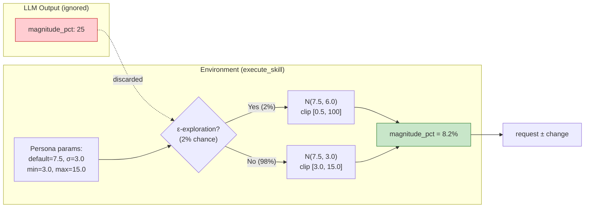

# Irrigation ABM Experiment — Hung & Yang (2021) LLM Adaptation

LLM-driven reproduction of the Colorado River Basin irrigation ABM from Hung & Yang (2021, *Water Resources Research*). 78 agricultural water users make annual demand decisions using language model reasoning instead of Q-learning (FQL).

This experiment demonstrates the SAGE governance middleware applied to a nonstationary water supply system where agents face chronic drought stress over a 42-year planning horizon.

## Dual-Appraisal Framework (WSA / ACA)

Irrigation agents use a **dual-appraisal** framework adapted from the FQL behavioral model in Hung & Yang (2021). Each year, agents assess two independent dimensions before choosing an action:

| Dimension | Construct | Description |
|-----------|-----------|-------------|
| **Threat** | Water Scarcity Assessment (WSA) | Chronic, season-level water supply threat based on drought index, curtailment, and shortage tier |
| **Capacity** | Adaptive Capacity Assessment (ACA) | General seasonal ability to adapt practices based on farm resources and technology status |

The two dimensions are assessed **independently** — governance rules may condition on one or both, but there is no multiplicative interaction. This reflects the continuous, multi-year nature of irrigation demand management (unlike acute, binary threat domains).

**Rating scale**: Both WSA and ACA use a 5-level ordinal scale: VL (Very Low), L (Low), M (Medium), H (High), VH (Very High).

### Theoretical Foundation

WSA/ACA naming and structure derive from Lazarus & Folkman (1984) cognitive appraisal theory:

- **Primary appraisal** (threat evaluation) → WSA: "How severe is the water supply threat?"
- **Secondary appraisal** (coping evaluation) → ACA: "How capable am I of adapting?"

**Important limitation**: WAGF's WSA/ACA are categorical labels (VL/L/M/H/VH), not a full cognitive appraisal process model. We borrow Lazarus & Folkman's construct naming to provide theoretical grounding, but do not claim to fully implement cognitive appraisal theory. The labels serve as governance-legible inputs that enable construct-conditioned rules.

### Why Dual-Appraisal (Not Single Threat)?

The flood ABM uses PMT (Protection Motivation Theory) with a single threat appraisal because flooding is an acute binary event (flood/no flood). Irrigation demand is fundamentally different:

| Dimension | Flood (PMT) | Irrigation (Dual-Appraisal) |
|-----------|------------|---------------------------|
| Threat nature | Acute, binary | Chronic, continuous |
| Decision type | Binary (adopt protection / not) | Continuous (how much to adjust demand) |
| Capacity relevance | Lower (adopt elevation or not) | Critical (can I actually change practices?) |

The dual-appraisal design enables **cross-construct governance rules** — e.g., WSA=VH + ACA=VH → "severe drought but high adaptive capacity → you should decrease, not increase." This logical conjunction is inexpressible in a single-appraisal system.

### Governance Rules Conditioned on Constructs

| Rule | Construct(s) | Logic | Rationale |
|------|-------------|-------|-----------|
| `high_threat_high_cope_no_increase` | WSA ∈ {H,VH} AND ACA ∈ {H,VH} | Block increase | High threat + high capacity = should conserve |
| `low_threat_no_increase` | WSA = VL | Block increase | Near-zero scarcity → no justification for more water |
| `high_threat_no_maintain` | WSA = VH | Warn maintain | Extreme drought → status quo deserves scrutiny |

These three rules triggered **1,250 times** across v20 production (34% of all ERROR triggers), demonstrating that dual-appraisal constructs are a substantive governance mechanism, not decorative metadata.

### Construct Validity (99.2% Coverage)

WSA/ACA valid-label coverage = 99.2% (3,250/3,276 agent-year decisions), indicating gemma3:4b reliably produces 5-level ordinal labels. The 0.8% invalid labels are caught at the governance validation stage.

## Three Pillars

| Pillar | Name | Configuration | Effect |
|--------|------|---------------|--------|
| 1 | **Strict Governance** | Water rights, curtailment caps, efficiency checks | Blocks physically impossible or redundant actions |
| 2 | **Cognitive Memory** | `HumanCentricMemoryEngine` (basic ranking mode) + year-end reflection | Emotional encoding (importance = emotion * source) of droughts and outcomes |
| 3 | **Reflection Loop** | Year-end consolidation with domain-specific guidance questions | Agents reflect on demand strategy effectiveness and form long-term insights |

## Quick Start

```bash
# Smoke test (5 synthetic agents, 5 years)
python run_experiment.py --model gemma3:4b --years 5 --agents 5

# Validation (10 synthetic agents, 10 years)
python run_experiment.py --model gemma3:4b --years 10 --agents 10 --seed 42

# Production (78 real CRSS agents, 42 years — requires ref/CRSS_DB data)
python run_experiment.py --model gemma3:4b --years 42 --real --seed 42 --num-ctx 8192 --num-predict 4096
```

## Production Results (v20, 78 Agents × 42 Years)

### Headline Metrics

| Metric | Value | CRSS Reference |
|--------|-------|----------------|
| Mean demand | 5.87 MAF/yr | 5.86 MAF/yr (1.00×) |
| Steady-state CoV (Y6-42) | 5.3% | Target <10% |
| Within ±10% corridor | 88% (37/42 yr) | — |
| Cold-start mean (Y1-5) | 4.76 MAF | Excluded from steady-state stats |

### Governance Outcomes (3,276 Agent-Year Decisions)

| Outcome | Count | Percentage |
|---------|-------|------------|
| Approved (1st attempt) | 1,236 | 37.7% |
| Retry success | 735 | 22.4% |
| Rejected → maintain_demand | 1,305 | 39.8% |

### Behavioral Diversity (Shannon Entropy)

| Stage | H_norm | Meaning |
|-------|--------|---------|
| Proposed (LLM choice) | 0.74 | Agents express diverse preferences |
| Executed (after governance) | 0.39 | Governance compresses to feasible subset |
| Compression | 47% | Institutional constraint narrowing |

### Interpretation

- **Demand stability**: Steady-state demand (Y6-42) remains within the CRSS ±10% corridor, achieving the same level of collective demand equilibrium as Hung & Yang (2021) FQL, but through governance constraints rather than Q-value convergence.
- **Cold-start transient**: Y1-5 demand drops to ~4.4 MAF (25% below CRSS), reflecting zero-memory initialization. FQL also exhibits early exploration instability, but its Q-values begin updating from Y1, producing a shorter transient.
- **Persistent intervention**: 60% of decisions require governance intervention (retry + rejected). This is not a system deficiency but a structural feature — bounded-rationality LLM agents in chronic drought structurally require external constraint.
- **Cluster differentiation**: Aggressive agents face 43 percentage-point governance compression (propose 60% increase → execute 17%), while Myopic agents face near-zero compression (98% maintain). This preserves the qualitative behavioral ordering from FQL k-means clusters through governance rules rather than individually calibrated penalty sensitivities.
- **Top rule triggers**: demand_ceiling (1,420) > high_threat_no_increase (1,180) > curtailment_awareness (499), showing governance load concentrates on hydrologically meaningful constraints.

## CLI Arguments

| Flag | Default | Description |
|------|---------|-------------|
| `--model` | `gemma3:1b` | Ollama model name |
| `--years` | `5` | Simulation years |
| `--agents` | `5` | Number of agents (synthetic mode) |
| `--workers` | `1` | Parallel LLM workers |
| `--real` | disabled | Use 78 real CRSS agents instead of synthetic |
| `--seed` | `42` | Random seed for reproducibility |
| `--memory-seed` | `42` | Memory engine seed |
| `--window-size` | `5` | Memory window size |
| `--no-magnitude` | disabled | Disable schema-driven magnitude_pct field |
| `--rebalance-clusters` | disabled | Force each behavioral cluster to have at least 15% of agents |
| `--num-ctx` | auto | Ollama context window override |
| `--num-predict` | auto | Ollama max tokens override |
| `--output` | auto-generated | Output directory |

## Behavioral Clusters

Three k-means clusters from Hung & Yang (2021) Section 4.1, mapped from FQL parameters to LLM personas:

| Cluster | FQL mu/sigma | LLM Persona | default | sigma | min | max | Exploration |
|---------|-------------|-------------|---------|-------|-----|-----|-------------|
| **Aggressive** | 0.36/1.22 | Bold, large demand swings | 10.0% | 3.5 | 5.0 | 20.0 | 2% |
| **Forward-looking Conservative** | 0.20/0.60 | Cautious, future-oriented | 7.5% | 3.0 | 3.0 | 15.0 | 2% |
| **Myopic Conservative** | 0.16/0.87 | Tradition-oriented, slow updates | 4.0% | 2.0 | 1.0 | 8.0 | 2% |

Each persona receives a tailored narrative in the prompt template, with cluster-specific language for trust in forecasts, neighbor influence, and adaptation willingness. Magnitude parameters are used for **Bounded Gaussian Sampling** (see below) -- the LLM does not control demand change magnitude.

## Response Format

Agent responses use the **Reasoning Before Rating** pattern — the `reasoning` field is placed first to improve autoregressive generation quality. The format is intentionally limited to **4 fields** (matching the flood ABM pattern) because gemma3:4b collapses nested `{"label", "reason"}` objects when more fields are present.

```
<<<DECISION_START>>>
{
  "reasoning": "Free-text analysis of water situation...",
  "water_scarcity_assessment": {"label": "M", "reason": "Supply is adequate with no shortage declared."},
  "adaptive_capacity_assessment": {"label": "H", "reason": "Strong financial resources and operational flexibility."},
  "decision": "1"
}
<<<DECISION_END>>>
```

**Field definitions** (from `agent_types.yaml → shared.response_format.fields`):

| Field | Type | Required | Description |
|-------|------|----------|-------------|
| `reasoning` | text | Yes | Free-text situational analysis (2-3 sentences) |
| `water_scarcity_assessment` | appraisal | Yes | `WSA_LABEL` (VL/L/M/H/VH) + `WSA_REASON` (one sentence) |
| `adaptive_capacity_assessment` | appraisal | Yes | `ACA_LABEL` (VL/L/M/H/VH) + `ACA_REASON` (one sentence) |
| `decision` | choice | Yes | Numeric skill ID (1–3) |

> **Removed fields (v18)**: `magnitude_pct`, `secondary_decision`, and `secondary_magnitude_pct` were removed from the response format. Magnitude is sampled via Bounded Gaussian at execution time (see below). Multi-skill is disabled. Reducing from 7 to 4 fields fixed WSA/ACA reason generation — gemma3:4b now reliably produces the nested `{"label", "reason"}` format.

### Prompt Structure: Grouped Evaluation Dimensions

The prompt template groups evaluation dimensions explicitly under the construct they map to, ensuring the LLM reasons about each dimension before assigning the label:

```text
First, assess your WATER SUPPLY situation by considering:
- Water Supply Outlook: Is your water supply abundant, adequate, tight, or critically short?
- Demand–Supply Balance: Is your current water request well matched to available supply?
Then rate your water_scarcity_assessment.

Next, assess your ADAPTIVE CAPACITY by considering:
- Capacity to Adjust: How easily could you change your water demand?
- Cost of Change: What would it cost you to adjust your irrigation practices?
- Benefit of Current Path: What is the advantage of keeping current demand unchanged?
Then rate your adaptive_capacity_assessment.
```

This mirrors the flood ABM's PMT-based prompt structure where evaluation dimensions (Perceived Severity, Vulnerability) are explicitly linked to the construct (threat_appraisal) they inform.

## FQL → LLM-ABM Action Space Mapping

This experiment adapts the Fuzzy Q-Learning (FQL) agent decision model from Hung & Yang (2021) to an LLM-driven architecture. The table below summarizes the key structural differences:

| Dimension | FQL (Hung & Yang 2021) | LLM-ABM (This Work) |
|-----------|----------------------|----------------------|
| **Action space** | 2 continuous actions: increase / decrease diversion | 3 discrete skills: increase / decrease / maintain demand |
| **Action magnitude** | Continuous: N(mu, sigma) × bin_size via Q-table | Bounded Gaussian: persona-defined N(default, sigma) at execution time |
| **Decision mechanism** | Epsilon-greedy Q-value ordering | LLM natural-language reasoning with governance validation |
| **State representation** | 21-bin discretized utilisation ratio | Natural-language context (water situation, memory, feedback) |
| **Behavioral heterogeneity** | FQL parameter vectors (mu, sigma, alpha, gamma, epsilon, regret) | Persona narratives + Gaussian magnitude parameters calibrated from FQL clusters |

### Action Space Extension

The original FQL model defines **2 actions** — increase or decrease diversion — with continuous magnitude drawn from N(mu, sigma). The Q-table shape is `(n_preceding=2, n_states=21, n_actions=2)`. The LLM-ABM uses **3 discrete skills** that directly map to these FQL actions plus a natural status-quo extension:

| Skill | FQL Equivalent | Real-World Analog | Rationale |
|-------|---------------|-------------------|-----------|
| `increase_demand` | Action 1 (positive delta) | Expanding irrigated acreage or crop intensity | Direct mapping from FQL increase action |
| `decrease_demand` | Action 0 (negative delta) | Voluntary conservation or reduced crop intensity | Direct mapping from FQL decrease action |
| `maintain_demand` | Implicit (zero-magnitude) | Status quo operations under long-term water service contracts | FQL requires nonzero action every period (Q-learning update rule); "maintain" is the most common real irrigator decision. Also serves as REJECTED fallback |

The 3-skill design matches the FQL 2-action structure (increase/decrease) with the natural extension of a status-quo option, enabling fair comparison between the two approaches. Governance rules differentially constrain action types (e.g., blocking `increase_demand` at allocation cap, blocking `decrease_demand` below demand floor).

### Magnitude Determination: FQL → LLM → Gaussian

The determination of demand change magnitude evolved through three stages:

| Stage | Mechanism | Result |
|-------|-----------|--------|
| **FQL** (Hung & Yang 2021) | N(mu, sigma) × bin_size via Q-table | Continuous, calibrated distribution |
| **LLM v1-v11** (Schema-Driven) | LLM outputs `magnitude_pct` (1-30%) | Degenerate: 56.6% chose 25%, only 6-7 unique values |
| **LLM v12+** (Bounded Gaussian) | Code samples from persona N(default, sigma) | Continuous stochasticity restored, matching FQL distribution |

The v12 design decouples **qualitative choice** (which skill — LLM reasoning) from **quantitative magnitude** (how much — code sampling). This "hybrid agency" reflects a real-world separation: a farmer's strategic decision to invest in drip irrigation is a different cognitive process from the exact percentage of water savings achieved. See [Bounded Gaussian Magnitude Sampling](#bounded-gaussian-magnitude-sampling-v12) for implementation details.

### Fair Comparison Protocol

Direct performance comparison between LLM-ABM and FQL-ABM requires acknowledging structural asymmetries:

**LLM-ABM advantages:**
- Matching action space (3 skills vs. 2 actions + implicit maintain) with semantic labels
- Governance guardrails (11 validators) preventing physically impossible or economically irrational decisions
- Full environmental context in natural language (drought index, shortage tier, Lake Mead level, curtailment ratio); FQL observes only a binary preceding factor

**FQL advantages:**
- Higher exploration rate (5-30% calibrated epsilon vs. 2% for LLM)
- Mathematically exact value learning (TD(0) Q-updates vs. noisy memory retrieval + reflection)
- Joint action-magnitude selection (Q-table directly maps state to optimal magnitude)

**What we are NOT claiming**: This comparison does not claim LLM agents are "better" than FQL agents. The goal is to demonstrate that LLM reasoning can produce *scientifically plausible* water demand trajectories under governance, not to outperform a specifically calibrated RL system. Controlled comparison targets: mean demand within CRSS reference range (5.56-6.45 MAF/yr), CoV < 10%, and qualitatively similar cluster behavioral signatures.

### Results Comparison

| Dimension | FQL (Hung & Yang 2021) | WAGF v20 |
|-----------|----------------------|----------|
| Agents / Period | 78 / 2019-2060 (42yr) | Same |
| Monte Carlo traces | 100 | 1 (seed 42) |
| Demand stabilization | Reward-based self-regulation (regret penalty drives Q-value convergence) | Governance corridor (floor 50% + ceiling 6.0 MAF) |
| Learning | TD(0) Q-value update leading to policy convergence | No convergent learning (memory + reflection only) |
| Mean demand | Ensemble distributions; early-year increases above CRSS | 5.87 MAF/yr (1.00x CRSS) |
| Variability | Ensemble spread; shrinks after prolonged drought | CoV 5.3% (Y6-42) |
| Cluster ordering | Aggressive > Forward-Looking > Myopic (from Q-value convergence) | Same ordering preserved (from governance compression) |
| Explainability | Q-table values (opaque numeric) | Natural language audit trail + InterventionReport |
| Shortage years | 13-30 years depending on adaptation path | 12 years (Tier 1: 5, Tier 2: 2, Tier 3: 5) |

### Core Theoretical Substitution

| FQL Mechanism | WAGF Equivalent | Functional Effect |
|---------------|-----------------|-------------------|
| Negative reward (regret x deviation) | Demand corridor (floor + ceiling) | Prevents both over-conservation and over-extraction |
| Q-value convergence to equilibrium | Static governance rules applied every year | Stable aggregate demand without learning |
| Agent-specific regret parameter | Governance compression differential | Aggressive: 43pp compression; Myopic: 0pp |
| Epsilon-greedy exploration | LLM stochasticity + 2% explicit exploration | Behavioral diversity maintained |

### What WAGF Adds

1. **Natural language reasoning + audit trail**: Each decision includes chain-of-thought, WSA/ACA labels, and a governance audit log (which rules triggered, why, and what alternatives were suggested). FQL produces only Q-values and action indices.
2. **Governance compression as information-theoretic metric**: H_norm 0.74 -> 0.39 (47% compression) quantifies institutional constraint strength. In RL frameworks all actions are inherently valid; this concept has no equivalent.
3. **Domain transfer without algorithm redesign**: The same broker engine transfers from the flood PMT domain to irrigation demand management with only YAML-level configuration changes. FQL requires redesigning the reward function, state discretization, and action space for each new domain.

### What WAGF Loses

1. **No convergence guarantee**: FQL has Q-learning convergence theorems; WAGF depends on governance rule design quality.
2. **39.8% rejection waste**: All FQL actions are inherently valid; WAGF rejects nearly 40% of decisions, falling back to maintain_demand.
3. **Single seed**: FQL reports 100-trace ensemble statistics; WAGF v20 uses only seed 42.
4. **No optimality criterion**: FQL optimizes expected discounted reward; WAGF has no objective function.

## Available Skills

| # | Skill ID | Description | Magnitude (v12+) | Constraints |
|---|----------|-------------|-------------------|-------------|
| 1 | `increase_demand` | Request more water allocation | Gaussian N(default, sigma) per persona | Blocked at allocation cap; blocked during severe drought (>0.7) |
| 2 | `decrease_demand` | Request less water allocation | Gaussian N(default, sigma) per persona | Blocked at min utilisation (10%); blocked below demand floor (50%) |
| 3 | `maintain_demand` | No change to practices | No magnitude change | Default/fallback; blocked when WSA = VH (`zero_escape_check`) |

> **Note on magnitude**: Since v12, demand change magnitude is sampled from a persona-defined Bounded Gaussian at execution time (see below). Since v18, the `magnitude_pct` field has been **removed from the response format entirely** — reducing the JSON schema from 7 to 4 fields fixed WSA/ACA reason generation with gemma3:4b.

### Bounded Gaussian Magnitude Sampling (v12+)

Since v12, the LLM's `magnitude_pct` output is **completely ignored**. Demand change magnitude is instead sampled from a persona-defined Gaussian distribution at execution time. This design choice is motivated by empirical findings:

- v11 analysis showed LLMs produce degenerate magnitude distributions (56.6% chose exactly 25%, only 6-7 unique values)
- Small LLMs cannot generate continuous distributions matching FQL behavior
- Code-based sampling provides true stochasticity matching Hung & Yang (2021)

The sampling pipeline:

```
Agent persona → (default, sigma, min, max, exploration_rate)
  → execute_skill():
      if random() < exploration_rate (2%):
          noise = Normal(0, sigma × 2.0)        ← unbounded exploration
          magnitude = clip(default + noise, 0.5, 100)
      else (98%):
          noise = Normal(0, sigma)               ← bounded exploitation
          magnitude = clip(default + noise, min, max)
  → apply demand change with sampled magnitude
```

The `magnitude_pct` field remains in the response schema as a cognitive signal (the LLM still "reasons" about how much to change), but the actual value applied comes from the Gaussian sampler. `magnitude_cap_check` is therefore set to WARNING level (not ERROR) to avoid wasting governance retries on a field the environment ignores.



Opt-out via `--no-magnitude` to remove the field entirely (reduces context burden for smaller models).

## Governance Rules — Three Rule Types

SAGE governance uses a **priority-ordered rule chain** with three distinct rule types:

```
1. Identity Rules    → Hard physical constraints (always enforced first)
2. Thinking Rules    → Appraisal coherence (evaluated in priority order)
3. Domain Validators → Custom checks (physical, social)
```

When a rule triggers at **ERROR** level, the action is **rejected** and the LLM is re-prompted with the rejection reason (up to 3 governance retries). **WARNING**-level rules log the concern but allow the action to proceed.  Rules within each category are evaluated in the order defined in `agent_types.yaml`; the first ERROR-level violation terminates evaluation.

### Identity Rules (Physical Constraints)

| Rule ID | Precondition | Blocked Skill | Level | Rationale |
|---------|-------------|---------------|-------|-----------|
| `water_right_cap` | `at_allocation_cap` | `increase_demand` | ERROR | Cannot request water beyond legal right allocation |
| `minimum_utilisation_floor` | `below_minimum_utilisation` | `decrease_demand` | ERROR | Cannot reduce demand below 10% of water right |

### Thinking Rules (Behavioral Coherence)

| Rule ID | Construct(s) | Condition | Blocked Skill | Level | Rationale |
|---------|-------------|-----------|---------------|-------|-----------|
| `high_threat_no_maintain` | WSA | WSA = VH | `maintain_demand` | WARNING | Very High water scarcity — consider adapting |
| `low_threat_no_increase` | WSA | WSA in {VL} | `increase_demand` | ERROR | Very low scarcity does not justify requesting more water |
| `high_threat_high_cope_no_increase` | WSA + ACA | WSA in {H, VH} AND ACA in {H, VH} | `increase_demand` | ERROR | High threat + high capacity should conserve, not consume |

### Domain Validators

Custom validators in `validators/irrigation_validators.py` provide physical, social, temporal, and behavioral checks. See [Governance Enhancements (v16)](#governance-enhancements-v16) for the complete 11-validator summary.

### Semantic Rules

Semantic rules are **not yet active** for irrigation because the experiment runs agents independently (no social network). They are relevant for the multi-agent flood domain where agents observe neighbors. Future irrigation extensions with inter-district information sharing would benefit from semantic grounding rules.

## Memory Configuration

The `HumanCentricMemoryEngine` operates in **basic ranking mode**:

| Parameter | Value | Description |
|-----------|-------|-------------|
| `engine_type` | `humancentric` | HumanCentric memory engine |
| `window_size` | 5 | Short-term working memory buffer |
| `top_k_significant` | 2 | Top memories by decayed importance |
| `consolidation_threshold` | 0.6 | Minimum importance for LTM transfer |
| `consolidation_probability` | 0.7 | Stochastic consolidation gate |
| `decay_rate` | 0.1 | Exponential forgetting rate |

### Importance Scoring

```
importance = emotional_weight * source_weight
```

| Emotional Category | Keywords | Weight |
|-------------------|----------|--------|
| `water_crisis` | curtailment, shortage, drought, dry, depleted, crisis | 1.0 |
| `strategic_choice` | decision, increase, decrease, efficiency, conservation | 0.8 |
| `positive_outcome` | sufficient, surplus, saved, adequate, improved | 0.6 |
| `social_feedback` | neighbor, upstream, downstream, compact, agreement | 0.4 |
| `baseline_observation` | (default) | 0.1 |

| Source Category | Patterns | Weight |
|----------------|----------|--------|
| `personal` | "i ", "my ", "me ", "my farm", "my water" | 1.0 |
| `neighbor` | "neighbor", "upstream", "downstream", "adjacent" | 0.8 |
| `basin` | "basin", "compact", "allocation", "bureau" | 0.6 |
| `policy` | "regulation", "policy", "mandate", "restriction" | 0.4 |

### Retrieval

In basic ranking mode, retrieval combines the recent **window** (5 most recent memories) with the **top-k** (2 highest by decayed importance), without weighted scoring.

## Reflection Configuration

| Parameter | Value |
|-----------|-------|
| `interval` | 1 (every year) |
| `batch_size` | 10 agents per batch |
| `importance_boost` | 0.9 |
| `method` | hybrid |

### Guidance Questions

Defined in `agent_types.yaml` under `global_config.reflection.questions`:

1. "Was your water demand strategy effective given the supply conditions?"
2. "Did the magnitude of your demand change match the outcome?"
3. "What patterns do you notice between your actions and supply shortfalls?"

### Action-Outcome Feedback

Each year, agents receive combined memories with magnitude context:
> "Year 5: You chose to decrease_demand by 15%. Outcome: Supply was adequate, utilisation dropped to 65%."

This enables causal learning — agents can correlate demand change magnitudes with supply outcomes across the reflection loop.

## Learning, Memory, and Adaptation

### What Counts as "Learning"?

In RL frameworks, learning = Q-value updates leading to policy convergence (convergence to optimal policy). FQL agents update their Q-table and transition probabilities every year, converging to near-optimal demand levels over hundreds of iterations.

WAGF agents present a more nuanced situation:

| Capability | Present? | Mechanism |
|------------|----------|-----------|
| Episodic memory | Yes | 5-year window + importance-weighted retrieval |
| Action-outcome feedback | Yes | "You chose decrease by 15%, outcome: supply adequate" |
| Annual reflection | Yes | 3 guidance questions producing consolidated insight stored as memory |
| Value function update | No | LLM weights are frozen — no gradient descent |
| Policy convergence | No | No systematic improvement toward optimality |
| Cross-episode optimization | No | No reward signal, no discount factor |

### Reflection is Not RL Learning, but is Not Zero Either

The reflection loop enables agents to:

- **Correlate** actions with outcomes ("I decreased demand last year and supply was adequate")
- **Form narrative insights** ("Conservative strategies work better during prolonged drought")
- **Retrieve relevant precedents** from memory when facing similar conditions

But reflection **cannot**:

- Systematically improve policy (the same "insight" may recur annually without changing behavior)
- Converge to equilibrium (Shannon entropy shows no downward trend: slope=+0.003, p=0.25)
- Substitute for governance constraints (even with 5-year memory, agents are still 39.8% rejected)

### Correct Framing

WAGF agents have **bounded adaptive capacity** — they can recall past experiences, reflect on outcomes, and express pattern recognition in their prompts. But behavioral stability comes primarily from governance constraints, not agent learning. This is a design choice, not a deficiency: under the cognitive limitations of a small LLM (4B parameters), external governance is a more reliable stabilization mechanism than internal learning.

**Analogy with FQL**: FQL internalizes over-extraction costs via the regret penalty in its reward function (internal regulation). WAGF externalizes these constraints via governance rules (external regulation). Both achieve similar collective demand equilibrium at the basin level.

## Economic Hallucination

v4 experiments revealed a novel LLM failure mode: **economic hallucination** — actions that are physically feasible but operationally absurd given quantitative context.

Forward-looking conservative (FLC) agents repeatedly chose `decrease_demand` despite their context showing near-zero utilisation. Persona anchoring ("cautious farmer") overwhelmed numerical awareness, compounding demand to zero over ~30 years.

**Three-layer defense (v6+)**:
1. **MIN_UTIL floor (P0)**: `execute_skill` enforces `max(new_request, water_right * 0.10)` across all reduction skills
2. **Diminishing returns (P1)**: Taper = `(utilisation - 0.10) / 0.90` — reductions shrink smoothly as utilisation approaches 10%
3. **Governance identity rule**: `minimum_utilisation_floor` precondition blocks `decrease_demand` when `below_minimum_utilisation == True`
4. **Builtin validator**: `minimum_utilisation_check()` in `irrigation_validators.py` as final safety net

This extends the hallucination taxonomy beyond physical impossibility (flood domain: re-elevating an already-elevated house) to economic/operational absurdity.

## Simulation Pipeline

### Overview Flow Diagram


### Step-by-Step

```
1. Initialize agents (synthetic or 78 real CRSS agents)
   - Assign behavioral cluster (aggressive/FLC/myopic)
   - Set initial water rights, diversions, efficiency status
2. For each year (1..42):
   a. Pre-Year Hook:
      - advance_year(): precipitation → Lake Mead mass balance → drought index → curtailment
      - Inject basin condition memories
      - Sync physical state flags (at_cap, below_floor, has_efficient)
      - Append action-outcome feedback from prior year
   b. Agent Decision Step (per agent):
      - Retrieve memories (window + top-k significant)
      - Build dual-appraisal prompt with persona context
      - Call LLM → parse response → extract WSA/ACA + decision
      - Validate against governance rules (12 validators, strict profile)
      - APPROVED → execute skill with Gaussian-sampled magnitude
      - ERROR → retry with rejection feedback (up to 3 retries)
      - REJECTED (after retries / EarlyExit) → execute maintain_demand fallback
   c. Skill Execution:
      - Sample magnitude from persona Gaussian N(default, sigma)
      - Apply demand change, enforce floor/cap constraints
      - Update state (request, diversion, efficiency_status)
   d. Post-Step Hook:
      - Record yearly decision, appraisals, sampled magnitude
   e. Post-Year Hook:
      - Trigger batch reflection
      - Save reflection insights to memory
3. Write output files and governance summary
```

## Output Files

```
results/<run_name>/
  simulation_log.csv                     # Year, agent, skill, constructs, magnitude
  irrigation_farmer_governance_audit.csv # Governance interventions
  governance_summary.json                # Aggregate audit stats
  config_snapshot.yaml                   # Reproducibility snapshot
  raw/irrigation_farmer_traces.jsonl     # Full LLM traces
  reflection_log.jsonl                   # Memory consolidation events
```

### Output Interpretation

| File | Key Columns / Fields |
|------|---------------------|
| `simulation_log.csv` | `agent_id`, `year`, `skill`, `WSA_LABEL`, `ACA_LABEL`, `magnitude_pct`, `water_right`, `diversion`, `utilisation` |
| `governance_summary.json` | `total_interventions` = ERROR blocks; `warnings.total_warnings` = WARNING observations; `retry_success` = agent corrected on retry |
| `irrigation_farmer_governance_audit.csv` | `failed_rules` = ERROR rules that blocked; `warning_rules` = WARNING observations |

### Two Retry Mechanisms

1. **Format retries** (up to 2): Triggered when the LLM output cannot be parsed (structural failure).
2. **Governance retries** (up to 3): Triggered when a parsed proposal violates governance rules.

Both are tracked separately in `governance_summary.json`.

## Enhancements (v7 — Group D)

| Feature | Description |
|---------|-------------|
| **Bounded Gaussian Magnitude** | Since v12, magnitude is sampled from persona-defined Gaussian at execution time (not from LLM output). Since v18, `magnitude_pct` removed from response format entirely. |
| **Action-Outcome Feedback** | Agents receive combined "You chose X → outcome Y" memories each year, enabling causal learning through reflection. |
| **Configurable Reflection** | Domain-specific reflection guidance questions defined in `agent_types.yaml` under `global_config.reflection.questions`. |

## Project Structure

```
irrigation_abm/
  run_experiment.py          # Main runner (ExperimentBuilder pipeline)
  irrigation_env.py          # Water system simulation environment
  irrigation_personas.py     # Cluster persona builder + context helpers
  config/
    agent_types.yaml         # Agent config, governance rules, personas
    skill_registry.yaml      # Available irrigation skills
    policies/                # Domain-specific governance policies
    prompts/                 # LLM prompt templates
  validators/
    irrigation_validators.py # 12 custom governance validators
  learning/
    fql.py                   # Reference FQL algorithm (not used by LLM runner)
```

## Water System Model

The irrigation environment uses a **simplified CRSS mass balance model** that captures the core physics of the Colorado River system at annual resolution. Unlike the full CRSS/RiverWare model (monthly, 3,700+ objects), our model reduces the system to a single-reservoir (Lake Mead) annual balance with agent-demand feedback.

### Model Scope and Limitations

This experiment does **not** replicate the full CRSS/RiverWare simulation. The Colorado River Simulation System (CRSS) is a monthly, multi-reservoir operations model with 3,700+ objects maintained by the U.S. Bureau of Reclamation, requiring a proprietary RiverWare license. Our model is a **surrogate mass balance model** at the same abstraction level as Hung & Yang (2021), which also employs a reduced-form model using CRSS database inputs rather than running the full RiverWare simulation.

**What our surrogate model captures:**

- **Bidirectional agent-reservoir coupling** — the core mechanism absent from standard CRSS, which uses exogenous demand schedules. Agent demand directly affects Lake Mead storage, which determines shortage tiers and curtailment, feeding back to constrain agent diversions.
- **USBR operating rules** — shortage tiers (1075/1050/1025 ft), curtailment ratios (5%/10%/20%), and Mexico DCP reductions (Minute 323, 5 elevation tiers) follow published Drought Contingency Plan parameters.
- **Real CRSS PRISM precipitation data** — same climate forcing dataset (2017-2060) used by the Bureau of Reclamation.
- **Physical constraints** — Powell minimum release (7.0 MAF/yr DCP floor), Upper Basin infrastructure ceiling (5.0 MAF/yr), Glen Canyon Dam buffering (±3.5 MAF/yr), and USBR storage-elevation curves.

**What our model omits (relative to full CRSS):**

- Monthly temporal resolution (we use annual time steps)
- Multi-reservoir operations (Powell, Flaming Gorge, Blue Mesa are not independently modeled)
- Detailed hydrologic routing between nodes
- Return flows and groundwater interactions
- Full Long-Range Operating Criteria (LROC) logic
- Prior appropriation doctrine (all agents face uniform curtailment)

**Why this simplification is sufficient:** Our study examines how *governance rules affect collective demand adaptation trajectories* over 42 years. The critical mechanism is the agent-reservoir feedback loop, which is fully preserved in our annual mass balance model. Monthly resolution and multi-reservoir routing would add computational complexity without changing the fundamental dynamics of agent adaptation, which operates at annual decision cycles.

### Design Philosophy

The model preserves three critical features of the real Colorado River system:

1. **Agent-Reservoir Feedback Loop**: Agent demand directly affects Lake Mead storage, which determines shortage tiers and curtailment ratios, which in turn constrain agent diversions. This bidirectional coupling is the core mechanism studied in Hung & Yang (2021).
2. **USBR Operating Rules**: Shortage tiers, curtailment ratios, and Mexico treaty delivery reductions follow the Drought Contingency Plan (DCP) and Interim Guidelines.
3. **Real Precipitation Data**: Winter precipitation is sourced from CRSS PRISM projections (`PrismWinterPrecip_ST_NOAA_Future.csv`), not synthetic data.

### Data Sources

| Data | Source | File |
|------|--------|------|
| Winter precipitation (2017-2060) | CRSS/PRISM NOAA projection | `ref/CRSS_DB/CRSS_DB/HistoricalData/PrismWinterPrecip_ST_NOAA_Future.csv` |
| Agent water rights (78 agents) | CRSS annual baseline time series | `ref/CRSS_DB/CRSS_DB/annual_baseline_time_series.csv` |
| Lake Mead storage-elevation curve | USBR area-capacity tables | Hardcoded in `irrigation_env.py` (`_STORAGE_MAF`, `_ELEVATION_FT`) |
| Initial Lake Mead elevation | USBR observed (Dec 2018) | 1081.46 ft |

### Annual Cycle

Each simulation year executes in this order:

```
advance_year()
  ├─ 1. _generate_precipitation()          ← CRSS PRISM data (UB 7-state average)
  ├─ 2. _generate_lake_mead_level()        ← Mass balance (see below)
  ├─ 3. _update_preceding_factors()        ← Binary: did precip/Mead rise?
  ├─ 4. _compute_drought_index()           ← Composite severity index
  └─ 5. _apply_curtailment()               ← Shortage tier → curtailment ratio
```

### Lake Mead Mass Balance

The model computes Lake Mead elevation via a simplified annual mass balance:

```
Inflow:
  NaturalFlow    = 12.0 MAF × (precip / 100mm)    [clamped to 6-17 MAF]
  UB_effective   = min(UB_diversions, NF - MinPowellRelease, UB_InfraCap)
  PowellRelease  = NaturalFlow - UB_effective       [≥ 7.0 MAF DCP floor]
  Mead_inflow    = PowellRelease + LB_tributaries   [1.0 MAF]

Outflow:
  LB_diversions  = Σ agent_diversion (lower basin)
  Mexico         = 1.5 MAF - DCP_reduction(tier)    [Minute 323]
  Evaporation    = 0.8 MAF × storage_fraction       [surface area proxy]
  Municipal      = 5.0 MAF                          [M&I + tribal + CAP + losses]

Balance:
  Δstorage       = clamp(inflow - outflow, ±3.5 MAF)  [Glen Canyon buffering]
  Storage(t+1)   = Storage(t) + Δstorage              [bounded: 2.0-26.1 MAF]
  Elevation      = interp(Storage, USBR_curve)
```

### Key Parameters

| Parameter | Value | Source |
|-----------|-------|--------|
| Natural flow baseline | 12.0 MAF/yr | CRSS historical average |
| Precipitation baseline | 100.0 mm | CRSS UB winter average |
| Min Powell release | 7.0 MAF/yr | USBR DCP floor (2019 agreement) |
| UB infrastructure ceiling | 5.0 MAF/yr | Historical UB depletion capacity |
| LB tributary inflow | 1.0 MAF/yr | Virgin River + Little Colorado + Bill Williams |
| LB municipal/M&I | 5.0 MAF/yr | CAP + Southern Nevada + MWD + system losses |
| Mexico treaty delivery | 1.5 MAF/yr | 1944 Treaty (before DCP reductions) |
| Reservoir evaporation | 0.8 MAF/yr | At reference storage (13.0 MAF) |
| Max annual storage change | ±3.5 MAF | Glen Canyon Dam operational buffering |
| Initial elevation | 1081.46 ft | USBR observed December 2018 |

### Mexico DCP Reductions (Minute 323)

When Lake Mead elevation drops, Mexico voluntarily reduces delivery under Minute 323:

| Mead Elevation | Mexico Reduction | Effective Delivery |
|---------------|-----------------|-------------------|
| ≥ 1090 ft | 0 | 1.500 MAF |
| 1075-1090 ft | 0.041 MAF | 1.459 MAF |
| 1050-1075 ft | 0.080 MAF | 1.420 MAF |
| 1025-1050 ft | 0.104 MAF | 1.396 MAF |
| < 1025 ft | 0.275 MAF | 1.225 MAF |

### Drought Index

Composite severity index in [0, 1] combining precipitation and reservoir signals:

```
precip_norm = clamp(1.0 - precip / (2 × baseline), 0, 1)
mead_norm   = clamp(1.0 - (mead_level - 900) / 320, 0, 1)
drought_index = 0.5 × precip_norm + 0.5 × mead_norm
```

| Drought Index | Classification | Agent Prompt Text |
|--------------|----------------|-------------------|
| < 0.2 | Normal | "Water supply conditions are normal" |
| 0.2-0.5 | Mild drought | "Mild drought conditions" |
| 0.5-0.8 | Moderate drought | "Moderate drought — water supply is significantly reduced" |
| > 0.8 | Severe drought | "Severe drought — water availability is critically low" |

### Shortage Tier and Curtailment

Based on USBR Drought Contingency Plan (DCP) operating rules:

| Mead Elevation | Shortage Tier | Curtailment Ratio | Governance Effect |
|---------------|--------------|-------------------|-------------------|
| ≥ 1075 ft | 0 (Normal) | 0% | WARNING only |
| 1050-1075 ft | 1 | 5% | WARNING only |
| 1025-1050 ft | 2 | 10% | ERROR: blocks `increase_demand` |
| < 1025 ft | 3 | 20% | ERROR: blocks `increase_demand` |

Curtailment applies uniformly to all agents:
```
diversion = request × (1 - curtailment_ratio)
```

### Agent-Reservoir Feedback Loop

```
Agent decisions (Year t)
    ↓
request changes (increase/decrease/maintain)
    ↓
update_agent_request() → new diversions
    ↓
advance_year() (Year t+1)
    ↓
_generate_lake_mead_level()
    ├─ UB_diversions = Σ agent.diversion (upper basin)
    ├─ LB_diversions = Σ agent.diversion (lower basin)
    ├─ Powell release = NF - UB_effective
    └─ Mead storage → elevation → shortage tier → curtailment
    ↓
_apply_curtailment()
    ↓
agent.diversion = request × (1 - curtailment_ratio)
    ↓
Next year's prompt: "Your allocation is curtailed by X%"
```

**Implication**: When agents collectively reduce demand → Lake Mead storage recovers → shortage tier drops → curtailment decreases → agents receive more water. This self-regulating mechanism is the core dynamic that the governance system must preserve.

### Comparison with Full CRSS/RiverWare

| Aspect | Our Model | Full CRSS |
|--------|-----------|-----------|
| Temporal resolution | Annual | Monthly |
| Spatial resolution | 2 basins (UB/LB) | 3,700+ objects |
| Reservoir model | Single (Mead) | Powell + Mead + Flaming Gorge + ... |
| Operating rules | Simplified DCP | Full LROC + DCP + Minute 323 |
| Demand model | 78 LLM agents | Exogenous demand schedules |
| Precipitation | CRSS PRISM (real) | CRSS PRISM (same source) |
| Natural flow | Scaled by precip | Full hydrologic routing |
| Agent feedback | Bidirectional ✓ | None (exogenous demand) |

**Key advantage of our approach**: The bidirectional coupling (agent demand ↔ reservoir state) enables studying how governance rules affect collective demand trajectories — something the standard CRSS cannot do because it uses fixed exogenous demand schedules.

## Governance Enhancements (v16)

The governance system has been iteratively calibrated through pilot experiments:

### Suggestion Bias Correction

All ERROR-level validators now use **neutral suggestion phrasing** that lists `maintain_demand` first:

```
Before: "Choose decrease_demand or adopt_efficiency instead."
After:  "Valid alternatives: maintain_demand, decrease_demand."
```

**Rationale**: Small LLMs (gemma3:4b) treat governance suggestions as directives. Biased suggestions caused universal decrease adoption (demand collapse to 69% of CRSS target). Neutral phrasing restored demand stability.

### Demand Corridor: Floor, Ceiling, and Design Rationale

The demand corridor is the primary stabilization mechanism, bounding agent demand between a per-agent floor and a basin-wide ceiling:

```text
10%  <- hard floor (minimum_utilisation_check: economic hallucination defense)
50%  <- stability floor (demand_floor_stabilizer: prevents over-conservation collapse)
~~~~ <- agent freedom zone ~~~~
6.0 MAF <- basin ceiling (demand_ceiling_stabilizer: prevents collective overshoot)
100% <- water right cap (per-agent legal limit)
```

**Why Floor (50% of water_right)?**

Problem discovered in v14 production (78 agents x 5yr): demand collapsed to 69% of CRSS target (CoV 27.4%).

Root causes:

- Suggestion bias: All ERROR-level suggestions recommended "choose decrease", and small LLMs treated suggestions as directives
- Persona anchoring: Forward-looking conservative agents repeatedly chose decrease even near zero utilisation

Calibration evidence:

| Floor ratio | Mean (MAF) | CoV | Rejected % |
|-------------|-----------|------|------------|
| 60% | 5.35 | 4.2% | 80% |
| **50%** | **5.31** | **4.6%** | **76%** |
| 40% | 5.03 | 9.7% | 73% |

Selected 50%: CoV < 10% with lowest rejection rate (maximum agent autonomy).

Theoretical justification: Real-world irrigation districts have minimum delivery obligations and long-term service contracts. Farmers cannot reduce demand below half their water right and still maintain agricultural operations. This is functionally equivalent to FQL's "penalty for under-utilization" (the regret parameter penalizes unmet demand).

**Why Ceiling (6.0 MAF basin total)?**

Problem discovered in v19 production (78 agents x 42yr): demand overshot to 6.60 MAF (+12.6% above CRSS), with 65% of years exceeding the 6.45 MAF upper corridor bound.

Root cause: Tier 0 (normal operations) accounts for 54% of simulation years, and no validator blocks increases during normal conditions. Aggressive agents (86% of the population) ramp demand freely.

Why 6.0 MAF specifically: CRSS baseline mean = 5.86 MAF, so 6.0 MAF = 1.024x (2.4% buffer). The CRSS success range is 5.56-6.45 MAF, placing 6.0 MAF in the upper-center of the corridor. This is wide enough for agents to make small increases in good years but prevents collective overshoot.

Theoretical justification: FQL agents self-regulate over-demand via the reward function's regret penalty (Q-values converge away from excessive extraction). WAGF agents have no reward function, so external governance provides the equivalent constraint. This aligns with Ostrom's (1990) "rules-in-use" framework: the demand ceiling is an operational rule that bounds the feasible action space.

**No Double-Bind Guarantee**

| Scenario | Floor | Ceiling | Available actions |
|----------|-------|---------|-------------------|
| Normal demand (50-100% util, <6.0 MAF) | -- | -- | All 5 skills |
| Low demand (<50% util) | Blocks decrease | -- | increase, maintain |
| High basin demand (>6.0 MAF) | -- | Blocks increase | maintain, decrease |
| Low demand + High basin (rare) | Blocks decrease | Blocks increase | maintain only |

In every scenario, at least `maintain_demand` remains available — no all-skills-blocked trap.

### REJECTED Outcome Handling

REJECTED agents now execute `maintain_demand` as fallback (instead of no-op), preserving their request and recalculating diversion with current curtailment.

### Complete Validator Summary (12 validators)

| # | Validator | Blocks | Level | Category |
|---|-----------|--------|-------|----------|
| 1 | `water_right_cap_check` | increase (at cap) | ERROR | Physical |
| 2 | `non_negative_diversion_check` | decrease (diversion=0) | ERROR/WARNING | Physical |
| 3 | `minimum_utilisation_check` | decrease (<10%) | ERROR | Physical |
| 4 | `demand_floor_stabilizer` | decrease (<50%) | ERROR | Economic |
| 5 | `demand_ceiling_stabilizer` | increase (basin >6.0 MAF) | ERROR | Economic |
| 6 | `drought_severity_check` | increase (drought>0.7) | ERROR | Physical |
| 7 | `magnitude_cap_check` | increase (exceeds cap) | WARNING | Physical |
| 8 | `supply_gap_block_increase` | increase (fulfil<70%) | ERROR | Physical |
| 9 | `curtailment_awareness_check` | increase (Tier 2+) | ERROR | Social |
| 10 | `compact_allocation_check` | increase (basin>Compact) | WARNING | Social |
| 11 | `consecutive_increase_cap_check` | increase (3yr streak) | ERROR | Temporal |
| 12 | `zero_escape_check` | maintain (<15%) | ERROR | Behavioral |

## Colorado River Basin Parameters

| Parameter | Value |
|-----------|-------|
| Total Compact allocation | 16,500,000 acre-ft/year |
| Upper Basin share | 7,500,000 acre-ft/year |
| Lower Basin share | 7,500,000 acre-ft/year |
| Mexico share | 1,500,000 acre-ft/year |
| Simulation period | 2019-2060 |
| Historical baseline | 1971-2018 |
| Monte Carlo runs | 100 |

## Assumptions and Simplifications

This section documents key modeling assumptions to support transparent scientific evaluation.

### Agent Behavior

- **No inter-agent communication**: Irrigation agents operate independently with no social network or information sharing. Each agent observes only basin-level signals (drought index, shortage tier) and their own allocation history.
- **Annual decision frequency**: Agents make one demand decision per year. Sub-annual (seasonal, monthly) adjustments are not modeled.
- **Homogeneous curtailment**: All agents within a basin face the same curtailment ratio, regardless of water right seniority. The prior appropriation doctrine is not modeled.
- **Fixed persona**: Behavioral cluster assignment (aggressive/conservative/myopic) is fixed at initialization and does not change during the simulation. The LLM's "personality" cannot drift between clusters.

### Water System

- **Single-reservoir model**: Only Lake Mead is modeled explicitly. Lake Powell and upper-basin reservoirs are represented implicitly through the minimum Powell release constraint (7.0 MAF/yr).
- **Annual resolution**: Monthly variations in demand, inflow, and operations are averaged to annual values.
- **Static non-agricultural demand**: Municipal, industrial, and tribal water use (5.0 MAF/yr) is held constant throughout the simulation.
- **No groundwater**: Groundwater pumping and aquifer dynamics are not modeled. All water supply comes from surface water (Colorado River system).

### LLM-Specific

- **Magnitude-reasoning decoupling**: The LLM reasons about magnitude (cognitive scaffold) but does not control it. Actual magnitude is Gaussian-sampled. Only action direction (which skill) affects simulation outcomes.
- **Model-dependent behavior**: Results are specific to the LLM used (default: gemma3:4b). Different model families or sizes may produce different behavioral distributions.
- **Governance as hard constraint**: ERROR-level governance rules cannot be overridden by the LLM. This is a design choice that prioritizes physical consistency over agent autonomy.

## Data Availability

| Dataset | Access | Path |
|---------|--------|------|
| CRSS PRISM winter precipitation (2017-2060) | Included in repository | `ref/CRSS_DB/CRSS_DB/HistoricalData/PrismWinterPrecip_ST_NOAA_Future.csv` |
| Agent water rights (78 agents) | Included in repository | `ref/CRSS_DB/CRSS_DB/annual_baseline_time_series.csv` |
| Historical UB depletion (2018 baseline) | Included in repository | `ref/CRSS_DB/CRSS_DB/HistoricalData/UB_historical_annual_depletion.csv` |
| Historical LB diversion (2018 baseline) | Included in repository | `ref/CRSS_DB/CRSS_DB/HistoricalData/LB_historical_annual_diversion.csv` |
| Lake Mead storage-elevation curve | USBR area-capacity tables | Hardcoded in `irrigation_env.py` (`_STORAGE_MAF`, `_ELEVATION_FT`) |
| FQL calibrated parameters | Hung & Yang (2021) | Embedded in `config/agent_types.yaml` under `fql_reference` |

All data required for the `--real` mode (78 CRSS agents) is included in the repository under `ref/CRSS_DB/`. Synthetic mode (`--agents N`) generates random agents and requires no external data.

**Reproducibility**: All production runs use `--seed 42`. The `config_snapshot.yaml` saved in each output directory captures the complete configuration for exact replication.

## Reference

Hung, F., & Yang, Y. C. E. (2021). Assessing adaptive irrigation impacts on water scarcity in nonstationary environments -- A multi-agent reinforcement learning approach. *Water Resources Research*, 57, e2020WR029262. https://doi.org/10.1029/2020WR029262
