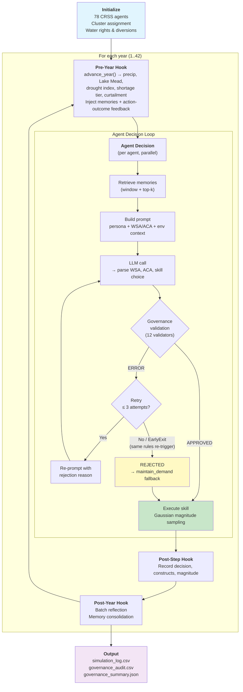

# Irrigation ABM — WAGF Adaptation of Hung & Yang (2021)

LLM-driven reproduction of the Colorado River Basin irrigation ABM from Hung & Yang (2021, *Water Resources Research*). 78 agricultural water users make annual demand decisions using natural-language reasoning — guided by governance rules and episodic memory — instead of Fuzzy Q-Learning (FQL).

**Key terms**: CRSS (Colorado River Simulation System), MAF (million acre-feet), AF (acre-feet), DCP (Drought Contingency Plan), USBR (U.S. Bureau of Reclamation).

---

## 1. Quick Start

```bash
# Smoke test (5 synthetic agents, 5 years)
python run_experiment.py --model gemma3:4b --years 5 --agents 5

# Validation (10 synthetic agents, 10 years)
python run_experiment.py --model gemma3:4b --years 10 --agents 10 --seed 42

# Production (78 real CRSS agents, 42 years — requires ref/CRSS_DB data)
python run_experiment.py --model gemma3:4b --years 42 --real --seed 42 --num-ctx 8192 --num-predict 4096
```

### Key CLI Flags

| Flag | Default | Description |
| :--- | :------ | :---------- |
| `--model` | `gemma3:1b` | Ollama model name |
| `--years` | `5` | Simulation years |
| `--agents` | `5` | Number of agents (synthetic mode) |
| `--real` | disabled | Use 78 real CRSS agents instead of synthetic |
| `--seed` | `42` | Random seed for reproducibility |
| `--workers` | `1` | Parallel LLM workers |

Run `python run_experiment.py --help` for all flags (memory, magnitude, context window, etc.).

### Project Structure

```text
irrigation_abm/
  run_experiment.py          # Main runner (ExperimentBuilder pipeline)
  irrigation_env.py          # Water system simulation environment
  irrigation_personas.py     # Cluster persona builder + context helpers
  config/
    agent_types.yaml         # Agent config, governance rules, personas
    skill_registry.yaml      # Available irrigation skills
    policies/                # Domain-specific governance policies
    prompts/                 # LLM prompt templates
  validators/
    irrigation_validators.py # 12 custom governance validators
  learning/
    fql.py                   # Reference FQL algorithm (not used by LLM runner)
```

### Output Files

```text
results/<run_name>/
  simulation_log.csv                     # Year, agent, skill, constructs, magnitude
  irrigation_farmer_governance_audit.csv # Governance interventions
  governance_summary.json                # Aggregate audit stats
  config_snapshot.yaml                   # Reproducibility snapshot
  raw/irrigation_farmer_traces.jsonl     # Full LLM traces
  reflection_log.jsonl                   # Memory consolidation events
```

---

## 2. Production Results (v20)

**Experiment**: 78 agents × 42 years, gemma3:4b, strict governance, seed 42.

| Metric | Value | CRSS Reference |
| :----- | :---- | :------------- |
| Mean demand | 5.87 MAF/yr | 5.86 MAF/yr (1.00×) |
| Steady-state CoV (Y6-42) | 5.3% | Target <10% |
| Within ±10% corridor | 88% (37/42 yr) | — |

### Governance Outcomes (3,276 decisions)

| Outcome | Count | Percentage |
| :------ | ----: | ---------: |
| Approved (1st attempt) | 1,236 | 37.7% |
| Retry success | 735 | 22.4% |
| Rejected → maintain_demand | 1,305 | 39.8% |

### Behavioral Diversity

| Stage | H_norm | Meaning |
| :---- | -----: | :------ |
| Proposed (LLM choice) | 0.74 | Agents express diverse preferences |
| Executed (after governance) | 0.39 | Governance compresses to feasible subset |

---

## 3. System Architecture

| Pillar | Name | Effect |
| :----- | :--- | :----- |
| 1 | **Strict Governance** | 12 validators block physically impossible or redundant actions |
| 2 | **Cognitive Memory** | `HumanCentricMemoryEngine` (basic ranking mode) + year-end reflection |
| 3 | **Reflection Loop** | Year-end consolidation with domain-specific guidance questions |



---

## 4. Water System Model

Simplified CRSS mass balance at annual resolution (same abstraction as Hung & Yang 2021). **[Full equations and derivations](docs/irrigation_physics.md)**.

### Key Parameters

| Parameter | Value | Source |
| :-------- | :---- | :----- |
| Natural flow baseline | 12.0 MAF/yr | CRSS historical average |
| Min Powell release | 7.0 MAF/yr | USBR DCP floor (2019) |
| UB infrastructure ceiling | 5.0 MAF/yr | Historical UB depletion capacity |
| Mexico treaty delivery | 1.5 MAF/yr | 1944 Treaty (before DCP reductions) |
| Initial elevation | 1081.46 ft | USBR observed December 2018 |
| Simulation period | 2019-2060 | Following Hung & Yang (2021) |

### Shortage Tiers

| Mead Elevation | Tier | Curtailment | Governance Effect |
| :------------- | :--- | :---------- | :---------------- |
| ≥ 1075 ft | 0 (Normal) | 0% | WARNING only |
| 1050-1075 ft | 1 | 5% | WARNING only |
| 1025-1050 ft | 2 | 10% | ERROR: blocks increase |
| < 1025 ft | 3 | 20% | ERROR: blocks increase |

---

## 5. Agent Design

### Behavioral Clusters

Three k-means clusters from Hung & Yang (2021), mapped from FQL parameters to LLM personas:

| Cluster | N (of 78) | LLM Persona | Magnitude default |
| :------ | --------: | :---------- | ----------------: |
| **Aggressive** | 67 | Bold, large demand swings | 10.0% |
| **Forward-Looking Conservative** | 5 | Cautious, future-oriented | 7.5% |
| **Myopic Conservative** | 6 | Tradition-oriented, slow updates | 4.0% |

### Action Space (5 Skills)

| Skill | Real-World Analog |
| :---- | :---------------- |
| `increase_large` | Major acreage expansion |
| `increase_small` | Marginal crop intensity increase |
| `maintain_demand` | Status quo under long-term contracts |
| `decrease_small` | Minor conservation adjustments |
| `decrease_large` | Fallowing fields, crop switching |

The LLM chooses the skill (qualitative direction); actual magnitude is sampled from persona-scaled Gaussian distributions at execution time (quantitative).

---

## 6. Governance System

12 validators in a priority-ordered rule chain. ERROR-level violations reject the action and re-prompt (up to 3 retries). WARNING-level rules log but allow.

| # | Validator | Blocks | Level | Category |
| - | :-------- | :----- | :---- | :------- |
| 1 | `water_right_cap_check` | increase (at cap) | ERROR | Physical |
| 2 | `non_negative_diversion_check` | decrease (diversion=0) | ERROR/WARN | Physical |
| 3 | `minimum_utilisation_check` | decrease (<10%) | ERROR | Physical |
| 4 | `demand_floor_stabilizer` | decrease (<50%) | ERROR | Economic |
| 5 | `demand_ceiling_stabilizer` | increase (basin >6.0 MAF) | ERROR | Economic |
| 6 | `drought_severity_check` | increase (drought>0.7) | ERROR | Physical |
| 7 | `magnitude_cap_check` | increase (exceeds cap) | WARNING | Physical |
| 8 | `supply_gap_block_increase` | increase (fulfil<70%) | ERROR | Physical |
| 9 | `curtailment_awareness_check` | increase (Tier 2+) | ERROR | Social |
| 10 | `compact_allocation_check` | increase (basin>Compact) | WARNING | Social |
| 11 | `consecutive_increase_cap_check` | increase (3yr streak) | ERROR | Temporal |
| 12 | `zero_escape_check` | maintain (<15% util) | ERROR | Behavioral |

---

## 7. Assumptions and Simplifications

**Agent behavior**: No inter-agent communication; annual decision frequency; homogeneous curtailment (no prior appropriation doctrine); fixed persona assignment throughout simulation.

**Water system**: Single-reservoir model (Lake Mead only; Powell implicit via 7.0 MAF/yr minimum release); annual resolution; static non-agricultural demand (5.0 MAF/yr for CAP, MWD, and other M&I uses); no groundwater.

**LLM-specific**: Magnitude-reasoning decoupling (LLM chooses skill direction, not magnitude); results specific to gemma3:4b; ERROR-level governance cannot be overridden.

---

## 8. Data Availability

All data for `--real` mode (78 CRSS agents) is included in `ref/CRSS_DB/`:

- **Precipitation**: `HistoricalData/PrismWinterPrecip_ST_NOAA_Future.csv` (CRSS/NOAA PRISM, 2017-2060)
- **Agent water rights**: `annual_baseline_time_series.csv` (78 agents)
- **Elevation curves**: Hardcoded in `irrigation_env.py` (USBR 2009 area-capacity survey)

Synthetic mode requires no external data. Reproducibility: all production runs use `--seed 42`; config captured in `config_snapshot.yaml`.

---

## 9. References

Hung, F., & Yang, Y. C. E. (2021). Assessing adaptive irrigation impacts on water scarcity in nonstationary environments — A multi-agent reinforcement learning approach. *Water Resources Research*, 57, e2020WR029262. <https://doi.org/10.1029/2020WR029262>

Lazarus, R. S., & Folkman, S. (1984). *Stress, Appraisal, and Coping*. Springer.

Ostrom, E. (1990). *Governing the Commons: The Evolution of Institutions for Collective Action*. Cambridge University Press.
