# Irrigation ABM — Governed LLM Adaptation of Hung & Yang (2021)

LLM-driven reproduction of the Colorado River Basin irrigation ABM from Hung & Yang (2021, *Water Resources Research*). 78 agricultural water users make annual demand decisions using language model reasoning instead of Q-learning (FQL).

This experiment demonstrates the WAGF governance middleware applied to a nonstationary water supply system where agents face chronic drought stress over a 42-year planning horizon (2019-2060).

## Table of Contents

- [1. Introduction](#1-introduction)
- [2. Quick Start](#2-quick-start)
  - [2.1 CLI Examples](#21-cli-examples)
  - [2.2 CLI Arguments](#22-cli-arguments)
  - [2.3 Project Structure](#23-project-structure)
  - [2.4 Output Files](#24-output-files)
- [3. System Architecture](#3-system-architecture)
  - [3.1 Three Pillars](#31-three-pillars)
  - [3.2 Simulation Pipeline](#32-simulation-pipeline)
  - [3.3 Architecture Diagram](#33-architecture-diagram)
- [4. Water System Model](#4-water-system-model)
  - [4.1 Model Scope](#41-model-scope)
  - [4.2 Mass Balance Equation](#42-mass-balance-equation)
  - [4.3 Key Parameters](#43-key-parameters)
  - [4.4 Data Sources](#44-data-sources)
  - [4.5 Drought Index](#45-drought-index)
  - [4.6 Shortage Tiers and Curtailment](#46-shortage-tiers-and-curtailment)
  - [4.7 Mexico DCP Reductions](#47-mexico-dcp-reductions)
  - [4.8 Agent-Reservoir Feedback Loop](#48-agent-reservoir-feedback-loop)
  - [4.9 Comparison with Full CRSS](#49-comparison-with-full-crss)
- [5. Agent Design](#5-agent-design)
  - [5.1 Behavioral Clusters](#51-behavioral-clusters)
  - [5.2 Action Space (5-Skill)](#52-action-space-5-skill)
  - [5.3 Bounded Gaussian Magnitude Sampling](#53-bounded-gaussian-magnitude-sampling)
  - [5.4 Cognitive Appraisal Constructs (WSA/ACA)](#54-cognitive-appraisal-constructs-wsaaca)
  - [5.5 Response Format and Prompt Design](#55-response-format-and-prompt-design)
  - [5.6 Memory and Retrieval](#56-memory-and-retrieval)
  - [5.7 Reflection](#57-reflection)
  - [5.8 Learning, Memory, and Adaptation](#58-learning-memory-and-adaptation)
- [6. Governance System](#6-governance-system)
  - [6.1 Rule Type Hierarchy](#61-rule-type-hierarchy)
  - [6.2 Complete Validator Summary (12)](#62-complete-validator-summary-12)
  - [6.3 Demand Corridor (Floor + Ceiling)](#63-demand-corridor-floor--ceiling)
  - [6.4 Construct-Conditioned Rules](#64-construct-conditioned-rules)
  - [6.5 Suggestion Bias Correction](#65-suggestion-bias-correction)
  - [6.6 REJECTED Outcome Handling](#66-rejected-outcome-handling)
  - [6.7 Economic Hallucination Defense](#67-economic-hallucination-defense)
- [7. Production Results](#7-production-results)
  - [7.1 Headline Metrics](#71-headline-metrics)
  - [7.2 Governance Outcomes](#72-governance-outcomes)
  - [7.3 Behavioral Diversity](#73-behavioral-diversity)
  - [7.4 Interpretation](#74-interpretation)
- [8. Comparison with FQL (Hung & Yang 2021)](#8-comparison-with-fql-hung--yang-2021)
  - [8.1 Action Space Mapping](#81-action-space-mapping)
  - [8.2 Results Comparison](#82-results-comparison)
  - [8.3 Core Theoretical Substitution](#83-core-theoretical-substitution)
  - [8.4 What WAGF Adds / Loses](#84-what-wagf-adds--loses)
  - [8.5 Fair Comparison Protocol](#85-fair-comparison-protocol)
- [9. Assumptions and Simplifications](#9-assumptions-and-simplifications)
- [10. Data Availability](#10-data-availability)
- [11. References](#11-references)

---

## 1. Introduction

This experiment adapts the Fuzzy Q-Learning (FQL) agent decision model from Hung & Yang (2021) to an LLM-driven architecture. Instead of Q-table value iteration, 78 irrigation districts use natural language reasoning — guided by governance rules and episodic memory — to make annual water demand decisions under chronic drought stress.

The model uses a simplified CRSS mass balance to compute Lake Mead elevation, shortage tiers, and curtailment ratios that feed back into agent decisions. Governance rules enforce physical constraints, behavioral coherence, and demand stability.

---

## 2. Quick Start

### 2.1 CLI Examples

```bash
# Smoke test (5 synthetic agents, 5 years)
python run_experiment.py --model gemma3:4b --years 5 --agents 5

# Validation (10 synthetic agents, 10 years)
python run_experiment.py --model gemma3:4b --years 10 --agents 10 --seed 42

# Production (78 real CRSS agents, 42 years — requires ref/CRSS_DB data)
python run_experiment.py --model gemma3:4b --years 42 --real --seed 42 --num-ctx 8192 --num-predict 4096
```

### 2.2 CLI Arguments

| Flag | Default | Description |
|------|---------|-------------|
| `--model` | `gemma3:1b` | Ollama model name |
| `--years` | `5` | Simulation years |
| `--agents` | `5` | Number of agents (synthetic mode) |
| `--workers` | `1` | Parallel LLM workers |
| `--real` | disabled | Use 78 real CRSS agents instead of synthetic |
| `--seed` | `42` | Random seed for reproducibility |
| `--memory-seed` | `42` | Memory engine seed |
| `--window-size` | `5` | Memory window size |
| `--no-magnitude` | disabled | Disable schema-driven magnitude_pct field |
| `--rebalance-clusters` | disabled | Force each behavioral cluster to have at least 15% of agents |
| `--num-ctx` | auto | Ollama context window override |
| `--num-predict` | auto | Ollama max tokens override |
| `--output` | auto-generated | Output directory |

### 2.3 Project Structure

```
irrigation_abm/
  run_experiment.py          # Main runner (ExperimentBuilder pipeline)
  irrigation_env.py          # Water system simulation environment
  irrigation_personas.py     # Cluster persona builder + context helpers
  config/
    agent_types.yaml         # Agent config, governance rules, personas
    skill_registry.yaml      # Available irrigation skills
    policies/                # Domain-specific governance policies
    prompts/                 # LLM prompt templates
  validators/
    irrigation_validators.py # 12 custom governance validators
  learning/
    fql.py                   # Reference FQL algorithm (not used by LLM runner)
```

### 2.4 Output Files

```
results/<run_name>/
  simulation_log.csv                     # Year, agent, skill, constructs, magnitude
  irrigation_farmer_governance_audit.csv # Governance interventions
  governance_summary.json                # Aggregate audit stats
  config_snapshot.yaml                   # Reproducibility snapshot
  raw/irrigation_farmer_traces.jsonl     # Full LLM traces
  reflection_log.jsonl                   # Memory consolidation events
```

| File | Key Columns / Fields |
|------|---------------------|
| `simulation_log.csv` | `agent_id`, `year`, `skill`, `WSA_LABEL`, `ACA_LABEL`, `magnitude_pct`, `water_right`, `diversion`, `utilisation` |
| `governance_summary.json` | `total_interventions` = ERROR blocks; `warnings.total_warnings` = WARNING observations; `retry_success` = agent corrected on retry |
| `irrigation_farmer_governance_audit.csv` | `failed_rules` = ERROR rules that blocked; `warning_rules` = WARNING observations |

**Two Retry Mechanisms:**

1. **Format retries** (up to 2): Triggered when the LLM output cannot be parsed (structural failure).
2. **Governance retries** (up to 3): Triggered when a parsed proposal violates governance rules.

Both are tracked separately in `governance_summary.json`.

---

## 3. System Architecture

### 3.1 Three Pillars

| Pillar | Name | Configuration | Effect |
|--------|------|---------------|--------|
| 1 | **Strict Governance** | Water rights, curtailment caps, efficiency checks | Blocks physically impossible or redundant actions |
| 2 | **Cognitive Memory** | `HumanCentricMemoryEngine` (basic ranking mode) + year-end reflection | Emotional encoding (importance = emotion * source) of droughts and outcomes |
| 3 | **Reflection Loop** | Year-end consolidation with domain-specific guidance questions | Agents reflect on demand strategy effectiveness and form long-term insights |

### 3.2 Simulation Pipeline


**Step-by-Step:**

```
1. Initialize agents (synthetic or 78 real CRSS agents)
   - Assign behavioral cluster (aggressive/FLC/myopic)
   - Set initial water rights, diversions, efficiency status
2. For each year (1..42):
   a. Pre-Year Hook:
      - advance_year(): precipitation → Lake Mead mass balance → drought index → curtailment
      - Inject basin condition memories
      - Sync physical state flags (at_cap, below_floor, has_efficient)
      - Append action-outcome feedback from prior year
   b. Agent Decision Step (per agent):
      - Retrieve memories (window + top-k significant)
      - Build WSA/ACA appraisal prompt with persona context
      - Call LLM → parse response → extract WSA/ACA + decision
      - Validate against governance rules (12 validators, strict profile)
      - APPROVED → execute skill with Gaussian-sampled magnitude
      - ERROR → retry with rejection feedback (up to 3 retries)
      - REJECTED (after retries / EarlyExit — early termination when identical rules block consecutive retries) → execute maintain_demand fallback
   c. Skill Execution:
      - Sample magnitude from persona Gaussian N(default, sigma)
      - Apply demand change, enforce floor/cap constraints
      - Update state (request, diversion, efficiency_status)
   d. Post-Step Hook:
      - Record yearly decision, appraisals, sampled magnitude
   e. Post-Year Hook:
      - Trigger batch reflection
      - Save reflection insights to memory
3. Write output files and governance summary
```

### 3.3 Architecture Diagram

See [`irrigation_design_flowchart.drawio.svg`](../../paper/irrigation/figures/irrigation_design_flowchart.drawio.svg) for a high-level system diagram showing: CRSS precipitation → Water System Model → Agent Decision → Governance Validation → Skill Execution → Feedback Loop.

---

## 4. Water System Model

The irrigation environment uses a **simplified CRSS mass balance model** that captures the core physics of the Colorado River system at annual resolution. Unlike the full CRSS/RiverWare model (monthly, 3,700+ objects), our model reduces the system to a single-reservoir (Lake Mead) annual balance with agent-demand feedback.

### 4.1 Model Scope

This experiment does **not** replicate the full CRSS/RiverWare simulation. The Colorado River Simulation System (CRSS) is a monthly, multi-reservoir operations model with 3,700+ objects maintained by the U.S. Bureau of Reclamation, requiring a proprietary RiverWare license. Our model is a **surrogate mass balance model** at the same abstraction level as Hung & Yang (2021), which also employs a reduced-form model using CRSS database inputs rather than running the full RiverWare simulation.

**What our surrogate model captures:**

- **Bidirectional agent-reservoir coupling** — the core mechanism absent from standard CRSS, which uses exogenous demand schedules. Agent demand directly affects Lake Mead storage, which determines shortage tiers and curtailment, feeding back to constrain agent diversions.
- **USBR operating rules** — shortage tiers (1075/1050/1025 ft), curtailment ratios (5%/10%/20%), and Mexico DCP reductions (Minute 323, 5 elevation tiers) follow published Drought Contingency Plan parameters.
- **Real CRSS PRISM precipitation data** — same climate forcing dataset (2017-2060) used by the Bureau of Reclamation.
- **Physical constraints** — Powell minimum release (7.0 MAF/yr DCP floor), Upper Basin infrastructure ceiling (5.0 MAF/yr), Glen Canyon Dam buffering (±3.5 MAF/yr), and USBR storage-elevation curves.

**What our model omits (relative to full CRSS):**

- Monthly temporal resolution (we use annual time steps)
- Multi-reservoir operations (Powell, Flaming Gorge, Blue Mesa are not independently modeled)
- Detailed hydrologic routing between nodes
- Return flows and groundwater interactions
- Full Long-Range Operating Criteria (LROC) logic
- Prior appropriation doctrine (all agents face uniform curtailment)

**Why this simplification is sufficient:** Our study examines how *governance rules affect collective demand adaptation trajectories* over 42 years. The critical mechanism is the agent-reservoir feedback loop, which is fully preserved in our annual mass balance model. Monthly resolution and multi-reservoir routing would add computational complexity without changing the fundamental dynamics of agent adaptation, which operates at annual decision cycles.

**Design philosophy** — the model preserves three critical features of the real Colorado River system:

1. **Agent-Reservoir Feedback Loop**: Agent demand directly affects Lake Mead storage, which determines shortage tiers and curtailment ratios, which in turn constrain agent diversions. This bidirectional coupling is the core mechanism studied in Hung & Yang (2021).
2. **USBR Operating Rules**: Shortage tiers, curtailment ratios, and Mexico treaty delivery reductions follow the Drought Contingency Plan (DCP) and Interim Guidelines.
3. **Real Precipitation Data**: Winter precipitation is sourced from CRSS PRISM projections (`PrismWinterPrecip_ST_NOAA_Future.csv`), not synthetic data.

#### Why a Single Reservoir (Lake Mead Only)?

The Colorado River system has two major reservoirs — Lake Powell (upstream, Glen Canyon Dam) and Lake Mead (downstream, Hoover Dam) — but our model tracks only Lake Mead storage and elevation explicitly. This is justified for three reasons:

1. **Lake Mead is the decision-relevant reservoir.** All DCP shortage tiers, curtailment ratios, and Mexico treaty reductions are triggered by *Lake Mead elevation*. Lake Powell's operational role is to regulate releases to Lake Mead, which our model captures through the Powell minimum release constraint ($Q_{\min} = 7.0$ MAF/yr, Eq. 5) and the UB infrastructure ceiling ($C_{\text{infra}} = 5.0$ MAF/yr). Tracking Powell storage separately would not add information to the agent decision process.

2. **Powell is implicitly represented.** The effective UB diversion equation (Eq. 5: $D_{\text{UB,eff}} = \min(D_{\text{UB}}, Q_{\text{nat}} - Q_{\min}, C_{\text{infra}})$) encodes Powell's three operational constraints: (a) the 7.0 MAF/yr DCP minimum release floor (ensuring downstream delivery), (b) the physical limit that UB cannot divert more than what flows in, and (c) the 5.0 MAF/yr infrastructure capacity ceiling. These constraints capture Powell's buffering role without requiring a separate storage state variable.

3. **Hung & Yang (2021) uses the same approach.** Their FQL model also uses a reduced-form mass balance with CRSS inputs rather than independent Powell modeling. Both studies focus on *agent-reservoir feedback at the demand decision point*, not on multi-reservoir operations.

#### Initial Elevation: 1081.46 ft (Dec 2018 Observed)

The simulation initializes Lake Mead at **1081.46 ft**, the USBR-observed elevation as of December 2018 — the year before the simulation begins (Y1 = calendar year 2019). This places the initial condition in **Tier 0** (above the 1075 ft threshold), matching real-world conditions. The code also pre-seeds the elevation history with 2017 (1082.52 ft) and 2018 (1081.46 ft) values for the preceding-factor computation that requires a 2-year lookback.

During the cold-start transient (Y1-5), rapid demand adjustments by zero-memory agents cause Lake Mead to drop to ~1050 ft range before stabilizing. This initial decline is not an artifact of the starting elevation — it reflects the learning dynamics of agents discovering equilibrium demand levels from scratch (see [Section 7.4](#74-interpretation)).

#### Differences from Hung & Yang (2021)

Our model shares the same physical foundation as Hung & Yang (2021) — both use a reduced-form CRSS mass balance with real precipitation data and agent-reservoir feedback — but differs in three fundamental ways:

| Aspect | Hung & Yang (2021) FQL | This Study (WAGF) |
| ------ | -------------------- | ----------------- |
| **Agent decision** | Fuzzy Q-Learning (reinforcement learning): agents learn Q-values over discrete state-action pairs | LLM-based: agents produce natural-language reasoning (WSA/ACA constructs) mapped to 5 graduated skills |
| **Self-regulation** | Implicit via reward function: regret penalty in FQL reward discourages over-demand → Q-values converge to equilibrium | Explicit governance rules: 12 validators block/warn inconsistent actions; `demand_ceiling_stabilizer` is the institutional equivalent of FQL's regret penalty |
| **Skill space** | Binary: increase or decrease demand by a learned percentage | 5 skills (`increase_large`, `increase_small`, `maintain_demand`, `decrease_small`, `decrease_large`) with persona-scaled Gaussian magnitude |
| **Persona calibration** | 141 agents with individual FQL parameters (Table S1) | 78 CRSS agents assigned to 3 persona clusters (aggressive, forward-looking, myopic) derived from k-means clustering of Hung & Yang Table 2 FQL parameters |
| **Governance layer** | None — agents self-regulate through learned reward signals | 12 explicit governance rules (8 physical + 2 social + 1 temporal + 1 behavioral) enforced by the WAGF broker |
| **Reservoir model** | Single-reservoir reduced-form (same approach) | Single-reservoir reduced-form (same approach) |

The key insight is that Hung & Yang's FQL agents did not need an explicit demand ceiling because the reward function's regret penalty naturally penalizes over-demand. In our LLM-based system, agents lack a reward signal — the `demand_ceiling_stabilizer` governance rule serves the same equilibrium-enforcing function through institutional constraint rather than learned optimization.

### 4.2 Mass Balance Equation

The model computes Lake Mead elevation via an annual mass balance. All quantities are in MAF (million acre-feet) at annual resolution.

**Storage update** — the core equation governing Lake Mead:

$$S(t+1) = S(t) + \max\!\bigl(-\Delta_{\max},\; \min(Q_{\text{in}}(t) - Q_{\text{out}}(t),\; \Delta_{\max})\bigr) \qquad \text{(Eq.\ 1)}$$

where $S \in [2.0,\, 26.1]$ MAF (dead-pool to full-pool physical bounds) and $\Delta_{\max} = 3.5$ MAF (Glen Canyon Dam operational buffering).

**Inflow components:**

$$Q_{\text{in}} = Q_{\text{Powell}} + Q_{\text{trib}} \qquad \text{(Eq.\ 2)}$$

$$Q_{\text{out}} = D_{\text{LB}} + M(h) + E(S) + D_{\text{muni}} \qquad \text{(Eq.\ 3)}$$

**Powell release** — constrained by minimum release floor and UB infrastructure:

$$Q_{\text{Powell}} = Q_{\text{nat}} - D_{\text{UB,eff}} \qquad \text{(Eq.\ 4)}$$

$$D_{\text{UB,eff}} = \min\bigl(D_{\text{UB}},\; Q_{\text{nat}} - Q_{\min},\; C_{\text{infra}}\bigr) \qquad \text{(Eq.\ 5)}$$

**Natural flow** — driven by CRSS PRISM precipitation:

$$Q_{\text{nat}} = Q_{\text{base}} \times \frac{P}{P_0}, \quad Q_{\text{nat}} \in [6,\, 17] \;\text{MAF} \qquad \text{(Eq.\ 6)}$$

**Evaporation** — scales with storage as a surface-area proxy:

$$E(S) = E_{\text{ref}} \times \max\!\left(0.15,\; \min\!\left(\frac{S}{S_{\text{ref}}},\; 1.50\right)\right) \qquad \text{(Eq.\ 7)}$$

**Agent diversion** — links agent decisions to mass balance:

$$d_i(t) = \min\bigl(r_i(t),\; w_i\bigr) \times \bigl(1 - \gamma_{\tau}\bigr) \qquad \text{(Eq.\ 8)}$$

where $r_i$ is agent $i$'s demand request (set by skill execution), $w_i$ is the legal water right, and $\gamma_{\tau}$ is the curtailment ratio for shortage tier $\tau$ (see [4.6](#46-shortage-tiers-and-curtailment)). Basin-level diversions aggregate over agents:

$$D_{\text{LB}} = \sum_{i \in \text{LB}} d_i, \qquad D_{\text{UB}} = \sum_{i \in \text{UB}} d_i \qquad \text{(Eq.\ 9)}$$

**Variable definitions:**

| Symbol | Definition | Value / Unit |
|--------|-----------|-------------|
| $S$ | Lake Mead storage | MAF |
| $h$ | Lake Mead elevation (from USBR storage-elevation curve) | ft |
| $Q_{\text{in}}$ | Total Mead inflow | MAF/yr |
| $Q_{\text{out}}$ | Total Mead outflow | MAF/yr |
| $Q_{\text{Powell}}$ | Powell release to Mead | MAF/yr |
| $Q_{\text{nat}}$ | Natural flow at Lee Ferry | MAF/yr |
| $Q_{\text{trib}}$ | LB tributary inflow (Virgin R. + Little Colorado + Bill Williams) | 1.0 MAF/yr |
| $Q_{\text{base}}$ | Natural flow baseline | 12.0 MAF/yr |
| $Q_{\min}$ | Minimum Powell release (DCP floor) | 7.0 MAF/yr |
| $D_{\text{UB}}$ | Upper Basin diversions (sum of UB agent diversions) | MAF/yr |
| $D_{\text{UB,eff}}$ | Effective UB diversions (constrained) | MAF/yr |
| $D_{\text{LB}}$ | Lower Basin diversions (sum of LB agent diversions) | MAF/yr |
| $D_{\text{muni}}$ | Municipal/M&I demand (CAP + Southern Nevada + MWD + losses) | 5.0 MAF/yr |
| $C_{\text{infra}}$ | UB infrastructure ceiling | 5.0 MAF/yr |
| $M(h)$ | Mexico treaty delivery (elevation-dependent, see [4.7](#47-mexico-dcp-reductions)) | MAF/yr |
| $E(S)$ | Reservoir evaporation (storage-dependent) | MAF/yr |
| $E_{\text{ref}}$ | Reference evaporation at $S_{\text{ref}}$ | 0.8 MAF/yr |
| $S_{\text{ref}}$ | Reference storage | 13.0 MAF |
| $P$ | UB winter precipitation (7-state average) | mm |
| $P_0$ | Precipitation baseline | 100 mm |
| $\Delta_{\max}$ | Max annual storage change (Glen Canyon Dam buffering) | 3.5 MAF |
| $r_i$ | Agent $i$ demand request (post-governance) | AF/yr |
| $w_i$ | Agent $i$ legal water right | AF/yr |
| $\gamma_{\tau}$ | Curtailment ratio for shortage tier $\tau$ | dimensionless |
| $d_i$ | Agent $i$ actual diversion (after curtailment) | AF/yr |

**Implementation** (`irrigation_env.py:725-804`):

```
advance_year()
  ├─ 1. _generate_precipitation()          ← CRSS PRISM data (UB 7-state average)
  ├─ 2. _generate_lake_mead_level()        ← Mass balance (Eq. 1-7)
  │      Inflow:
  │        Q_nat       = 12.0 × (P / 100)           [bounded to 6–17 MAF]
  │        D_UB_eff    = min(D_UB, Q_nat - 7.0, 5.0)
  │        Q_Powell    = Q_nat - D_UB_eff
  │        Q_in        = Q_Powell + 1.0              [tributary]
  │      Outflow:
  │        Q_out       = D_LB + M(h) + E(S) + 5.0   [municipal]
  │      Balance:
  │        ΔS          = max(-3.5, min(Q_in - Q_out, 3.5))
  │        S(t+1)      = max(2.0, min(S(t) + ΔS, 26.1))
  │        h           = USBR storage-elevation lookup(S)
  ├─ 3. _update_preceding_factors()        ← Binary: did precip/Mead rise?
  ├─ 4. _compute_drought_index()           ← Composite severity index
  ├─ 5. _apply_curtailment()               ← Eq. 8: d_i = min(r_i, w_i) × (1 - γ_τ)
  └─ 6. _apply_powell_constraint()         ← Eq. 5: pro-rata UB scaling
```

### 4.3 Key Parameters

| Parameter | Value | Source |
|-----------|-------|--------|
| Natural flow baseline | 12.0 MAF/yr | CRSS historical average |
| Precipitation baseline | 100.0 mm | CRSS UB winter average |
| Min Powell release | 7.0 MAF/yr | USBR DCP floor (2019 agreement) |
| UB infrastructure ceiling | 5.0 MAF/yr | Historical UB depletion capacity |
| LB tributary inflow | 1.0 MAF/yr | Virgin River + Little Colorado + Bill Williams |
| LB municipal/M&I | 5.0 MAF/yr | CAP + Southern Nevada + MWD + system losses |
| Mexico treaty delivery | 1.5 MAF/yr | 1944 Treaty (before DCP reductions) |
| Reservoir evaporation | 0.8 MAF/yr | At reference storage (13.0 MAF) |
| Max annual storage change | ±3.5 MAF | Glen Canyon Dam operational buffering |
| Initial elevation | 1081.46 ft | USBR observed December 2018 |
| Total Compact allocation | 16,500,000 AF/yr | 1922 Colorado River Compact |
| Upper Basin share | 7,500,000 AF/yr | 1922 Compact |
| Lower Basin share | 7,500,000 AF/yr | 1922 Compact |
| Mexico share | 1,500,000 AF/yr | 1944 Treaty |
| Simulation period | 2019-2060 | Following Hung & Yang (2021) |

### 4.4 Data Sources

| Data | Source | File |
|------|--------|------|
| Winter precipitation (2017-2060) | CRSS/PRISM NOAA projection | `ref/CRSS_DB/CRSS_DB/HistoricalData/PrismWinterPrecip_ST_NOAA_Future.csv` |
| Agent water rights (78 agents) | CRSS annual baseline time series | `ref/CRSS_DB/CRSS_DB/annual_baseline_time_series.csv` |
| Lake Mead storage-elevation curve | USBR area-capacity tables | Hardcoded in `irrigation_env.py` (`_STORAGE_MAF`, `_ELEVATION_FT`) |
| Initial Lake Mead elevation | USBR observed (Dec 2018) | 1081.46 ft |

**Precipitation as sole exogenous climate forcing:** The `PrismWinterPrecip_ST_NOAA_Future.csv` file contains annual winter precipitation projections (2017-2060) for 9 Upper Basin state-groups (WY, UT1-3, NM, CO1-3, AZ), generated by CRSS via bootstrapping from the 1906-2018 historical PRISM/NOAA record. Values are in inches, converted to mm (×25.4) at load time. The UB 7-state average drives the natural flow calculation (Eq. 6). All other quantities — natural flow, Lake Mead level, shortage tiers, curtailment ratios — are computed endogenously by the mass balance model. This matches the approach in Hung & Yang (2021).

### 4.5 Drought Index

Composite severity index in [0, 1] combining precipitation and reservoir signals:

```text
precip_norm   = max(0, min(1.0 - precip / (2 × baseline), 1))
mead_norm     = max(0, min(1.0 - (mead_level - 900) / 320, 1))
drought_index = 0.5 × precip_norm + 0.5 × mead_norm
```

| Drought Index | Classification | Agent Prompt Text |
|--------------|----------------|-------------------|
| < 0.2 | Normal | "Water supply conditions are normal" |
| 0.2-0.5 | Mild drought | "Mild drought conditions" |
| 0.5-0.8 | Moderate drought | "Moderate drought — water supply is significantly reduced" |
| > 0.8 | Severe drought | "Severe drought — water availability is critically low" |

### 4.6 Shortage Tiers and Curtailment

Based on USBR Drought Contingency Plan (DCP) operating rules:

| Mead Elevation | Shortage Tier | Curtailment Ratio | Governance Effect |
|---------------|--------------|-------------------|-------------------|
| ≥ 1075 ft | 0 (Normal) | 0% | WARNING only |
| 1050-1075 ft | 1 | 5% | WARNING only |
| 1025-1050 ft | 2 | 10% | ERROR: blocks `increase_demand` |
| < 1025 ft | 3 | 20% | ERROR: blocks `increase_demand` |

Curtailment applies uniformly to all agents:

```
diversion = request × (1 - curtailment_ratio)
```

### 4.7 Mexico DCP Reductions

When Lake Mead elevation drops, Mexico voluntarily reduces delivery under Minute 323:

| Mead Elevation | Mexico Reduction | Effective Delivery |
|---------------|-----------------|-------------------|
| ≥ 1090 ft | 0 | 1.500 MAF |
| 1075-1090 ft | 0.041 MAF | 1.459 MAF |
| 1050-1075 ft | 0.080 MAF | 1.420 MAF |
| 1025-1050 ft | 0.104 MAF | 1.396 MAF |
| < 1025 ft | 0.275 MAF | 1.225 MAF |

### 4.8 Agent-Reservoir Feedback Loop

```mermaid
flowchart TD
    subgraph PHASE1 ["Phase 1: Physical System Update — advance_year(t)"]
        direction TB
        IN1["🌧️ <b>Exogenous input</b><br/>P(t) = CRSS PRISM winter precipitation (mm)"]
        IN2["📦 <b>Lagged input</b><br/>D_UB(t−1), D_LB(t−1) = last year's diversions"]

        NF["<b>Natural Flow</b> (Eq. 6)<br/>Q_nat = 12.0 MAF × P(t) / 100 mm<br/>bounded to [6, 17] MAF"]

        PR["<b>Powell Release</b> (Eq. 4-5)<br/>UB agents withdraw: D_UB_eff = min(D_UB, Q_nat − 7.0, 5.0)<br/>Remainder released: Q_Powell = Q_nat − D_UB_eff"]

        QIN["<b>Mead Inflow</b> (Eq. 2)<br/>Q_in = Q_Powell + 1.0 MAF (LB tributaries)"]
        QOUT["<b>Mead Outflow</b> (Eq. 3)<br/>Q_out = D_LB(t−1) + Mexico + Evaporation + 5.0 MAF"]

        BAL["<b>Storage Update</b> (Eq. 1)<br/>ΔS = max(−3.5, min(Q_in − Q_out, +3.5)) MAF<br/>S(t) = S(t−1) + ΔS, bounded to [2.0, 26.1] MAF"]

        ELEV["<b>Elevation</b><br/>h(t) = interpolate S(t) on<br/>USBR storage-elevation table (9 points)"]

        TIER["<b>Shortage Tier</b><br/>h ≥ 1075 → Tier 0 (0%)<br/>h < 1075 → Tier 1 (5%)<br/>h < 1050 → Tier 2 (10%)<br/>h < 1025 → Tier 3 (20%)"]

        IN1 --> NF
        IN2 --> PR
        NF --> PR --> QIN --> BAL
        IN2 --> QOUT --> BAL
        BAL --> ELEV --> TIER
    end

    subgraph PHASE2 ["Phase 2: Curtailment — applied before agent decisions"]
        CURT["<b>Diversion after curtailment</b> (Eq. 8)<br/>d_i = min(request_i, water_right_i) × (1 − γ_τ)"]
    end

    TIER -->|"tier τ(t), elevation h(t)"| CURT

    subgraph PHASE3 ["Phase 3: Agent Decisions — per agent in Year t"]
        direction TB
        CTX["<b>Prompt Context</b><br/>h(t), tier(t), drought(t), memory,<br/>governance constraints → LLM"]
        LLM["<b>LLM Reasoning</b><br/>Assess WSA + ACA → choose skill"]
        GOV["<b>Governance Validation</b><br/>12 validators check feasibility<br/>+ construct coherence"]
        EXEC["<b>Skill Execution</b><br/>Sample magnitude ~ N(μ, σ) × persona_scale<br/>Update request_i → apply curtailment → d_i(t)"]
        CTX --> LLM --> GOV --> EXEC
    end

    CURT -->|"h(t), tier(t), drought(t)<br/>injected into agent prompt"| CTX

    EXEC -.->|"d_i(t) stored in agent state;<br/>aggregated as D_UB(t), D_LB(t)<br/>for next year's mass balance"| IN2

    style PHASE1 fill:#fff3e0
    style PHASE2 fill:#fce4ec
    style PHASE3 fill:#e3f2fd
    style IN1 fill:#e1f5fe
    style IN2 fill:#e8f5e9
```



**Temporal structure**: The diagram reads top-to-bottom within a single simulation year $t$. Phase 1 runs first (`advance_year()`), using last year's diversions $D(t-1)$ and this year's precipitation $P(t)$ to update Lake Mead. Phase 2 applies curtailment before agents act. Phase 3 is where the LLM makes decisions. The **dashed arrow** from Phase 3 back to Phase 1 represents the one-year lag: diversions $d_i(t)$ are stored in agent state and become the lagged input $D(t)$ when the mass balance runs at the start of year $t+1$.

**Self-regulating dynamics**: Over-extraction → lower Lake Mead → higher shortage tier → larger curtailment + governance blocks increase skills → agents shift to maintain/decrease → demand drops → Lake Mead recovers → tier drops → constraints relax. This negative feedback loop stabilizes demand near the CRSS baseline without a reward signal.

### 4.9 Comparison with Full CRSS

| Aspect | Our Model | Full CRSS |
|--------|-----------|-----------|
| Temporal resolution | Annual | Monthly |
| Spatial resolution | 2 basins (UB/LB) | 3,700+ objects |
| Reservoir model | Single (Mead) | Powell + Mead + Flaming Gorge + ... |
| Operating rules | Simplified DCP | Full LROC + DCP + Minute 323 |
| Demand model | 78 LLM agents | Exogenous demand schedules |
| Precipitation | CRSS PRISM (real) | CRSS PRISM (same source) |
| Natural flow | Scaled by precip | Full hydrologic routing |
| Agent feedback | Bidirectional | None (exogenous demand) |

**Key advantage of our approach**: The bidirectional coupling (agent demand <-> reservoir state) enables studying how governance rules affect collective demand trajectories — something the standard CRSS cannot do because it uses fixed exogenous demand schedules.

---

## 5. Agent Design

### 5.1 Behavioral Clusters

Three k-means clusters from Hung & Yang (2021) Section 4.1, mapped from FQL parameters to LLM personas (67 aggressive, 5 forward-looking conservative, 6 myopic conservative among the 78 CRSS agents):

| Cluster | FQL mu/sigma | LLM Persona | default | sigma | min | max | Exploration |
|---------|-------------|-------------|---------|-------|-----|-----|-------------|
| **Aggressive** | 0.36/1.22 | Bold, large demand swings | 10.0% | 3.5 | 5.0 | 20.0 | 2% |
| **Forward-looking Conservative** | 0.20/0.60 | Cautious, future-oriented | 7.5% | 3.0 | 3.0 | 15.0 | 2% |
| **Myopic Conservative** | 0.16/0.87 | Tradition-oriented, slow updates | 4.0% | 2.0 | 1.0 | 8.0 | 2% |

Each persona receives a tailored narrative in the prompt template, with cluster-specific language for trust in forecasts, neighbor influence, and adaptation willingness. Magnitude parameters are used for **Bounded Gaussian Sampling** (see [5.3](#53-bounded-gaussian-magnitude-sampling)) — the LLM does not control demand change magnitude.

### 5.2 Action Space (5-Skill)

The original FQL model defines **2 actions** — increase or decrease diversion — with continuous magnitude drawn from N(mu, sigma). The LLM-ABM extends this to **5 discrete skills** that decompose the FQL continuous actions into granular choices plus a status-quo option:

| # | Skill | FQL Equivalent | Real-World Analog |
|---|-------|---------------|-------------------|
| 1 | `increase_large` | Action 1, high magnitude | Major acreage expansion or new crop |
| 2 | `increase_small` | Action 1, low magnitude | Marginal increase in crop intensity |
| 3 | `maintain_demand` | Implicit (zero-magnitude) | Status quo under long-term contracts |
| 4 | `decrease_small` | Action 0, low magnitude | Minor conservation adjustments |
| 5 | `decrease_large` | Action 0, high magnitude | Fallowing fields, switching to low-water crops |

**Why 5 instead of 3?** A 3-skill design (increase / maintain / decrease) maps FQL's 2 actions + status quo but collapses the continuous magnitude distribution into a single bin per direction. The 5-skill design restores the granularity distinction between small and large adjustments, enabling **differential governance**: Tier 1 shortage blocks `increase_large` (ERROR) but only warns on `increase_small` (WARNING), mirroring how real water institutions allow marginal increases during mild drought but block major expansions.

**Per-skill constraints:**

| # | Skill ID | Key Constraints |
|---|----------|-----------------|
| 1 | `increase_large` | Blocked at cap; blocked Tier 2+; blocked drought>0.7; blocked basin>6.0 MAF |
| 2 | `increase_small` | Same as above; Tier 1 = WARNING only (not ERROR) |
| 3 | `maintain_demand` | Default/fallback; blocked when WSA=VH + util<15% (`zero_escape_check`) |
| 4 | `decrease_small` | Blocked at min utilisation (10%); blocked below demand floor (50%) |
| 5 | `decrease_large` | Same as above |

> **Note on magnitude**: Demand change magnitude is sampled from skill-specific Bounded Gaussians at execution time. The `magnitude_pct` field has been **removed from the response format** — reducing the JSON schema from 7 to 4 fields improved WSA/ACA reason generation with gemma3:4b.

### 5.3 Bounded Gaussian Magnitude Sampling

The LLM's `magnitude_pct` output is **ignored**. Demand change magnitude is sampled from skill-specific Gaussian distributions at execution time.

**Per-Skill Gaussian Parameters** (from `agent_types.yaml → skill_magnitude`):

| Skill | mu (%) | sigma | min (%) | max (%) |
|-------|--------|-------|---------|---------|
| `increase_large` | 12.0 | 3.0 | 8.0 | 20.0 |
| `increase_small` | 4.0 | 1.5 | 1.0 | 8.0 |
| `decrease_small` | 4.0 | 1.5 | 1.0 | 8.0 |
| `decrease_large` | 12.0 | 3.0 | 8.0 | 20.0 |

**Persona Scale Interaction**: Each persona multiplies mu and sigma by its `persona_scale`:

| Persona | Scale | increase_large effective | increase_small effective |
|---------|-------|------------------------|------------------------|
| Aggressive | 1.15 | N(13.8%, σ=3.45), [8-20%] | N(4.6%, σ=1.73), [1-8%] |
| Forward-Looking | 1.00 | N(12.0%, σ=3.0), [8-20%] | N(4.0%, σ=1.5), [1-8%] |
| Myopic | 0.80 | N(9.6%, σ=2.4), [8-20%] | N(3.2%, σ=1.2), [1-8%] |

**Sampling pipeline:**

```text
Agent persona + chosen skill → (μ × scale, σ × scale, m_min, m_max, ε)
  → execute_skill():
      With probability ε = 0.02 (exploration):
          X ~ N(μ, (2σ)²)                       ← wide-variance exploration
          m = max(0.5, min(X, 100))              ← broad bounds
      With probability 1 − ε (exploitation):
          X ~ N(μ, σ²)                           ← skill-specific variance
          m = max(m_min, min(X, m_max))           ← skill-specific bounds
  → apply demand change with sampled magnitude m
```

This design decouples **qualitative choice** (which skill — LLM reasoning) from **quantitative magnitude** (how much — code sampling). The `magnitude_cap_check` is set to WARNING level (not ERROR) to avoid wasting governance retries on a field the environment ignores.

```mermaid
flowchart LR
    subgraph LLM ["LLM Output (ignored)"]
        A["magnitude_pct: 25"]
    end

    subgraph ENV ["Environment (execute_skill)"]
        B["Persona params:<br/>default=7.5, σ=3.0<br/>min=3.0, max=15.0"]
        C{"ε-exploration?<br/>(2% chance)"}
        D["N(7.5, 6.0)<br/>clip [0.5, 100]"]
        E["N(7.5, 3.0)<br/>clip [3.0, 15.0]"]
        F["magnitude_pct = 8.2%"]
    end

    A -.->|"discarded"| C
    B --> C
    C -->|"Yes (2%)"| D
    C -->|"No (98%)"| E
    D --> F
    E --> F
    F --> G["request ± change"]

    style A fill:#ffcdd2,stroke:#c62828
    style F fill:#c8e6c9,stroke:#2e7d32
```



**Magnitude determination comparison:**

| Approach | Mechanism | Result |
|----------|-----------|--------|
| **FQL** (Hung & Yang 2021) | N(μ, σ) × bin_size via Q-table | Continuous, calibrated distribution |
| **Schema-Driven** (LLM chooses magnitude) | LLM outputs `magnitude_pct` (1-30%) | Degenerate: 56.6% chose 25%, only 6-7 unique values |
| **Bounded Gaussian** (current) | Environment samples from persona-scaled N(μ, σ) | Continuous stochasticity restored, matching FQL distribution |

Opt-out via `--no-magnitude` to remove the `magnitude_pct` field from the prompt (reduces context burden for smaller models).

### 5.4 Cognitive Appraisal Constructs (WSA/ACA)

Irrigation agents follow **cognitive appraisal theory** (Lazarus & Folkman, 1984), adapted from the FQL behavioral model in Hung & Yang (2021). Each year, agents assess two independent dimensions before choosing an action:

| Dimension | Construct | Description |
|-----------|-----------|-------------|
| **Threat** | Water Scarcity Assessment (WSA) | Chronic, season-level water supply threat based on drought index, curtailment, and shortage tier |
| **Capacity** | Adaptive Capacity Assessment (ACA) | General seasonal ability to adapt practices based on farm resources and technology status |

The two dimensions are assessed **independently** — governance rules may condition on one or both, but there is no multiplicative interaction. This reflects the continuous, multi-year nature of irrigation demand management (unlike acute, binary threat domains).

**Rating scale**: Both WSA and ACA use a 5-level ordinal scale: VL (Very Low), L (Low), M (Medium), H (High), VH (Very High).

**Theoretical foundation:** WSA/ACA naming and structure derive from Lazarus & Folkman (1984) cognitive appraisal theory:

- **Primary appraisal** (threat evaluation) → WSA: "How severe is the water supply threat?"
- **Secondary appraisal** (coping evaluation) → ACA: "How capable am I of adapting?"

**Important limitation**: WAGF's WSA/ACA are categorical labels (VL/L/M/H/VH), not a full cognitive appraisal process model. We borrow Lazarus & Folkman's construct naming to provide theoretical grounding, but do not claim to fully implement cognitive appraisal theory. The labels serve as governance-legible inputs that enable construct-conditioned rules.

**Why two appraisal dimensions (not single threat)?** The flood ABM uses PMT (Protection Motivation Theory) with a single threat appraisal because flooding is an acute binary event (flood/no flood). Irrigation demand is fundamentally different:

| Dimension | Flood (PMT) | Irrigation (Cognitive Appraisal) |
|-----------|------------|---------------------------|
| Threat nature | Acute, binary | Chronic, continuous |
| Decision type | Binary (adopt protection / not) | Continuous (how much to adjust demand) |
| Capacity relevance | Lower (adopt elevation or not) | Critical (can I actually change practices?) |

The two-construct design enables **cross-construct governance rules** — e.g., WSA=VH + ACA=VH → "severe drought but high adaptive capacity → you should decrease, not increase." This logical conjunction is inexpressible in a single-appraisal system.

**Construct validity (99.2% coverage):** WSA/ACA valid-label coverage = 99.2% (3,250/3,276 agent-year decisions), indicating gemma3:4b reliably produces 5-level ordinal labels. The 0.8% invalid labels are caught at the governance validation stage.

### 5.5 Response Format and Prompt Design

Agent responses use the **Reasoning Before Rating** pattern — the `reasoning` field is placed first to improve autoregressive generation quality. The format is intentionally limited to **4 fields** (matching the flood ABM pattern) because gemma3:4b collapses nested `{"label", "reason"}` objects when more fields are present.

```
<<<DECISION_START>>>
{
  "reasoning": "Free-text analysis of water situation...",
  "water_scarcity_assessment": {"label": "M", "reason": "Supply is adequate with no shortage declared."},
  "adaptive_capacity_assessment": {"label": "H", "reason": "Strong financial resources and operational flexibility."},
  "decision": "1"
}
<<<DECISION_END>>>
```

**Field definitions** (from `agent_types.yaml → shared.response_format.fields`):

| Field | Type | Required | Description |
|-------|------|----------|-------------|
| `reasoning` | text | Yes | Free-text situational analysis (2-3 sentences) |
| `water_scarcity_assessment` | appraisal | Yes | `WSA_LABEL` (VL/L/M/H/VH) + `WSA_REASON` (one sentence) |
| `adaptive_capacity_assessment` | appraisal | Yes | `ACA_LABEL` (VL/L/M/H/VH) + `ACA_REASON` (one sentence) |
| `decision` | choice | Yes | Numeric skill ID (1-5) |

**Prompt structure — grouped evaluation dimensions:**

The prompt template groups evaluation dimensions explicitly under the construct they map to, ensuring the LLM reasons about each dimension before assigning the label:

```text
First, assess your WATER SUPPLY situation by considering:
- Water Supply Outlook: Is your water supply abundant, adequate, tight, or critically short?
- Demand-Supply Balance: Is your current water request well matched to available supply?
Then rate your water_scarcity_assessment.

Next, assess your ADAPTIVE CAPACITY by considering:
- Capacity to Adjust: How easily could you change your water demand?
- Cost of Change: What would it cost you to adjust your irrigation practices?
- Benefit of Current Path: What is the advantage of keeping current demand unchanged?
Then rate your adaptive_capacity_assessment.
```

This mirrors the flood ABM's PMT-based prompt structure where evaluation dimensions (Perceived Severity, Vulnerability) are explicitly linked to the construct (threat_appraisal) they inform.

### 5.6 Memory and Retrieval

The `HumanCentricMemoryEngine` operates in **basic ranking mode**:

| Parameter | Value | Description |
|-----------|-------|-------------|
| `engine_type` | `humancentric` | HumanCentric memory engine |
| `window_size` | 5 | Short-term working memory buffer |
| `top_k_significant` | 2 | Top memories by decayed importance |
| `consolidation_threshold` | 0.6 | Minimum importance for LTM transfer |
| `consolidation_probability` | 0.7 | Stochastic consolidation gate |
| `decay_rate` | 0.1 | Exponential forgetting rate |

**Importance scoring:**

```
importance = emotional_weight * source_weight
```

| Emotional Category | Keywords | Weight |
|-------------------|----------|--------|
| `water_crisis` | curtailment, shortage, drought, dry, depleted, crisis | 1.0 |
| `strategic_choice` | decision, increase, decrease, efficiency, conservation | 0.8 |
| `positive_outcome` | sufficient, surplus, saved, adequate, improved | 0.6 |
| `social_feedback` | neighbor, upstream, downstream, compact, agreement | 0.4 |
| `baseline_observation` | (default) | 0.1 |

| Source Category | Patterns | Weight |
|----------------|----------|--------|
| `personal` | "i ", "my ", "me ", "my farm", "my water" | 1.0 |
| `neighbor` | "neighbor", "upstream", "downstream", "adjacent" | 0.8 |
| `basin` | "basin", "compact", "allocation", "bureau" | 0.6 |
| `policy` | "regulation", "policy", "mandate", "restriction" | 0.4 |

**Retrieval:** In basic ranking mode, retrieval combines the recent **window** (5 most recent memories) with the **top-k** (2 highest by decayed importance), without weighted scoring.

### 5.7 Reflection

| Parameter | Value |
|-----------|-------|
| `interval` | 1 (every year) |
| `batch_size` | 10 agents per batch |
| `importance_boost` | 0.9 |
| `method` | hybrid |

**Guidance questions** (defined in `agent_types.yaml` under `global_config.reflection.questions`):

1. "Was your water demand strategy effective given the supply conditions?"
2. "Did the magnitude of your demand change match the outcome?"
3. "What patterns do you notice between your actions and supply shortfalls?"

**Action-outcome feedback:** Each year, agents receive combined memories with magnitude context:

> "Year 5: You chose to decrease_demand by 15%. Outcome: Supply was adequate, utilisation dropped to 65%."

This enables causal learning — agents can correlate demand change magnitudes with supply outcomes across the reflection loop.

### 5.8 Learning, Memory, and Adaptation

**What counts as "learning"?** In RL frameworks, learning = Q-value updates leading to policy convergence (convergence to optimal policy). FQL agents update their Q-table and transition probabilities every year, converging to near-optimal demand levels over hundreds of iterations.

WAGF agents present a more nuanced situation:

| Capability | Present? | Mechanism |
|------------|----------|-----------|
| Episodic memory | Yes | 5-year window + importance-weighted retrieval |
| Action-outcome feedback | Yes | "You chose decrease by 15%, outcome: supply adequate" |
| Annual reflection | Yes | 3 guidance questions producing consolidated insight stored as memory |
| Value function update | No | LLM weights are frozen — no gradient descent |
| Policy convergence | No | No systematic improvement toward optimality |
| Cross-episode optimization | No | No reward signal, no discount factor |

**Reflection is not RL learning, but is not zero either.** The reflection loop enables agents to:

- **Correlate** actions with outcomes ("I decreased demand last year and supply was adequate")
- **Form narrative insights** ("Conservative strategies work better during prolonged drought")
- **Retrieve relevant precedents** from memory when facing similar conditions

But reflection **cannot**:

- Systematically improve policy (the same "insight" may recur annually without changing behavior)
- Converge to equilibrium (Shannon entropy shows no downward trend: slope=+0.003, p=0.25)
- Substitute for governance constraints (even with 5-year memory, agents are still 39.8% rejected)

**Correct framing:** WAGF agents have **bounded adaptive capacity** — they can recall past experiences, reflect on outcomes, and express pattern recognition in their prompts. But behavioral stability comes primarily from governance constraints, not agent learning. This is a design choice, not a deficiency: under the cognitive limitations of a small LLM (4B parameters), external governance is a more reliable stabilization mechanism than internal learning.

**Analogy with FQL**: FQL internalizes over-extraction costs via the regret penalty in its reward function (internal regulation). WAGF externalizes these constraints via governance rules (external regulation). Both achieve similar collective demand equilibrium at the basin level.

---

## 6. Governance System

### 6.1 Rule Type Hierarchy

SAGE governance uses a **priority-ordered rule chain** with three distinct rule types:

```
1. Identity Rules    → Hard physical constraints (always enforced first)
2. Thinking Rules    → Appraisal coherence (evaluated in priority order)
3. Domain Validators → Custom checks (physical, social, economic, temporal, behavioral)
```

When a rule triggers at **ERROR** level, the action is **rejected** and the LLM is re-prompted with the rejection reason (up to 3 governance retries). **WARNING**-level rules log the concern but allow the action to proceed. Rules within each category are evaluated in the order defined in `agent_types.yaml`; the first ERROR-level violation terminates evaluation.

**Identity Rules (Physical Constraints):**

| Rule ID | Precondition | Blocked Skill | Level | Rationale |
|---------|-------------|---------------|-------|-----------|
| `water_right_cap` | `at_allocation_cap` | `increase_demand` | ERROR | Cannot request water beyond legal right allocation |
| `minimum_utilisation_floor` | `below_minimum_utilisation` | `decrease_demand` | ERROR | Cannot reduce demand below 10% of water right |

**Thinking Rules (Behavioral Coherence):**

| Rule ID | Construct(s) | Condition | Blocked Skill | Level | Rationale |
|---------|-------------|-----------|---------------|-------|-----------|
| `high_threat_no_maintain` | WSA | WSA = VH | `maintain_demand` | WARNING | Very High water scarcity — consider adapting |
| `low_threat_no_increase` | WSA | WSA in {VL} | `increase_demand` | ERROR | Very low scarcity does not justify requesting more water |
| `high_threat_high_cope_no_increase` | WSA + ACA | WSA in {H, VH} AND ACA in {H, VH} | `increase_demand` | ERROR | High threat + high capacity should conserve, not consume |

**Semantic rules** are not yet active for irrigation because the experiment runs agents independently (no social network). They are relevant for the multi-agent flood domain where agents observe neighbors.

### 6.2 Complete Validator Summary (12)

| # | Validator | Blocks | Level | Category |
|---|-----------|--------|-------|----------|
| 1 | `water_right_cap_check` | increase (at cap) | ERROR | Physical |
| 2 | `non_negative_diversion_check` | decrease (diversion=0) | ERROR/WARNING | Physical |
| 3 | `minimum_utilisation_check` | decrease (<10%) | ERROR | Physical |
| 4 | `demand_floor_stabilizer` | decrease (<50%) | ERROR | Economic |
| 5 | `demand_ceiling_stabilizer` | increase (basin >6.0 MAF) | ERROR | Economic |
| 6 | `drought_severity_check` | increase (drought>0.7) | ERROR | Physical |
| 7 | `magnitude_cap_check` | increase (exceeds cap) | WARNING | Physical |
| 8 | `supply_gap_block_increase` | increase (fulfil<70%) | ERROR | Physical |
| 9 | `curtailment_awareness_check` | increase (Tier 2+) | ERROR | Social |
| 10 | `compact_allocation_check` | increase (basin>Compact) | WARNING | Social |
| 11 | `consecutive_increase_cap_check` | increase (3yr streak) | ERROR | Temporal |
| 12 | `zero_escape_check` | maintain (<15%) | ERROR | Behavioral |

### 6.3 Demand Corridor (Floor + Ceiling)

The demand corridor is the primary stabilization mechanism, bounding agent demand between a per-agent floor and a basin-wide ceiling:

```text
10%  <- hard floor (minimum_utilisation_check: economic hallucination defense)
50%  <- stability floor (demand_floor_stabilizer: prevents over-conservation collapse)
~~~~ <- agent freedom zone ~~~~
6.0 MAF <- basin ceiling (demand_ceiling_stabilizer: prevents collective overshoot)
100% <- water right cap (per-agent legal limit)
```

**Why Floor (50% of water_right)?**

Without a demand floor, demand collapsed to 69% of CRSS target (CoV 27.4%) during calibration.

Root causes:

- Suggestion bias: All ERROR-level suggestions recommended "choose decrease", and small LLMs treated suggestions as directives
- Persona anchoring: Forward-looking conservative agents repeatedly chose decrease even near zero utilisation

Calibration evidence:

| Floor ratio | Mean (MAF) | CoV | Rejected % |
|-------------|-----------|------|------------|
| 60% | 5.35 | 4.2% | 80% |
| **50%** | **5.31** | **4.6%** | **76%** |
| 40% | 5.03 | 9.7% | 73% |

Selected 50%: CoV < 10% with lowest rejection rate (maximum agent autonomy).

Theoretical justification: Real-world irrigation districts have minimum delivery obligations and long-term service contracts. Farmers cannot reduce demand below half their water right and still maintain agricultural operations. This is functionally equivalent to FQL's "penalty for under-utilization" (the regret parameter penalizes unmet demand).

**Why Ceiling (6.0 MAF basin total)?**

Without a demand ceiling, demand overshot to 6.60 MAF (+12.6% above CRSS) during full-horizon calibration, with 65% of years exceeding the 6.45 MAF upper corridor bound.

Root cause: Tier 0 (normal operations) accounts for 54% of simulation years, and no validator blocks increases during normal conditions. Aggressive agents (86% of the population) ramp demand freely.

Why 6.0 MAF specifically: CRSS baseline mean = 5.86 MAF, so 6.0 MAF = 1.024x (2.4% buffer). The CRSS success range is 5.56-6.45 MAF, placing 6.0 MAF in the upper-center of the corridor. This is wide enough for agents to make small increases in good years but prevents collective overshoot.

Theoretical justification: FQL agents self-regulate over-demand via the reward function's regret penalty (Q-values converge away from excessive extraction). WAGF agents have no reward function, so external governance provides the equivalent constraint. This aligns with Ostrom's (1990) "rules-in-use" framework: the demand ceiling is an operational rule that bounds the feasible action space.

**No double-bind guarantee:**

| Scenario | Floor | Ceiling | Available actions |
|----------|-------|---------|-------------------|
| Normal demand (50-100% util, <6.0 MAF) | -- | -- | All 5 skills |
| Low demand (<50% util) | Blocks decrease | -- | increase, maintain |
| High basin demand (>6.0 MAF) | -- | Blocks increase | maintain, decrease |
| Low demand + High basin (rare) | Blocks decrease | Blocks increase | maintain only |

In every scenario, at least `maintain_demand` remains available — no all-skills-blocked trap.

### 6.4 Construct-Conditioned Rules

| Rule | Construct(s) | Logic | Rationale |
|------|-------------|-------|-----------|
| `high_threat_high_cope_no_increase` | WSA in {H,VH} AND ACA in {H,VH} | Block increase | High threat + high capacity = should conserve |
| `low_threat_no_increase` | WSA = VL | Block increase | Near-zero scarcity → no justification for more water |
| `high_threat_no_maintain` | WSA = VH | Warn maintain | Extreme drought → status quo deserves scrutiny |

These three rules triggered **1,250 times** across v20 production (34% of all ERROR triggers), demonstrating that WSA/ACA constructs are a substantive governance mechanism, not decorative metadata.

### 6.5 Suggestion Bias Correction

All ERROR-level validators now use **neutral suggestion phrasing** that lists `maintain_demand` first:

```
Before: "Choose decrease_demand or adopt_efficiency instead."
After:  "Valid alternatives: maintain_demand, decrease_demand."
```

**Rationale**: Small LLMs (gemma3:4b) treat governance suggestions as directives. Biased suggestions caused universal decrease adoption (demand collapse to 69% of CRSS target). Neutral phrasing restored demand stability.

### 6.6 REJECTED Outcome Handling

REJECTED agents now execute `maintain_demand` as fallback (instead of no-op), preserving their request and recalculating diversion with current curtailment.

### 6.7 Economic Hallucination Defense

Early calibration revealed a novel LLM failure mode: **economic hallucination** — actions that are physically feasible but operationally absurd given quantitative context.

Forward-looking conservative (FLC) agents repeatedly chose `decrease_demand` despite their context showing near-zero utilisation. Persona anchoring ("cautious farmer") overwhelmed numerical awareness, compounding demand to zero over ~30 years.

**Four-layer defense:**

1. **MIN_UTIL floor (P0)**: `execute_skill` enforces `max(new_request, water_right * 0.10)` across all reduction skills
2. **Diminishing returns (P1)**: Taper = `(utilisation - 0.10) / 0.90` — reductions shrink smoothly as utilisation approaches 10%
3. **Governance identity rule**: `minimum_utilisation_floor` precondition blocks `decrease_demand` when `below_minimum_utilisation == True`
4. **Builtin validator**: `minimum_utilisation_check()` in `irrigation_validators.py` as final safety net

This extends the hallucination taxonomy beyond physical impossibility (flood domain: re-elevating an already-elevated house) to economic/operational absurdity.

---

## 7. Production Results

**Experiment**: 78 agents x 42 years, gemma3:4b, Phase C governance, seed 42.

### 7.1 Headline Metrics

| Metric | Value | CRSS Reference |
|--------|-------|----------------|
| Mean demand | 5.87 MAF/yr | 5.86 MAF/yr (1.00x) |
| Steady-state CoV (Y6-42) | 5.3% | Target <10% |
| Within +/-10% corridor | 88% (37/42 yr) | -- |
| Cold-start mean (Y1-5) | 4.76 MAF | Excluded from steady-state stats |

### 7.2 Governance Outcomes

3,276 agent-year decisions:

| Outcome | Count | Percentage |
|---------|-------|------------|
| Approved (1st attempt) | 1,236 | 37.7% |
| Retry success | 735 | 22.4% |
| Rejected → maintain_demand | 1,305 | 39.8% |

### 7.3 Behavioral Diversity

| Stage | H_norm | Meaning |
|-------|--------|---------|
| Proposed (LLM choice) | 0.74 | Agents express diverse preferences |
| Executed (after governance) | 0.39 | Governance compresses to feasible subset |
| Compression | 47% | Institutional constraint narrowing |

### 7.4 Interpretation

- **Demand stability**: Steady-state demand (Y6-42) remains within the CRSS +/-10% corridor, achieving the same level of collective demand equilibrium as Hung & Yang (2021) FQL, but through governance constraints rather than Q-value convergence.
- **Cold-start transient**: Y1-5 mean demand is 4.76 MAF (19% below CRSS), with Y5 trough at 4.44 MAF, reflecting zero-memory initialization. FQL also exhibits early exploration instability, but its Q-values begin updating from Y1, producing a shorter transient.
- **Persistent intervention**: 62% of decisions require governance intervention (retry + rejected). This is not a system deficiency but a structural feature — bounded-rationality LLM agents in chronic drought structurally require external constraint.
- **Cluster differentiation**: Aggressive agents face 43 percentage-point governance compression (propose 60% increase → execute 17%), while Myopic agents face near-zero compression (98% maintain). This preserves the qualitative behavioral ordering from FQL k-means clusters through governance rules rather than individually calibrated penalty sensitivities.
- **Top rule triggers**: demand_ceiling_stabilizer (1,420) > high_threat_high_cope_no_increase (1,180) > curtailment_awareness (499), showing governance load concentrates on hydrologically meaningful constraints.

---

## 8. Comparison with FQL (Hung & Yang 2021)

This experiment adapts the Fuzzy Q-Learning (FQL) agent decision model from Hung & Yang (2021) to an LLM-driven architecture.

### 8.1 Action Space Mapping

| Dimension | FQL (Hung & Yang 2021) | LLM-ABM (This Work) |
|-----------|----------------------|----------------------|
| **Action space** | 2 continuous actions: increase / decrease diversion | 5 discrete skills: increase_large/small, maintain, decrease_small/large |
| **Action magnitude** | Continuous: N(mu, sigma) x bin_size via Q-table | Bounded Gaussian: per-skill N(mu, sigma) at execution time |
| **Decision mechanism** | Epsilon-greedy Q-value ordering | LLM natural-language reasoning with governance validation |
| **State representation** | 21-bin discretized utilisation ratio | Natural-language context (water situation, memory, feedback) |
| **Behavioral heterogeneity** | FQL parameter vectors (mu, sigma, alpha, gamma, epsilon, regret) | Persona narratives + Gaussian magnitude parameters calibrated from FQL clusters |

### 8.2 Results Comparison

| Dimension | FQL (Hung & Yang 2021) | WAGF v20 |
|-----------|----------------------|----------|
| Agents / Period | 78 / 2019-2060 (42yr) | Same |
| Monte Carlo traces | 100 | 1 (seed 42) |
| Demand stabilization | Reward-based self-regulation (regret penalty drives Q-value convergence) | Governance corridor (floor 50% + ceiling 6.0 MAF) |
| Learning | TD(0) Q-value update leading to policy convergence | No convergent learning (memory + reflection only) |
| Mean demand | Ensemble distributions; early-year increases above CRSS | 5.87 MAF/yr (1.00x CRSS) |
| Variability | Ensemble spread; shrinks after prolonged drought | CoV 5.3% (Y6-42) |
| Cluster ordering | Aggressive > Forward-Looking > Myopic (from Q-value convergence) | Same ordering preserved (from governance compression) |
| Explainability | Q-table values (opaque numeric) | Natural language audit trail + InterventionReport |
| Shortage years | 13-30 years depending on adaptation path | 12 years (Tier 1: 5, Tier 2: 2, Tier 3: 5) |

### 8.3 Core Theoretical Substitution

| FQL Mechanism | WAGF Equivalent | Functional Effect |
|---------------|-----------------|-------------------|
| Negative reward (regret x deviation) | Demand corridor (floor + ceiling) | Prevents both over-conservation and over-extraction |
| Q-value convergence to equilibrium | Static governance rules applied every year | Stable aggregate demand without learning |
| Agent-specific regret parameter | Governance compression differential | Aggressive: 43pp compression; Myopic: 0pp |
| Epsilon-greedy exploration | LLM stochasticity + 2% explicit exploration | Behavioral diversity maintained |

### 8.4 What WAGF Adds / Loses

**What WAGF adds:**

1. **Natural language reasoning + audit trail**: Each decision includes chain-of-thought, WSA/ACA labels, and a governance audit log (which rules triggered, why, and what alternatives were suggested). FQL produces only Q-values and action indices.
2. **Governance compression as information-theoretic metric**: H_norm 0.74 -> 0.39 (47% compression) quantifies institutional constraint strength. In RL frameworks all actions are inherently valid; this concept has no equivalent.
3. **Domain transfer without algorithm redesign**: The same broker engine transfers from the flood PMT domain to irrigation demand management with only YAML-level configuration changes. FQL requires redesigning the reward function, state discretization, and action space for each new domain.

**What WAGF loses:**

1. **No convergence guarantee**: FQL has Q-learning convergence theorems; WAGF depends on governance rule design quality.
2. **39.8% rejection waste**: All FQL actions are inherently valid; WAGF rejects nearly 40% of decisions, falling back to maintain_demand.
3. **Single seed**: FQL reports 100-trace ensemble statistics; WAGF v20 uses only seed 42.
4. **No optimality criterion**: FQL optimizes expected discounted reward; WAGF has no objective function.

### 8.5 Fair Comparison Protocol

Direct performance comparison between LLM-ABM and FQL-ABM requires acknowledging structural asymmetries:

**LLM-ABM advantages:**

- Matching action space (5 skills vs. 2 actions + implicit maintain) with semantic labels
- Governance guardrails (12 validators) preventing physically impossible or economically irrational decisions
- Full environmental context in natural language (drought index, shortage tier, Lake Mead level, curtailment ratio); FQL observes only a binary preceding factor

**FQL advantages:**

- Higher exploration rate (5-30% calibrated epsilon vs. 2% for LLM)
- Mathematically exact value learning (TD(0) Q-updates vs. noisy memory retrieval + reflection)
- Joint action-magnitude selection (Q-table directly maps state to optimal magnitude)

**What we are NOT claiming**: This comparison does not claim LLM agents are "better" than FQL agents. The goal is to demonstrate that LLM reasoning can produce *scientifically plausible* water demand trajectories under governance, not to outperform a specifically calibrated RL system. Controlled comparison targets: mean demand within CRSS reference range (5.56-6.45 MAF/yr), CoV < 10%, and qualitatively similar cluster behavioral signatures.

---

## 9. Assumptions and Simplifications

This section documents key modeling assumptions to support transparent scientific evaluation.

**Agent behavior:**

- **No inter-agent communication**: Irrigation agents operate independently with no social network or information sharing. Each agent observes only basin-level signals (drought index, shortage tier) and their own allocation history.
- **Annual decision frequency**: Agents make one demand decision per year. Sub-annual (seasonal, monthly) adjustments are not modeled.
- **Homogeneous curtailment**: All agents within a basin face the same curtailment ratio, regardless of water right seniority. The prior appropriation doctrine is not modeled.
- **Fixed persona**: Behavioral cluster assignment (aggressive/conservative/myopic) is fixed at initialization and does not change during the simulation. The LLM's "personality" cannot drift between clusters.

**Water system:**

- **Single-reservoir model**: Only Lake Mead is modeled explicitly. Lake Powell and upper-basin reservoirs are represented implicitly through the minimum Powell release constraint (7.0 MAF/yr).
- **Annual resolution**: Monthly variations in demand, inflow, and operations are averaged to annual values.
- **Static non-agricultural demand**: Municipal, industrial, and tribal water use (5.0 MAF/yr) is held constant throughout the simulation.
- **No groundwater**: Groundwater pumping and aquifer dynamics are not modeled. All water supply comes from surface water (Colorado River system).

**LLM-specific:**

- **Magnitude-reasoning decoupling**: The LLM reasons about magnitude (cognitive scaffold) but does not control it. Actual magnitude is Gaussian-sampled. Only action direction (which skill) affects simulation outcomes.
- **Model-dependent behavior**: Results are specific to the LLM used (default: gemma3:4b). Different model families or sizes may produce different behavioral distributions.
- **Governance as hard constraint**: ERROR-level governance rules cannot be overridden by the LLM. This is a design choice that prioritizes physical consistency over agent autonomy.

---

## 10. Data Availability

| Dataset | Access | Path |
|---------|--------|------|
| CRSS PRISM winter precipitation (2017-2060) | Included in repository | `ref/CRSS_DB/CRSS_DB/HistoricalData/PrismWinterPrecip_ST_NOAA_Future.csv` |
| Agent water rights (78 agents) | Included in repository | `ref/CRSS_DB/CRSS_DB/annual_baseline_time_series.csv` |
| Historical UB depletion (2018 baseline) | Included in repository | `ref/CRSS_DB/CRSS_DB/HistoricalData/UB_historical_annual_depletion.csv` |
| Historical LB diversion (2018 baseline) | Included in repository | `ref/CRSS_DB/CRSS_DB/HistoricalData/LB_historical_annual_diversion.csv` |
| Lake Mead storage-elevation curve | USBR area-capacity tables | Hardcoded in `irrigation_env.py` (`_STORAGE_MAF`, `_ELEVATION_FT`) |
| FQL calibrated parameters | Hung & Yang (2021) | Embedded in `config/agent_types.yaml` under `fql_reference` |

**Precipitation data details:** The `PrismWinterPrecip_ST_NOAA_Future.csv` contains annual winter precipitation projections for 9 state-groups (WY, UT1-3, NM, CO1-3, AZ) from 2017-2060. These projections were generated by CRSS via bootstrapping from the 1906-2018 historical PRISM/NOAA record. Values are in inches, converted to mm (x25.4) at load time. The UB 7-state average (WY, UT1-3, CO1-3) serves as the sole exogenous climate forcing variable — all other quantities (natural flow, Lake Mead level, shortage tiers, curtailment) are computed endogenously by the mass balance model (see [4.2](#42-mass-balance-equation)).

All data required for the `--real` mode (78 CRSS agents) is included in the repository under `ref/CRSS_DB/`. Synthetic mode (`--agents N`) generates random agents and requires no external data.

**Reproducibility**: All production runs use `--seed 42`. The `config_snapshot.yaml` saved in each output directory captures the complete configuration for exact replication.

---

## 11. References

Hung, F., & Yang, Y. C. E. (2021). Assessing adaptive irrigation impacts on water scarcity in nonstationary environments -- A multi-agent reinforcement learning approach. *Water Resources Research*, 57, e2020WR029262. https://doi.org/10.1029/2020WR029262

Lazarus, R. S., & Folkman, S. (1984). *Stress, Appraisal, and Coping*. Springer.

Ostrom, E. (1990). *Governing the Commons: The Evolution of Institutions for Collective Action*. Cambridge University Press.
