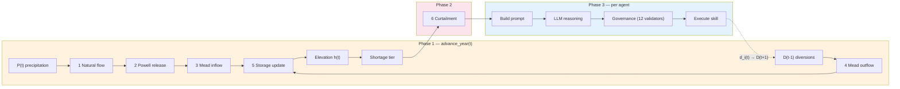

# Irrigation Water System — Physics Reference

Detailed mass balance equations, variable definitions, storage-elevation curves, and CRSS comparison for the irrigation ABM. This supplements the main [README](../README.md) Section 4.

---

## Mass Balance Equations

All quantities in MAF (million acre-feet), annual resolution. The system computes sequentially:

**1. Natural flow** — Lee Ferry long-term average: 12 MAF; precipitation baseline: 100 mm

$$Q_{Nat} = 12 \times \frac{P_{winter}}{100}, \quad Q_{Nat} \in [6,\, 17] \;\text{MAF}$$

**2. Water release from Lake Powell** — min release: 7 MAF; max release: 12 MAF

$$Q_{Powell}(t) = \max\!\bigl(7,\; \min(Q_{raw},\; 12)\bigr), \qquad Q_{raw}(t) = Q_{Nat} - \sum_{i=1}^{n} Div\_UB_{i,t}$$

**3. Inflow of Lake Mead** — streamflow from tributaries: 1 MAF

$$Q_{in,Mead} = Q_{Powell} + 1.0$$

**4. Outflow of Lake Mead** — $D_{muni}$ = 5.0 MAF (CAP + MWD + municipal); $M_{DCP}(h)$ = Mexico treaty (elevation-dependent); $ET(S)$ = evaporation

$$Q_{out,Mead} = D_{muni} + M_{DCP}(h) + ET(S) + \sum_{i=1}^{n} Div\_LB_{i,t}$$

**5. Storage update** — Glen Canyon Dam buffering limits $|\Delta S| \leq 3.5$ MAF/yr

$$S(t+1) = S(t) + Q_{in,Mead} - Q_{out,Mead}, \quad S \in [2.0,\; 26.1]$$

**6. Agent diversion** — $r_i$ = demand request, $w_i$ = water right, $\gamma_\tau$ = curtailment ratio for tier $\tau$

$$d_i(t) = \min(r_i(t),\; w_i) \times (1 - \gamma_\tau)$$

### Auxiliary Equations

**Evaporation** — scales with storage as surface-area proxy ($E_{ref}$ = 0.8 MAF/yr at $S_{ref}$ = 13.0 MAF):

$$ET(S) = E_{ref} \times \max\!\left(0.15,\; \min\!\left(\frac{S}{S_{ref}},\; 1.50\right)\right)$$

---

## Variable Definitions

| Symbol | Definition | Value / Unit |
| :----- | :--------- | :----------- |
| $S$ | Lake Mead storage | MAF |
| $h$ | Lake Mead elevation (USBR storage-elevation curve) | ft |
| $Q_{Nat}$ | Natural flow at Lee Ferry | MAF/yr |
| $P_{winter}$ | UB winter precipitation (7-state average) | mm |
| $Q_{Powell}$ | Powell release to Mead | MAF/yr |
| $Q_{raw}$ | Unconstrained Powell release (before min/max clamp) | MAF/yr |
| $Q_{in,Mead}$ | Total Mead inflow | MAF/yr |
| $Q_{out,Mead}$ | Total Mead outflow | MAF/yr |
| $Div\_UB_{i,t}$ | Upper Basin agent $i$ diversion in year $t$ | MAF/yr |
| $Div\_LB_{i,t}$ | Lower Basin agent $i$ diversion in year $t$ | MAF/yr |
| $D_{muni}$ | Municipal/M&I demand (CAP + MWD + losses) | 5.0 MAF/yr |
| $M_{DCP}(h)$ | Mexico treaty delivery (elevation-dependent, Minute 323) | MAF/yr |
| $ET(S)$ | Reservoir evaporation (storage-dependent) | MAF/yr |
| $r_i$ | Agent $i$ demand request (post-governance) | AF/yr |
| $w_i$ | Agent $i$ legal water right | AF/yr |
| $\gamma_\tau$ | Curtailment ratio for shortage tier $\tau$ | dimensionless |
| $d_i$ | Agent $i$ actual diversion (after curtailment) | AF/yr |

---

## Implementation Pseudocode

From `irrigation_env.py:725-804`:

```text
advance_year()
  |-- 1. _generate_precipitation()          <- P_winter from CRSS PRISM (UB 7-state avg)
  |-- 2. _generate_lake_mead_level()        <- Steps 1-5 above
  |        Q_Nat    = 12.0 * (P / 100)              [bounded 6-17 MAF]
  |        Q_raw    = Q_Nat - sum(Div_UB)
  |        Q_Powell = max(7, min(Q_raw, 12))
  |        Q_in     = Q_Powell + 1.0                 [tributaries]
  |        Q_out    = sum(Div_LB) + M_DCP(h) + ET(S) + 5.0
  |        S(t+1)   = clip(S(t) + Q_in - Q_out, 2.0, 26.1)
  |        h        = USBR storage-elevation lookup(S)
  |-- 3. _update_preceding_factors()        <- Binary: did precip/Mead rise?
  |-- 4. _compute_drought_index()           <- Composite severity index
  |-- 5. _apply_curtailment()               <- d_i = min(r_i, w_i) * (1 - gamma_tau)
  +-- 6. _apply_powell_constraint()         <- Pro-rata UB scaling
```

---

## Mexico DCP Reductions (Minute 323)

When Lake Mead elevation drops, Mexico voluntarily reduces delivery:

| Mead Elevation | Mexico Reduction | Effective Delivery |
| :------------- | :--------------- | :----------------- |
| >= 1090 ft | 0 | 1.500 MAF |
| 1075-1090 ft | 0.041 MAF | 1.459 MAF |
| 1050-1075 ft | 0.080 MAF | 1.420 MAF |
| 1025-1050 ft | 0.104 MAF | 1.396 MAF |
| < 1025 ft | 0.275 MAF | 1.225 MAF |

---

## Storage-Elevation Curve

Lake Mead storage-to-elevation is interpolated from the USBR 2009 area-capacity survey (9 control points hardcoded in `irrigation_env.py` as `_STORAGE_MAF` and `_ELEVATION_FT`).

---

## Agent-Reservoir Feedback Loop



| Step | Equation | Constants |
| :--- | :------- | :-------- |
| 1 Natural flow | $Q_{Nat} = 12 \times P_{winter}/100$ | bounded [6, 17] MAF |
| 2 Powell release | $Q_{Powell} = \max(7, \min(Q_{raw}, 12))$ | $Q_{raw} = Q_{Nat} - \sum Div\_UB$ |
| 3 Mead inflow | $Q_{in} = Q_{Powell} + 1.0$ | tributaries: 1 MAF |
| 4 Mead outflow | $Q_{out} = D_{muni} + M_{DCP}(h) + ET(S) + \sum Div\_LB$ | $D_{muni}$ = 5.0 MAF |
| 5 Storage update | $S(t+1) = S(t) + Q_{in} - Q_{out}$ | $S \in [2.0, 26.1]$, $\|\Delta S\| \leq 3.5$ |
| 6 Curtailment | $d_i = \min(r_i, w_i) \times (1 - \gamma_\tau)$ | tier-dependent $\gamma$ |

**Feedback loop**: Over-extraction → lower Mead → higher tier → larger curtailment + governance blocks increases → agents shift to maintain/decrease → demand drops → Mead recovers → tier drops → constraints relax. The dashed arrow represents the one-year lag: $d_i(t)$ becomes $D(t+1)$ in next year's mass balance.

---

## Comparison with Full CRSS

| Aspect | Our Model | Full CRSS |
| :----- | :-------- | :-------- |
| Temporal resolution | Annual | Monthly |
| Spatial resolution | 2 basins (UB/LB) | 3,700+ objects |
| Reservoir model | Single (Mead) | Powell + Mead + Flaming Gorge + ... |
| Operating rules | Simplified DCP | Full LROC + DCP + Minute 323 |
| Demand model | 78 LLM agents | Exogenous demand schedules |
| Precipitation | CRSS PRISM (real) | CRSS PRISM (same source) |
| Natural flow | Scaled by precip | Full hydrologic routing |
| Agent feedback | Bidirectional | None (exogenous demand) |

**Key advantage**: Bidirectional coupling (agent demand <-> reservoir state) enables studying how governance rules affect collective demand trajectories — something standard CRSS cannot do because it uses fixed exogenous demand schedules.

---

## Single-Reservoir Justification

The Colorado River system has two major reservoirs — Lake Powell (upstream, Glen Canyon Dam) and Lake Mead (downstream, Hoover Dam) — but our model tracks only Lake Mead explicitly. Three reasons:

1. **Lake Mead is the decision-relevant reservoir.** All DCP shortage tiers, curtailment ratios, and Mexico treaty reductions are triggered by Lake Mead elevation. Lake Powell's operational role is to regulate releases to Lake Mead, captured through the Powell minimum release constraint (Eq. 5) and the UB infrastructure ceiling.

2. **Powell is implicitly represented.** Step 2 ($Q_{Powell} = \max(7, \min(Q_{raw}, 12))$) encodes Powell's operational constraints: (a) 7.0 MAF/yr DCP minimum release floor, (b) 12 MAF/yr max release, (c) UB diversions subtracted before clamping.

3. **Hung & Yang (2021) uses the same approach.** Their FQL model also uses a reduced-form mass balance with CRSS inputs rather than independent Powell modeling.

### Initial Elevation: 1081.46 ft (Dec 2018 Observed)

The simulation initializes Lake Mead at 1081.46 ft, the USBR-observed elevation as of December 2018 — the year before the simulation begins (Y1 = calendar year 2019). This places the initial condition in Tier 0 (above the 1075 ft threshold). The code also pre-seeds the elevation history with 2017 (1082.52 ft) and 2018 (1081.46 ft) values for the preceding-factor computation requiring a 2-year lookback.

---

## Data Sources

| Data | Source | File |
| :--- | :----- | :--- |
| Winter precipitation (2017-2060) | CRSS/PRISM NOAA projection | `ref/CRSS_DB/CRSS_DB/HistoricalData/PrismWinterPrecip_ST_NOAA_Future.csv` |
| Agent water rights (78 agents) | CRSS annual baseline time series | `ref/CRSS_DB/CRSS_DB/annual_baseline_time_series.csv` |
| Historical UB depletion | CRSS (2018 baseline) | `ref/CRSS_DB/CRSS_DB/HistoricalData/UB_historical_annual_depletion.csv` |
| Historical LB diversion | CRSS (2018 baseline) | `ref/CRSS_DB/CRSS_DB/HistoricalData/LB_historical_annual_diversion.csv` |
| Lake Mead storage-elevation | USBR 2009 area-capacity survey | Hardcoded in `irrigation_env.py` (`_STORAGE_MAF`, `_ELEVATION_FT`) |
| FQL calibrated parameters | Hung & Yang (2021) Table 2 | Embedded in `config/agent_types.yaml` under `fql_reference` |

**Precipitation as sole exogenous forcing**: The PRISM CSV contains annual winter precipitation projections for 9 Upper Basin state-groups (WY, UT1-3, NM, CO1-3, AZ), generated by CRSS via bootstrapping from the 1906-2018 historical PRISM/NOAA record. Values are in inches, converted to mm (*25.4) at load time. The UB 7-state average drives the natural flow calculation (Eq. 6). All other quantities are computed endogenously.
