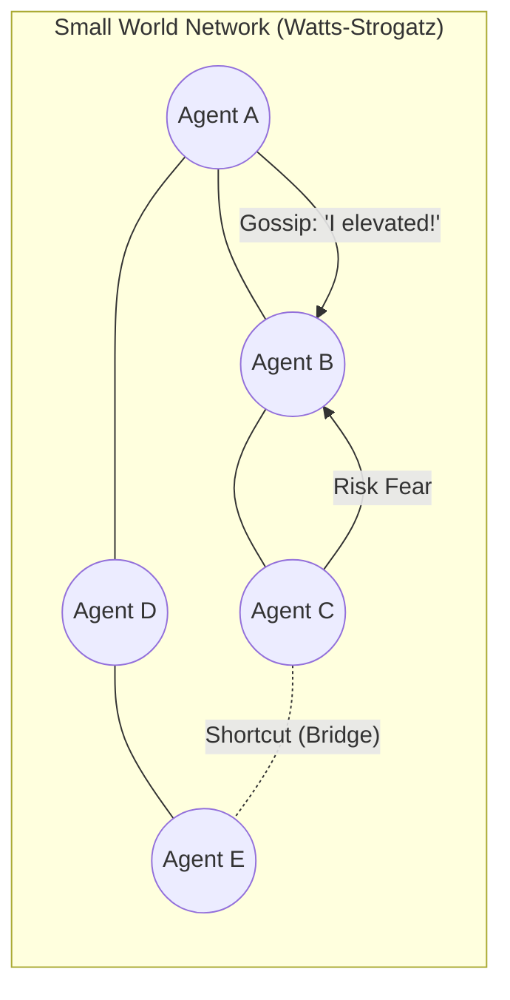
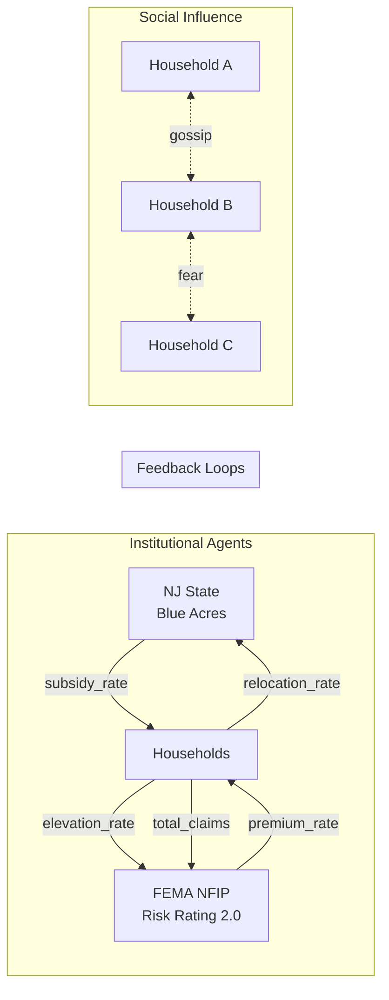

# Comprehensive Simulation Setup / 模擬系統綜合設定說明

This document answers the core architecture questions and outlines the "Highlights" of our LLM-powered multi-agent flood simulation.

## 1. Agent Population & Strata / 智能體數量與分層

- **Count / 數量**: Configurable (Default: 50-100). The `run_flood.py` script samples directly from the raw Excel survey data.
- **Strata / 分層**: Automatically divided into `household_owner` and `household_renter` based on Survey Column 26 (1=Own, 2=Rent). Each has distinct prompt templates and decision spaces.

## 2. Skill Registry / 技能定義

All actions are governed by [skill_registry.yaml](file:///h:/%E6%88%91%E7%9A%84%E9%9B%B2%E7%AB%AF%E7%A1%AC%E7%A2%9F/github/governed_broker_framework/examples/single_agent/skill_registry.yaml):

- **Homeowner**: `buy_insurance`, `elevate_house` (one-time), `buyout_program`, `do_nothing`.
- **Renter**: `buy_contents_insurance`, `relocate` (one-time), `do_nothing`.
- **Governance**: Preconditions ensure agents cannot "Elevate" twice or "Relocate" once they are gone.

## 3. State Schema / 狀態屬性

- **Fixed (Excel Survey)**: Income range, education, occupation, residency generations, household size, and flood history.
- **Dynamic (Simulation State)**: `elevated`, `has_insurance`, `relocated`, `virtual_zone` (for spatial hazards).

## 4. Memory & Retrieval (RAG) / 記憶與檢索系統

- **Engine**: `HumanCentricMemoryEngine` is enabled.
- **Function**: Agents store flood events, financial losses, and gossip from neighbors. During the "Thinking" phase, relevant memories are retrieved and injected into the prompt to influence Threat Perception (TP) and Coping Perception (CP).

## 5. Interaction Mechanisms / 交互作用

- **Social Interaction**: Agents are connected via a **Watts-Strogatz Social Graph**. Social neighbors exchange "Gossip" about flood fear and adaptation choices.
- **Environmental Interaction**: The `pre_step` hook triggers flood events from the Passaic River Basin hazard data, updating the `env_context` which all agents perceive as "The World."

### Social Network Design / 社會網絡設計

We use a **Watts-Strogatz Small World Network** to simulate neighborhood information exchange.
我們採用 **Watts-Strogatz 小世界網絡** 來模擬鄰里間的信息交換。



**Scientific Basis**:

- **High Clustering**: Agents form tight-knit "cliques" representing physical proximity (neighbors).
- **Short Path Length**: "Shortcuts" (weak ties) allow information about community adaptation trends or government subsidies to spread rapidly across the entire population.
- **Reference**: Watts & Strogatz (1998), Haer et al. (2016).

### Information Asymmetry / 信息不對稱

To maintain realism, agents have restricted access to information:
為了維持真實性，不同類型的智能體對信息的存取权有所受限：

| Agent Type           | Knows (Visible) / 已知信息                                                   | Does NOT Know (Private) / 未知信息                                    |
| :------------------- | :--------------------------------------------------------------------------- | :-------------------------------------------------------------------- |
| **Household** / 住戶 | Local flood depth, Own finances, Neighbor gossip, Public subsidies/premiums. | FEMA's total solvency, Government's long-term budget targets.         |
| **NJ State** / 政府  | Global relocation rates, Community damage averages, Total budget.            | Individual agent's hidden "Place Attachment" or specific debt ratios. |
| **FEMA** / 保險      | Total claims, Total premiums, Community elevation rate.                      | Agent's psychological "Threat Perception" (TP).                       |

## 6. Agent Type Influence / 不同智能體類型的影響

- **Economic Vulnerability**: Households with lower income (from Survey) receive higher priority in government reasoning for subsidies.
- **Decision Constraints**: Owners weigh "Place Attachment" (PA) vs the cost of elevation; Renters focus on "Social Capital" (SC) and the ease of moving.

## 7. Institutional Roles / 政府與保險公司的角色

- **NJStateAgent (Government)**: Acts as a "Regulator." It monitors community-level relocation rates and adjusts subsidies to encourage movement from the Passaic flood zones.
- **FemaNfipAgent (Insurance)**: Acts as a "Financial Stabilizer." It maintains solvency by adjusting premiums based on the previous year's total claims vs premiums.

## 8. Disaster-LLM Integration / 災害模型與大模型的交互

- **Data-to-Context**: Water depth (m) -> `GridFloodModel` -> Feet (ft) -> `env_context`.
- **Feedback Loop**: When agents move or elevate, it reduces future `total_claims`, allowing the Insurance Agent to potentially lower premiums in future steps.

---

## 🌟 Highlights vs. Traditional FLOODABM / 與傳統模型相比的亮點

1. **Reasoning-Based Decisions**: Unlike traditional ABM that uses fixed probability weights, our agents **explain why** they choose an action based on PMT theory (TP, CP, SC, PA).
2. **Synthetic Spatial Projection**: We solved the "Spatial Mismatch" of survey data, allowing real householder data to interact with real Passaic River hydrologic grids.
3. **Double-Loop Governance**: The `Auditor` validates LLM reasoning against behavioral rules (e.g., preventing unrealistic decisions given low income).
4. **Social Memory**: Risk perception is not just a variable, but a stored and retrieved narrative that evolves over a 13-year simulation history.

---

## 🔄 Three-Agent Interaction Model / 三類智能體交互模型



**Interaction Summary**:
| From | To | Data | Effect |
|:---|:---|:---|:---|
| NJ State | Households | `subsidy_rate` | Makes buyout more attractive |
| FEMA | Households | `premium_rate` | Affects insurance decision |
| Households | NJ State | `relocation_rate` | Triggers subsidy adjustment |
| Households | FEMA | `elevation_rate`, `claims` | Triggers premium adjustment |
| Household ↔ Household | Social Network | Gossip, Fear | Memory injection |

---

## ⚡ Multiprocessing / 平行處理

The simulation supports parallel LLM calls for household agent decisions:

```bash
# Sequential (default, deterministic)
python run_flood.py --agents 100 --steps 13

# Parallel (4 workers, faster but order may vary)
python run_flood.py --agents 100 --steps 13 --workers 4
```

**Implementation Details**:

- Uses `concurrent.futures.ThreadPoolExecutor`
- Institutional agents (`pre_step` hook) always run sequentially first
- Only household LLM calls are parallelized
- Post-step hooks wait for all agents to complete before executing
