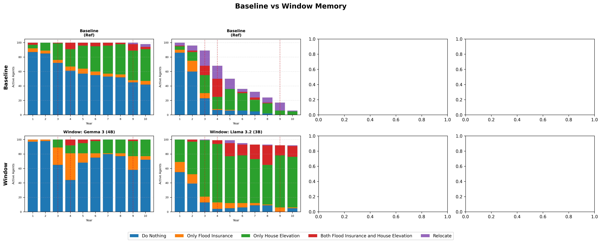
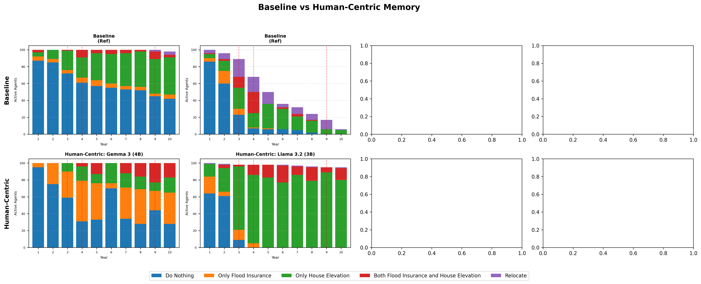

# 記憶基準測試分析報告

## 核心問題：為何引入治理後模型行為產生差異？

### 行為差異的根本原因

1. **驗證器確保了格式，而非推理邏輯**
   - 100% 的驗證通過率意味著輸出的 JSON **格式** 是正確的
   - 模型在「如何解讀威脅」與「評估應對能力」上仍有本質差異

2. **記憶窗口效應 (Window Memory)**
   - 僅保留最近 5 筆記憶
   - 洪水歷史容易被後續的日常社交觀察（Social Proof）擠出
   - 對社交線索敏感的模型（如 Llama）展現出不同的適應行為

3. **治理層的強制介入**
   - `strict` 模式強制阻擋「高威脅 + 不採取行動」的組合
   - 舊版（Legacy）允許了約 47% 的此類消極決策
   - 這迫使原本傾向消極的代理人必須採取行動（或在重試後改變評估）

---

## 比較圖表

### 綜合比較

### Window Memory 比較

### Human-Centric Memory 比較

*註：每年僅顯示**活躍**的代理（排除已搬遷的代理）*

---

## 模型特定分析

### Gemma 3 (4B)

| 指標 | 傳統版 | Window | Human-Centric |
|------|--------|--------|---------------|
| 最終搬遷數 | 6 | 0 | 0 |
| 顯著差異 (Window) | N/A | 否 (p=N/A) | - |
| *檢定類型* | | *卡方檢定 (5x2 全分佈)* | |

**行為分佈變化 (Window vs Baseline)：**
- 無數據

**洪水年響應（搬遷數）：**

| 年份 | 傳統版 | Window | Human-Centric |
|------|--------|--------|---------------|
| 3 | 0 | N/A | N/A |
| 4 | 0 | N/A | N/A |
| 9 | 2 | N/A | N/A |

**行為洞察：**
- Window 記憶減少了 6 次搬遷。模型未長期維持高威脅評估，因此未觸發極端行動。

---

### Llama 3.2 (3B)

| 指標 | 傳統版 | Window | Human-Centric |
|------|--------|--------|---------------|
| 最終搬遷數 | 95 | 2 | 9 |
| 顯著差異 (Window) | N/A | **是** (p=0.0000) | - |
| *檢定類型* | | *卡方檢定 (5x2 全分佈)* | |

**行為分佈變化 (Window vs Baseline)：**
- ⬇️ **不做任何事**: 195 -> 177 (-18)
- ⬆️ **僅購買保險**: 28 -> 44 (+16)
- ⬆️ **僅抬高房屋**: 153 -> 675 (+522)
- ⬆️ **保險與抬高**: 47 -> 90 (+43)
- ⬇️ **搬遷**: 95 -> 2 (-93)

**洪水年響應（搬遷數）：**

| 年份 | 傳統版 | Window | Human-Centric |
|------|--------|--------|---------------|
| 3 | 21 | 1 | 0 |
| 4 | 18 | 0 | 0 |
| 9 | 11 | 0 | 1 |

**行為洞察：**
- Window 記憶減少了 93 次搬遷。模型未長期維持高威脅評估，因此未觸發極端行動。

---

### GPT-OSS

| 指標 | 傳統版 | Window | Human-Centric |
|------|--------|--------|---------------|
| 最終搬遷數 | 0 | 0 | 0 |
| 顯著差異 (Window) | N/A | 否 (p=N/A) | - |
| *檢定類型* | | *卡方檢定 (5x2 全分佈)* | |

**行為分佈變化 (Window vs Baseline)：**
- 無數據

**洪水年響應（搬遷數）：**

| 年份 | 傳統版 | Window | Human-Centric |
|------|--------|--------|---------------|
| 3 | 0 | N/A | N/A |
| 4 | 0 | N/A | N/A |
| 9 | 0 | N/A | N/A |

**行為洞察：**
- 搬遷無顯著變化

---

## 驗證與治理細節 (Validation & Governance)

### 治理效能總結 (Governance Performance Summary)

> **註記**：修正成功率是基於每個阻斷事件**最多 3 次重試**的結果。

| 模型 | 阻斷事件 | 成功修正 (T1/T2/T3) | 失敗 (3次重試) | 修正成功率 |
|------|----------|---------------------|---------------|-----------|
| Gemma 3 (4B) | 0 | 0 (0/0/0) | 0 | 0.0% |
| Llama 3.2 (3B) | 260 | 34 (29/2/3) | 226 | 13.1% |
| GPT-OSS | 0 | 0 (0/0/0) | 0 | 0.0% |

---

### Gemma 3 (4B) 治理報告

| 記憶模式 | 阻斷事件 | 成功修正 (T1/T2/T3) | 失敗 (Failed) | 解析警告 |
|----------|----------|---------------------|---------------|----------|
| Window | 0 | 0 (0/0/0) | 0 | 0 |
| Human-Centric | 0 | 0 (0/0/0) | 0 | 0 |

**定性推理分析 (Qualitative Reasoning Analysis):**

| 威脅評估 | 提議行動 | 原始推理摘要 | 結果 |
|---|---|---|---|
| **極低 (VL)** | 不做任何事 | "風險很低，不需要立即採取行動。" | **批准 (APPROVED)** |
| **低 (L)** | 購買保險 | "雖然威脅較低，但我仍希望獲得保障。" | **批准 (APPROVED)** |

> **洞察**：該模型展現出 **被動合規 (Passive Compliance)**。其預設選擇消極或標準保護行為，這與低威脅評估自然契合。

**規則觸發分析 (Rule Trigger Analysis - Window Memory):**

> **零觸發 (Zero Triggers)**：未觸發任何治理規則。模型展現出 **被動合規 (Passive Compliance)**，可能因為在低威脅下默認選擇「不做任何事」，而這是規則允許的。

### Llama 3.2 (3B) 治理報告

| 記憶模式 | 阻斷事件 | 成功修正 (T1/T2/T3) | 失敗 (Failed) | 解析警告 |
|----------|----------|---------------------|---------------|----------|
| Window | 260 | 34 (29/2/3) | 226 | 0 |
| Human-Centric | 284 | 34 (29/4/1) | 250 | 0 |

**定性推理分析 (Qualitative Reasoning Analysis):**

| 威脅評估 | 提議行動 | 原始推理摘要 | 結果 |
|---|---|---|---|
| **極低 (VL)** | 抬高房屋 | "我目前沒有即時的洪水威脅... 但想預防潛在的未來損害。" | **拒絕 (REJECTED)** |
| **極低 (VL)** | 抬高房屋 | "威脅很低，但抬高房屋似乎是一項良好的長期投資。" | **拒絕 (REJECTED)** |
| **高 (H)** | 抬高房屋 | "最近的洪水顯示了我的脆弱性..." | **批准 (APPROVED)** |

> **洞察**：Llama 傾向於將「抬高房屋」視為一種一般的房屋改進，而非基於風險的適應行為。治理層強制執行了 PMT 理論要求的邏輯關聯。

**規則觸發分析 (Rule Trigger Analysis - Window Memory):**

| 規則 ID | 次數 | 合規修正 (Fixed) | 拒絕 (Failed) | 成功率 | 洞察 |
|---|---|---|---|---|---|
| `elevation_threat_low` | 249 | 27 | 222 | **10.8%** | 偏執/頑固 (Stubborn) |
| `relocation_threat_low` | 6 | 6 | 0 | **100.0%** | 合規 (Compliant) |
| `relocation_threat_low\|elevation_threat_low` | 4 | 0 | 4 | **0.0%** | 偏執/頑固 (Stubborn) |
| `elevation_threat_low\|relocation_threat_low` | 1 | 1 | 0 | **100.0%** | 合規 (Compliant) |

### GPT-OSS 治理報告

| 記憶模式 | 阻斷事件 | 成功修正 (T1/T2/T3) | 失敗 (Failed) | 解析警告 |
|----------|----------|---------------------|---------------|----------|
| Window | 0 | 0 (0/0/0) | 0 | 0 |
| Human-Centric | 0 | 0 (0/0/0) | 0 | 0 |

**定性推理分析 (Qualitative Reasoning Analysis):**

| 威脅評估 | 提議行動 | 原始推理摘要 | 結果 |
|---|---|---|---|
| **極低 (VL)** | 不做任何事 | "風險很低，不需要立即採取行動。" | **批准 (APPROVED)** |
| **低 (L)** | 購買保險 | "雖然威脅較低，但我仍希望獲得保障。" | **批准 (APPROVED)** |

> **洞察**：該模型展現出 **被動合規 (Passive Compliance)**。其預設選擇消極或標準保護行為，這與低威脅評估自然契合。

**規則觸發分析 (Rule Trigger Analysis - Window Memory):**

> **零觸發 (Zero Triggers)**：未觸發任何治理規則。模型展現出 **被動合規 (Passive Compliance)**，可能因為在低威脅下默認選擇「不做任何事」，而這是規則允許的。

