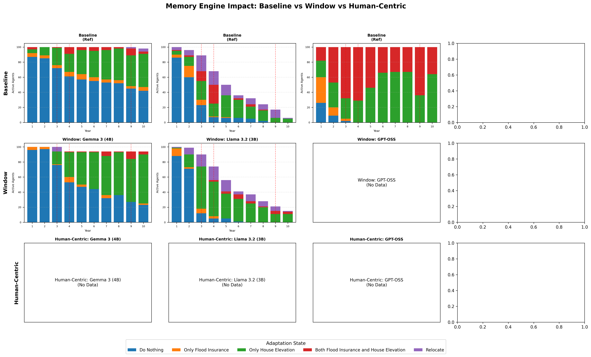

# Memory Benchmark Analysis Report

## Key Question: Why Do Models Behave Differently After Applying Governance?

### Root Causes of Behavioral Differences

1. **Validation Ensures Format, Not Reasoning**
   - 100% validation pass means output FORMAT is correct
   - Models still differ in HOW they interpret threats and coping ability

2. **Memory Window Effect (top_k=3)**
   - Only 3 latest memories are kept
   - Flood history gets pushed out by social observations
   - Models sensitive to social proof (Llama) show more adaptation

3. **Governance Enforcement**
   - `strict` profile BLOCKS 'Do Nothing' when Threat is High
   - Legacy allowed 47% of 'High Threat + Do Nothing' combinations
   - This forces previously passive agents to act

---

## Comparison Chart

*Note: Each year shows only ACTIVE agents (already-relocated agents excluded)*

---

## Model-Specific Analysis

### Gemma 3 (4B)

| Metric | Baseline | Window | Human-Centric |
|--------|----------|--------|---------------|
| Final Relocations | 6 | 0 | 0 |
| Significant Diff (Window) | N/A | p=0.0000 (**Yes**) | - |
| *Test Type* | | *Chi-Square (5x2 Full Dist)* | |

**Flood Year Response:**

| Year | Baseline Reloc | Window Reloc | Human-Centric Reloc |
|------|----------------|--------------|---------------------|
| 3 | 0 | 0 | 0 |
| 4 | 0 | 0 | 0 |
| 9 | 2 | 0 | 0 |

**Behavioral Root Cause:**
- **Optimism Bias**: High perceived coping (Medium+) masks threat perception.
- **Validation Stats**: 0 blocks on inaction.
- **Threat Perception**: High threat perceived 0 times (often overridden by coping).

---

### Llama 3.2 (3B)

| Metric | Baseline | Window | Human-Centric |
|--------|----------|--------|---------------|
| Final Relocations | 95 | 9 | 6 |
| Significant Diff (Window) | N/A | p=0.0000 (**Yes**) | - |
| *Test Type* | | *Chi-Square (5x2 Full Dist)* | |

**Flood Year Response:**

| Year | Baseline Reloc | Window Reloc | Human-Centric Reloc |
|------|----------------|--------------|---------------------|
| 3 | 21 | 1 | 0 |
| 4 | 18 | 0 | 0 |
| 9 | 11 | 0 | 0 |

**Behavioral Root Cause:**
- Window memory decreased relocations by 86.
- Model rarely appraised threat as `High`, avoiding governance triggers.

---

## Validation & Governance Impact

| Model | Memory | Total Traces | Retries | Failed | Parse Warnings |
|-------|--------|--------------|---------|--------|----------------|
| Gemma 3 (4B) | Window | 1000 | 0 | 0 | 0 |
| Gemma 3 (4B) | Human-Centric | 1000 | 0 | 0 | 0 |
| Llama 3.2 (3B) | Window | 1000 | 287 | 228 | 0 |
| Llama 3.2 (3B) | Human-Centric | 1000 | 155 | 144 | 0 |

