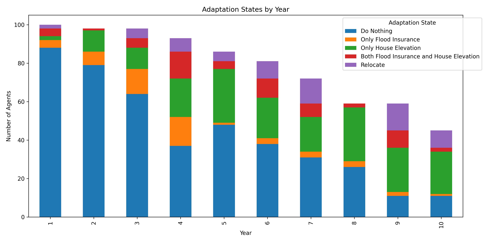

# Skill-Governed Flood Adaptation (Single Agent Baseline)

This example demonstrates the core functionality of the **Governed Broker Framework** in a household flood adaptation scenario. It is aligned with the 12/04 baseline experiment but enhanced with structured governance, logical validation, and detailed audit logging.

## Core Architecture

This experiment utilizes a **Three-Layer Architecture**:
1.  **World Layer (`simulation/`)**: A stochastic flood simulation with environment states (flood events, grants, neighborhood adaptation).
2.  **Governance Layer (`broker/`)**: Intercepts agent decisions.
    -   **Unified Adapter**: Normalizes multi-model output and handles numeric-to-skill mapping.
    -   **Agent Validator**: Enforces logical consistency (e.g., preventing inaction during high-perceived threat).
3.  **Agent Layer (`examples/single_agent/`)**: Defines the specific prompt templates and domain skills.

## Hardened Universal Logic

The core modules have been "hardened" to ensure simulation integrity regardless of the specific agent configuration:
-   **Structured PMT Labels**: The system enforces $[Low/Med/High]$ parsing for Threat and Coping Appraisals by default.
-   **Numeric Mapping**: Skill decisions can be provided as numbers (1-4), which the broker automatically maps to canonical skill IDs based on the agent's current state (e.g., standard vs. elevated).
-   **Logical Consistency**: Core validators block "maladaptive" decisions (like doing nothing when threat is high) to ensure agents behave rationally according to the Protection Motivation Theory.

## Getting Started

1.  **Generate Profiles**: Create initial agent demographic data.
    ```bash
    python generate_profiles.py
    ```
2.  **Run Experiment**: Execute the simulation for a specific model.
    ```bash
    python run_experiment.py --model gemma3:4b --num-agents 100 --num-years 10
    ```

## Results & Benchmark Comparison

By applying the Skill-Governed Framework, we observe more structured and rational adaptation behavior compared to the unconstrained baseline.

### Original Baseline (Reference)
The original simulation (without structured labeling or validation) often exhibited higher variance or "do-nothing" bias in certain models.



### Skill-Governed Progression (Latest)
With the framework applied, agents demonstrate more consistent adaptation profiles across different models (Gemma, Llama, GPT-OSS).

| Model | Progression Plot |
| :--- | :--- |
| **Gemma 3:4b** |  |
| **Llama 3.2:3b** |  |
| **GPT-OSS** |  |

## Audit Trails
All decisions are logged in `results/<model>/household_audit.jsonl` with full traces of:
-   The original LLM prompt and raw response.
-   Parsed structured evaluations (TP_LABEL, CP_LABEL).
-   Validator issues and retry history.
