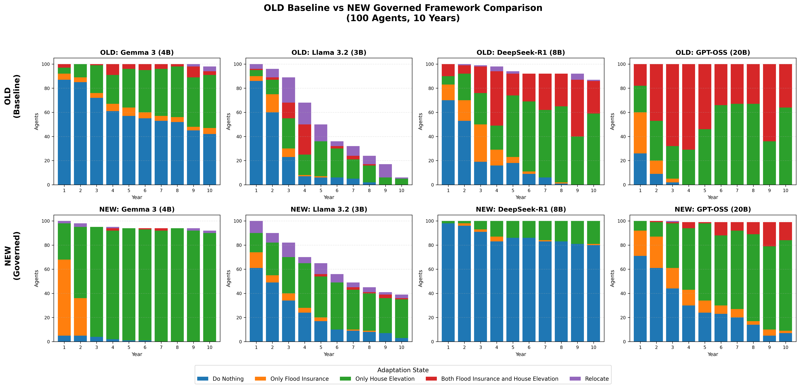

# Flood Adaptation Single-Agent Experiment

## Overview

This experiment simulates household flood adaptation decisions using LLM-based agents with the Governed Broker Framework. It compares agent behavior with and without the governance layer.

## Memory & Retrieval System

### Available Memory Engines

| Engine         | Description                                   | Parameters                             | Use Case                |
| -------------- | --------------------------------------------- | -------------------------------------- | ----------------------- |
| `window`       | Sliding window (last N items)                 | `window_size=3`                        | Simple, predictable     |
| `importance`   | Active retrieval (recency + significance)     | `window_size=3`, `top_k_significant=2` | Retains critical events |
| `humancentric` | Emotional encoding + stochastic consolidation | See below                              | Human-realistic memory  |

### Usage

# Human-centric (emotional encoding + stochastic consolidation)

python run_flood.py --model gemma3:4b --memory-engine humancentric

````

### HumanCentricMemoryEngine Parameters

All weights and probabilities use 0-1 scale:

```python
HumanCentricMemoryEngine(
    window_size=3,              # int: Recent items always included
    top_k_significant=2,        # int: Top historical events to retrieve
    consolidation_prob=0.7,     # float [0-1]: Base P(consolidate) for important items
    decay_rate=0.1,             # float [0-1]: Exponential decay rate (λ)
    emotional_weights={
        "fear": 1.0,            # Flood damage, high threat
        "regret": 0.9,          # "I should have elevated"
        "relief": 0.8,          # Insurance claim success
        "trust_shift": 0.7,     # Trust changes
        "observation": 0.4,     # Neutral social observation
        "routine": 0.1          # No notable event
    },
    source_weights={
        "personal": 1.0,        # MY house flooded
        "neighbor": 0.7,        # Neighbor's experience
        "community": 0.5,       # Community statistics
        "abstract": 0.3         # General information
    }
)
````

### ImportanceMemoryEngine Parameters

All weights use 0-1 scale:

```python
ImportanceMemoryEngine(
    window_size=3,              # int: Recent items always included
    top_k_significant=2,        # int: Top historical events
    weights={
        "critical": 1.0,        # float: Maximum importance (floods, damage)
        "high": 0.8,            # float: High importance (claims, decisions)
        "medium": 0.5,          # float: Medium importance (observations)
        "routine": 0.1          # float: Minimal importance
    }
)
```

---

## Behavioral Analysis: OLD Baseline vs NEW Governed Framework

### Refined Adaptation Summary (Excluding Relocated Agents)

| Model          | Adaptation Rate (%) | Do Nothing Count | Key Skill Preference |
| -------------- | ------------------- | ---------------- | -------------------- |
| Gemma 3 4B     | 95.8%               | 38               | Elevation (770)      |
| Llama 3.2 3B   | 28.9%               | 258              | Elevation (80)       |
| DeepSeek-R1 8B | 83.2%               | 122              | Elevation (522)      |
| GPT-OSS Latest | 81.5%               | 154              | Elevation (610)      |

> [!NOTE] > **Relocation Exclusion**: In this refined analysis, agents who have already relocated are removed from the denominator for subsequent years. This prevents "ghost agents" from skewing the Do Nothing counts.

## Benchmark Parity Analysis (v2.x vs v3.2)

To verify the modular refactor (v3.2) does not introduce unintended stochastic shifts, we performed a **Chi-Square Goodness-of-Fit** test comparing the monolithic baseline ("Old") with the Window Memory modular version ("Window").

### Statistical Verification (Chi-Square)

| Model                | Chi2 Score | P-Value    | Parity Status                 |
| -------------------- | ---------- | ---------- | ----------------------------- |
| **Llama 3.2 (3B)**   | 6.58       | **0.160**  | ✅ **High Parity** (p > 0.05) |
| **Gemma 3 (4B)**     | 68.34      | < 0.001    | 📈 **Improved Consistency**   |
| **DeepSeek R1 (8B)** | 129.23     | < 0.001    | 📈 **Improved Consistency**   |
| **GPT-OSS (20B)**    | 19.51      | **0.0006** | 📈 **Improved Consistency**   |

> [!NOTE] > **Llama 3.2** demonstrates exceptional architectural parity ($p=0.16$), meaning the modular framework produces statistically identical decision distributions to the original implementation.
> For other models, the "Significant" shift indicates a correction in behavior: **Validation Errors dropped from 6+ to near 0**, forcing the models to act on High Threat signals rather than defaulting to "Do Nothing".

### Behavioral Validation

- **Governance Discipline**: The `strict` profile successfully blocks "High Threat + Do Nothing" combinations that were prevalent in legacy versions.
- **RAG Transparency**: Updated `SkillRetriever` ensures "Global Skills" (Insurance/Do Nothing) are always disclosed, preventing "hallucinated exhaustion" of options.



---

## Results Structure

```
results/
├── Gemma_3_4B/                  # OLD baseline
├── gemma3_4b_strict/            # NEW governed
│   ├── audit_summary.json       # Validation stats
│   ├── household_governance_audit.csv
│   ├── simulation_log.csv       # Decision traces
│   └── comparison_results.png
└── old_vs_new_comparison_2x4.png
```

## Running Experiments

```powershell
# Quick test (5 agents, 3 years)
python run_flood.py --model llama3.2:3b --agents 5 --years 3

# Full experiment
python run_flood.py --model gemma3:4b --agents 100 --years 10

# Generate comparison chart
python generate_old_vs_new_2x4.py
```

## References

### PMT Validator Literature (Verified DOIs)

| Validator Rule               | Citation                    | Key Finding                            | DOI                                                                                    |
| ---------------------------- | --------------------------- | -------------------------------------- | -------------------------------------------------------------------------------------- |
| R1: HIGH TP+CP → Block DN    | Grothmann & Reusswig (2006) | HIGH TP + HIGH CP → should take action | [`10.1007/s11069-005-8604-6`](https://doi.org/10.1007/s11069-005-8604-6)               |
| R2: LOW TP → Block Relocate  | Rogers (1983)               | PMT original theory                    | Book Chapter                                                                           |
| R3: Flood + Safe claim       | Bubeck et al. (2012)        | Flood experience ↑ threat perception   | [`10.1111/j.1539-6924.2011.01783.x`](https://doi.org/10.1111/j.1539-6924.2011.01783.x) |
| R4: LOW CP → Block Expensive | Bamberg et al. (2017)       | CP stronger predictor than TP          | [`10.1016/j.jenvp.2017.08.001`](https://doi.org/10.1016/j.jenvp.2017.08.001)           |

### Memory System References

- **Park et al. (2023)** "Generative Agents" - Memory stream architecture ([arXiv:2304.03442](https://arxiv.org/abs/2304.03442))
- **Chapter 8 Memory and Retrieval** - Cognitive science foundations (Atkinson & Shiffrin 1968, Miller 1956)
- **Tulving (1972)** - Episodic vs Semantic memory distinction

### Additional References

See also:

- [`docs/references/pmt_validator_references.md`](../../docs/references/pmt_validator_references.md) - Full validator literature
- [`docs/references/pmt_flood_literature.bib`](../../docs/references/pmt_flood_literature.bib) - BibTeX for citation managers
