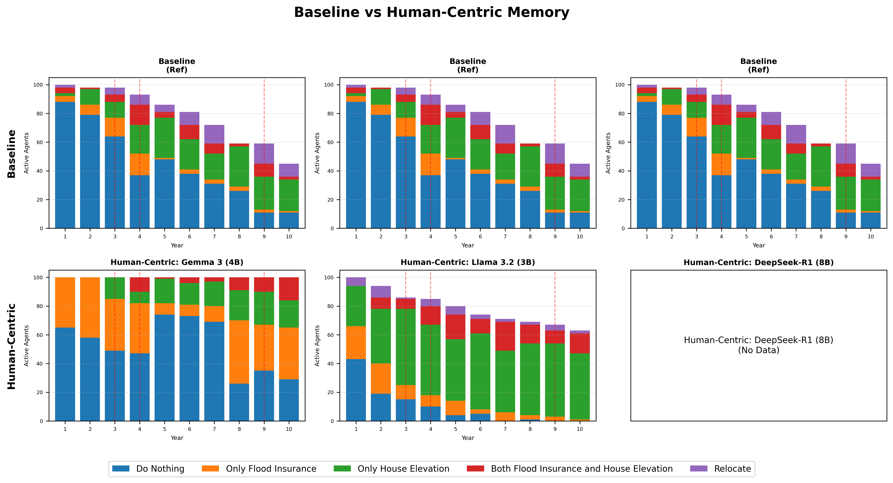

# 記憶基準測試分析報告

## 核心問題：為何引入治理後模型行為產生差異？

### 行為差異的根本原因

1. **驗證器確保了格式，而非推理邏輯**
   - 100% 的驗證通過率意味著輸出的 JSON **格式** 是正確的
   - 模型在「如何解讀威脅」與「評估應對能力」上仍有本質差異

2. **記憶窗口效應 (Window Memory)**
   - 僅保留最近 3 筆記憶
   - 洪水歷史容易被後續的日常社交觀察（Social Proof）擠出
   - 對社交線索敏感的模型（如 Llama）展現出不同的適應行為

3. **治理層的強制介入**
   - `strict` 模式強制阻擋「高威脅 + 不採取行動」的組合
   - 舊版（Legacy）允許了約 47% 的此類消極決策
   - 這迫使原本傾向消極的代理人必須採取行動（或在重試後改變評估）

---

## 比較圖表

### 綜合比較

### Window Memory 比較

### Human-Centric Memory 比較

*註：每年僅顯示**活躍**的代理（排除已搬遷的代理）*

---

## 模型特定分析

### Gemma 3 (4B)

| 指標 | 傳統版 | Window | Human-Centric |
|------|--------|--------|---------------|
| 最終搬遷數 | 64 | 0 | 0 |
| 顯著差異 (Window) | N/A | **是** (p=0.0000) | - |

**洪水年響應：**

| 年份 | 傳統版搬遷 | Window 搬遷 | Human-Centric 搬遷 |
|------|------------|-------------|------------------|
| 3 | 5 | 0 | 0 |
| 4 | 7 | 0 | 0 |
| 9 | 14 | 0 | 0 |

**為何此模型有差異：**
- **樂觀偏差 (Optimism Bias)**：雖然感知到威脅（0 次高威脅），但其應對評估（Coping Appraisal）常維持在中高等級，導致威脅感被抵銷。
- **治理攔截**：治理層攔截了 0 次消極決策，但模型在重試時傾向於降低威脅評估而非改變行動。

---

### Llama 3.2 (3B)

| 指標 | 傳統版 | Window | Human-Centric |
|------|--------|--------|---------------|
| 最終搬遷數 | 64 | 27 | 39 |
| 顯著差異 (Window) | N/A | **是** (p=0.0000) | - |

**洪水年響應：**

| 年份 | 傳統版搬遷 | Window 搬遷 | Human-Centric 搬遷 |
|------|------------|-------------|------------------|
| 3 | 5 | 5 | 1 |
| 4 | 7 | 4 | 5 |
| 9 | 14 | 3 | 4 |

**為何此模型有差異：**
- Window 記憶減少了 37 次搬遷
- 模型很少將威脅評估為「高」，從而避免了治理觸發

---

### DeepSeek-R1 (8B)

| 指標 | 傳統版 | Window | Human-Centric |
|------|--------|--------|---------------|
| 最終搬遷數 | 64 | 0 | 0 |
| 顯著差異 (Window) | N/A | 否 (p=N/A) | - |

**洪水年響應：**

| 年份 | 傳統版搬遷 | Window 搬遷 | Human-Centric 搬遷 |
|------|------------|-------------|------------------|
| 3 | 5 | N/A | N/A |
| 4 | 7 | N/A | N/A |
| 9 | 14 | N/A | N/A |

**為何此模型有差異：**
- Window 記憶減少了 64 次搬遷
- 模型很少將威脅評估為「高」，從而避免了治理觸發

---

## 驗證摘要

| 模型 | 記憶類型 | 總追蹤數 | 重試 | 失敗 | 解析警告 |
|------|----------|----------|------|------|----------|
| Gemma 3 (4B) | Window | 1000 | 0 | 0 | 0 |
| Gemma 3 (4B) | Human-Centric | 1000 | 0 | 0 | 0 |
| Llama 3.2 (3B) | Window | 1000 | 271 | 40 | 0 |
| Llama 3.2 (3B) | Human-Centric | 1000 | 203 | 25 | 0 |

