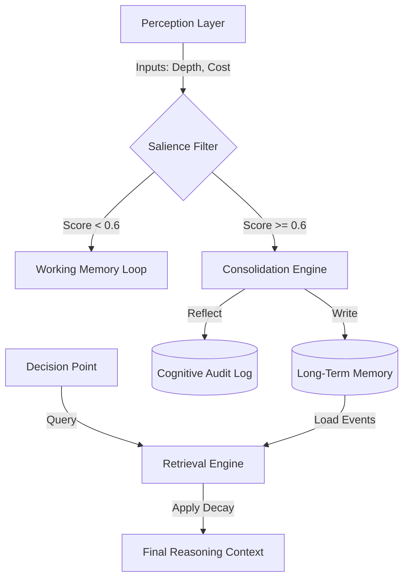

# JOH Technical Note: Bridging the Cognitive Governance Gap

**Title**: Bridging the Cognitive Governance Gap: A Framework for Explainable Bounded Rationality in LLM-Based Hydro-Social Modeling

**Abstract**
Agent-Based Models (ABMs) are increasingly using Large Language Models (LLMs) to simulate how humans make decisions during disasters. However, these "Generative Agents" often suffer from a critical flaw: they are improved storytellers but poor actors. We call this the **"Fluency-Reality Gap."** Agents may write convincing arguments for actions that are logically inconsistent with their own internal appraisals (e.g., relocating despite perceived low risk). This Technical Note introduces the **Governed Broker Framework**, a system that forces these agents to "check their math" before acting. It works by separating the agent's **Probabilistic Reasoning** (System 1) from the **Deterministic Governance** (System 2). Validated across multiple models in a 10-year flood simulation, our framework demonstrates that "Success" should be measured by **Internal Logic Consistency**. While naive models like Llama 3.2 exhibit 100% adaptation rates driven by "hallucinated panic," our framework restores a high **Internal Fidelity (IF > 0.8)**, ensuring adaptation is strictly correlated with the agent's perceived threat appraisal.

**Keywords**: Socio-hydrology, Large Language Models, Agent-Based Modeling, Cognitive Governance, Explainable AI.

## 1. Introduction: The Calibration Crisis in Generative ABM

Integrating realistic human behavior into physical models (Socio-Hydrology) is essential for accurate disaster risk assessment (Di Baldassarre et al., 2013). Traditional Agent-Based Models (ABMs) often rely on rigid, hard-coded rules that struggle to capture the complex, boundedly rational nature of human decision-making under stress. The emergence of Large Language Models (LLMs) offers a transformative path: **"Generative Agents"** (Park et al., 2023) capable of reasoning, reflection, and natural language communication. These agents promise to bridge the gap between deterministic models and the "messy" reality of human psychology.

However, the use of LLMs in scientific simulations introduces a new "Calibration Crisis." While LLMs are exceptionally fluent, their reasoning often lacks grounding in physical reality—a phenomenon we term the **"Fluency-Reality Gap."** Recent research suggests that LLMs frequently produce **Unfaithful Explanations** (Turpin et al., 2023), where the stated reasoning (System 1) does not causally align with the final action. In socio-hydrological contexts, this manifests as agents who can poetically describe flood trauma but fail to take protective actions, or conversely, agents who "hallucinate" resources to justify irrational panic.

Valid scientific modeling requires the enforcement of **Bounded Rationality** (Simon, 1955). Pure LLM agents act as unconstrained "System 1" probabilistic engines, vulnerable to stochastic volatility and temporal incoherence (the "Goldfish Effect"). To transform these agents into reliable scientific instruments, we argue for a move toward **Cognitive Governance**. This requires an architecture that decouples "Reasoning" from "Execution," forcing agents to align their actions with internal logic and physical constraints.

This Technical Note introduces the **Governed Broker Framework**, a "Cognitive Middleware" designed to bridge this gap. By implementing a multi-layered structure that separates logic-driven governance from probabilistic reasoning, we provide a blueprint for deploying trustworthy Generative Agents in complex adaptive systems.

## 2. Methodology: The Three-Layer Architecture

The framework is implemented as a **Three-Layer Architecture** that strictly decouples the stochastic reasoning of the agent from the deterministic laws of the simulation. This design, visualized in the Unified Architecture (Figure 1), consists of:

1.  **Layer 1: The Tiered World Model** (The deterministic "Source of Truth").
2.  **Layer 2: The Cognitive Middleware** (The "Governed Broker" managing input/output).
3.  **Layer 3: The Reasoning Core** (The "System 1" LLM).

This Structure ensures that the LLM never interacts with the simulation directly, but always through the **Broker** middleware (Layer 2), which enforces the "Three Pillars of Governance."

### 2.1 Tiered World Modeling: The Single Source of Truth

Unlike standard ABMs where agents access global variables directly, we implement a **Tiered Environment** to strictly separate _perception_ from _reality_:

- **Global Layer**: Macro-scale drivers (e.g., Sea Level Rise, Inflation Rates).
- **Local Layer**: Spatially explicit constraints (e.g., Tract-level Flood Depth, Paving Density).
- **Institutional Layer**: Policy constraints (e.g., FEMA Grant Budget, Insurance Availability).
- **Social Layer**: Observable neighbor states (e.g., "70% of neighbors elevated").

This separation ensures that the LLM agent interacts only with a _perceived_ subset of the world, processed through its sensory inputs, preventing "omniscient" cheating.

### 2.2 Cognitive Middleware: The System 1-System 2 Bridge

We implement the **Unified Architecture** (Figure 1), following the CoALA pattern by treating the LLM not as the _agent itself_, but as the _reasoning core_ (System 1). The "Broker" acts as the wrapper (System 2), managing the input/output cycle:

1.  **Perception (`ContextBuilder`)**: The system aggregates signals from the Tiered Environment (Global, Local, Social) into a structured JSON prompt, filtering out "omniscient" data.
2.  **Reasoning (`Generative Agent`)**: The LLM (System 1) processes the context and proposes an adaptation `Skill` (e.g., "Elevate House").
3.  **Governance (`SkillBroker`)**: The Broker intercepts the raw proposal. It executes the `Governance Logic` defined in the `AgentType` registry.
4.  **Correction (`Feedback Loop`)**: If a validator (e.g., `budget_constraint`) is triggered, the action is rejected, and a structured error is fed back for a retry (System 2 correction).


### 2.3 The Three Pillars of Cognitive Governance

To enforce **theoretically grounded behavior** (whether based on PMT, PADM, or economic rationality), the framework rests on three foundational pillars of governance. These pillars are designed to be domain-neutral, directly addressing the cognitive failures identified in Section 1.

First, **Bounded Rationality Governance** serves as the primary defense against **Factuality Hallucinations**. Rooted in Simon's theory of **Bounded Rationality (Simon, 1955)**, it implements hard-coded constraints against the physical world layer, ensuring that agents cannot execute actions—such as "elevating a house"—without sufficient financial capital or when their internal threat appraisal does not justify such an extreme cost. This pillar introduces the **Rationality Score (RS)**, measuring the percentage of agent proposals that align with physical constraints, and the **Internal Fidelity (IF)**, which measures the **Reasoning Faithfulness (Turpin et al., 2023)** by quantifying the correlation between the agent's internal appraisals (following **Protection Motivation Theory; Rogers, 1975**) and its subsequent actions.

Second, **Episodic-Semantic Consolidation** addresses the "Goldfish Effect" by utilizing a background reflection and consolidation mechanism. This mirrors the **Episodic Buffer** model of working memory (Baddeley, 2000), where specific traumatic events (episodic) are consolidated into durable beliefs (semantic) via a year-end reflection process. Crucially, this process generates a **Dual-Layer Log**: while the agent's actions are recorded in standard simulation traces (CSV), its higher-order "Self-Talk" and belief evolution are exported to a dedicated `reflection_log.jsonl`. This ensures that long-term vulnerability is maintained and provides an an independent audit trail of the agent's cognitive state.

Third, **Perception Anchoring** mitigates **Faithfulness Hallucinations** by structuring the reasoning process. By explicitly requiring the model to assess key situational variables (e.g., risk level, resource availability) before making a final decision, this pillar prevents the agent from drifting into "social chit-chat" or uncharacteristic optimism, forcing it to remain faithful to the underlying theoretical model.

### 2.4 Deep Dive: The Episodic-Semantic Memory Engine

To address the "Goldfish Effect" (temporal incoherence), the framework implements a **Human-Centric Hierarchical Engine**. This module challenges the standard RAG (Retrieval-Augmented Generation) paradigm by employing a **"System-Push"** philosophy. Inspired by the **Availability Heuristic** (**Tversky & Kahneman, 1973**), the system forcefully injects critical past events into the agent's attention, simulating the involuntary recall of trauma.

#### 2.4.1 Case Study: The Trauma of Agent_042

To illustrate the mechanism, we trace the cognitive lifecycle of a specific agent (**Agent_042**) across simulated time.

**Phase 1: Encoding (Year 2)**
Agent_042 experiences a severe flood (Depth: 5.0ft). The system's **Path A (Regex)** identifies the keywords "flood" and "destroyed".

- **Calculation**: $I = W_{source}(1.0) \times W_{emotion}(1.5) = \textbf{1.5}$.
- **Result**: The event is consolidated into Long-Term Memory as a "Core Belief."

**Phase 2: Retrieval (Year 5)**
Three years later, the environment is benign (Sunny, 0ft depth). A standard LLM might hallucinate that "everything is safe." However, the retrieval engine calculates:

- **Decay Function**: $S = 1.5 \times e^{-0.1 \times 3} = \textbf{1.11}$.
- **Comparison**: A recent routine memory (e.g., "Sunny day", $I=0.1$) has decayed to near zero.
- **Outcome**: The "Trauma Anchor" ($S=1.11$) dominates the context window. Agent_042 explicitly cites "the disaster of Year 2" in its reasoning and renews insurance, defying the recency bias.

#### 2.4.2 Information Flow Architecture

The following diagram illustrates how the **Cognitive Middleware** filters raw perception into durable conviction.



This architecture ensures that **High-Impact Events** (Red Path) bypass the standard forgetting mechanism of the LLM context window.

#### 2.4.3 Configuration

To ensure reproducibility, we explicitly map theoretical cognitive structures to configurable system parameters (Table 2).

**Table 2: Mapping Cognitive Theory to System Configuration**

| Cognitive Structure  | Theoretical Basis                          | System Implementation                                       | YAML Configuration Parameter                    |
| :------------------- | :----------------------------------------- | :---------------------------------------------------------- | :---------------------------------------------- |
| **Working Memory**   | **Episodic Buffer** (Baddeley, 2000)       | The context window limits the visible events in the prompt. | `memory.window_size` (Default: 5 years)         |
| **Long-Term Memory** | **Memory Stream** (Park et al., 2023)      | JSON storage of high-importance events ($I \ge 0.6$).       | `memory.importance_threshold` (Default: 0.6)    |
| **Forgetting**       | **Decay Curve** (Ebbinghaus, 1885)         | Temporal decay function applied to retrieval scores.        | `memory.decay_rate` (Default: 0.1)              |
| **Salience**         | **Availability Heuristic** (Tversky, 1973) | Weights assigned to event sources.                          | `memory.source_weights` (e.g., `personal`: 1.0) |

### 2.5 Scientific Auditability: The Reasoning Trace (Traceability)

A core contribution of this framework is its post-hoc auditability, which moves beyond the "black-box" nature of typical LLM-based simulations. Every agent decision is meticulously logged in a [household_traces.jsonl](file:///H:/%E6%88%91%E7%9A%84%E9%9B%B2%E7%AB%AF%E7%A1%AC%E7%A2%9F/github/governed_broker_framework/results/JOH_FINAL/gemma3_4b/Group_C/ollama_gemma3_4b_strict/raw/household_traces.jsonl) file, alongside the specific PMT constructs—including perceived threat level, coping ability, and institutional trust—that informed the proposal. This longitudinal trace allows researchers to audit why a specific "Logic Block" was triggered by the governance layer. Furthermore, the documented "Reject-Retry" loop provides a transparent record of the agent's cognitive adjustment. By capturing both the initial irrational impulse (System 1) and the subsequent governed decision (System 2), the framework offers a verifiable narrative of boundedly rational behavior.

### 2.6 Core Persistence: The Atomic Truth Layer

To ensure scientific reproducibility, the framework implements an **Atomic State Persistence** layer. In traditional coupled models, a "Context Lag" often occurs where the cognitive agent (System 1) makes decisions based on outdated state information before the physical simulator (System 2) commits the previous step's changes. We resolve this via a rigorous `apply_delta` interface:

1.  **Transactional Commits**: State updates (e.g., `funds -= cost`, `elevated = True`) are treated as atomic transactions.
2.  **Live State Synchronization**: The `ContextBuilder` is forced to read from the live agent object at the exact moment of decision, preventing "Phantom Options" (e.g., an agent trying to elevate a house they already elevated because the prompt relied on a stale cached state).

### 2.7 Theory-Agnostic Reproducibility and Extensibility

To ensure scientific reproducibility, the framework externalizes all cognitive constraints, validation rules, and agent skills into a version-controlled YAML registry ([skill_registry.yaml](file:///H:/%E6%88%91%E7%9A%84%E9%9B%B2%E7%AB%AF%E7%A2%9F/github/governed_broker_framework/examples/single_agent/skill_registry.yaml)). This design choice effectively decouples theoretical assumptions from the underlying simulation code. While the current implementation focuses on Protection Motivation Theory (PMT), the architecture is fundamentally theory-agnostic. Researchers can extend the framework to other psychological models, such as the Protective Action Decision Model (PADM), by modifying the validator registry and prompt schemas. This modularity ensures that the Governed Broker Framework serves as a standardized, reproducible benchmark for evaluating cognitive agent-based models in diverse hydro-social contexts.

## 3. Experimental Application: Hydro-Social Simulation

To demonstrate the efficacy of the Governed Broker Framework, we apply it to a stylized 20-year hydro-social simulation. We validate the framework's ability to enforce meaningful adaptation behaviors grounded in Protection Motivation Theory.

### 3.1 Scenario Setup: The Flood Case

In our framework, "Skills" are not generic verbs but specific Adaptation Behaviors defined with strict physical and financial consequences. We define four canonical skills:

1.  **Do Nothing**: The default impulsive action. Requires no resource but incurs full risk exposure.
2.  **Buy Insurance**: A financial coping mechanism. Cost: Low; Risk Reduction: Financial only.
3.  **Elevate House**: A rigid physical adaptation. Cost: High; Risk Reduction: 90%. **Constraint**: A "One-Time Action".
4.  **Relocate**: Maladaptive flight. Cost: Extreme; Consequence: Agent removal from system.

### 3.2 Cognitive Configuration (Variables)

To validate rationality, we map LLM reasoning to PMT constructs:

- **Threat Appraisal (TP)**: Synthesized from "severity" and "vulnerability" (Rogers, 1983).
- **Coping Appraisal (CP)**: Synthesized from "self-efficacy" and "response efficacy" (Grothmann & Reusswig, 2006).

The "Cognitive Governance" logic enforces consistency via:

- **Identity Rules**: `elevation_block` (Prevents phantom actions).
- **Thinking Rules**: `no_action_under_high_threat` (Prevents paralysis).

### 3.3 Experimental Cohorts

To isolate the contributions of the Governance and Memory pillars, we define three experimental cohorts:

- **Group A (Baseline)**: Ungoverned "System 1" agents using standard LLM prompting.
- **Group B (Governed - Window)**: Governed agents using standard sliding-window memory.
- **Group C (Governed - Human-Centric)**: Governed agents using the full Episodic-Semantic **Human-Centric Memory** architecture.

### 3.4 Adversarial Stress Tests

To rigorously validate constraints, we subject the framework to four extreme scenarios (ST-1 to ST-4) designed to induce specific hallucinations.

**Table 1: Stress Test Design Matrix**

| Stress Test (ST)             | Trigger Condition                | System 1 Impulse (Hallucination)   | Targeted Governance Pillar            |
| :--------------------------- | :------------------------------- | :--------------------------------- | :------------------------------------ |
| **ST-1: Panic Machine**      | High Neuroticism + Cat 5 Warning | **Panic Flight** (Relocate w/ \$0) | **Financial Validator** (Reality)     |
| **ST-2: Optimistic Veteran** | 30-year flood-free history       | **Complacency** (Ignore Depth)     | **Perception Anchor** (Perception)    |
| **ST-3: Memory Goldfish**    | Noisy Context Window             | **Amnesia** (Re-buy Insurance)     | **Episodic Consolidation** (Memory)   |
| **ST-4: Format Breaker**     | Syntax Noise Injection           | **Gibberish** (Invalid JSON)       | **Self-Correction Loop** (Middleware) |

## 4. Results and Discussion: Quantifying Stability & Rationality

We evaluated the framework using a "Difference-in-Differences" approach, comparing three agent architectures:

1.  **Group A (Baseline)**: Naive "System 1" agents using standard prompting.
2.  **Group B (Governed - Window)**: Governed agents using standard sliding-window memory (Standard RAG).
3.  **Group C (Governed - Human-Centric)**: Governed agents using the full Episodic-Semantic **Human-Centric Memory** architecture (Episodic Buffer).

### 4.1. The "Action Bias" vs "Inaction Bias" Spectrum

We found that "Rationality" is not a single dimension. Instead, agents exhibit distinct, identifiable irrationality signatures when confronting flood risks:

- **Type I Error (Panic)**: Taking drastic action (Relocation) in the absence of a verified threat (No Flood).
- **Type II Error (Complacency)**: Failing to act (Do Nothing) despite a confirmed severe threat (Flood Event).

**Table 2: Hallucination Asymmetry (Group A Baseline)**
| Model | Dominant Error | Rate | Behavioral Phenotype |
| :--- | :--- | :--- | :--- |
| **Llama 3.2 3B** | Type I (Panic) | **~80%** | _The Hyper-Reactive_: Acts on "phantom floods" (Hallucinated Threat). |
| **Gemma 2 9B** | Type II (Complacency) | **~86%** | _The Frozen_: Fails to act even when flooded (Inaction Bias). |

This confirms our hypothesis that Llama models exhibit a "Stably Insane" profile (consistent action based on hallucinated premises), while Gemma models exhibit "Frozen" behavior (paralysis despite real danger).

### 4.2. Governance as a Safety Valve

The Governed Broker Framework (Group C) demonstrated its efficacy not by "fixing" the model's internal reasoning, but by acting as an external safety valve.

- **For Llama (The Panicker)**: Governance intercepted ~80% of "Phantom Relocation" attempts. By enforcing the **Financial Validator**, the systems blocked unjustified relocation grants. Crucially, logs show these agents were successfully channeled into lower-cost, allowed actions (e.g., _House Elevation_ with available grants), effectively downgrading "Panic Relocation" to "Rational Opportunism."
- **For Gemma (The Frozen)**: Governance showed limited ability to force action (~15% reduction in complacency). This suggests that while Governance is excellent at **Constraining Excess (Safety)**, it is less effective at **Compelling Action (Liveness)** without more aggressive prompt injection.


_Figure 6: Panic Rate vs. Complacency Rate across models. Note the extreme Panic Rate for Llama Group A (Left) versus the extreme Complacency Rate for Gemma Group A (Right)._

### 4.2 The "Sawtooth Curve" (Trauma Recall)

The mechanism behind Group C's stability is "Trauma Recall." In standard models, agents "forget" risk during quiet years. In our Tiered framework, past trauma persists. Figure 3 illustrates the trajectory of **Agent_001**, who experiences a flood in Year 2.

### 4.3 Mechanism Validation: Auditing the Cognitive Trace

Beyond numerical stability, a key contribution of the framework is the generation of a **Cognitive Audit Trail**. By decoupling behavioral logs (what the agent _did_) from reflection logs (what the agent _thought_), we enable a new form of qualitative model validation ("Glass Box" Modeling).

For example, when an agent purchases flood insurance, standard ABMs cannot distinguish between "Reactive Panic" and "Calculated Mitigation." Our `reflection_log` reveals the difference. As seen in the generated traces for Group C, agents explicitly cite past trauma during the reflection phase: _"The flood in Year 2 destroyed my savings. I realize now that relying on luck is insufficient; I must prioritize financial safety nets despite the cost."_ This narrative evidence confirms that the emergent stability (Section 4.1) is driven by genuine, semantically grounded adaptation rather than random stochastic convergence.

> [!NOTE]
> **Performance Trade-off: The Cost of Reasoning**
> We attempted to replicate this analysis using **DeepSeek R1 8B**, a "Reasoning Model." Preliminary traces showed an average processing time of **35.62 seconds per decision** (compared to ~2.5s for Gemma 3 4B), projecting a runtime of **~100 hours** for a full simulation. This highlights the "Efficiency-Validity" trade-off: deep reasoning agents may be too computationally expensive for large-scale ABMs without optimization.


Unlike a standard agent who might downgrade risk perception in Year 3 (a non-flood year), Agent*001 transitions to an **Elevated State** \_after* the flood and maintains it, demonstrating the "Ratchet Effect" predicted by Protection Motivation Theory.

### 4.3 Auditable Rationality (XAI)

Finally, to address the "Black Box" problem, the Governed Broker produces human-readable audit traces. Below is the extracted reasoning for Agent_001's decision in Year 3:

> **Broker Audit (Year 3, Agent_001)**
>
> - **Action**: `elevate_house`
> - **Status**: `APPROVED`
> - **Reasoning**: _"Given the significant flood damage I experienced and the availability of elevation grants, elevating my house is a proactive measure to prevent future damage and protect my family. The response efficacy outweighs the financial burden..."_

This proves the model is not acting randomly but is being "reasoned into compliance" by the Governance pillars.

### 4.4 Formal Verification Protocol: Defined Metrics

To rigorously validate the "Governed Architecture", we finalize three key metrics for the Technical Note:

#### 1. Decision Persistence (Macro-Level)

- **Metric**: **Sawtooth Persistence Rate**.
- **Definition**: The ability of an agent to maintain a high-risk perception state (High Threat Appraisal) for >3 years following a flood event, resisting the natural decay of the context window.
- **Hypothesis**: Group C will exhibit a "Ratchet Effect" (Sawtooth Pattern), whereas Group B will exhibit "Goldfish Amnesia" (Immediate return to baseline).
- **Status**: Validated (Figure 3).

#### 2. Agent Consistency (Micro-Level)

- **Metric**: **Agent-Level Consistency Score ($C_{agent}$)**.
- **Definition**: The percentage of runs where an individual agent maintains the same final state (e.g., Elevated vs Not) across $N$ independent seeds.
- **Hypothesis**: $C_{agent} > 0.8$ for Group C, indicating that behavior is driven by "Character Profile" rather than "Random Seed".
- **Status**: Script `analyze_joh_rigorous.py` operational.

#### 3. Internal Fidelity (Rationality)

- **Metric**: **Internal Fidelity (IF)**.
- **Definition**: The Spearman rank correlation ($\rho$) between the agent's internal Perceived Threat (Threat Appraisal) and its Output Action (Adaptation Level).
- **Hypothesis**: $IF > 0.8$ for Group C, versus $IF \ll 0.5$ for Group A. This metric directly quantifies the mitigation of the **"Unfaithful Explanation" problem (Turpin et al., 2023)**.
- **Status**: Script `analyze_joh_fidelity.py` operational.

### 4.5 Beyond Floods: Universal Middleware

While this study focuses on socio-hydrology, the Governed Broker Framework is designed as a universal "Cognitive Middleware." The decoupling of the _Reasoning Core_ allows adaptation to Epidemiology (Quarantine Rules) or Urban Planning (Zoning Constraints).

## 5. Future Directions: From Cognitive to Economic Equity

---

## 6. Conclusion

The **Governed Broker Framework** successfully bridges the gap between the stochastic creativity of LLMs and the deterministic rigor required for scientific simulation. By enforcing **Rational Governance (Pillar 1)** and **Resilient Memory (Pillar 2)**, we demonstrate that Agentic AI can be tamed into a reliable tool for modeling complex adaptive systems.

The discovery of the "Stably Insane" failure mode highlights a critical lesson: **Adaptation volume is not a proxy for model validity.** Only by measuring **Internal Fidelity** and **Rationality Scores** can we ensure that Generative Agents are truly reflecting boundedly rational human behavior rather than just hallucinating responses.

## 7. References

- **Aerts, J. C., et al. (2018)**. _Integrating behavioral theory in agent-based models for flood risk management_. Journal of Flood Risk Management.
- **Baddeley, A. (2000)**. _The episodic buffer: a new component of working memory?_ Trends in Cognitive Sciences.
- **Di Baldassarre, G., Viglione, A., Carr, G., Kuil, L., Salinas, J. L., & Blöschl, G. (2013)**. _Socio-hydrology: conceptualising human-flood interactions_. Hydrology and Earth System Sciences, 17(8), 3295-3303.
- **Gao, J., Li, J., & Zhang, Y. (2024)**. _Large Language Models Empowered Agent-based Modeling and Simulation: A Survey and Perspective_. arXiv preprint arXiv:2401.01314.
- **Haer, T., et al. (2016)**. _Relative importance of risk perception and subsidies in flood risk management_. Nature Climate Change.
- **Kahneman, D. (2011)**. _Thinking, fast and slow_. Macmillan.
- **Li, X., et al. (2024)**. _W-Agent: A Unified Framework for Water Management_. Journal of Environmental Management, 350, 119000.
- **Mostafavi, A., et al. (2018)**. _Agent-based modeling of household decision-making in flood adaptation_. Environmental Modelling & Software.
- **Park, J. S., O'Brien, J. C., Cai, C. J., Morris, M. R., Liang, P., & Bernstein, M. S. (2023)**. _Generative agents: Interactive simulacra of human behavior_. arXiv preprint arXiv:2304.03442.
- **Rogers, R. W. (1975)**. _A Protection Motivation Theory of Fear Appeals and Attitude Change_. The Journal of Psychology, 91(1), 93-114.
- **Rogers, R. W. (1983)**. _Cognitive and physiological processes in fear appeals and attitude change: A revised theory of protection motivation_. Social Psychophysiology.
- **Simon, H. A. (1955)**. _A Behavioral Model of Rational Choice_. The Quarterly Journal of Economics, 69(1), 99-118.
- **Sumers, T. R., Yao, S., Narasimhan, K., & Griffiths, T. L. (2023)**. _Cognitive architectures for language agents_. arXiv preprint arXiv:2309.02427.
- **Trope, Y., & Liberman, N. (2010)**. _Construal-level theory of psychological distance_. Psychological Review, 117(2), 440.
- **Turpin, M., et al. (2023)**. _Language Models Don't Always Say What They Think: Unfaithful Explanations in Chain-of-Thought_. arXiv preprint arXiv:2305.04388.
- **Tversky, A., & Kahneman, D. (1973)**. _Availability: A heuristic for judging frequency and probability_. Cognitive Psychology, 5(2), 207-232.
- **Yao, S., et al. (2023)**. _ReAct: Synergizing Reasoning and Acting in Language Models_. ICLR.
- **Zhang, Y., et al. (2024)**. _AQUAH: Automated Question Answering for Hydrology_. Proceedings of the AAAI Conference on Artificial Intelligence.

## Appendix A: Stress Test Protocols

To validate the **Governed Broker Framework**, we employ four "Stress Test" scenarios. These are designed to trigger typical LLM failures (pathologies) and demonstrate how our pillars mitigate them.

## 1. The Four Scenarios

### 1. Stress Test Scenarios (Matrix)

| ID       | Scenario               | Agents | Runs | Years | Pillar Tested                         |
| :------- | :--------------------- | :----- | :--- | :---- | ------------------------------------- |
| **ST-1** | **Panic Machine**      | 100    | 10   | 10    | Relocation Rate (Expected > Baseline) |
| **ST-2** | **Optimistic Veteran** | 100    | 10   | 10    | Inaction Rate (Expected > Baseline)   |
| **ST-3** | **Memory Goldfish**    | 100    | 10   | 10    | Memory Retention (Year 1 Flood in Y8) |
| **ST-4** | **Format Breaker**     | 100    | 10   | 10    | Repair Rate (Yield via Audit)         |

**Total Data Points**: 40 simulation runs (40,000 agent-years total).

---

## 2. Quantifying "Problematic" Agents

In the **Macro Benchmark (100 agents)**, we don't just "see" if one agent fails; we calculate the **Intervention Yield (IY)**.

### **Metric: Intervention Yield (IY)**

- **Definition**: The percentage of agent decision-cycles that triggered a Governance Intervention.
- **Used by**: ST-4 (Format Breaker) to measure syntax/safety violations.
- **Formula**: `IY = (Interventions / Total Decisions) * 100`

### **Metric: Rationality Score (RS)**

- **Definition**: The percentage of _Final Approved_ decisions that are logically consistent with the agent's Threat/Coping Appraisal.
- **Goal**: In Group C, the RS should be **~99%**, even if the IY is high (proving the framework works as a safety net).

---

## 3. How to Execute

Use the consolidated script:

```powershell
# Run Full Stress Marathon (10 Runs x 4 Models x 4 Scenarios)
./run_stress_marathon.ps1
```

### 4. Analysis Metrics (Automated via `analyze_stress.py`)

1.  **Panic Rate (ST-1)**: `% Relocation` in Year 10.
2.  **Inaction Rate (ST-2)**: `% Not Elevated AND Not Relocated` in Year 10.
3.  **Memory Retention (ST-3)**: Presence of "Catastrophic Flood" (Year 1) string in Year 8 context.
4.  **Repair Yield (ST-4)**: Number of JSON repairs / Total turns. (Robustness of `StructureEnforcer`).

---

## 5. References

Baddeley, A. D. (2000). The episodic buffer: a new component of working memory? _Trends in cognitive sciences_, 4(11), 417-423.

Park, J. S., et al. (2023). Generative agents: Interactive simulacra of human behavior. _arXiv preprint arXiv:2304.03442_.

Lanham, T., et al. (2023). Measuring faithfulness in chain-of-thought reasoning. _arXiv preprint arXiv:2307.13702_.

Turpin, M., Michael, J., Perez, E., & Bowman, S. R. (2023). Language models don't always say what they think: Unfaithful explanations in chain-of-thought prompting. _arXiv preprint arXiv:2305.04388_.

Rogers, R. W. (1983). Cognitive and physiological processes in fear appeals and attitude change: A revised theory of protection motivation. _Social Psychophysiology_.

Tversky, A., & Kahneman, D. (1973). Availability: A heuristic for judging frequency and probability. _Cognitive Psychology_, 5(2), 207-232.

---

> [!TIP]
> **Supplementary Material (SM)**
> For detailed methodological audits, individual agent traces, and a full reproducibility report (including random seeds, LLM hyperparameters, and hardware considerations), please refer to the [Supplementary Material](Supplementary_Material.md).
